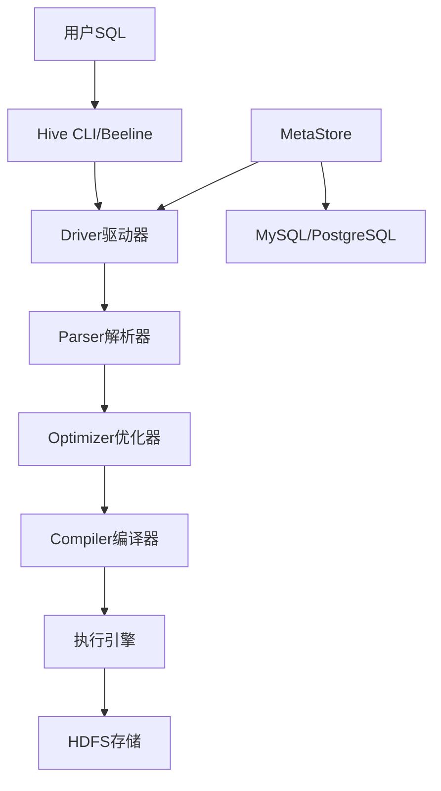

# 🐝 Hive 深度学习笔记 - 理论与实战结合

> 基于知识全景脑图的系统性学习指南，结合data-studio项目实际配置

## 📚 学习框架总览

### 核心理念
**Hive = SQL-on-Hadoop 的抽象层**  
将复杂的分布式计算封装成熟悉的SQL语法，让数据分析师能够高效处理海量数据。

---

## 🏗️ 第一部分：架构设计深度解析

### 1.1 整体架构理解



**关键洞察**：
- 🎯 **分离设计**：计算与存储分离，元数据与数据分离
- 🚀 **插件化执行**：支持MapReduce/Tez/Spark多种引擎
- 📊 **元数据中心化**：所有表结构信息统一管理

### 1.2 实际项目配置分析

基于你的data-studio项目配置：

```xml
<!-- 企业级MetaStore配置 -->
<property>
    <name>hive.metastore.uris</name>
    <value>thrift://sg-hive.data-infra.shopee.io:9083</value>
</property>

<!-- 多地域部署策略 -->
- hive-site-sg.xml (新加坡)
- hive-site-us.xml (美国)  
- hive-site-id.xml (印尼)
```

**企业实践要点**：
1. **多地域部署**：就近访问降低网络延迟
2. **环境隔离**：prod/staging环境独立配置
3. **连接池优化**：`socket.timeout`、`connection.timeout`合理设置

---

## 🗄️ 第二部分：数据模型与存储优化

### 2.1 表类型选择策略

| 场景 | 表类型 | 优势 | 适用场景 |
|------|--------|------|----------|
| 临时分析 | 内部表 | Hive全权管理 | 测试、临时计算 |
| 生产数据 | 外部表 | 数据安全性高 | 多系统共享数据 |
| 大表查询 | 分区表 | 查询性能优化 | 时间序列数据 |
| Join优化 | 分桶表 | 减少Shuffle | 大表Join场景 |

### 2.2 存储格式性能对比

```sql
-- ORC格式优化示例
CREATE TABLE user_behavior_orc (
    user_id bigint,
    action_time timestamp,
    action_type string,
    page_id string
)
STORED AS ORC
TBLPROPERTIES (
    "orc.compress"="SNAPPY",
    "orc.create.index"="true"
)
PARTITIONED BY (dt string);
```

**性能提升技巧**：
- ✅ **ORC + Snappy**：平衡压缩比和查询速度
- ✅ **列式存储**：只读取需要的列，节省IO
- ✅ **向量化执行**：批量处理提升CPU利用率

---

## ⚡ 第三部分：查询优化实战

### 3.1 执行计划优化流程

```sql
-- 1. 开启成本优化器
SET hive.cbo.enable=true;
SET hive.compute.query.using.stats=true;

-- 2. 收集统计信息
ANALYZE TABLE user_behavior_orc COMPUTE STATISTICS;
ANALYZE TABLE user_behavior_orc PARTITION(dt='2024-01-01') COMPUTE STATISTICS FOR COLUMNS;

-- 3. 查看执行计划
EXPLAIN EXTENDED 
SELECT action_type, COUNT(*) 
FROM user_behavior_orc 
WHERE dt='2024-01-01' 
GROUP BY action_type;
```

### 3.2 Join优化策略

```sql
-- MapJoin优化：自动广播小表
SET hive.auto.convert.join=true;
SET hive.mapjoin.smalltable.filesize=25000000; -- 25MB

-- Bucket MapJoin：预分桶表优化
SELECT /*+ MAPJOIN(u) */ 
    u.user_id, b.action_type
FROM user_dim u 
JOIN user_behavior_orc b 
ON u.user_id = b.user_id;
```

**核心原则**：
1. **小表优先**：小表放内存，大表走磁盘
2. **分区剪裁**：WHERE条件中包含分区字段
3. **列剪裁**：SELECT只包含必要字段

---

## 🔧 第四部分：高级特性深入

### 4.1 自定义函数开发

```java
// Java UDF示例
public class DateFormatUDF extends UDF {
    private SimpleDateFormat formatter = new SimpleDateFormat("yyyy-MM-dd");
    
    public String evaluate(Long timestamp) {
        if (timestamp == null) return null;
        return formatter.format(new Date(timestamp * 1000));
    }
}
```

```sql
-- 注册和使用UDF
ADD JAR /path/to/date-format-udf.jar;
CREATE TEMPORARY FUNCTION date_format AS 'com.example.DateFormatUDF';

SELECT date_format(create_time) as create_date 
FROM user_behavior_orc;
```

### 4.2 视图与物化视图

```sql
-- 创建物化视图加速查询
CREATE MATERIALIZED VIEW daily_user_summary AS
SELECT 
    dt,
    action_type,
    COUNT(DISTINCT user_id) as active_users,
    COUNT(*) as total_actions
FROM user_behavior_orc
GROUP BY dt, action_type;

-- 查询自动重写到物化视图
SELECT dt, SUM(active_users) 
FROM daily_user_summary 
WHERE dt BETWEEN '2024-01-01' AND '2024-01-07'
GROUP BY dt;
```

---

## 🏢 第五部分：企业级数据仓库实践

### 5.1 分层架构设计

```
📂 数据仓库分层
├── 🗃️ ODS (Operational Data Store)
│   ├── 原始日志数据
│   ├── 业务数据库镜像
│   └── 第三方数据源
├── 🔧 DWD (Data Warehouse Detail)
│   ├── 数据清洗
│   ├── 格式统一
│   └── 质量校验
├── 📊 DWS (Data Warehouse Summary)
│   ├── 轻度汇总
│   ├── 主题域建模
│   └── 指标计算
└── 🎯 ADS (Application Data Store)
    ├── 报表数据
    ├── 大屏展示
    └── 算法特征
```

### 5.2 基于你项目的实际应用

#### 📊 企业级配置分析

**多环境部署对比**：

| 环境 | MetaStore地址 | 端口 | 特点 |
|------|---------------|------|------|
| 生产环境 | `sg-hive.data-infra.shopee.io` | 9083 | 高可用，性能优化 |
| 预发布环境 | `sg-hive.data-infra.staging.shopee.io` | 48869 | 与生产环境隔离 |

**多地域架构**：
```
🌏 全球化部署
├── 🇸🇬 新加坡 (sg-hive)
├── 🇺🇸 美国 (us-hive)  
└── 🇮🇩 印尼 (id-hive)
```

**关键配置解析**：
```xml
<!-- 连接池优化 -->
<property>
    <name>hive.metastore.client.socket.timeout</name>
    <value>5</value> <!-- 快速失败，避免长时间等待 -->
</property>

<!-- Spark集成 -->
<property>
    <name>metastore.catalog.default</name>
    <value>spark</value> <!-- 默认使用Spark引擎 -->
</property>

<!-- 安全配置 -->
<property>
    <name>hive.server2.enable.doAs</name>
    <value>true</value> <!-- 用户身份传递 -->
</property>
```

#### 📈 数据库Schema管理实践

从schema文件看到的企业实践：

```sql
-- 版本化管理（按语义化版本）
data_studio_schema_v1.26.0.sql
data_studio_schema_v2.12.0.sql

-- 环境隔离
data_studio_schema_junit.sql (测试环境)
data_studio_schema_migration.sql (迁移脚本)

-- 初始化数据
data_studio_v2.9.0_initial_data.sql
```

**最佳实践总结**：
1. ✅ **版本控制**：每个版本都有对应的DDL脚本
2. ✅ **渐进式升级**：通过migration脚本平滑升级  
3. ✅ **环境一致性**：junit环境保证开发测试一致性
4. ✅ **数据初始化**：生产环境数据预设
5. ✅ **地域就近**：多地域部署降低延迟

---

## 📈 第六部分：性能监控与调优

### 6.1 关键性能指标

```sql
-- 查询性能分析
SET hive.exec.post.hooks=org.apache.hadoop.hive.ql.hooks.LineageLogger;

-- 资源使用监控
SELECT 
    query_id,
    query_string,
    total_exec_time,
    cpu_time,
    physical_memory,
    virtual_memory
FROM information_schema.queries
WHERE execution_time > 300; -- 超过5分钟的查询
```

### 6.2 调优配置清单

```properties
# 并行度优化
hive.exec.parallel=true
hive.exec.parallel.thread.number=16

# 内存优化
hive.tez.container.size=4096
hive.tez.java.opts=-Xmx3276m

# Vectorization优化
hive.vectorized.execution.enabled=true
hive.vectorized.execution.reduce.enabled=true
```

---

## 🎯 系统学习实践计划

### 📋 基于脑图的完整学习路径

#### 🚀 第一阶段：基础概念掌握 (Week 1-2)

**理论学习**：
- [ ] 📖 深入理解Hive的设计哲学：为什么选择SQL-on-Hadoop？
- [ ] 🏗️ 掌握架构四层模型：UI → MetaStore → Driver → Engine  
- [ ] 🔍 分析你项目中的多地域部署策略

**动手实践**：
```bash
# 1. 本地环境搭建
docker run -d -p 9083:9083 -p 10000:10000 \
  --name hive-metastore apache/hive:3.1.2

# 2. 连接测试  
beeline -u "jdbc:hive2://localhost:10000/default"

# 3. 基础表操作
CREATE DATABASE learning_hive;
USE learning_hive;
```

**验收标准**：
- ✅ 能够解释MetaStore在架构中的作用
- ✅ 理解你项目中为什么使用不同端口（9083 vs 48869）
- ✅ 可以手绘Hive查询执行流程图

---

#### ⚡ 第二阶段：数据模型与存储优化 (Week 3-4)

**核心任务**：
- [ ] 🗄️ 实践内部表 vs 外部表的使用场景对比
- [ ] 📊 设计分区表解决大数据量查询问题
- [ ] 🚀 对比TextFile、ORC、Parquet性能差异

**项目实战**：
```sql
-- 模拟你项目的用户行为表
CREATE EXTERNAL TABLE user_behavior (
    user_id bigint,
    session_id string,
    action_time timestamp,
    action_type string,
    page_url string
)
PARTITIONED BY (dt string, region string)
STORED AS ORC
LOCATION '/data/user_behavior/';

-- 性能测试：同样数据不同存储格式的查询速度
```

**深度思考**：
- 🤔 为什么你的项目选择与Spark集成？
- 🤔 多地域部署如何影响数据分区策略？

---

#### 🔧 第三阶段：查询优化与性能调优 (Week 5-6)

**优化技能树**：
- [ ] 🎯 掌握CBO（成本优化器）的工作原理
- [ ] 🔄 实践MapJoin、BucketJoin等优化技术
- [ ] 📈 学会读懂EXPLAIN执行计划

**企业级优化实践**：
```sql
-- 1. 统计信息收集（对应你项目的表）  
ANALYZE TABLE user_behavior PARTITION(dt='2024-01-01') 
COMPUTE STATISTICS FOR COLUMNS;

-- 2. 查询优化前后对比
EXPLAIN EXTENDED
SELECT region, action_type, COUNT(*) as pv
FROM user_behavior  
WHERE dt BETWEEN '2024-01-01' AND '2024-01-07'
GROUP BY region, action_type;
```

**项目关联学习**：
- 📊 分析你的data-studio项目中的查询模式
- 🔍 研究schema版本演进对查询性能的影响

---

#### 🏢 第四阶段：企业级特性应用 (Week 7-8)

**高级功能掌握**：
- [ ] 🛠️ 开发Java/Python UDF函数
- [ ] 👁️ 创建物化视图加速重复查询  
- [ ] 🔐 配置Ranger权限控制

**结合项目实际**：
```java
// 基于你项目需求开发UDF
public class DataStudioDateUDF extends UDF {
    // 处理多时区数据格式统一
    public String evaluate(String timestamp, String timezone) {
        // 实现逻辑
    }
}
```

**安全与治理**：
- 🔐 理解你项目中`hive.server2.enable.doAs=true`的安全意义
- 📋 设计数据血缘追踪方案

---

#### 🌟 第五阶段：生产环境实战 (Week 9-12)

**系统集成**：
- [ ] 🔄 集成Spring Boot应用（参考你的application.yml）
- [ ] 📅 配置Airflow/Oozie调度系统
- [ ] 📊 搭建监控告警体系

**容量规划与运维**：
- [ ] 📈 基于你项目的多地域架构设计容灾方案
- [ ] 🚨 建立性能监控和异常告警机制
- [ ] 📝 编写运维手册和故障处理流程

---

### 🎖️ 能力评估标准

#### 初级水平 (完成阶段1-2)
- ✅ 理解Hive基本概念和架构
- ✅ 能够创建和管理表、分区
- ✅ 编写基本的HiveQL查询

#### 中级水平 (完成阶段3-4)  
- ✅ 熟练进行查询优化和性能调优
- ✅ 开发自定义函数满足业务需求
- ✅ 理解企业级部署和安全配置

#### 高级水平 (完成阶段5)
- ✅ 设计和实施企业数据仓库架构  
- ✅ 解决复杂的生产环境问题
- ✅ 指导团队进行Hive最佳实践

---

### 📚 每周学习节奏建议

```
📅 学习计划模板
├── 🌅 周一-周二：理论学习 + 文档阅读
├── 🛠️ 周三-周四：动手实践 + 代码编写  
├── 🔍 周五：总结复盘 + 问题答疑
└── 🎯 周末：项目实战 + 拓展阅读
```

**时间分配**：
- 📖 理论学习：30%
- 💻 动手实践：50%  
- 🤝 交流讨论：20%

---

### 🎁 特别福利：项目定制化学习

基于你的data-studio项目，我特别设计了这些实战任务：

1. **配置文件深度解读**：分析prod vs staging环境差异
2. **多地域架构优化**：设计跨地域数据同步策略  
3. **Schema演进实践**：模拟版本升级和数据迁移
4. **Spring Boot集成**：理解企业级应用如何使用Hive
5. **性能监控实战**：建立适合你项目的监控体系

---

## 💡 关键学习资源

### 📖 推荐书籍
1. **《Programming Hive》** - 权威参考手册
2. **《Hive实战》** - 中文实践指南
3. **《数据仓库工具箱》** - 建模方法论

### 🔗 在线资源
- **Apache Hive官方文档**：最新特性和最佳实践
- **Cloudera/Hortonworks文档**：企业级部署指南  
- **GitHub开源项目**：实际代码案例学习

### 🛠️ 实践环境
- **CDH/HDP沙箱**：完整企业级环境
- **Docker容器**：快速本地部署
- **云平台**：AWS EMR、阿里云MaxCompute

---

## 🚀 下一步行动

基于你的data-studio项目，我建议：

1. **深入分析现有配置**：理解多地域部署架构
2. **研究schema演进**：学习版本管理最佳实践  
3. **性能优化实践**：基于实际查询进行调优
4. **集成开发**：结合Spark/Jupyter Notebook使用

记住：**理论指导实践，实践验证理论** 🎯

---

*Happy Learning! 🎓 如需深入探讨任何章节，随时交流！*
