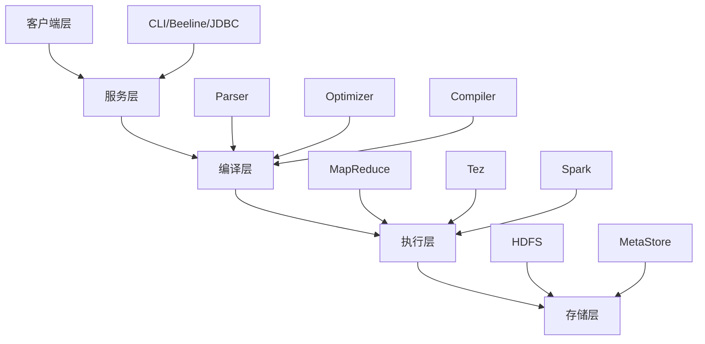

# 🐝 Hive 理论知识深度学习文档

> Apache Hive 核心理论知识体系 - 从底层原理到架构设计的全面解析

---

## 📋 目录

1. [Hive 设计哲学与理论基础](#1-hive-设计哲学与理论基础)
2. [系统架构理论](#2-系统架构理论)
3. [查询处理理论](#3-查询处理理论)
4. [存储模型理论](#4-存储模型理论)
5. [查询优化理论](#5-查询优化理论)
6. [并发控制与事务理论](#6-并发控制与事务理论)
7. [元数据管理理论](#7-元数据管理理论)
8. [分布式计算理论](#8-分布式计算理论)

---

## 1. Hive 设计哲学与理论基础

### 1.1 核心设计理念

**抽象层设计理论**：
```
SQL抽象层
    ↓
逻辑计划层  
    ↓
物理计划层
    ↓  
分布式执行层
```

**设计目标**：
- **易用性**：将复杂的MapReduce编程抽象为SQL
- **可扩展性**：支持PB级数据处理
- **容错性**：基于HDFS的高可用存储
- **灵活性**：支持多种数据格式和执行引擎

### 1.2 理论定位分析

**CAP定理在Hive中的体现**：
- **一致性(Consistency)**：MetaStore保证元数据一致性
- **可用性(Availability)**：通过HDFS副本机制保证
- **分区容忍性(Partition Tolerance)**：分布式架构天然支持

**OLAP vs OLTP**：
- Hive专注于**分析型处理(OLAP)**
- 牺牲事务性能换取分析性能
- 适合批处理，不适合实时交互

---

## 2. 系统架构理论

### 2.1 分层架构设计



**理论优势**：
1. **松耦合设计**：每层职责明确，便于独立优化
2. **可插拔架构**：执行引擎可以灵活替换
3. **水平扩展**：各层都支持分布式部署

### 2.2 MetaStore理论架构

**三层MetaStore模式**：

```
Application Layer (Hive CLI/Server)
         ↓
MetaStore Service (Thrift API)  
         ↓
Database Layer (MySQL/PostgreSQL)
```

**理论意义**：
- **元数据集中化**：统一管理所有表结构信息
- **服务化设计**：多个Hive实例可共享同一MetaStore
- **持久化保证**：关系型数据库确保元数据不丢失

---

## 3. 查询处理理论

### 3.1 SQL解析理论

**编译器理论在Hive中的应用**：

```
词法分析(Lexical Analysis)
    ↓
语法分析(Syntax Analysis) → AST
    ↓  
语义分析(Semantic Analysis)
    ↓
逻辑计划生成(Logical Plan)
    ↓
优化(Optimization)
    ↓
物理计划生成(Physical Plan)
```

**AST (抽象语法树) 结构**：
- **查询块(Query Block)**：SELECT、FROM、WHERE等子句
- **操作符树(Operator Tree)**：Join、Filter、Project等操作
- **表达式树(Expression Tree)**：列引用、函数调用等

### 3.2 逻辑计划理论

**关系代数基础**：
- **选择(Selection)**：σ(condition)(R) → WHERE子句
- **投影(Projection)**：π(attributes)(R) → SELECT子句  
- **连接(Join)**：R ⋈ S → JOIN操作
- **聚集(Aggregation)**：γ(grouping,aggregation)(R) → GROUP BY

**逻辑优化规则**：
```
1. 谓词下推(Predicate Pushdown)
   σ(p)(R ⋈ S) → σ(p)(R) ⋈ S  (当p只涉及R的属性)

2. 投影下推(Projection Pushdown)  
   π(A)(R ⋈ S) → π(A∩attr(R))(R) ⋈ π(A∩attr(S))(S)

3. 连接交换律
   R ⋈ S ≡ S ⋈ R

4. 连接结合律  
   (R ⋈ S) ⋈ T ≡ R ⋈ (S ⋈ T)
```

---

## 4. 存储模型理论

### 4.1 数据组织理论

**层次化存储模型**：
```
Database (数据库)
  └── Table (表)
      ├── Partition (分区) - 物理目录
      │   └── Bucket (分桶) - 哈希分布文件
      └── Schema (模式) - 列定义
```

**分区理论**：
- **水平分区**：按行将数据分割到不同物理位置
- **分区消除**：查询时只扫描相关分区，减少I/O
- **分区键选择**：通常选择查询过滤条件中的高基数字段

**分桶理论**：
- **哈希分布**：HASH(bucketing_column) % num_buckets
- **数据倾斜解决**：均匀分布数据到各个桶
- **Join优化**：相同桶号可以直接Join，减少Shuffle

### 4.2 文件格式理论

**行式存储 vs 列式存储**：

| 特性 | 行式存储 | 列式存储 |
|------|----------|----------|
| 数据局部性 | 行局部性好 | 列局部性好 |
| 压缩比 | 低 | 高(相同类型数据) |
| 查询模式 | OLTP友好 | OLAP友好 |
| 写入性能 | 高 | 相对较低 |

**ORC格式理论**：
```
File Footer (文件尾)
├── Metadata (元数据)
├── Column Statistics (列统计信息) 
└── Compression Info (压缩信息)

Stripe 1, 2, ... N (条带)  
├── Index Data (索引数据)
├── Row Data (行数据)
└── Stripe Footer (条带尾)
```

**优化原理**：
- **列式压缩**：相同类型数据压缩比更高
- **索引下推**：在存储层完成过滤，减少网络传输
- **向量化执行**：批量处理提高CPU缓存命中率

---

## 5. 查询优化理论

### 5.1 成本优化器(CBO)理论

**统计信息理论**：
```
Table Statistics:
├── Row Count (行数)
├── Data Size (数据大小)  
└── Last Update Time (更新时间)

Column Statistics:
├── Distinct Values (唯一值数量)
├── Null Count (空值数量)
├── Min/Max Values (最值)
├── Average Length (平均长度)  
└── Histogram (直方图)
```

**代价估算模型**：
```
Cost = CPU_Cost + IO_Cost + Network_Cost

其中：
- CPU_Cost = f(行数, 操作复杂度)
- IO_Cost = f(数据量, 存储介质)  
- Network_Cost = f(数据传输量, 网络带宽)
```

**Join算法选择理论**：

1. **Nested Loop Join**：
   - 代价：O(|R| × |S|)
   - 适用：小表Join

2. **Hash Join**：
   - 代价：O(|R| + |S|)
   - 适用：一个表明显小于另一个

3. **Sort-Merge Join**：
   - 代价：O(|R|log|R| + |S|log|S|)
   - 适用：两表大小相近

### 5.2 物理优化理论

**Map-Side Join理论**：
```
前提条件：
- 小表能完全载入内存
- 大表已按Join Key分区

优化效果：
- 消除Reduce阶段
- 避免数据Shuffle
- 大幅提升性能
```

**动态分区剪裁**：
```sql
-- 理论模型
SELECT * FROM fact_table f
JOIN dim_table d ON f.dim_id = d.id  
WHERE d.status = 'active';

-- 优化后执行计划
1. 先执行：SELECT id FROM dim_table WHERE status = 'active'
2. 利用结果动态确定fact_table需要扫描的分区
3. 最后执行Join操作
```

---

## 6. 并发控制与事务理论

### 6.1 ACID理论在Hive中的实现

**原子性(Atomicity)**：
- **事务日志**：记录所有数据变更操作
- **回滚机制**：失败时恢复到事务开始前状态

**一致性(Consistency)**：  
- **Schema验证**：确保数据符合表定义
- **约束检查**：外键、唯一性等约束

**隔离性(Isolation)**：
- **快照隔离**：读取事务开始时的数据快照
- **多版本并发控制(MVCC)**：通过版本号区分不同事务的数据

**持久性(Durability)**：
- **写前日志(WAL)**：先写日志再写数据
- **HDFS副本**：数据多副本保证持久性

### 6.2 锁机制理论

**读写锁模型**：
```
Shared Lock (S) - 读锁
├── 多个事务可同时持有
└── 与排他锁互斥

Exclusive Lock (X) - 写锁  
├── 只允许一个事务持有
└── 与所有其他锁互斥
```

**锁粒度理论**：
- **表级锁**：操作整张表时使用
- **分区级锁**：操作特定分区时使用
- **行级锁**：Hive 3.x开始支持，适用于UPDATE/DELETE

---

## 7. 元数据管理理论

### 7.1 元数据模型理论

**层次化元数据模型**：
```
Catalog (目录)
└── Database (数据库)
    └── Table (表)
        ├── Column (列)
        ├── Partition (分区)
        ├── Storage Descriptor (存储描述符)
        └── Table Parameters (表参数)
```

**元数据一致性理论**：
- **ACID保证**：元数据操作满足事务性
- **版本控制**：支持元数据的版本管理
- **并发控制**：多客户端同时访问的一致性保证

### 7.2 Schema演进理论

**向后兼容性**：
- **添加列**：新列默认值为NULL，不影响现有查询
- **删除列**：可能导致查询失败，需谨慎处理
- **修改列类型**：需要考虑数据类型兼容性

**Schema版本管理**：
```
Version 1.0: {id: int, name: string}
Version 1.1: {id: int, name: string, age: int}  
Version 2.0: {id: bigint, name: string, age: int, email: string}
```

---

## 8. 分布式计算理论

### 8.1 MapReduce理论模型

**计算模型抽象**：
```
Map Phase:
Input → Map Function → Intermediate Key-Value Pairs

Shuffle Phase:  
Intermediate Pairs → Partitioning → Sorting → Grouping

Reduce Phase:
Grouped Pairs → Reduce Function → Output
```

**在Hive中的应用**：
- **Map阶段**：扫描表、过滤数据、投影列
- **Shuffle阶段**：按Join Key或Group Key重分布
- **Reduce阶段**：执行Join、聚合等操作

### 8.2 Tez执行引擎理论

**DAG(有向无环图)模型**：
```
Vertex (顶点) - 计算任务
Edge (边) - 数据依赖关系
Task (任务) - 顶点的具体执行实例
```

**理论优势**：
- **内存Pipeline**：中间结果可保存在内存中
- **动态优化**：运行时根据数据分布调整执行计划
- **资源重用**：容器可以重用执行多个任务

### 8.3 查询执行理论

**并行执行模型**：
```
Inter-Operator Parallelism (算子间并行)
├── Pipeline Parallelism - 流水线并行
└── Partition Parallelism - 分区并行

Intra-Operator Parallelism (算子内并行)  
├── Data Parallelism - 数据并行
└── Task Parallelism - 任务并行
```

**数据倾斜理论**：
- **成因分析**：热点键导致某些Reducer任务过重
- **检测方法**：统计各Reducer处理的数据量
- **解决策略**：
  - 两阶段聚合
  - 加盐技术(Salting)
  - 随机前缀

---

## 📚 核心理论总结

### 🎯 Hive的本质
**Hive = SQL编译器 + 元数据管理器 + 分布式执行协调器**

### 🔑 关键理论洞察

1. **抽象的力量**：将复杂的分布式计算抽象为熟悉的SQL
2. **分层的智慧**：清晰的分层架构便于独立优化和扩展
3. **元数据的重要性**：统一的元数据管理是数据治理的基础
4. **优化的艺术**：基于成本的优化器是性能提升的关键
5. **分布式的挑战**：一致性、可用性、分区容错性的权衡

### 📈 理论发展趋势

1. **实时化**：从批处理向流批一体发展
2. **智能化**：机器学习驱动的自动优化
3. **云原生**：容器化部署和弹性扩缩容
4. **联邦化**：多数据源统一查询接口

---

## 🤔 深度思考题

1. **架构设计**：为什么Hive选择元数据和数据分离的架构？
2. **查询优化**：CBO相比RBO的理论优势在哪里？
3. **存储格式**：列式存储在OLAP场景下的理论优势？
4. **事务处理**：Hive的ACID实现相比传统数据库有何不同？
5. **性能调优**：数据倾斜问题的理论根源和解决思路？

---

## 📖 进阶学习建议

### 理论基础强化
- **数据库系统原理**：深入理解关系模型和查询处理
- **分布式系统理论**：掌握CAP定理、一致性模型等
- **编译原理**：理解SQL解析和优化的底层机制

### 论文阅读推荐
- "Hive - A Warehousing Solution Over a Map-Reduce Framework"
- "Apache Calcite: A Foundational Framework for Optimized Query Processing"
- "The Gamma Database Machine Project"

### 源码研究方向
- **Parser模块**：了解SQL解析实现
- **Optimizer模块**：研究CBO优化算法  
- **Execution模块**：深入执行引擎原理

---

*这份理论文档将帮助你建立对Hive的深层理解，为实际应用奠定坚实的理论基础。理论与实践相结合，才能真正掌握Hive这一强大的数据处理工具！* 🎓✨
