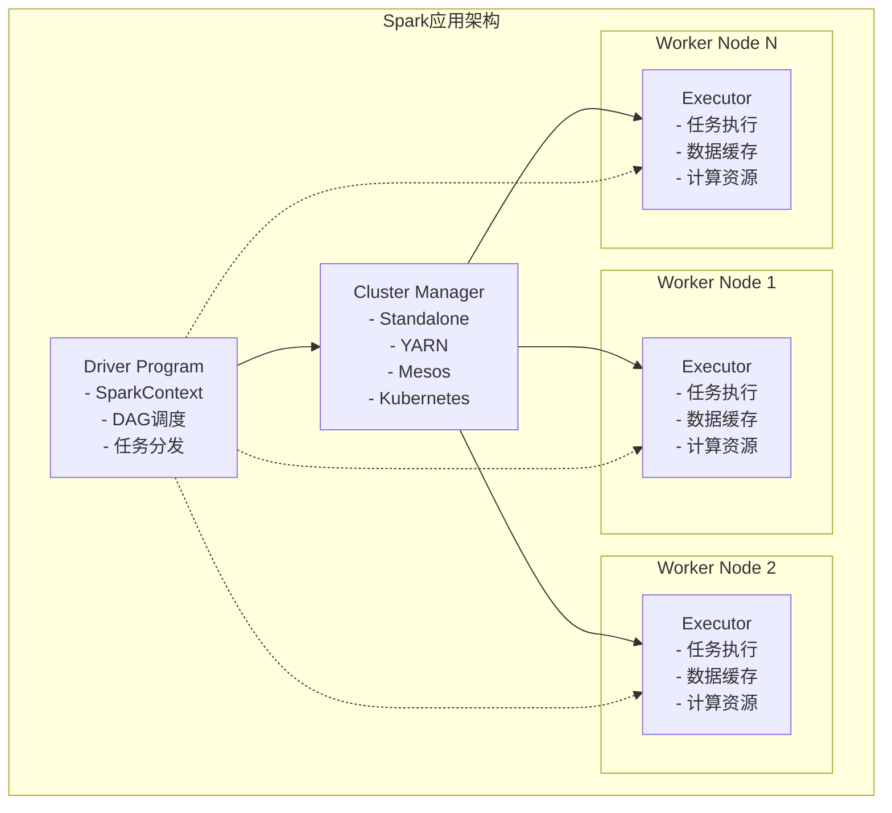
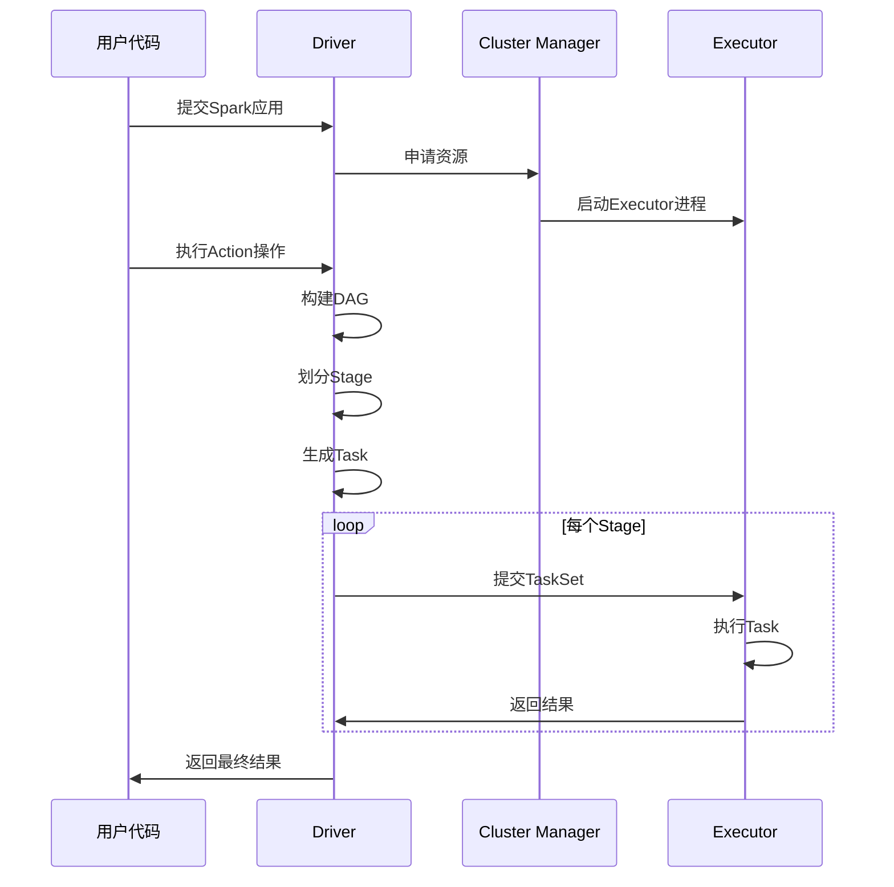
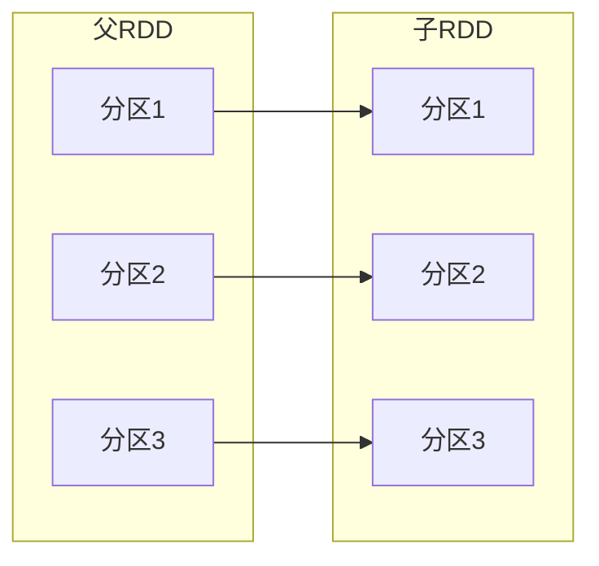
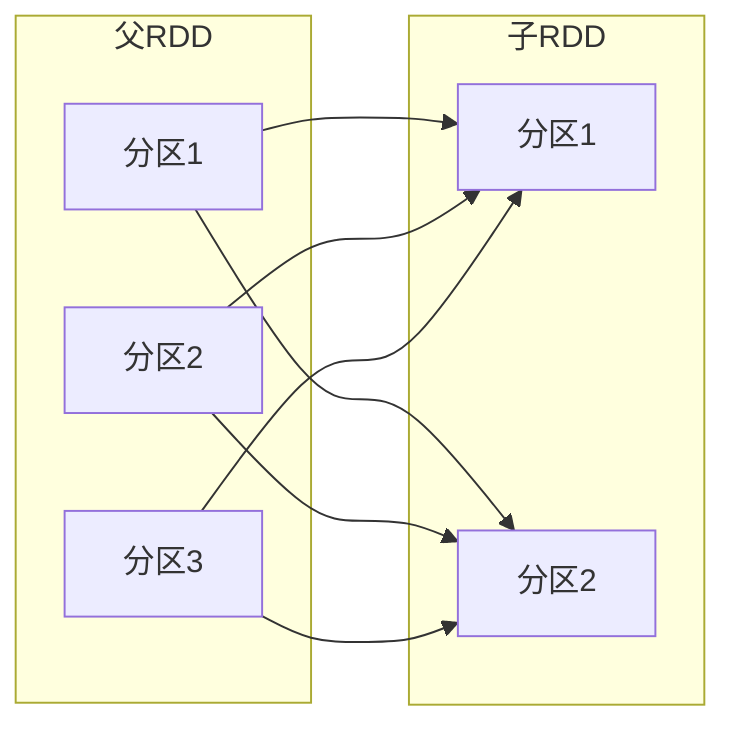
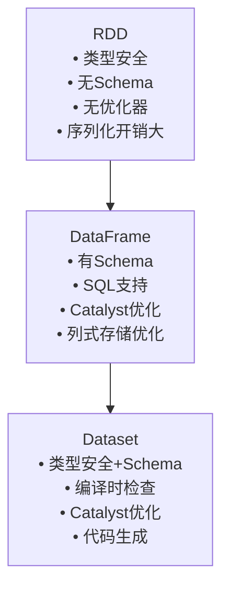

# Spark核心理论与架构深度学习笔记

## 目录
1. [Spark设计思想与定位](#1-spark设计思想与定位)
2. [整体架构详解](#2-整体架构详解) 
3. [RDD核心理论](#3-rdd核心理论)
4. [DataFrame与Dataset](#4-dataframe与dataset)
5. [代码实例分析](#5-代码实例分析)

---

## 1. Spark设计思想与定位

### 1.1 大数据处理痛点分析

**MapReduce的局限性：**
- **磁盘I/O密集**：每个MapReduce作业都需要将中间结果写入HDFS，导致大量磁盘读写
- **高延迟**：迭代算法需要启动多个MapReduce作业，每次都要重新读取数据
- **编程复杂性**：需要将逻辑拆分为Map和Reduce阶段，表达复杂算法困难
- **资源利用率低**：每个作业独立申请资源，无法复用

### 1.2 Spark核心思路

```
传统MapReduce:
Input → Map → Write to Disk → Reduce → Output
         ↓
     磁盘I/O瓶颈

Spark内存计算:
Input → Transformation → Transformation → Action → Output
               ↓              ↓
           内存缓存       血缘关系追踪
```

**核心设计原则：**

1. **内存优先计算**
   - 将数据尽量保存在内存中，避免频繁的磁盘I/O
   - 支持数据在内存中的多次复用

2. **统一计算引擎**
   - 一个框架支持批处理、交互式查询、流处理、机器学习、图计算
   - 降低学习成本和运维复杂度

3. **弹性与容错**
   - 通过RDD血缘（Lineage）实现自动容错
   - 无需额外的检查点机制

4. **懒惰执行（Lazy Evaluation）**
   - 只有遇到Action操作才真正执行计算
   - 优化器可以分析整个计算图进行优化

---

## 2. 整体架构详解

### 2.1 架构组件



### 2.2 核心组件职责

#### Driver（驱动器）
```scala
// Driver的核心职责
class SparkDriver {
  val sparkContext: SparkContext // 应用入口
  
  // 1. DAG构建与调度
  def buildDAG(rdd: RDD): DAG = {
    // 分析RDD依赖关系，构建有向无环图
  }
  
  // 2. Stage划分
  def createStages(dag: DAG): List[Stage] = {
    // 根据宽依赖切分Stage
  }
  
  // 3. 任务分发
  def submitTasks(stage: Stage): Unit = {
    // 将Stage内的任务发送给Executor执行
  }
}
```

#### Executor（执行器）
```scala
class SparkExecutor {
  // 1. 任务执行
  def runTask(task: Task): TaskResult = {
    // 执行具体的计算逻辑
  }
  
  // 2. 数据缓存管理
  val blockManager: BlockManager // 内存和磁盘存储管理
  
  // 3. Shuffle数据管理
  val shuffleManager: ShuffleManager // Shuffle读写
}
```

### 2.3 作业执行流程



**详细执行步骤：**

1. **应用启动**
   - 用户提交Spark应用
   - Driver启动，创建SparkContext
   - 向Cluster Manager申请资源

2. **资源分配**
   - Cluster Manager分配Worker节点
   - 启动Executor进程
   - Driver与Executor建立通信

3. **DAG构建**（Action触发）
   - 分析RDD的依赖关系
   - 构建有向无环图（DAG）

4. **Stage划分**
   - 根据宽依赖（Shuffle）切分Stage
   - 每个Stage包含可并行执行的Task

5. **任务调度**
   - 将Stage内的Task分发给Executor
   - Executor执行Task并返回结果

6. **结果收集**
   - Driver收集各Task的执行结果
   - 合并后返回给用户程序

---

## 3. RDD核心理论

### 3.1 RDD概念与特性

**RDD（Resilient Distributed Dataset）弹性分布式数据集**

```scala
// RDD的本质是一个抽象类
abstract class RDD[T] {
  // 1. 分区列表
  def getPartitions: Array[Partition]
  
  // 2. 分区计算函数  
  def compute(partition: Partition, context: TaskContext): Iterator[T]
  
  // 3. 依赖关系
  def getDependencies: Seq[Dependency[_]]
  
  // 4. 分区器（可选）
  def partitioner: Option[Partitioner] = None
  
  // 5. 最佳位置（可选）
  def getPreferredLocations(partition: Partition): Seq[String] = Nil
}
```

### 3.2 RDD五大特性

#### 1. **分区列表（A list of partitions）**
```scala
// 数据被划分为多个分区，每个分区可以在不同节点上并行处理
val rdd = sparkContext.parallelize(List(1,2,3,4,5,6), numPartitions = 3)
// 分区0: [1,2]
// 分区1: [3,4] 
// 分区2: [5,6]
```

#### 2. **计算函数（A function for computing each split）**
```scala
// 每个分区都有对应的计算函数
val mappedRDD = rdd.map(x => x * 2)
// 分区0计算: [1,2] => [2,4]
// 分区1计算: [3,4] => [6,8]
// 分区2计算: [5,6] => [10,12]
```

#### 3. **依赖关系（Dependencies）**
```scala
// RDD之间的依赖关系用于容错和调度优化
val rdd1 = sparkContext.parallelize(List(1,2,3,4))
val rdd2 = rdd1.map(x => x * 2)  // 窄依赖
val rdd3 = rdd2.groupBy(x => x % 2) // 宽依赖
```

#### 4. **分区器（Partitioner for Key-Value RDDs）**
```scala
// 用于控制Key-Value RDD的数据分布
val kvRDD = sparkContext.parallelize(List(("a",1),("b",2),("c",3)))
val partitionedRDD = kvRDD.partitionBy(new HashPartitioner(2))
```

#### 5. **最佳位置（Preferred locations）**
```scala
// 数据本地性优化，将计算调度到数据所在的节点
// HDFS文件的block所在节点就是该分区的最佳位置
```

### 3.3 依赖关系详解

#### 窄依赖（Narrow Dependencies）


**特点：**
- 父分区到子分区是一对一或多对一
- 不需要Shuffle，数据在同一个节点
- 可以pipeline执行，性能高
- 失败恢复简单，只需重算对应父分区

**常见操作：** map, filter, union, mapPartitions

```scala
// 窄依赖示例
val rdd1 = sparkContext.parallelize(1 to 10, 4)
val rdd2 = rdd1.map(_ * 2)        // 窄依赖：一对一
val rdd3 = rdd1.filter(_ > 5)     // 窄依赖：一对一  
val rdd4 = rdd2.union(rdd3)       // 窄依赖：多对一
```

#### 宽依赖（Wide Dependencies/Shuffle Dependencies）


**特点：**
- 子分区依赖多个父分区
- 需要Shuffle，数据需要跨节点传输
- 性能开销大，是优化重点
- 失败恢复复杂，需要重算多个父分区

**常见操作：** groupByKey, reduceByKey, join, distinct

```scala
// 宽依赖示例
val rdd1 = sparkContext.parallelize(List(("a",1),("b",2),("a",3),("b",4)), 4)
val rdd2 = rdd1.groupByKey()      // 宽依赖：需要Shuffle
val rdd3 = rdd1.reduceByKey(_ + _) // 宽依赖：但有预聚合优化
```

### 3.4 容错机制：血缘关系（Lineage）

```scala
// RDD血缘示例
val textFile = sparkContext.textFile("hdfs://data.txt")  // RDD_1
val words = textFile.flatMap(_.split(" "))                // RDD_2 (依赖RDD_1)
val pairs = words.map(word => (word, 1))                  // RDD_3 (依赖RDD_2)  
val wordCounts = pairs.reduceByKey(_ + _)                 // RDD_4 (依赖RDD_3)

// 血缘关系链：RDD_1 <- RDD_2 <- RDD_3 <- RDD_4
```

**容错原理：**
1. **自动重算**：当某个RDD分区丢失时，根据血缘关系自动重新计算
2. **最小恢复**：只重算丢失的分区，不影响其他健康分区  
3. **血缘截断**：通过缓存或检查点截断过长的血缘链

```scala
// 容错优化
val importantRDD = pairs.cache()  // 缓存重要的中间结果
wordCounts.checkpoint()           // 设置检查点截断血缘
```

### 3.5 RDD操作分类

#### Transformation（转换操作）
**特点：** 懒惰执行，返回新的RDD

```scala
// 常用Transformation
val rdd = sparkContext.parallelize(1 to 10)

// 元素转换
val mapped = rdd.map(x => x * 2)
val filtered = rdd.filter(x => x > 5)
val flatMapped = rdd.flatMap(x => List(x, x*2))

// 采样
val sampled = rdd.sample(false, 0.5)

// 集合运算  
val rdd2 = sparkContext.parallelize(5 to 15)
val unioned = rdd.union(rdd2)
val intersected = rdd.intersection(rdd2)
val distinct = rdd.distinct()

// Key-Value操作
val kvRDD = rdd.map(x => (x % 3, x))
val grouped = kvRDD.groupByKey()
val reduced = kvRDD.reduceByKey(_ + _)
```

#### Action（行动操作）
**特点：** 立即执行，触发实际计算

```scala
// 收集结果
val result = rdd.collect()        // 收集所有元素到Driver
val first = rdd.first()           // 获取第一个元素
val take = rdd.take(5)           // 获取前5个元素

// 聚合计算
val count = rdd.count()           // 元素个数
val sum = rdd.reduce(_ + _)       // 聚合操作
val aggregate = rdd.aggregate(0)(_ + _, _ + _) // 自定义聚合

// 输出操作
rdd.saveAsTextFile("hdfs://output") // 保存到文件系统
rdd.foreach(println)              // 对每个元素执行操作
```

---

## 4. DataFrame与Dataset

### 4.1 从RDD到DataFrame的演进



### 4.2 DataFrame详解

**DataFrame = RDD + Schema + Catalyst优化器**

```scala
// DataFrame创建
import org.apache.spark.sql.SparkSession

val spark = SparkSession.builder()
  .appName("DataFrame Example")
  .getOrCreate()

// 从结构化数据创建
val df = spark.read
  .option("header", "true")
  .option("inferSchema", "true") 
  .csv("path/to/data.csv")

// 从RDD创建
import spark.implicits._
case class Person(name: String, age: Int, city: String)
val peopleDF = rdd.map(row => Person(row(0), row(1).toInt, row(2))).toDF()
```

**DataFrame API示例：**
```scala
// SQL风格操作
df.select("name", "age")
  .where($"age" > 18)
  .groupBy("city")
  .count()
  .orderBy($"count".desc)

// 等价的SQL查询
df.createOrReplaceTempView("people")
spark.sql("""
  SELECT city, count(*) as count
  FROM people 
  WHERE age > 18
  GROUP BY city
  ORDER BY count DESC
""")
```

### 4.3 Dataset详解

**Dataset = DataFrame + 强类型**

```scala
// Dataset定义
case class Person(name: String, age: Int, salary: Double)

// Dataset创建
val ds: Dataset[Person] = spark.read
  .json("people.json")
  .as[Person]  // 转换为强类型Dataset

// 类型安全操作
val adults = ds.filter(_.age >= 18)  // 编译时类型检查
val highEarners = ds.filter(_.salary > 50000)

// 聚合操作
val avgSalary = ds
  .groupByKey(_.age / 10)  // 按年龄段分组
  .agg(avg($"salary"))     // 平均工资
```

### 4.4 三种API对比

| 特性 | RDD | DataFrame | Dataset |
|------|-----|-----------|---------|
| 类型安全 | 编译时 | 运行时 | 编译时 |
| 性能优化 | 无 | Catalyst优化 | Catalyst优化 |
| 序列化 | Java序列化 | 列式存储 | 列式存储 |
| 代码生成 | 无 | 支持 | 支持 |
| 垃圾回收 | 影响大 | 堆外内存 | 堆外内存 |
| API易用性 | 函数式 | SQL + DSL | 类型安全DSL |

---

## 5. 代码实例分析

基于项目中的实际代码，我们来分析Spark的实际应用：

### 5.1 项目中的Spark配置结构

```java
// 来自项目：SparkJarConfig.java
@Data
public class SparkJarConfig {
    private String sparkVersion;           // Spark版本
    private ResourceConfig mainResource;   // 主要资源（jar包）
    private String mainClass;              // 入口类
    private String sparkProperties;        // Spark配置参数
    private String programArgument;        // 程序参数
    private List<ResourceConfig> otherResources; // 其他依赖资源
    private Boolean isStreamingTask;       // 是否为流处理任务
    private YarnQueueInfo yarnQueueInfo;   // YARN队列信息
}
```

**实际配置示例：**
```json
{
  "sparkVersion": "3.2.0",
  "mainClass": "com.shopee.di.example.SparkWordCount",
  "sparkProperties": "--conf spark.executor.memory=4g --conf spark.executor.cores=2",
  "programArgument": "hdfs://input/data.txt hdfs://output/",
  "isStreamingTask": false,
  "yarnQueueInfo": {
    "queueName": "data-processing",
    "priority": "NORMAL"
  }
}
```

### 5.2 任务执行流程分析

```java
// 来自项目：WorkflowExecutionServiceImpl.java (简化版)
public class WorkflowExecutionService {
    
    public Long submit(Long workflowId, String operator, Set<Long> selectedIds) {
        // 1. 获取工作流定义
        AssetDO assetDO = assetMapper.getById(workflowId);
        
        // 2. 构建执行计划
        List<AssetDO> allNodes = assetSearchService.getAllWorkflowTaskNodes(workflowId);
        
        // 3. 创建执行记录
        ExecutionDO executionDO = buildExecutionDO(assetDO, operator);
        executionService.insert(executionDO);
        
        // 4. 构建任务列表
        List<TaskDO> taskDOS = buildTaskDOList(allNodes, executionDO);
        
        // 5. 提交初始任务（无上游依赖的任务）
        Set<Long> nodesWithoutUpStream = getNodesWithoutUpStream(allIds, relations);
        for (TaskDO taskDO : firstSubmitTasks) {
            String scheduleInstanceCode = adHocWrapper.submit(taskDO);
            updateTaskStatus(taskDO.getId(), ExecutionStatusEnum.WAIT);
        }
        
        return executionDO.getId();
    }
}
```

### 5.3 Spark任务配置构建

```java
// 基于项目代码的Spark任务配置构建逻辑
switch (assetTypeEnum) {
    case SPARK_JAR:
        SparkJarConfig sparkJarConfig = JsonUtils.parseObject(
            assetDetailDO.getSpecificConfiguration(), 
            SparkJarConfig.class
        );
        
        // 构建Spark配置
        String config = StringUtils.trim(sparkJarConfig.getSparkProperties()) 
                      + " --class " + sparkJarConfig.getMainClass();
        
        executionInfo.setConfig(config);
        executionInfo.setSparkVersion(sparkJarConfig.getSparkVersion());
        executionInfo.setMainResource(buildMainResource(sparkJarConfig.getMainResource()));
        executionInfo.setAttachedResources(buildAttachedResource(sparkJarConfig.getOtherResources()));
        
        // 处理程序参数和变量替换
        if (StringUtils.isNotBlank(sparkJarConfig.getProgramArgument())) {
            Map<String, Object> taskVariableMap = fillTaskVariables(variableMap, assetDetailDO);
            executionInfo.setProgramArguments(
                StringReplaceUtils.replacedVariable(
                    sparkJarConfig.getProgramArgument(), 
                    taskVariableMap
                )
            );
        }
        break;
}
```

### 5.4 实际Spark程序示例

基于项目结构，这里是一个典型的Spark应用示例：

```scala
// 典型的Spark Jar应用程序结构
package com.shopee.di.example

import org.apache.spark.sql.SparkSession

object SparkWordCount {
  def main(args: Array[String]): Unit = {
    // 1. 创建SparkSession
    val spark = SparkSession.builder()
      .appName("WordCount Example")
      .getOrCreate()
    
    val sc = spark.sparkContext
    val inputPath = args(0)
    val outputPath = args(1)
    
    // 2. 读取数据 (RDD方式)
    val textFile = sc.textFile(inputPath)
    
    // 3. 数据处理
    val wordCounts = textFile
      .flatMap(line => line.split("\\s+"))  // 分词
      .map(word => (word, 1))               // 映射为(word, 1)
      .reduceByKey(_ + _)                   // 按key聚合
    
    // 4. 保存结果
    wordCounts.saveAsTextFile(outputPath)
    
    // 5. 停止SparkContext
    spark.stop()
  }
}
```

```scala
// DataFrame/Dataset方式实现
object SparkWordCountSQL {
  def main(args: Array[String]): Unit = {
    val spark = SparkSession.builder()
      .appName("WordCount SQL Example")
      .getOrCreate()
    
    import spark.implicits._
    
    // 1. 读取数据为DataFrame
    val textDF = spark.read.text(args(0))
    
    // 2. SQL方式处理
    textDF.createOrReplaceTempView("text_table")
    
    val wordCountDF = spark.sql("""
      SELECT word, count(*) as count
      FROM (
        SELECT explode(split(value, '\\s+')) as word
        FROM text_table
      ) words
      WHERE word != ''
      GROUP BY word
      ORDER BY count DESC
    """)
    
    // 3. 保存结果
    wordCountDF.write.mode("overwrite").csv(args(1))
    
    spark.stop()
  }
}
```

---

## 总结

本章深入讲解了Spark的核心理论基础：

1. **设计思想**：内存计算、统一引擎、弹性容错、懒惰执行
2. **架构组件**：Driver、Executor、Cluster Manager的职责与交互
3. **RDD理论**：五大特性、依赖关系、血缘容错机制
4. **高级抽象**：DataFrame和Dataset的优势与使用场景
5. **实际应用**：结合项目代码理解理论在实践中的体现

下一节我们将深入学习Spark的执行引擎，包括DAG调度、Stage划分和Task执行机制。

---

## 推荐阅读
- [Spark官方文档 - Programming Guide](https://spark.apache.org/docs/latest/programming-guide.html)
- [Spark源码分析 - RDD实现](https://github.com/apache/spark/blob/master/core/src/main/scala/org/apache/spark/rdd/RDD.scala)
- 《Spark权威指南》第3-5章
