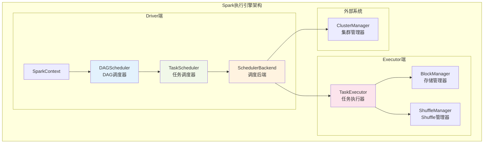
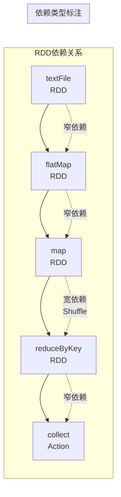
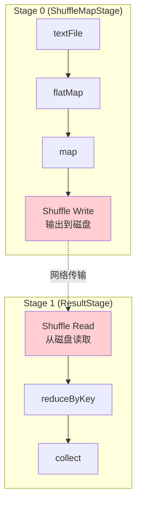
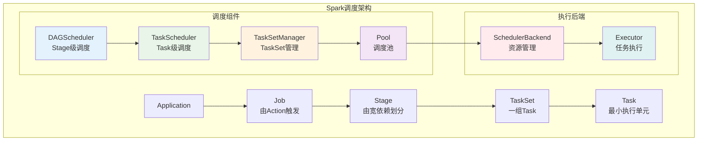
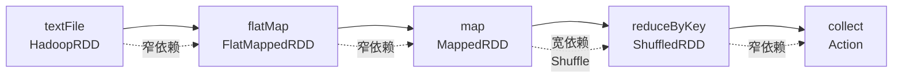
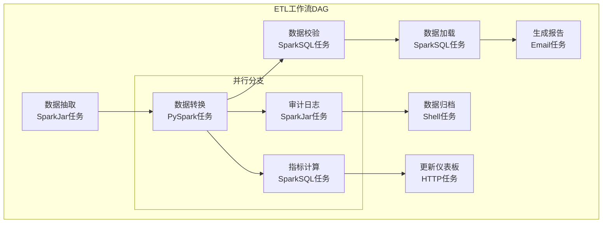

# Spark执行引擎深度学习笔记

## 目录
1. [执行引擎概述](#1-执行引擎概述)
2. [DAG调度器详解](#2-dag调度器详解)
3. [Stage划分机制](#3-stage划分机制)
4. [Task调度执行](#4-task调度执行)
5. [调度器组件架构](#5-调度器组件架构)
6. [实例分析](#6-实例分析)

---

## 1. 执行引擎概述

### 1.1 Spark执行引擎核心职责



### 1.2 执行引擎工作流程

```scala
// Spark执行引擎的核心工作流程
class SparkExecutionEngine {
  
  // 1. Action触发作业提交
  def triggerJob[T](rdd: RDD[T], func: Iterator[T] => Unit): Unit = {
    sparkContext.runJob(rdd, func)
  }
  
  // 2. DAG构建与优化
  def buildDAG(finalRDD: RDD[_]): DAG = {
    val visitedRDDs = new mutable.HashSet[RDD[_]]
    val dependencies = new ArrayBuffer[Dependency[_]]
    
    def visit(rdd: RDD[_]): Unit = {
      if (!visitedRDDs.contains(rdd)) {
        visitedRDDs += rdd
        dependencies ++= rdd.dependencies
        rdd.dependencies.foreach(dep => visit(dep.rdd))
      }
    }
    
    visit(finalRDD)
    new DAG(visitedRDDs.toSet, dependencies.toSeq)
  }
  
  // 3. Stage划分
  def createStages(dag: DAG): Array[Stage] = {
    // 根据宽依赖切分Stage
    val stages = new ArrayBuffer[Stage]
    val shuffleDeps = dag.dependencies.filter(_.isInstanceOf[ShuffleDependency])
    
    // 创建ShuffleMapStage和ResultStage
    stages.toArray
  }
}
```

---

## 2. DAG调度器详解

### 2.1 DAGScheduler核心功能

**DAGScheduler是Spark调度系统的核心**，负责：

1. **DAG构建**：将RDD的依赖关系转换为有向无环图
2. **Stage划分**：根据宽依赖将DAG切分为多个Stage
3. **Task生成**：为每个Stage生成相应的Task集合
4. **失败重试**：处理Stage和Task的失败重试逻辑
5. **数据本地性**：优化Task的数据本地性调度

```scala
// DAGScheduler的核心实现逻辑
class DAGScheduler(
    private[scheduler] val sc: SparkContext,
    private[scheduler] val taskScheduler: TaskScheduler
) {
  
  // 提交作业的入口方法
  def submitJob[T, U](
      rdd: RDD[T],
      func: (TaskContext, Iterator[T]) => U,
      partitions: Seq[Int],
      callSite: CallSite,
      resultHandler: (Int, U) => Unit,
      properties: Properties): JobWaiter[U] = {
    
    // 1. 创建Job对象
    val jobId = nextJobId.getAndIncrement()
    val job = new Job(jobId, rdd, func, partitions, callSite, resultHandler, properties)
    
    // 2. 提交给事件处理队列
    eventProcessLoop.post(JobSubmitted(job))
    
    job.waiter
  }
  
  // 处理Job提交事件
  private def handleJobSubmitted(job: Job): Unit = {
    // 1. 创建ResultStage
    val finalStage = createResultStage(job.rdd, job.partitions, job.jobId)
    
    // 2. 提交Stage
    submitStage(finalStage)
  }
  
  // 递归提交Stage
  private def submitStage(stage: Stage): Unit = {
    // 1. 检查父Stage是否完成
    val missing = getMissingParentStages(stage)
    
    if (missing.isEmpty) {
      // 2. 所有父Stage都完成，提交当前Stage
      submitMissingTasks(stage)
    } else {
      // 3. 先提交缺失的父Stage
      missing.foreach(submitStage)
      waitingStages += stage
    }
  }
}
```

### 2.2 DAG构建过程



**DAG构建算法：**
```scala
def buildDAG(finalRDD: RDD[_]): DirectedAcyclicGraph = {
  val visited = mutable.Set[RDD[_]]()
  val nodes = mutable.ArrayBuffer[RDD[_]]()
  val edges = mutable.ArrayBuffer[Dependency[_]]()
  
  def traverse(rdd: RDD[_]): Unit = {
    if (!visited.contains(rdd)) {
      visited.add(rdd)
      nodes += rdd
      
      // 遍历所有依赖
      for (dependency <- rdd.dependencies) {
        edges += dependency
        traverse(dependency.rdd) // 递归遍历父RDD
      }
    }
  }
  
  traverse(finalRDD)
  new DirectedAcyclicGraph(nodes.toSeq, edges.toSeq)
}
```

---

## 3. Stage划分机制

### 3.1 Stage划分原理

**核心规则：遇到宽依赖就切分Stage**



### 3.2 Stage类型详解

#### ShuffleMapStage
```scala
class ShuffleMapStage(
    id: Int,
    rdd: RDD[_],
    numTasks: Int,
    parents: List[Stage],
    firstJobId: Int,
    shuffleDep: ShuffleDependency[_, _, _]
) extends Stage(id, rdd, numTasks, parents, firstJobId) {
  
  // 每个分区的输出位置
  val outputLocs = Array.fill[Option[MapStatus]](numPartitions)(None)
  
  // 是否所有分区都已完成
  def isAvailable: Boolean = outputLocs.forall(_.isDefined)
  
  // 获取输出位置
  def outputLocInMapOutputTrackerFormat(): Array[MapStatus] = {
    outputLocs.map(_.orNull)
  }
}
```

#### ResultStage  
```scala
class ResultStage(
    id: Int,
    rdd: RDD[_], 
    func: (TaskContext, Iterator[_]) => _,
    partitions: Array[Int],
    parents: List[Stage],
    firstJobId: Int
) extends Stage(id, rdd, partitions.length, parents, firstJobId) {
  
  // 需要计算的分区
  val partitionsToCompute: Array[Int] = partitions
  
  // 结果处理函数
  val resultHandler: (Int, _) => Unit = _
}
```

### 3.3 Stage划分算法实现

```scala
private def getOrCreateParentStages(rdd: RDD[_], firstJobId: Int): List[Stage] = {
  getShuffleDependencies(rdd).map { shuffleDep =>
    getOrCreateShuffleMapStage(shuffleDep, firstJobId)
  }.toList
}

private def getShuffleDependencies(rdd: RDD[_]): HashSet[ShuffleDependency[_, _, _]] = {
  val parents = new HashSet[ShuffleDependency[_, _, _]]
  val visited = new HashSet[RDD[_]]
  val waitingForVisit = new ArrayStack[RDD[_]]
  
  waitingForVisit.push(rdd)
  
  while (waitingForVisit.nonEmpty) {
    val toVisit = waitingForVisit.pop()
    if (!visited(toVisit)) {
      visited += toVisit
      
      toVisit.dependencies.foreach {
        case shuffleDep: ShuffleDependency[_, _, _] =>
          parents += shuffleDep  // 找到宽依赖，添加到父Stage
        case dependency =>
          waitingForVisit.push(dependency.rdd)  // 窄依赖，继续遍历
      }
    }
  }
  
  parents
}
```

---

## 4. Task调度执行

### 4.1 Task类型与生成

#### Task层次结构
```scala
abstract class Task[T](
    val stageId: Int,
    val stageAttemptId: Int, 
    val partitionId: Int
) extends Serializable {
  
  // Task执行的核心方法
  def runTask(context: TaskContext): T
  
  // 获取Task的最佳执行位置
  def preferredLocations: Seq[TaskLocation] = Nil
}

// ShuffleMapTask：输出数据到Shuffle系统
class ShuffleMapTask(
    stageId: Int,
    stageAttemptId: Int,
    taskBinary: Broadcast[Array[Byte]],
    partition: Partition,
    locs: Seq[TaskLocation]
) extends Task[MapStatus](stageId, stageAttemptId, partition.index) {
  
  override def runTask(context: TaskContext): MapStatus = {
    val rdd = SparkEnv.get.closureSerializer.newInstance().deserialize[RDD[_]](...)
    val writer = SparkEnv.get.shuffleManager.getWriter[Any, Any](...)
    
    // 计算并写入Shuffle数据
    writer.write(rdd.iterator(partition, context).asInstanceOf[Iterator[_ <: Product2[Any, Any]]])
    writer.stop(success = true).get
  }
}

// ResultTask：计算最终结果
class ResultTask[T, U](
    stageId: Int,
    stageAttemptId: Int,
    taskBinary: Broadcast[Array[Byte]],
    partition: Partition,
    locs: Seq[TaskLocation],
    func: (TaskContext, Iterator[T]) => U
) extends Task[U](stageId, stageAttemptId, partition.index) {
  
  override def runTask(context: TaskContext): U = {
    val rdd = SparkEnv.get.closureSerializer.newInstance().deserialize[RDD[T]](...)
    func(context, rdd.iterator(partition, context))
  }
}
```

### 4.2 TaskScheduler工作机制

```scala
private[spark] class TaskSchedulerImpl(
    val sc: SparkContext,
    val maxTaskFailures: Int
) extends TaskScheduler {
  
  // 提交TaskSet
  override def submitTasks(taskSet: TaskSet): Unit = {
    val tasks = taskSet.tasks
    val manager = createTaskSetManager(taskSet, maxTaskFailures)
    
    // 添加到调度池
    schedulableBuilder.addTaskSetManager(manager, manager.properties)
    
    // 触发资源分配
    backend.reviveOffers()
  }
  
  // 资源分配算法
  def resourceOffers(offers: IndexedSeq[WorkerOffer]): Seq[Seq[TaskDescription]] = {
    // 1. 随机打乱offers，避免总是分配给同一个executor
    val shuffledOffers = Random.shuffle(offers)
    
    // 2. 为每个offer分配任务
    val tasks = shuffledOffers.map(offer => {
      val execId = offer.executorId
      val host = offer.host
      val availableCores = offer.cores
      
      // 3. 根据数据本地性分配任务
      val localityLevels = Array(
        TaskLocality.PROCESS_LOCAL,  // 进程本地
        TaskLocality.NODE_LOCAL,     // 节点本地  
        TaskLocality.RACK_LOCAL,     // 机架本地
        TaskLocality.ANY             // 任意位置
      )
      
      val tasksForExecutor = ArrayBuffer[TaskDescription]()
      var availableCpuCores = availableCores
      
      for (locality <- localityLevels if availableCpuCores > 0) {
        val tasks = resourceOfferSingleTaskSet(
          taskSetManager, execId, host, availableCpuCores, locality
        )
        tasksForExecutor ++= tasks
        availableCpuCores -= tasks.size
      }
      
      tasksForExecutor
    })
    
    tasks
  }
}
```

### 4.3 数据本地性调度

**数据本地性级别（优先级从高到低）：**

```scala
object TaskLocality extends Enumeration {
  val PROCESS_LOCAL = Value  // 数据在同一JVM进程中
  val NODE_LOCAL = Value     // 数据在同一节点上
  val RACK_LOCAL = Value     // 数据在同一机架上  
  val ANY = Value           // 数据在任意位置
}
```

**本地性调度实现：**
```scala
private def getAllowedLocalityLevel(curTime: Long): TaskLocality.TaskLocality = {
  // 根据等待时间决定本地性级别
  def getAllowedLocalityLevel(curTime: Long): TaskLocality.TaskLocality = {
    while (curTime - lastLaunchTime >= localityWaits(currentLocalityIndex)) {
      currentLocalityIndex += 1
      if (currentLocalityIndex >= localityWaits.length) {
        return TaskLocality.ANY
      }
    }
    myLocalityLevels(currentLocalityIndex)
  }
}

// 本地性等待时间配置
val localityWaits = Array(
  spark.locality.wait.process,  // 进程本地性等待时间
  spark.locality.wait.node,     // 节点本地性等待时间  
  spark.locality.wait.rack      // 机架本地性等待时间
)
```

---

## 5. 调度器组件架构

### 5.1 调度器组件关系



### 5.2 事件驱动调度机制

```scala
// Spark采用事件驱动的调度机制
private[scheduler] class DAGSchedulerEventProcessLoop(dagScheduler: DAGScheduler)
  extends EventLoop[DAGSchedulerEvent]("dag-scheduler-event-loop") {
  
  override def onReceive(event: DAGSchedulerEvent): Unit = {
    val timerContext = timer.time()
    try {
      doOnReceive(event)
    } finally {
      timerContext.stop()
    }
  }
  
  private def doOnReceive(event: DAGSchedulerEvent): Unit = event match {
    case JobSubmitted(jobId, rdd, func, partitions, callSite, listener, properties) =>
      dagScheduler.handleJobSubmitted(jobId, rdd, func, partitions, callSite, listener, properties)
      
    case StageCancelled(stageId, reason) =>
      dagScheduler.handleStageCancellation(stageId, reason)
      
    case JobCancelled(jobId, reason) =>
      dagScheduler.handleJobCancellation(jobId, reason)
      
    case TaskSetFailed(taskSet, reason, exception) =>
      dagScheduler.handleTaskSetFailed(taskSet, reason, exception)
      
    case CompletionEvent(task, reason, result, accumUpdates, metricPeaks, info) =>
      dagScheduler.handleTaskCompletion(task, reason, result, accumUpdates, metricPeaks, info)
  }
}
```

### 5.3 调度池与公平调度

```scala
private[spark] class Pool(
    val poolName: String,
    val schedulingMode: SchedulingMode,
    initMinShare: Int,
    initWeight: Int
) extends Schedulable {
  
  val schedulableQueue = new ConcurrentLinkedQueue[Schedulable]
  
  // 按调度模式排序
  override def getSortedTaskSetQueue: ArrayBuffer[TaskSetManager] = {
    val sortedTaskSetQueue = new mutable.ArrayBuffer[TaskSetManager]
    
    schedulingMode match {
      case SchedulingMode.FAIR =>
        // 公平调度：按权重和运行时间排序
        val comparator = new FairSchedulingAlgorithm()
        sortedTaskSetQueue ++= schedulableQueue.asScala.toSeq.sortWith(comparator.comparator)
        
      case SchedulingMode.FIFO =>
        // FIFO调度：按提交顺序排序
        val comparator = new FIFOSchedulingAlgorithm()  
        sortedTaskSetQueue ++= schedulableQueue.asScala.toSeq.sortWith(comparator.comparator)
    }
    
    sortedTaskSetQueue
  }
}
```

---

## 6. 实例分析

### 6.1 WordCount程序执行流程分析

```scala
// 经典WordCount程序
val textFile = sc.textFile("hdfs://input/data.txt")      // RDD_1
val words = textFile.flatMap(line => line.split(" "))    // RDD_2  
val pairs = words.map(word => (word, 1))                 // RDD_3
val wordCounts = pairs.reduceByKey(_ + _)                 // RDD_4
val result = wordCounts.collect()                         // Action触发
```

**执行流程分解：**

1. **DAG构建**


2. **Stage划分**
```
Stage 0 (ShuffleMapStage):
- Task 0: textFile.partition(0) -> flatMap -> map -> shuffle write
- Task 1: textFile.partition(1) -> flatMap -> map -> shuffle write
- Task 2: textFile.partition(2) -> flatMap -> map -> shuffle write

Stage 1 (ResultStage):  
- Task 0: shuffle read -> reduceByKey.partition(0) -> collect
- Task 1: shuffle read -> reduceByKey.partition(1) -> collect
```

3. **Task执行时间线**

```mermaid
gantt
    title WordCount执行时间线
    dateFormat X
    axisFormat %s
    
    section Stage 0
    Task 0    :done, t0, 0, 3s
    Task 1    :done, t1, 0, 4s  
    Task 2    :done, t2, 0, 3s
    
    section Stage 1
    Task 0    :done, t3, after t1, 2s
    Task 1    :done, t4, after t1, 2s
```


### 6.2 项目中的复杂工作流执行

基于项目代码分析一个典型的数据处理工作流：

```java
// 项目中的工作流执行逻辑
public class ComplexDataProcessingWorkflow {
    
    public void executeETLPipeline() {
        // 1. 数据抽取 (Extract)
        SparkJarConfig extractConfig = SparkJarConfig.builder()
            .sparkVersion("3.2.0")
            .mainClass("com.shopee.di.etl.ExtractTask")  
            .sparkProperties("--conf spark.sql.adaptive.enabled=true")
            .build();
            
        // 2. 数据转换 (Transform)  
        PythonSparkConfig transformConfig = PythonSparkConfig.builder()
            .sparkVersion("3.2.0")
            .language("python")
            .mainResource(ResourceConfig.builder()
                .resourcePath("hdfs://scripts/transform.py")
                .build())
            .build();
            
        // 3. 数据加载 (Load)
        SparkSQLConfig loadConfig = SparkSQLConfig.builder()
            .sparkVersion("3.2.0") 
            .sparkProperties("--conf spark.sql.warehouse.dir=hdfs://warehouse/")
            .build();
    }
}
```

**工作流DAG示例：**


### 6.3 性能优化实例

```scala
// 基于项目经验的Spark性能优化配置
val optimizedSparkConf = new SparkConf()
  .setAppName("Optimized Data Processing")
  
  // 资源配置优化
  .set("spark.executor.instances", "20")
  .set("spark.executor.cores", "4") 
  .set("spark.executor.memory", "8g")
  .set("spark.executor.memoryFraction", "0.8")
  
  // Shuffle优化
  .set("spark.sql.adaptive.enabled", "true")
  .set("spark.sql.adaptive.coalescePartitions.enabled", "true")
  .set("spark.sql.adaptive.skewJoin.enabled", "true")
  
  // 序列化优化
  .set("spark.serializer", "org.apache.spark.serializer.KryoSerializer")
  .set("spark.kryoserializer.buffer.max", "64m")
  
  // 内存管理优化
  .set("spark.memory.useLegacyMode", "false")
  .set("spark.memory.storageFraction", "0.5")
```

---

## 总结

本章深入分析了Spark执行引擎的核心机制：

1. **DAG调度器**：负责作业的整体调度，将RDD依赖关系转换为执行计划
2. **Stage划分**：基于宽依赖切分，优化数据传输和并行度
3. **Task调度**：实现数据本地性优化，提高执行效率
4. **事件驱动**：异步事件处理，保证系统响应性
5. **实际应用**：结合项目代码理解复杂工作流的执行机制

下一节我们将学习Spark SQL与Catalyst优化器的深度原理。

---

## 推荐阅读
- [Spark官方文档 - Job Scheduling](https://spark.apache.org/docs/latest/job-scheduling.html)
- 《Spark内核设计的艺术》第6-8章
- [Spark源码分析 - DAGScheduler](https://github.com/apache/spark/blob/master/core/src/main/scala/org/apache/spark/scheduler/DAGScheduler.scala)
