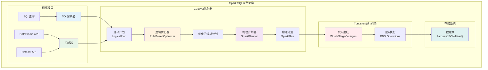
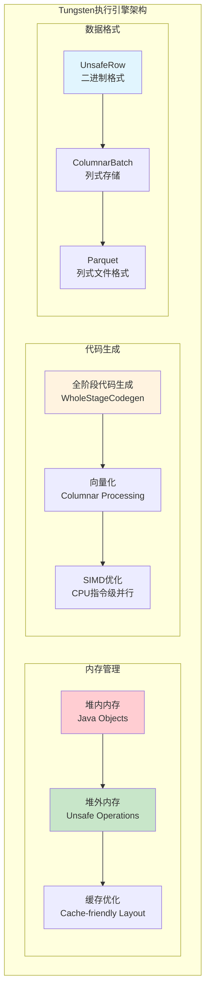
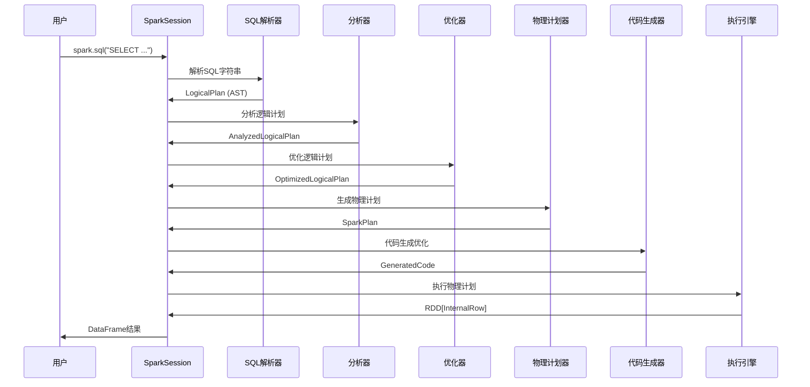

# Spark SQL与Catalyst优化器深度学习笔记

## 目录
1. [Spark SQL架构概述](#1-spark-sql架构概述)
2. [Catalyst优化器原理](#2-catalyst优化器原理)
3. [Tungsten执行引擎](#3-tungsten执行引擎)
4. [SQL执行流程详解](#4-sql执行流程详解)
5. [优化规则与实践](#5-优化规则与实践)
6. [代码生成技术](#6-代码生成技术)

---

## 1. Spark SQL架构概述

### 1.1 Spark SQL整体架构



### 1.2 核心组件功能

#### 1. **SQL解析器（Parser）**
```scala
// SQL解析器将SQL字符串转换为AST
class SparkSqlParser extends AbstractSqlParser {
  
  def parsePlan(sqlText: String): LogicalPlan = {
    parse(sqlText) { parser =>
      astBuilder.visitSingleStatement(parser.singleStatement()) match {
        case plan: LogicalPlan => plan
        case _ => throw new ParseException("Expected a LogicalPlan")
      }
    }
  }
}

// 示例：SQL解析过程
val sql = "SELECT name, age FROM users WHERE age > 18"
val parsedPlan = sparkSqlParser.parsePlan(sql)
// 生成的AST结构：
// Project([name, age], Filter(age > 18, UnresolvedRelation(users)))
```

#### 2. **分析器（Analyzer）**
```scala
// 分析器解析表名、列名、函数等引用
class Analyzer(catalog: SessionCatalog) extends RuleExecutor[LogicalPlan] {
  
  lazy val batches: Seq[Batch] = Seq(
    Batch("Resolution", Once,
      ResolveRelations ::       // 解析表引用
      ResolveReferences ::      // 解析列引用  
      ResolveDeserializer ::    // 解析反序列化器
      ResolveFunctions ::       // 解析函数调用
      Nil: _*),
    
    Batch("Post-Hoc Resolution", Once, 
      PreprocessTableInsertion ::
      ResolveUpCast ::
      Nil: _*)
  )
}

// 分析过程示例
// 输入：Project([name, age], Filter(age > 18, UnresolvedRelation(users)))
// 输出：Project([users.name, users.age], Filter(users.age > 18, ResolvedRelation(usersTable)))
```

### 1.3 SQL到RDD的转换过程

```scala
// 完整的SQL执行流程
class SparkSession {
  
  def sql(sqlText: String): DataFrame = {
    // 1. 解析SQL
    val logicalPlan = sparkSqlParser.parsePlan(sqlText)
    
    // 2. 分析和优化
    val analyzedPlan = analyzer.executeAndCheck(logicalPlan)  
    val optimizedPlan = optimizer.executeAndCheck(analyzedPlan)
    
    // 3. 生成物理计划
    val physicalPlans = planner.plan(optimizedPlan)
    val sparkPlan = planner.pruneFilterProject(physicalPlans.head)
    
    // 4. 执行
    val rdd = sparkPlan.execute()
    
    // 5. 封装为DataFrame
    Dataset.ofRows(this, optimizedPlan)
  }
}
```

---

## 2. Catalyst优化器原理

### 2.1 基于规则的优化框架

**Catalyst采用基于规则的优化（Rule-Based Optimization）**

```scala
// Catalyst优化器的核心抽象
abstract class Rule[TreeType <: TreeNode[_]] extends Logging {
  
  // 规则名称
  val ruleName: String
  
  // 应用规则的核心方法
  def apply(plan: TreeType): TreeType
  
  // 条件：何时应用此规则
  def condition(plan: TreeType): Boolean = true
}

// 规则执行器
abstract class RuleExecutor[TreeType <: TreeNode[_]] {
  
  // 定义优化批次
  protected def batches: Seq[Batch]
  
  // 执行优化
  def execute(plan: TreeType): TreeType = {
    var curPlan = plan
    
    batches.foreach { batch =>
      val batchStartPlan = curPlan
      var iteration = 0
      var lastPlan = curPlan
      
      // 迭代应用规则直到计划稳定
      do {
        curPlan = batch.rules.foldLeft(curPlan) {
          case (currentPlan, rule) => rule(currentPlan)
        }
        iteration += 1
      } while (iteration < batch.strategy.maxIterations && !curPlan.fastEquals(lastPlan))
    }
    
    curPlan
  }
}
```

### 2.2 常用优化规则

#### 1. **常量折叠（Constant Folding）**
```scala
object ConstantFolding extends Rule[LogicalPlan] {
  def apply(plan: LogicalPlan): LogicalPlan = plan.transformAllExpressions {
    
    // 算术表达式常量折叠
    case Add(Literal(a, dt), Literal(b, _)) if dt.isInstanceOf[NumericType] =>
      Literal(a.asInstanceOf[Number].doubleValue() + b.asInstanceOf[Number].doubleValue())
      
    // 字符串连接常量折叠  
    case Concat(Literal(a: UTF8String, _) :: Literal(b: UTF8String, _) :: Nil) =>
      Literal(a.concat(b))
      
    // 布尔表达式常量折叠
    case And(Literal(true, BooleanType), right) => right
    case And(Literal(false, BooleanType), _) => Literal(false)
  }
}

// 优化示例
// 原始：SELECT name FROM users WHERE 1 + 2 > age  
// 优化：SELECT name FROM users WHERE 3 > age
```

#### 2. **谓词下推（Predicate Pushdown）**
```scala
object PushDownPredicate extends Rule[LogicalPlan] {
  def apply(plan: LogicalPlan): LogicalPlan = plan transform {
    
    // 将Filter下推到Join下方
    case Filter(condition, Join(left, right, joinType, joinCondition)) =>
      val (leftConditions, rightConditions, commonConditions) = 
        splitConjunctivePredicates(condition)
      
      val newLeft = leftConditions.foldLeft(left)((l, c) => Filter(c, l))
      val newRight = rightConditions.foldLeft(right)((r, c) => Filter(c, r))
      
      val newJoin = Join(newLeft, newRight, joinType, joinCondition)
      commonConditions.foldLeft[LogicalPlan](newJoin)((j, c) => Filter(c, j))
      
    // 将Filter下推到Project下方  
    case Filter(condition, Project(projectList, child)) =>
      val aliases = getAliasMap(projectList)
      val substitutedCondition = condition.transform {
        case a: Attribute => aliases.getOrElse(a, a)
      }
      Project(projectList, Filter(substitutedCondition, child))
  }
}

// 优化示例
// 原始：SELECT u.name FROM users u JOIN orders o ON u.id = o.user_id WHERE u.age > 18
// 优化：SELECT u.name FROM (SELECT * FROM users WHERE age > 18) u JOIN orders o ON u.id = o.user_id
```

#### 3. **列裁剪（Column Pruning）**
```scala
object ColumnPruning extends Rule[LogicalPlan] {
  def apply(plan: LogicalPlan): LogicalPlan = plan transform {
    
    // Project列裁剪
    case Project(projectList, child) if projectList != child.output =>
      val requiredAttributes = projectList.flatMap(_.references).distinct
      Project(projectList, prunedChild(child, requiredAttributes))
      
    // Join列裁剪
    case Join(left, right, joinType, condition) =>
      val requiredAttributes = condition.map(_.references).getOrElse(Set.empty) ++
                              plan.references
      val prunedLeft = prunedChild(left, requiredAttributes)  
      val prunedRight = prunedChild(right, requiredAttributes)
      Join(prunedLeft, prunedRight, joinType, condition)
  }
}

// 优化示例  
// 原始：SELECT name FROM (SELECT name, age, city FROM users)
// 优化：SELECT name FROM (SELECT name FROM users)
```

### 2.3 优化器执行批次

```scala
abstract class SparkOptimizer extends Optimizer {
  
  def batches: Seq[Batch] = {
    Batch("Finish Analysis", Once,
      EliminateSubqueryAliases) ::
      
    Batch("Union", Once,  
      CombineUnions) ::
      
    Batch("Pullup Correlated Predicates", Once,
      PullupCorrelatedPredicates) ::
      
    Batch("Subquery", Once,
      OptimizeSubqueries) ::
      
    Batch("Replace Operators", fixedPoint,
      ReplaceIntersectWithSemiJoin,
      ReplaceExceptWithFilter,
      ReplaceExceptWithAntiJoin,
      ReplaceDistinctWithAggregate) ::
      
    Batch("Aggregate", fixedPoint,
      RemoveLiteralFromGroupExpressions,
      RemoveRepetitionFromGroupExpressions) ::
      
    Batch("Operator Optimizations", fixedPoint, Seq(
      // Operator push down
      PushProjectionThroughUnion,
      PushPredicateThroughJoin,
      PushDownPredicate,
      LimitPushDown,
      ColumnPruning,
      InferFiltersFromConstraints,
      
      // Operator combine  
      CollapseRepartition,
      CollapseProject,
      CollapseWindow,
      CombineFilters,
      CombineLimits,
      CombineUnions,
      
      // Constant folding and strength reduction
      TransposeWindow,
      NullPropagation,
      ConstantFolding,
      ReorderAssociativeOperator,
      LikeSimplification,
      BooleanSimplification,
      SimplifyConditionals,
      RemoveDispensableExpressions,
      SimplifyBinaryComparison,
      PruneFilters,
      EliminateSorts,
      SimplifyCasts,
      SimplifyCaseConversionExpressions,
      RewriteCorrelatedScalarSubquery,
      EliminateMapObjects,
      EliminateUnions,
      SimplifyExtractValueOps,
      CombineConcats) ++
      extendedOperatorOptimizationRules: _*)
  }
}
```

---

## 3. Tungsten执行引擎

### 3.1 Tungsten核心特性

**Tungsten是Spark 2.0引入的新一代执行引擎，主要特性：**

1. **堆外内存管理**：减少GC压力
2. **缓存友好的数据结构**：提高CPU缓存命中率  
3. **全阶段代码生成**：消除虚函数调用开销
4. **向量化处理**：利用现代CPU的SIMD指令



### 3.2 堆外内存管理

```scala
// UnsafeRow：Tungsten的核心数据结构  
class UnsafeRow extends InternalRow {
  
  private var baseObject: Object = _
  private var baseOffset: Long = _
  private var sizeInBytes: Int = _
  
  // 高效的字段访问
  def getInt(ordinal: Int): Int = {
    assertIndexIsValid(ordinal)
    Platform.getInt(baseObject, getFieldOffset(ordinal))
  }
  
  def setInt(ordinal: Int, value: Int): Unit = {
    assertIndexIsValid(ordinal)
    Platform.putInt(baseObject, getFieldOffset(ordinal), value)
  }
  
  // 字段偏移计算
  private def getFieldOffset(ordinal: Int): Long = {
    baseOffset + bitSetWidthInBytes + ordinal * 8L
  }
}

// 内存分配器
class TaskMemoryManager(
    memoryManager: MemoryManager,
    taskAttemptId: Long
) {
  
  // 申请堆外内存页
  def allocatePage(size: Long): MemoryBlock = {
    if (size > MAXIMUM_PAGE_SIZE_BYTES) {
      throw new IllegalArgumentException(s"Cannot allocate page of size $size")
    }
    
    val page = memoryManager.tungstenMemoryAllocator.allocate(size)
    page
  }
  
  // 释放内存页
  def freePage(page: MemoryBlock): Unit = {
    memoryManager.tungstenMemoryAllocator.free(page)
  }
}
```

### 3.3 全阶段代码生成

**代码生成的核心思想：将整个Stage的计算逻辑编译成一个Java方法**

```scala
// WholeStageCodegen实现
case class WholeStageCodegenExec(child: SparkPlan) extends SparkPlan {
  
  override def doExecute(): RDD[InternalRow] = {
    val (ctx, cleanedSource) = doCodeGen()
    
    // 编译生成的代码
    val compiledClass = CodeGenerator.compile(cleanedSource)
    val generatedIterator = compiledClass.generate(ctx.references.toArray)
    
    child.execute().mapPartitionsWithIndex { (index, iter) =>
      generatedIterator.asInstanceOf[BufferedRowIterator].init(index, Array(iter))
      new Iterator[InternalRow] {
        def hasNext: Boolean = generatedIterator.hasNext
        def next(): InternalRow = generatedIterator.next()
      }
    }
  }
  
  def doCodeGen(): (CodegenContext, String) = {
    val ctx = new CodegenContext
    val code = child.produce(ctx, this)
    
    val source = s"""
      public SpecificIterator generate(Object[] references) {
        return new SpecificIterator(references);
      }
      
      final class SpecificIterator extends BufferedRowIterator {
        
        private Object[] references;
        private Iterator<InternalRow> inputs[];
        
        public SpecificIterator(Object[] references) {
          this.references = references;
        }
        
        public void init(int index, Iterator<InternalRow>[] inputs) {
          this.inputs = inputs;  
        }
        
        protected void processNext() throws java.io.IOException {
          $code
        }
      }
    """
    
    (ctx, source)
  }
}
```

**生成的代码示例：**
```java
// 原始SQL：SELECT a + b FROM table WHERE c > 10
// 生成的代码：
protected void processNext() throws java.io.IOException {
  while (inputs[0].hasNext()) {
    InternalRow row = (InternalRow) inputs[0].next();
    
    // WHERE c > 10
    int c = row.getInt(2);
    if (c > 10) {
      
      // SELECT a + b  
      int a = row.getInt(0);
      int b = row.getInt(1);
      int result = a + b;
      
      // 输出结果
      UnsafeRow unsafeRow = new UnsafeRow(1);
      unsafeRow.setInt(0, result);
      append(unsafeRow);
    }
  }
}
```

### 3.4 向量化执行

```scala
// 向量化执行支持
trait ColumnarBatchScan extends LeafExecNode {
  
  // 支持向量化读取
  override def supportsBatch: Boolean = true
  
  // 批量读取数据
  override def doExecuteColumnar(): RDD[ColumnarBatch] = {
    // 从数据源读取列式数据
    inputRDD.mapPartitions { iter =>
      new Iterator[ColumnarBatch] {
        def hasNext: Boolean = iter.hasNext
        def next(): ColumnarBatch = {
          // 读取一批数据（默认4096行）
          val batch = new ColumnarBatch(schema.fields.map(createColumnVector))
          var rowCount = 0
          
          while (iter.hasNext && rowCount < 4096) {
            val row = iter.next()
            // 将行数据添加到列向量中
            addRowToBatch(batch, row, rowCount)
            rowCount += 1
          }
          
          batch.setNumRows(rowCount)
          batch
        }
      }
    }
  }
}

// 向量化算子示例
case class ColumnarProjectExec(
    projectList: Seq[NamedExpression], 
    child: SparkPlan
) extends SparkPlan {
  
  override def doExecuteColumnar(): RDD[ColumnarBatch] = {
    child.executeColumnar().mapPartitions { batches =>
      batches.map { batch =>
        // 对每个批次进行投影计算
        val projectedColumns = projectList.map { expr =>
          evaluateExpression(expr, batch)
        }
        new ColumnarBatch(projectedColumns.toArray, batch.numRows())
      }
    }
  }
}
```

---

## 4. SQL执行流程详解

### 4.1 完整的SQL执行管道



### 4.2 逻辑计划树结构

```scala
// 典型SQL的逻辑计划树
val sql = """
  SELECT u.name, COUNT(*) as order_count
  FROM users u
  JOIN orders o ON u.id = o.user_id  
  WHERE u.age > 18
  GROUP BY u.name
  ORDER BY order_count DESC
  LIMIT 10
"""

// 生成的逻辑计划树：
/*
Limit(10)
 +- Sort(order_count DESC)
    +- Aggregate(u.name, COUNT(*) as order_count)
       +- Join(u.id = o.user_id)
          :- Filter(age > 18)
          :  +- SubqueryAlias(u)
          :     +- UnresolvedRelation(users)
          +- SubqueryAlias(o)
             +- UnresolvedRelation(orders)
*/
```

### 4.3 物理计划选择

```scala
// 物理计划器选择最优执行策略
object SparkStrategies extends QueryPlanner[SparkPlan] {
  
  def strategies: Seq[Strategy] = Seq(
    FileSourceStrategy,       // 文件数据源策略
    DataSourceStrategy,       // 通用数据源策略  
    SpecialLimits,           // Limit优化策略
    Aggregation,             // 聚合策略
    Window,                  // 窗口函数策略
    JoinSelection,           // Join策略选择
    InMemoryScans,           // 内存缓存扫描
    BasicOperators           // 基础算子策略
  )
}

// Join策略选择示例
object JoinSelection extends Strategy {
  def apply(plan: LogicalPlan): Seq[SparkPlan] = plan match {
    
    case Join(left, right, joinType, condition) =>
      
      // 1. 广播Hash Join (小表)
      if (canBroadcast(right)) {
        Seq(BroadcastHashJoinExec(left, right, joinType, condition, BuildRight))
      }
      
      // 2. Sort Merge Join (大表)  
      else if (canSortMergeJoin(joinType)) {
        Seq(SortMergeJoinExec(left, right, joinType, condition))
      }
      
      // 3. Hash Join (默认)
      else {
        Seq(ShuffledHashJoinExec(left, right, joinType, condition, BuildRight))
      }
  }
}
```

---

## 5. 优化规则与实践

### 5.1 Join优化策略

#### 1. **广播Join优化**
```scala
// 自动广播小表
spark.conf.set("spark.sql.adaptive.enabled", true)
spark.conf.set("spark.sql.adaptive.join.enabled", true)  
spark.conf.set("spark.sql.autoBroadcastJoinThreshold", "10MB")

// 手动广播提示
import org.apache.spark.sql.functions.broadcast

val result = users.join(
  broadcast(small_lookup_table),  // 强制广播
  users("category_id") === small_lookup_table("id")
)
```

#### 2. **Sort Merge Join优化**  
```scala
// 对大表Join进行分区优化
val users = spark.read.parquet("users.parquet")
  .repartition($"user_id")  // 按Join键重分区

val orders = spark.read.parquet("orders.parquet")
  .repartition($"user_id")  // 按Join键重分区
  
val result = users.join(orders, "user_id")  // 避免Shuffle
```

### 5.2 聚合优化策略

#### 1. **预聚合优化**
```scala
// Catalyst自动应用预聚合
val sql = """
  SELECT category, COUNT(*) 
  FROM products 
  GROUP BY category
"""

// 优化后的执行计划：
/*
HashAggregateExec(keys=[category], functions=[count(1)])
+- Exchange hashpartitioning(category, 200)
   +- HashAggregateExec(keys=[category], functions=[partial_count(1)])  -- 预聚合
      +- FileScan parquet [category]
*/
```

#### 2. **分组集优化**
```scala
// GROUPING SETS优化
val sql = """
  SELECT category, brand, COUNT(*)
  FROM products
  GROUP BY GROUPING SETS (
    (category, brand),
    (category), 
    ()
  )
"""

// Catalyst自动优化为：
// ExpandExec + HashAggregateExec  避免多次扫描数据
```

### 5.3 子查询优化

#### 1. **子查询重写**
```scala
// 相关子查询优化
val sql = """
  SELECT u.name 
  FROM users u
  WHERE EXISTS (
    SELECT 1 FROM orders o 
    WHERE o.user_id = u.id AND o.amount > 100
  )
"""

// Catalyst重写为Semi Join：
val optimized = users
  .join(orders.filter($"amount" > 100), Seq("user_id"), "leftsemi")
  .select($"name")
```

#### 2. **标量子查询优化**
```scala
// 标量子查询提升
val sql = """
  SELECT name, age,
    (SELECT AVG(amount) FROM orders WHERE user_id = users.id) as avg_order
  FROM users  
"""

// 优化为Left Outer Join避免N+1查询
```

---

## 6. 代码生成技术

### 6.1 表达式代码生成

```scala
// 表达式代码生成示例
abstract class Expression extends TreeNode[Expression] {
  
  // 生成表达式计算代码
  def genCode(ctx: CodegenContext): ExprCode = {
    val isNull = ctx.freshName("isNull")
    val value = ctx.freshName("value")
    
    val code = doGenCode(ctx, ExprCode(isNull, value, ""))
    code
  }
  
  // 具体表达式实现代码生成
  protected def doGenCode(ctx: CodegenContext, ev: ExprCode): ExprCode
}

// Add表达式的代码生成
case class Add(left: Expression, right: Expression) extends Expression {
  
  protected def doGenCode(ctx: CodegenContext, ev: ExprCode): ExprCode = {
    val leftGen = left.genCode(ctx)
    val rightGen = right.genCode(ctx)
    
    val code = s"""
      ${leftGen.code}
      ${rightGen.code}
      
      boolean ${ev.isNull} = ${leftGen.isNull} || ${rightGen.isNull};
      ${javaType} ${ev.value} = ${defaultValue};
      
      if (!${ev.isNull}) {
        ${ev.value} = ${leftGen.value} + ${rightGen.value};
      }
    """
    
    ev.copy(code = code)
  }
}
```

### 6.2 算子代码生成

```scala
// Filter算子代码生成
case class FilterExec(condition: Expression, child: SparkPlan) extends SparkPlan {
  
  override def doConsume(ctx: CodegenContext, input: Seq[ExprCode], row: ExprCode): String = {
    val conditionGen = condition.genCode(ctx)
    
    s"""
      ${conditionGen.code}
      if (!${conditionGen.isNull} && ${conditionGen.value}) {
        ${parent.doConsume(ctx, input, row)}
      }
    """
  }
}

// Project算子代码生成  
case class ProjectExec(projectList: Seq[NamedExpression], child: SparkPlan) extends SparkPlan {
  
  override def doConsume(ctx: CodegenContext, input: Seq[ExprCode], row: ExprCode): String = {
    val exprs = projectList.map(_.genCode(ctx))
    val exprCodes = exprs.map(_.code).mkString("\n")
    val exprValues = exprs.map(_.value)
    
    s"""
      $exprCodes
      ${parent.doConsume(ctx, exprs, row)}
    """
  }
}
```

### 6.3 代码生成优化技术

#### 1. **分支消除**
```java
// 优化前：包含分支判断
if (!input_isNull_0) {
  if (input_value_0 > 18) {
    // 处理逻辑
  }
}

// 优化后：消除分支  
boolean isValid = !input_isNull_0 && (input_value_0 > 18);
if (isValid) {
  // 处理逻辑
}
```

#### 2. **循环展开**
```java
// 优化前：循环处理
for (int i = 0; i < batch.numRows(); i++) {
  process(batch.getRow(i));
}

// 优化后：循环展开
int i = 0;
for (; i < (batch.numRows() & ~3); i += 4) {
  process(batch.getRow(i));
  process(batch.getRow(i + 1));
  process(batch.getRow(i + 2));
  process(batch.getRow(i + 3));
}
for (; i < batch.numRows(); i++) {
  process(batch.getRow(i));
}
```

---

## 总结

本章深入学习了Spark SQL与Catalyst优化器的核心原理：

1. **SQL架构**：从解析、分析到优化、执行的完整管道
2. **Catalyst优化器**：基于规则的优化框架，包含上百种优化规则  
3. **Tungsten引擎**：堆外内存、代码生成、向量化等现代化技术
4. **执行流程**：SQL到RDD的完整转换过程
5. **优化实践**：Join、聚合、子查询等常见优化场景
6. **代码生成**：表达式和算子的Java代码生成技术

下一节我们将学习Spark的内存管理与Shuffle机制。

---

## 推荐阅读
- [Spark官方文档 - SQL Performance Tuning](https://spark.apache.org/docs/latest/sql-performance-tuning.html)
- [Deep Dive into Spark SQL's Catalyst Optimizer](https://databricks.com/blog/2015/04/13/deep-dive-into-spark-sqls-catalyst-optimizer.html)
- 《Spark SQL内核剖析》全书
