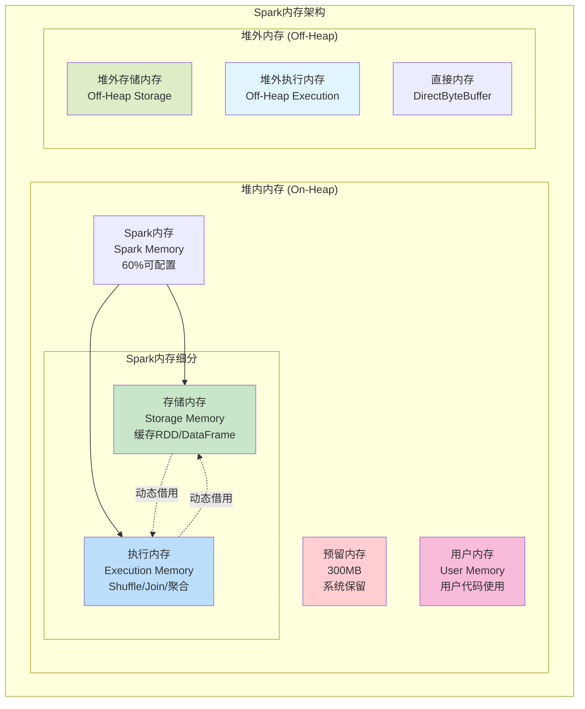
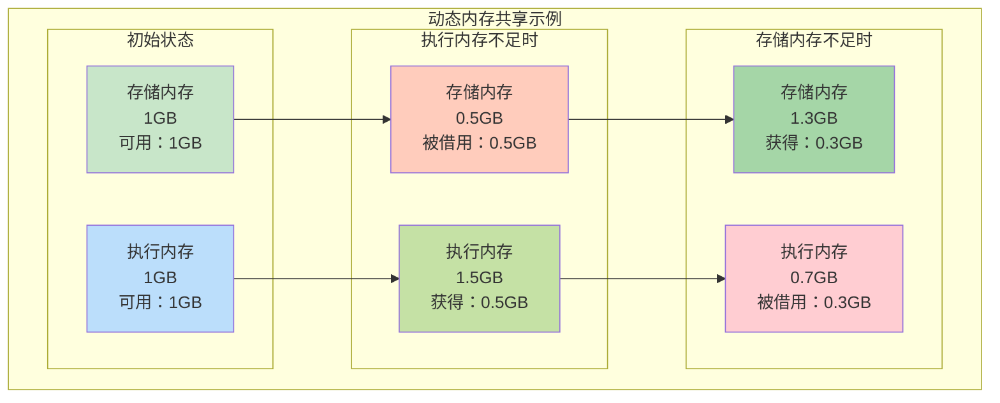
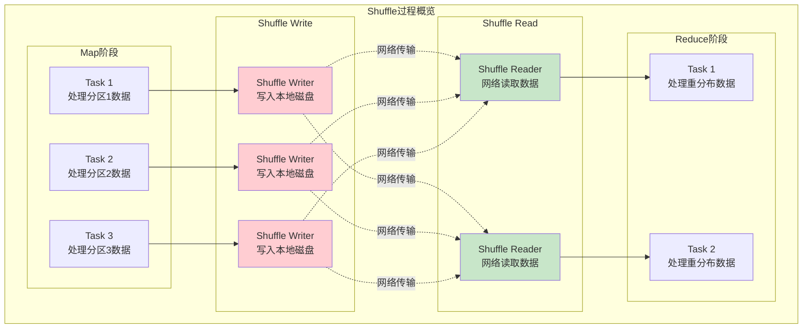
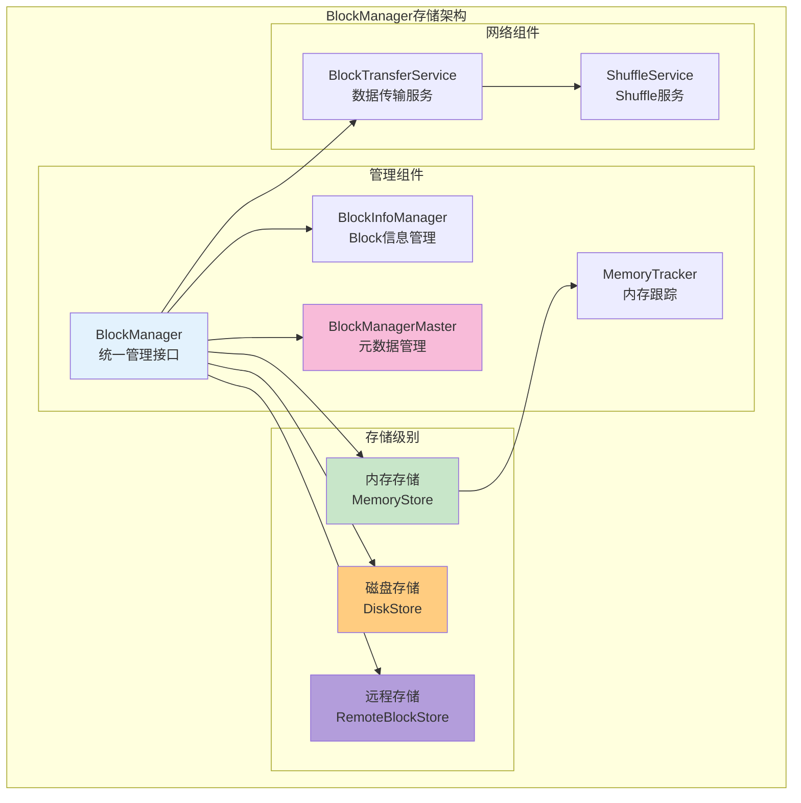

# Spark内存管理与Shuffle机制深度学习笔记

## 目录
1. [Spark内存管理架构](#1-spark内存管理架构)
2. [统一内存管理机制](#2-统一内存管理机制)
3. [Shuffle机制详解](#3-shuffle机制详解)
4. [存储系统BlockManager](#4-存储系统blockmanager)
5. [内存调优策略](#5-内存调优策略)
6. [Shuffle优化实践](#6-shuffle优化实践)

---

## 1. Spark内存管理架构

### 1.1 Spark内存模型概览



### 1.2 内存区域划分详解

```scala
// Spark内存管理器的核心实现
abstract class MemoryManager(
    conf: SparkConf,
    numCores: Int,
    onHeapStorageMemory: Long,
    onHeapExecutionMemory: Long
) {
  
  // 1. 最大堆内内存 = 最大堆大小 - 预留内存
  protected val maxHeapMemory = {
    val systemMemory = conf.getLong("spark.testing.memory", Runtime.getRuntime.maxMemory)
    val reservedMemory = conf.getLong("spark.testing.reservedMemory", 
                                      math.min(systemMemory * 0.3, 300 * 1024 * 1024))
    systemMemory - reservedMemory
  }
  
  // 2. Spark内存 = 最大堆内内存 * spark.memory.fraction(默认0.6)
  protected val maxOnHeapStorageMemory = onHeapStorageMemory
  protected val maxOnHeapExecutionMemory = onHeapExecutionMemory
  
  // 3. 堆外内存配置
  protected val maxOffHeapMemory = conf.getSizeAsBytes("spark.memory.offHeap.size", 0)
  protected val offHeapStorageMemory = 
    (maxOffHeapMemory * conf.getDouble("spark.memory.storageFraction", 0.5)).toLong
  protected val offHeapExecutionMemory = maxOffHeapMemory - offHeapStorageMemory
}
```

### 1.3 内存计算公式

```scala
// 内存分配计算公式
object SparkMemoryCalculator {
  
  def calculateMemory(heapSize: Long, sparkConf: SparkConf): MemoryInfo = {
    
    // 1. 预留内存：max(heapSize * 0.3, 300MB)
    val reservedMemory = math.min(heapSize * 0.3, 300 * 1024 * 1024).toLong
    
    // 2. 可用内存 = 堆大小 - 预留内存  
    val usableMemory = heapSize - reservedMemory
    
    // 3. Spark内存 = 可用内存 * spark.memory.fraction (默认0.6)
    val memoryFraction = sparkConf.getDouble("spark.memory.fraction", 0.6)
    val sparkMemory = (usableMemory * memoryFraction).toLong
    
    // 4. 用户内存 = 可用内存 - Spark内存
    val userMemory = usableMemory - sparkMemory
    
    // 5. 存储内存 = Spark内存 * spark.memory.storageFraction (默认0.5)
    val storageFraction = sparkConf.getDouble("spark.memory.storageFraction", 0.5)
    val storageMemory = (sparkMemory * storageFraction).toLong
    
    // 6. 执行内存 = Spark内存 - 存储内存
    val executionMemory = sparkMemory - storageMemory
    
    MemoryInfo(
      heapSize = heapSize,
      reservedMemory = reservedMemory,
      userMemory = userMemory,
      storageMemory = storageMemory, 
      executionMemory = executionMemory
    )
  }
}

// 实际计算示例（4GB堆内存）
val memoryInfo = SparkMemoryCalculator.calculateMemory(4096L * 1024 * 1024, sparkConf)
/*
结果：
- 总堆内存：4096 MB
- 预留内存：300 MB  
- 用户内存：1518 MB (37%)
- Spark内存：2278 MB (60% * 3796)
  - 存储内存：1139 MB (50% * 2278)  
  - 执行内存：1139 MB (50% * 2278)
*/
```

---

## 2. 统一内存管理机制

### 2.1 统一内存管理器（UnifiedMemoryManager）

**Spark 1.6引入统一内存管理，解决了静态内存管理的问题**

```scala
private[spark] class UnifiedMemoryManager(
    conf: SparkConf,
    val maxHeapMemory: Long,
    onHeapStorageRegionSize: Long,
    numCores: Int
) extends MemoryManager(
  conf,
  numCores,  
  onHeapStorageRegionSize,
  maxHeapMemory - onHeapStorageRegionSize
) {
  
  // 存储内存池
  private val onHeapStorageMemoryPool = new StorageMemoryPool(this, MemoryMode.ON_HEAP)
  private val offHeapStorageMemoryPool = new StorageMemoryPool(this, MemoryMode.OFF_HEAP)
  
  // 执行内存池  
  private val onHeapExecutionMemoryPool = new ExecutionMemoryPool(this, MemoryMode.ON_HEAP)
  private val offHeapExecutionMemoryPool = new ExecutionMemoryPool(this, MemoryMode.OFF_HEAP)
  
  override def acquireStorageMemory(
      blockId: BlockId,
      numBytes: Long,
      memoryMode: MemoryMode): Boolean = synchronized {
    
    val (executionPool, storagePool, maxMemory) = memoryMode match {
      case MemoryMode.ON_HEAP => 
        (onHeapExecutionMemoryPool, onHeapStorageMemoryPool, maxOnHeapStorageMemory)
      case MemoryMode.OFF_HEAP =>
        (offHeapExecutionMemoryPool, offHeapStorageMemoryPool, maxOffHeapStorageMemory)
    }
    
    // 1. 尝试在存储内存池中分配
    if (storagePool.memoryFree >= numBytes) {
      storagePool.acquireMemory(blockId, numBytes)
      return true
    }
    
    // 2. 尝试从执行内存池借用
    val memoryBorrowedFromExecution = math.max(0, 
      math.min(executionPool.memoryFree, numBytes - storagePool.memoryFree))
    
    if (memoryBorrowedFromExecution > 0) {
      executionPool.decrementPoolSize(memoryBorrowedFromExecution)
      storagePool.incrementPoolSize(memoryBorrowedFromExecution)
    }
    
    storagePool.acquireMemory(blockId, numBytes)
  }
}
```

### 2.2 动态内存共享机制



### 2.3 内存驱逐机制

```scala
// 存储内存池的驱逐策略
private[memory] class StorageMemoryPool(
    lock: Object,
    memoryMode: MemoryMode
) extends MemoryPool(lock) {
  
  // LRU驱逐策略
  private val memoryStore = new MemoryStore(conf, blockInfoManager, 
                                           serializerManager, memoryManager, this)
  
  def evictBlocksToFreeSpace(
      blockId: Option[BlockId],
      space: Long,
      memoryMode: MemoryMode): Long = {
    
    // 1. 选择要驱逐的Block（LRU策略）
    val blocksToEvict = new mutable.ArrayBuffer[BlockId]
    var freedMemory = 0L
    
    val iterator = memoryStore.entries.entrySet().iterator()
    while (iterator.hasNext && freedMemory < space) {
      val entry = iterator.next()
      val blockInfo = entry.getValue
      
      // 跳过正在使用的Block
      if (blockInfo.readerCount == 0 && blockInfo.writerTask == TaskContext.get()) {
        blocksToEvict += entry.getKey
        freedMemory += blockInfo.size
      }
    }
    
    // 2. 执行驱逐
    blocksToEvict.foreach { blockId =>
      val removedBlock = memoryStore.remove(blockId)
      removedBlock.foreach { block =>
        // 写入磁盘或丢弃
        spillToDisk(block)
      }
    }
    
    freedMemory
  }
}
```

---

## 3. Shuffle机制详解

### 3.1 Shuffle概述与分类

**Shuffle是Spark中最复杂和最重要的机制之一，负责数据重分布**



### 3.2 Shuffle Manager演进

```scala
// Shuffle Manager的演进历史
trait ShuffleManager {
  
  def registerShuffle[K, V, C](
      shuffleId: Int,
      numMaps: Int,
      dependency: ShuffleDependency[K, V, C]): ShuffleHandle
      
  def getWriter[K, V](
      handle: ShuffleHandle,
      mapId: Int,
      context: TaskContext): ShuffleWriter[K, V]
      
  def getReader[K, C](
      handle: ShuffleHandle,
      startPartition: Int,
      endPartition: Int,
      context: TaskContext): ShuffleReader[K, C]
}

// 1. Hash-based Shuffle (Spark 0.8-1.1, 已废弃)
class HashShuffleManager extends ShuffleManager {
  // 问题：产生大量小文件 M*R个文件
  // M个Map任务 × R个Reduce任务 = M*R个输出文件
}

// 2. Sort-based Shuffle (Spark 1.2+, 默认)  
class SortShuffleManager extends ShuffleManager {
  // 改进：每个Map任务只产生1个数据文件和1个索引文件
  // 总文件数：2*M个文件
  
  override def getWriter[K, V](
      handle: ShuffleHandle,
      mapId: Int,
      context: TaskContext): ShuffleWriter[K, V] = {
    
    handle match {
      case unsafeShuffleHandle: SerializedShuffleHandle[K @unchecked, V @unchecked] =>
        // Unsafe Shuffle Writer：性能最优
        new UnsafeShuffleWriter(...)
        
      case bypassMergeSortHandle: BypassMergeSortShuffleHandle[K @unchecked, V @unchecked] =>
        // Bypass Shuffle Writer：少量分区时使用
        new BypassMergeSortShuffleWriter(...)
        
      case other: BaseShuffleHandle[K @unchecked, V @unchecked, _] =>
        // Sort Shuffle Writer：通用情况
        new SortShuffleWriter(...)
    }
  }
}
```

### 3.3 SortShuffleWriter详解

```scala
private[spark] class SortShuffleWriter[K, V, C](
    shuffleBlockResolver: IndexShuffleBlockResolver,
    handle: BaseShuffleHandle[K, V, C],
    mapId: Int,
    context: TaskContext
) extends ShuffleWriter[K, V] with Logging {
  
  private val dep = handle.dependency
  private val blockManager = SparkEnv.get.blockManager
  private val sorter: ExternalSorter[K, V, _] = new ExternalSorter[K, V, C](
    context, dep.aggregator, Some(dep.partitioner), dep.keyOrdering, dep.serializer)
  
  override def write(records: Iterator[Product2[K, V]]): Unit = {
    // 1. 插入数据到外部排序器
    sorter.insertAll(records)
    
    // 2. 获取输出文件
    val output = shuffleBlockResolver.getDataFile(dep.shuffleId, mapId)
    val tmp = Utils.tempFileWith(output)
    
    try {
      val blockId = ShuffleBlockId(dep.shuffleId, mapId, IndexShuffleBlockResolver.NOOP_REDUCE_ID)
      
      // 3. 写入排序后的数据并生成分区索引
      val partitionLengths = sorter.writePartitionedFile(blockId, tmp)
      
      // 4. 写入索引文件
      shuffleBlockResolver.writeIndexFileAndCommit(dep.shuffleId, mapId, partitionLengths, tmp)
      
      // 5. 更新Shuffle写入度量
      mapStatus = MapStatus(blockManager.shuffleServerId, partitionLengths)
      
    } catch {
      case e: Exception =>
        if (tmp.exists()) tmp.delete()
        throw e
    }
  }
}
```

### 3.4 外部排序器（ExternalSorter）

```scala
private[spark] class ExternalSorter[K, V, C](
    context: TaskContext,
    aggregator: Option[Aggregator[K, V, C]] = None,
    partitioner: Option[Partitioner] = None,  
    ordering: Option[Ordering[K]] = None,
    serializer: Serializer = SparkEnv.get.serializer
) extends Spillable[WritablePartitionedPairCollection[K, C]](context.taskMemoryManager())
  with Logging {
  
  // 内存中的数据结构
  private var map = new PartitionedAppendOnlyMap[K, C]
  private var buffer = new PartitionedPairBuffer[K, C]
  
  // 溢写文件列表
  private val spills = new ArrayBuffer[SpilledFile]
  
  def insertAll(records: Iterator[Product2[K, V]]): Unit = {
    val shouldCombine = aggregator.isDefined
    
    if (shouldCombine) {
      // 需要预聚合：使用AppendOnlyMap
      val mergeValue = aggregator.get.mergeValue
      val createCombiner = aggregator.get.createCombiner
      
      while (records.hasNext) {
        val kv = records.next()
        map.changeValue(kv._1, createCombiner(kv._2), mergeValue)
        maybeSpillCollection(usingMap = true)  // 检查是否需要溢写
      }
    } else {
      // 不需要预聚合：使用PairBuffer  
      while (records.hasNext) {
        val kv = records.next()
        buffer.insert(kv._1, kv._2.asInstanceOf[C])
        maybeSpillCollection(usingMap = false)  // 检查是否需要溢写
      }
    }
  }
  
  // 内存不足时溢写到磁盘
  protected[this] override def spill(collection: WritablePartitionedPairCollection[K, C]): Unit = {
    val inMemoryIterator = collection.destructiveSortedWritablePartitionedIterator(comparator)
    val spillFile = spillMemoryIteratorToDisk(inMemoryIterator)
    spills += spillFile
  }
}
```

### 3.5 UnsafeShuffleWriter优化

**UnsafeShuffleWriter是性能最优的Shuffle Writer，使用堆外内存和序列化排序**

```scala
public final class UnsafeShuffleWriter<K, V> extends ShuffleWriter<K, V> {
  
  private final int numPartitions;
  private final TaskMemoryManager memoryManager;
  private final SerializerInstance serializer;
  private final ClassTag<V> valueClassTag;
  
  // 核心数据结构：ShuffleInMemorySorter
  private ShuffleInMemorySorter sorter;
  private MemoryBlock allocatedPages[];
  
  @Override
  public void write(scala.collection.Iterator<Product2<K, V>> records) throws IOException {
    
    // 1. 初始化内存排序器
    if (sorter == null) {
      sorter = new ShuffleInMemorySorter(
        memoryManager, (int) Math.min(PackedRecordPointer.MAXIMUM_PARTITION_ID + 1, numPartitions));
    }
    
    // 2. 序列化并插入记录
    final SerializationStream ser = serializer.serializeStream(writeBuffer);
    
    while (records.hasNext()) {
      final Product2<K, V> record = records.next();
      final K key = record._1();
      final V value = record._2();
      
      // 计算分区ID
      final int partitionId = partitioner.getPartition(key);
      
      // 序列化键值对
      ser.writeKey(key, valueClassTag);
      ser.writeValue(value, valueClassTag);
      ser.flush();
      
      // 插入到内存排序器
      final int recordLength = writeBuffer.size();
      sorter.insertRecord(writeBuffer.getBuf(), writeBuffer.size(), partitionId);
      
      // 检查是否需要溢写
      if (!sorter.hasSpaceForAnotherRecord()) {
        spill();
      }
    }
    
    // 3. 最终排序和写入
    closeAndWriteOutput();
  }
}
```

---

## 4. 存储系统BlockManager

### 4.1 BlockManager架构



### 4.2 存储级别详解

```scala
// Spark提供的存储级别
object StorageLevel {
  
  val NONE = new StorageLevel(false, false, false, false)
  
  // 仅内存
  val MEMORY_ONLY = new StorageLevel(true, false, false, false)
  val MEMORY_ONLY_2 = new StorageLevel(true, false, false, false, 2)  // 2副本
  
  // 内存+磁盘  
  val MEMORY_AND_DISK = new StorageLevel(true, true, false, false)
  val MEMORY_AND_DISK_2 = new StorageLevel(true, true, false, false, 2)
  
  // 序列化存储
  val MEMORY_ONLY_SER = new StorageLevel(true, false, false, true)
  val MEMORY_AND_DISK_SER = new StorageLevel(true, true, false, true)
  
  // 堆外内存
  val OFF_HEAP = new StorageLevel(true, true, true, true)
}

class StorageLevel private(
    private var _useDisk: Boolean,      // 是否使用磁盘
    private var _useMemory: Boolean,    // 是否使用内存  
    private var _useOffHeap: Boolean,   // 是否使用堆外内存
    private var _deserialized: Boolean, // 是否反序列化存储
    private var _replication: Int = 1   // 副本数量
) extends Externalizable {
  
  // 存储级别选择算法
  def isValid: Boolean = {
    (_useMemory || _useDisk) && (_replication > 0)
  }
}
```

### 4.3 MemoryStore实现

```scala
private[spark] class MemoryStore(
    conf: SparkConf,
    blockInfoManager: BlockInfoManager,
    serializerManager: SerializerManager,
    memoryManager: MemoryManager,
    blockEvictionHandler: BlockEvictionHandler
) extends BlockStore(conf) with Logging {
  
  // 内存中的Block存储
  private val entries = new LinkedHashMap[BlockId, MemoryEntry[_]](32, 0.75f, true)
  
  def putBytes[T: ClassTag](
      blockId: BlockId,
      size: Long, 
      memoryMode: MemoryMode,
      _bytes: () => ChunkedByteBuffer): Boolean = {
    
    // 1. 申请内存空间
    val putSucceeded = memoryManager.acquireStorageMemory(blockId, size, memoryMode)
    
    if (putSucceeded) {
      // 2. 序列化数据
      val bytes = _bytes()
      
      // 3. 存储到内存
      val entry = new SerializedMemoryEntry[T](bytes, memoryMode, classTag[T])
      entries.synchronized {
        entries.put(blockId, entry)
      }
      true
    } else {
      false
    }
  }
  
  def putIteratorAsValues[T](
      blockId: BlockId,
      values: Iterator[T],
      classTag: ClassTag[T]): Either[PartiallyUnrolledIterator[T], Long] = {
    
    var elementsUnrolled = 0
    val vector = new SizeTrackingVector[T]()(classTag)
    var keepUnrolling = true
    val initialMemoryThreshold = unrollMemoryThreshold
    var memoryThreshold = initialMemoryThreshold
    
    // 逐步展开Iterator并监控内存使用
    while (values.hasNext && keepUnrolling) {
      vector += values.next()
      elementsUnrolled += 1
      
      if (elementsUnrolled % memoryCheckPeriod == 0) {
        val currentSize = vector.estimateSize()
        if (currentSize >= memoryThreshold) {
          // 请求更多内存
          val amountToRequest = (currentSize * memoryGrowthFactor - memoryThreshold).toLong
          keepUnrolling = memoryManager.acquireStorageMemory(blockId, amountToRequest, MemoryMode.ON_HEAP)
          
          if (keepUnrolling) {
            memoryThreshold += amountToRequest
          }
        }
      }
    }
    
    if (keepUnrolling) {
      // 完全展开成功
      Right(vector.estimateSize())
    } else {
      // 内存不足，返回部分展开的迭代器
      Left(new PartiallyUnrolledIterator(this, MemoryMode.ON_HEAP, unrolledMemory, 
                                        unrolled.iterator, values))
    }
  }
}
```

---

## 5. 内存调优策略

### 5.1 内存配置优化

```scala
// 内存相关的关键配置参数
val optimizedSparkConf = new SparkConf()
  
  // 1. 基础内存配置
  .set("spark.executor.memory", "8g")                    // 执行器堆内存
  .set("spark.executor.cores", "4")                      // CPU核数
  .set("spark.executor.instances", "10")                 // 执行器实例数
  
  // 2. 内存分布配置  
  .set("spark.memory.fraction", "0.8")                   // Spark内存占比（默认0.6）
  .set("spark.memory.storageFraction", "0.3")            // 存储内存占比（默认0.5）
  
  // 3. 堆外内存配置
  .set("spark.memory.offHeap.enabled", "true")           // 启用堆外内存
  .set("spark.memory.offHeap.size", "2g")                // 堆外内存大小
  
  // 4. GC优化配置
  .set("spark.executor.extraJavaOptions", 
       "-XX:+UseG1GC " +                                 // 使用G1GC
       "-XX:+UnlockExperimentalVMOptions " +
       "-XX:+UseZGC " +                                  // 或使用ZGC（JDK11+）
       "-XX:MaxGCPauseMillis=200 " +                     // 最大GC暂停时间
       "-XX:G1HeapRegionSize=16m")                       // G1堆区域大小
  
  // 5. 序列化优化
  .set("spark.serializer", "org.apache.spark.serializer.KryoSerializer")
  .set("spark.kryoserializer.buffer.max", "64m")
```

### 5.2 缓存策略优化

```scala
// 智能缓存策略选择
object CacheStrategyOptimizer {
  
  def chooseBestStorageLevel(
      dataSize: Long, 
      accessPattern: AccessPattern,
      memoryAvailable: Long,
      cpuIntensive: Boolean
  ): StorageLevel = {
    
    (dataSize, accessPattern, memoryAvailable, cpuIntensive) match {
      
      // 小数据集，频繁访问 -> 内存存储  
      case (size, AccessPattern.FREQUENT, mem, _) if size < mem * 0.3 =>
        StorageLevel.MEMORY_ONLY
      
      // 大数据集，偶尔访问 -> 序列化内存存储
      case (size, AccessPattern.OCCASIONAL, mem, false) if size < mem * 0.6 =>
        StorageLevel.MEMORY_ONLY_SER
        
      // 非常大的数据集 -> 内存+磁盘存储
      case (size, _, mem, _) if size > mem =>
        StorageLevel.MEMORY_AND_DISK_SER
        
      // CPU密集型任务 -> 避免序列化开销
      case (_, _, _, true) =>
        StorageLevel.MEMORY_AND_DISK
        
      // 默认策略
      case _ =>
        StorageLevel.MEMORY_AND_DISK
    }
  }
  
  // 缓存使用示例
  def optimizedCaching(df: DataFrame): DataFrame = {
    val estimatedSize = df.queryExecution.logical.stats.sizeInBytes.longValue()
    val storageLevel = chooseBestStorageLevel(estimatedSize, 
                                            AccessPattern.FREQUENT, 
                                            getAvailableMemory(), 
                                            false)
    
    df.persist(storageLevel)
  }
}
```

### 5.3 内存泄漏检测与预防

```scala
// 内存泄漏检测器
class MemoryLeakDetector(sparkContext: SparkContext) extends Logging {
  
  private val memoryUsageHistory = mutable.ArrayBuffer[MemorySnapshot]()
  
  def checkMemoryLeak(): Unit = {
    val currentSnapshot = captureMemorySnapshot()
    memoryUsageHistory += currentSnapshot
    
    if (memoryUsageHistory.size > 10) {
      // 分析内存使用趋势
      val trend = analyzeMemoryTrend(memoryUsageHistory.takeRight(10))
      
      if (trend.isLeaking) {
        logWarning(s"Potential memory leak detected: ${trend.description}")
        
        // 建议的解决方案
        suggest(trend.recommendedActions)
      }
      
      // 保持历史记录在合理范围内
      if (memoryUsageHistory.size > 100) {
        memoryUsageHistory.remove(0, 50)
      }
    }
  }
  
  private def captureMemorySnapshot(): MemorySnapshot = {
    val runtime = Runtime.getRuntime
    val statusStore = sparkContext.statusStore
    
    MemorySnapshot(
      timestamp = System.currentTimeMillis(),
      heapUsed = runtime.totalMemory() - runtime.freeMemory(),
      heapMax = runtime.maxMemory(),
      executorMemoryUsed = statusStore.executorInfos.map(_.memoryUsed).sum,
      storageMemoryUsed = statusStore.rddInfos.map(_.memoryUsed).sum,
      activeTasks = statusStore.activeStages.map(_.numActiveTasks).sum
    )
  }
}

// 内存泄漏预防最佳实践
object MemoryLeakPrevention {
  
  // 1. 及时释放大对象的引用
  def processLargeDataset(data: Dataset[_]): Unit = {
    val processedData = data.map(processRecord)
    processedData.write.mode("overwrite").parquet("output/path")
    
    // 显式解除持久化
    data.unpersist(blocking = true)
    processedData.unpersist(blocking = true)
  }
  
  // 2. 使用checkpoint截断血缘关系
  def preventLongLineage(rdd: RDD[_]): RDD[_] = {
    if (rdd.dependencies.size > 10) {  // 血缘过长
      rdd.checkpoint()  // 设置检查点
      rdd
    } else {
      rdd
    }
  }
  
  // 3. 合理使用广播变量
  def broadcastLargeVariable[T](sc: SparkContext, data: T): Broadcast[T] = {
    val broadcast = sc.broadcast(data)
    
    // 在作业结束后清理广播变量
    sc.addSparkListener(new SparkListener {
      override def onJobEnd(jobEnd: SparkListenerJobEnd): Unit = {
        broadcast.destroy(blocking = false)
      }
    })
    
    broadcast
  }
}
```

---

## 6. Shuffle优化实践

### 6.1 Shuffle参数调优

```scala
// Shuffle性能优化配置
val shuffleOptimizedConf = new SparkConf()
  
  // 1. Shuffle并行度配置
  .set("spark.sql.shuffle.partitions", "800")           // 默认200，可根据数据量调整
  .set("spark.default.parallelism", "400")              // RDD默认并行度
  
  // 2. Shuffle内存配置  
  .set("spark.shuffle.memoryFraction", "0.6")           // Shuffle内存占比
  .set("spark.shuffle.spill.compress", "true")          // 压缩溢写文件
  .set("spark.shuffle.compress", "true")                // 压缩Shuffle输出
  
  // 3. Shuffle I/O优化
  .set("spark.shuffle.file.buffer", "64k")              // 文件缓冲区大小
  .set("spark.reducer.maxSizeInFlight", "96m")          // Shuffle读取缓冲区
  .set("spark.reducer.maxReqsInFlight", "Int.MaxValue") // 最大并发请求数
  
  // 4. Shuffle排序配置
  .set("spark.shuffle.sort.bypassMergeThreshold", "400") // 绕过排序阈值
  .set("spark.shuffle.spill.numElementsForceSpillThreshold", "1000000") // 强制溢写阈值
  
  // 5. 网络配置优化
  .set("spark.network.timeout", "800s")                 // 网络超时
  .set("spark.shuffle.io.retryWait", "60s")             // 重试等待时间
  .set("spark.shuffle.io.maxRetries", "5")              // 最大重试次数
```

### 6.2 数据倾斜优化策略

```scala
// 数据倾斜检测与优化
object DataSkewOptimizer {
  
  // 1. 检测数据倾斜
  def detectDataSkew(df: DataFrame, groupByCol: String): SkewReport = {
    val partitionSizes = df.mapPartitions { iter =>
      val counts = mutable.Map[String, Long]()
      iter.foreach { row =>
        val key = row.getAs[String](groupByCol)
        counts(key) = counts.getOrElse(key, 0L) + 1
      }
      counts.iterator
    }.reduceByKey(_ + _)
    
    val stats = partitionSizes.mapValues(identity).collect().toMap
    val totalCount = stats.values.sum
    val avgCount = totalCount / stats.size
    val skewedKeys = stats.filter(_._2 > avgCount * 10).keys.toSeq  // 10倍于平均值认为倾斜
    
    SkewReport(
      totalKeys = stats.size,
      totalRecords = totalCount,
      skewedKeys = skewedKeys,
      skewRatio = skewedKeys.size.toDouble / stats.size
    )
  }
  
  // 2. 倾斜Key加盐处理
  def saltSkewedJoin(
      leftDF: DataFrame, 
      rightDF: DataFrame, 
      joinKey: String,
      skewedKeys: Seq[String],
      saltFactor: Int = 100
  ): DataFrame = {
    
    import org.apache.spark.sql.functions._
    
    // 为倾斜的key添加随机盐值
    val saltedLeft = leftDF.withColumn("salted_key", 
      when(col(joinKey).isin(skewedKeys: _*), 
           concat(col(joinKey), lit("_"), (rand() * saltFactor).cast("int")))
      .otherwise(col(joinKey))
    )
    
    // 右表对倾斜key进行扩展
    val skewedRightDF = rightDF
      .filter(col(joinKey).isin(skewedKeys: _*))
      .withColumn("salt_id", explode(array((0 until saltFactor).map(lit): _*)))
      .withColumn("salted_key", concat(col(joinKey), lit("_"), col("salt_id")))
      .drop("salt_id")
    
    val normalRightDF = rightDF
      .filter(!col(joinKey).isin(skewedKeys: _*))
      .withColumn("salted_key", col(joinKey))
    
    val expandedRightDF = skewedRightDF.union(normalRightDF)
    
    // 执行Join
    saltedLeft.join(expandedRightDF, "salted_key")
      .drop("salted_key")
  }
  
  // 3. 双阶段聚合优化
  def twoPhaseAggregation(df: DataFrame, groupCols: Seq[String], aggCol: String): DataFrame = {
    import org.apache.spark.sql.functions._
    
    // 第一阶段：局部聚合（加盐）
    val saltedDF = df.withColumn("salt", (rand() * 100).cast("int"))
    
    val localAgg = saltedDF
      .groupBy(groupCols :+ "salt": _*)
      .agg(sum(aggCol).as("local_sum"))
    
    // 第二阶段：全局聚合（去盐）  
    val globalAgg = localAgg
      .drop("salt")
      .groupBy(groupCols: _*)
      .agg(sum("local_sum").as(s"sum_$aggCol"))
    
    globalAgg
  }
}
```

### 6.3 自适应查询执行（AQE）优化

```scala
// Spark 3.0+ 自适应查询执行优化
val aqeOptimizedConf = new SparkConf()
  
  // 1. 启用AQE
  .set("spark.sql.adaptive.enabled", "true")
  
  // 2. 自动合并小分区
  .set("spark.sql.adaptive.coalescePartitions.enabled", "true")
  .set("spark.sql.adaptive.coalescePartitions.minPartitionNum", "1")
  .set("spark.sql.adaptive.coalescePartitions.initialPartitionNum", "800")
  .set("spark.sql.adaptive.advisoryPartitionSizeInBytes", "256MB")
  
  // 3. 自动倾斜Join优化
  .set("spark.sql.adaptive.skewJoin.enabled", "true")
  .set("spark.sql.adaptive.skewJoin.skewedPartitionFactor", "5")
  .set("spark.sql.adaptive.skewJoin.skewedPartitionThresholdInBytes", "256MB")
  
  // 4. 动态Join策略选择
  .set("spark.sql.adaptive.localShuffleReader.enabled", "true")
  
// AQE使用示例
class AdaptiveQueryExecutionExample(spark: SparkSession) {
  
  def optimizedEtlPipeline(): Unit = {
    // AQE会自动优化以下查询
    val result = spark.sql("""
      SELECT u.user_id, u.name, COUNT(*) as order_count, SUM(o.amount) as total_amount
      FROM users u
      JOIN orders o ON u.user_id = o.user_id
      WHERE u.registration_date >= '2023-01-01'
      GROUP BY u.user_id, u.name
      HAVING COUNT(*) > 5
      ORDER BY total_amount DESC
      LIMIT 1000
    """)
    
    result.write
      .mode("overwrite")
      .option("compression", "snappy")
      .parquet("output/user_order_summary")
  }
}
```

---

## 总结

本章深入学习了Spark内存管理与Shuffle机制的核心原理：

1. **内存管理**：统一内存管理机制、动态内存共享、堆外内存优化
2. **Shuffle机制**：从HashShuffle到SortShuffle的演进、UnsafeShuffleWriter优化
3. **存储系统**：BlockManager架构、存储级别选择、缓存策略
4. **内存调优**：内存配置优化、泄漏检测与预防、GC调优策略
5. **Shuffle优化**：参数调优、数据倾斜处理、AQE自适应优化
6. **最佳实践**：基于实际项目经验的优化建议和代码示例

下一节我们将学习Spark Streaming与流处理技术。

---

## 推荐阅读
- [Spark官方文档 - Memory Management](https://spark.apache.org/docs/latest/tuning.html#memory-management)
- [深度解析Spark Shuffle](https://databricks.com/blog/2014/05/07/optimizing-spark-shuffle-for-large-scale-workloads.html)  
- 《Spark性能优化指南》第4-6章
