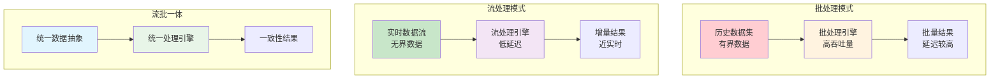
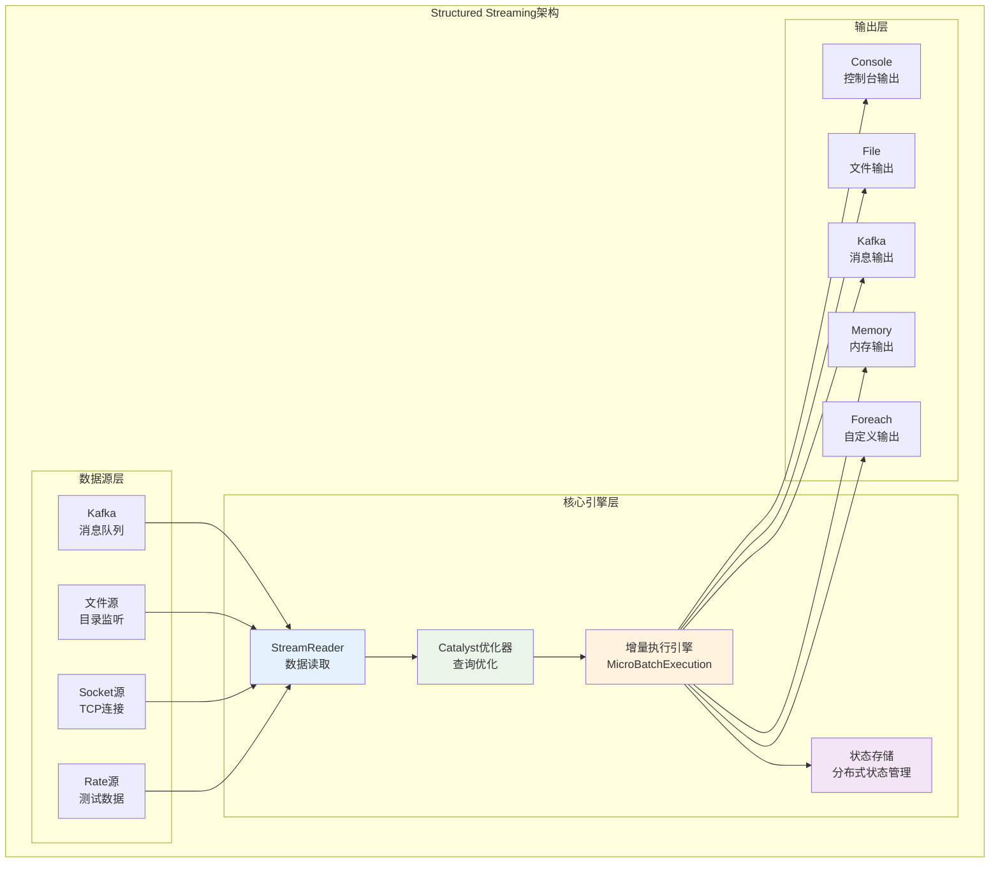
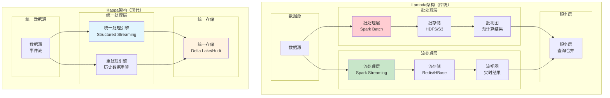

# Spark Streaming与流处理深度学习笔记

## 目录
1. [流处理概述与架构](#1-流处理概述与架构)
2. [DStream API详解](#2-dstream-api详解)
3. [Structured Streaming原理](#3-structured-streaming原理)
4. [流批一体化架构](#4-流批一体化架构)
5. [容错与状态管理](#5-容错与状态管理)
6. [性能优化策略](#6-性能优化策略)

---

## 1. 流处理概述与架构

### 1.1 流处理基本概念

**流处理 vs 批处理的本质区别**



### 1.2 Spark流处理架构演进

```scala
// Spark流处理技术栈演进
object SparkStreamingEvolution {
  
  // 1. Spark Streaming (DStream) - Spark 0.7+
  class DStreamExample {
    val streamingContext = new StreamingContext(sparkConf, Seconds(10))
    
    val lines = streamingContext.socketTextStream("localhost", 9999)
    val words = lines.flatMap(_.split(" "))
    val wordCounts = words.map(x => (x, 1)).reduceByKey(_ + _)
    
    // 微批处理模式：每10秒处理一批数据
    streamingContext.start()
    streamingContext.awaitTermination()
  }
  
  // 2. Structured Streaming - Spark 2.0+  
  class StructuredStreamingExample {
    val spark = SparkSession.builder().getOrCreate()
    
    val lines = spark.readStream
      .format("socket")
      .option("host", "localhost") 
      .option("port", 9999)
      .load()
    
    val words = lines.as[String].flatMap(_.split(" "))
    val wordCounts = words.groupBy("value").count()
    
    // 连续处理模式：真正的流处理
    val query = wordCounts.writeStream
      .outputMode("complete")
      .format("console")
      .trigger(Trigger.ProcessingTime("10 seconds"))
      .start()
      
    query.awaitTermination()
  }
}
```

### 1.3 流处理关键概念

#### 1. **事件时间 vs 处理时间**
```scala
// 事件时间：数据实际产生的时间
case class Event(
  eventTime: Timestamp,    // 事件发生时间
  processTime: Timestamp,  // 处理时间  
  data: String
)

// 处理时间：系统处理数据的时间
val eventTimeQuery = spark.readStream
  .format("kafka")
  .option("kafka.bootstrap.servers", "localhost:9092")
  .load()
  .select(
    from_json($"value", eventSchema).as("event"),
    $"timestamp".as("processTime")  // Kafka消息时间戳
  )
  .select("event.*", "processTime")
  
// 基于事件时间的窗口聚合
val windowedCounts = eventTimeQuery
  .withWatermark("eventTime", "10 minutes")  // 设置水位线
  .groupBy(
    window($"eventTime", "5 minutes", "1 minute"),  // 5分钟窗口，1分钟滑动
    $"category"
  )
  .count()
```

#### 2. **水位线（Watermark）机制**
```scala
// 水位线用于处理乱序数据和延迟数据
class WatermarkExample {
  
  def createWatermarkedStream(): Dataset[Row] = {
    val events = spark.readStream
      .format("kafka")
      .load()
      .select(from_json($"value", eventSchema).as("event"))
      .select("event.*")
    
    // 设置水位线：容忍10分钟的延迟
    events.withWatermark("eventTime", "10 minutes")
  }
  
  // 水位线工作原理
  def watermarkLogic(): Unit = {
    /*
    假设当前处理时间为 12:15:00
    设置水位线为 10分钟延迟容忍
    
    水位线 = max(事件时间) - 延迟容忍度
    
    如果最新事件时间是 12:10:00，则：
    水位线 = 12:10:00 - 10分钟 = 12:00:00
    
    所有事件时间 < 12:00:00 的延迟数据将被丢弃
    */
  }
}
```

---

## 2. DStream API详解

### 2.1 DStream核心概念

**DStream (Discretized Stream) 将连续的数据流离散化为一系列RDD**

```scala
// DStream的内部实现原理
abstract class DStream[T: ClassTag](@transient private var _ssc: StreamingContext) 
  extends Serializable with Logging {
  
  // DStream的依赖关系
  def dependencies: List[DStream[_]]
  
  // 生成指定时间的RDD
  def compute(time: Time): Option[RDD[T]]
  
  // 滑动间隔  
  def slideDuration: Duration = _ssc.graph.batchDuration
  
  // 检查点间隔
  private var _checkpointDuration: Duration = null
}

// DStream工作流程示例
class DStreamWorkflow {
  
  val streamingContext = new StreamingContext(sparkConf, Seconds(5))
  
  // 1. 输入DStream：从数据源接收数据
  val kafkaStream = KafkaUtils.createDirectStream[String, String](
    streamingContext,
    PreferConsistent,
    Subscribe[String, String](topics, kafkaParams)
  )
  
  // 2. 转换DStream：应用各种转换操作
  val processedStream = kafkaStream
    .map(record => record.value())           // 提取消息内容
    .filter(_.nonEmpty)                      // 过滤空消息
    .flatMap(_.split("\\s+"))               // 分词
    .map(word => (word, 1))                 // 转换为键值对
    .reduceByKeyAndWindow(_ + _, Seconds(30), Seconds(10))  // 窗口聚合
  
  // 3. 输出DStream：将结果输出到外部系统
  processedStream.foreachRDD { rdd =>
    if (!rdd.isEmpty()) {
      rdd.foreachPartition { partition =>
        // 写入数据库或其他存储系统
        writeToDatabase(partition)
      }
    }
  }
}
```

### 2.2 DStream转换操作

```scala
// DStream转换操作详解
class DStreamTransformations {
  
  val ssc = new StreamingContext(sparkConf, Seconds(10))
  val inputStream = ssc.socketTextStream("localhost", 9999)
  
  // 1. 基础转换
  def basicTransformations(): Unit = {
    val mappedStream = inputStream.map(_.toUpperCase)
    val filteredStream = inputStream.filter(_.contains("ERROR"))
    val flatMappedStream = inputStream.flatMap(_.split(" "))
  }
  
  // 2. 窗口操作
  def windowOperations(): Unit = {
    // 窗口长度30秒，滑动间隔10秒
    val windowedStream = inputStream.window(Seconds(30), Seconds(10))
    
    // 窗口内的单词计数
    val wordCounts = inputStream
      .flatMap(_.split(" "))
      .map(word => (word, 1))
      .reduceByKeyAndWindow(
        (a: Int, b: Int) => a + b,        // 聚合函数
        (a: Int, b: Int) => a - b,        // 反向聚合函数（优化）
        Seconds(30),                       // 窗口长度
        Seconds(10)                        // 滑动间隔
      )
  }
  
  // 3. 状态转换  
  def statefulTransformations(): Unit = {
    val stateStream = inputStream
      .flatMap(_.split(" "))
      .map(word => (word, 1))
      .updateStateByKey[Int] { (values: Seq[Int], state: Option[Int]) =>
        val currentCount = values.sum
        val previousCount = state.getOrElse(0)
        Some(currentCount + previousCount)  // 累计计数
      }
  }
  
  // 4. 连接操作
  def joinOperations(): Unit = {
    val stream1 = ssc.socketTextStream("localhost", 9999)
      .map(line => (line.split(",")(0), line.split(",")(1)))
      
    val stream2 = ssc.socketTextStream("localhost", 8888)  
      .map(line => (line.split(",")(0), line.split(",")(1)))
    
    // 流与流的连接（在同一批次内）
    val joinedStream = stream1.join(stream2)
    
    // 流与静态数据集的连接
    val staticRDD = ssc.sparkContext.parallelize(List(("key1", "value1")))
    val transformedStream = stream1.transform { rdd =>
      rdd.join(staticRDD)
    }
  }
}
```

### 2.3 输出操作与容错

```scala
// DStream输出操作
class DStreamOutputOperations {
  
  val ssc = new StreamingContext(sparkConf, Seconds(10))
  val processedStream: DStream[(String, Int)] = createProcessedStream()
  
  // 1. 标准输出操作
  def standardOutputs(): Unit = {
    processedStream.print()                    // 打印到控制台
    processedStream.saveAsTextFiles("hdfs://output/")  // 保存为文本文件
    processedStream.saveAsObjectFiles("hdfs://objects/") // 保存为对象文件
  }
  
  // 2. 自定义输出操作
  def customOutputs(): Unit = {
    processedStream.foreachRDD { rdd =>
      // 连接池管理
      val connection = ConnectionPool.getConnection()
      
      rdd.foreachPartition { partitionOfRecords =>
        partitionOfRecords.foreach { record =>
          // 写入数据库
          connection.send(record)
        }
      }
      
      ConnectionPool.returnConnection(connection)
    }
  }
  
  // 3. 容错输出操作
  def faultTolerantOutput(): Unit = {
    processedStream.foreachRDD { (rdd, time) =>
      // 幂等性输出：确保重复执行不会产生副作用
      val outputId = s"output_${time.milliseconds}"
      
      if (!outputAlreadyExists(outputId)) {
        rdd.coalesce(1).saveAsTextFile(s"hdfs://output/$outputId")
        markOutputAsCompleted(outputId)
      }
    }
  }
  
  // 4. 检查点配置
  def checkpointConfiguration(): Unit = {
    ssc.checkpoint("hdfs://checkpoints/streaming/")
    
    // 设置检查点间隔（建议为批次间隔的5-10倍）
    processedStream.checkpoint(Minutes(1))
  }
}
```

---

## 3. Structured Streaming原理

### 3.1 Structured Streaming架构

**Structured Streaming将流处理视为无界表上的增量查询**



### 3.2 增量查询模型

```scala
// Structured Streaming的核心概念：无界表
class StructuredStreamingConcepts {
  
  val spark = SparkSession.builder().getOrCreate()
  import spark.implicits._
  
  // 1. 输入表：无界表抽象
  val inputTable = spark.readStream
    .format("kafka")
    .option("kafka.bootstrap.servers", "localhost:9092")
    .option("subscribe", "events")
    .load()
    .select(
      from_json($"value", eventSchema).as("event"),
      $"timestamp"
    )
    .select("event.*", "timestamp")
  
  /*
  无界表概念：
  +---+----------+-----+
  |id |timestamp |value|
  +---+----------+-----+
  |1  |10:00:01  |100  |  <- Batch 1
  |2  |10:00:02  |200  |
  |3  |10:00:03  |300  |  <- Batch 2  
  |4  |10:00:04  |150  |
  |...           |...  |  <- 持续增长
  +---+----------+-----+
  */
  
  // 2. 查询逻辑：标准DataFrame/SQL操作
  val processedTable = inputTable
    .withColumn("hour", hour($"timestamp"))
    .groupBy($"hour", window($"timestamp", "1 hour"))
    .agg(
      count("*").as("count"),
      avg("value").as("avg_value"),
      max("value").as("max_value")
    )
  
  // 3. 输出模式定义
  def outputModes(): Unit = {
    // Complete Mode：输出完整结果表
    processedTable.writeStream
      .outputMode("complete")  // 每次输出完整结果
      .format("console")
      .start()
    
    // Append Mode：只输出新增行
    inputTable
      .filter($"value" > 100)
      .writeStream
      .outputMode("append")    // 只输出新增的过滤结果
      .format("console") 
      .start()
    
    // Update Mode：输出更新的行
    processedTable.writeStream
      .outputMode("update")    // 只输出更新的聚合结果
      .format("console")
      .start()
  }
}
```

### 3.3 触发器与执行模式

```scala
// 触发器类型与配置
class TriggerConfiguration {
  
  val spark = SparkSession.builder().getOrCreate()
  val query = createStreamingQuery()
  
  // 1. 微批处理触发器（默认）
  def microBatchTrigger(): Unit = {
    query.writeStream
      .trigger(Trigger.ProcessingTime("10 seconds"))  // 每10秒触发一次
      .format("console")
      .start()
  }
  
  // 2. 一次性触发器  
  def onceTrigger(): Unit = {
    query.writeStream
      .trigger(Trigger.Once())  // 处理一次后停止
      .format("parquet")
      .option("path", "hdfs://output/")
      .start()
  }
  
  // 3. 连续处理触发器（实验性）
  def continuousTrigger(): Unit = {
    query.writeStream
      .trigger(Trigger.Continuous("1 second"))  // 1秒延迟的连续处理
      .format("kafka")
      .option("kafka.bootstrap.servers", "localhost:9092")
      .option("topic", "output")
      .start()
  }
  
  // 4. 可用即处理触发器
  def availableNowTrigger(): Unit = {
    query.writeStream
      .trigger(Trigger.AvailableNow())  // 处理所有可用数据后停止
      .format("delta")
      .option("path", "s3://bucket/delta-table/")
      .start()
  }
}
```

### 3.4 状态存储机制

```scala
// Structured Streaming状态管理
class StateManagement {
  
  val spark = SparkSession.builder()
    .config("spark.sql.streaming.stateStore.providerClass", 
            "org.apache.spark.sql.execution.streaming.state.HDFSBackedStateStoreProvider")
    .config("spark.sql.streaming.checkpointLocation", "hdfs://checkpoints/")
    .getOrCreate()
  
  // 1. 聚合状态：自动管理
  def aggregationState(): Unit = {
    val events = readKafkaStream()
    
    val aggregated = events
      .withWatermark("eventTime", "10 minutes")
      .groupBy(
        window($"eventTime", "5 minutes"),
        $"userId"
      )
      .agg(
        count("*").as("eventCount"),
        sum("amount").as("totalAmount")
      )
    
    // Spark自动管理聚合状态
    aggregated.writeStream
      .outputMode("update")
      .format("console")
      .start()
  }
  
  // 2. 自定义状态：mapGroupsWithState
  def customState(): Unit = {
    case class UserSession(
      userId: String,
      sessionStart: Timestamp,
      eventCount: Int,
      lastActivity: Timestamp
    )
    
    def updateUserSession(
        key: String,
        values: Iterator[Event], 
        state: GroupState[UserSession]
    ): UserSession = {
      
      val events = values.toSeq
      val currentSession = state.getOption.getOrElse(
        UserSession(key, events.head.timestamp, 0, events.head.timestamp)
      )
      
      val updatedSession = currentSession.copy(
        eventCount = currentSession.eventCount + events.size,
        lastActivity = events.map(_.timestamp).max
      )
      
      // 会话超时检查（30分钟无活动）
      if (updatedSession.lastActivity.getTime < 
          System.currentTimeMillis() - 30 * 60 * 1000) {
        state.remove()  // 删除过期状态
        updatedSession.copy(eventCount = -1)  // 标记会话结束
      } else {
        state.update(updatedSession)
        state.setTimeoutTimestamp(updatedSession.lastActivity.getTime + 30 * 60 * 1000)
        updatedSession
      }
    }
    
    val events = readKafkaStream()
    val sessionUpdates = events
      .groupByKey(_.userId)
      .mapGroupsWithState(GroupStateTimeout.EventTimeTimeout)(updateUserSession)
    
    sessionUpdates.writeStream
      .outputMode("update")
      .format("console")
      .start()
  }
  
  // 3. 平坦映射状态：flatMapGroupsWithState
  def flatMapState(): Unit = {
    def processUserEvents(
        key: String,
        values: Iterator[Event],
        state: GroupState[UserSession]
    ): Iterator[Alert] = {
      
      val events = values.toSeq
      val alerts = ArrayBuffer[Alert]()
      
      // 检测异常模式并生成告警
      if (events.size > 100) {  // 短时间内大量事件
        alerts += Alert(key, "HIGH_FREQUENCY", events.size)
      }
      
      // 更新状态...
      
      alerts.iterator
    }
    
    val events = readKafkaStream()
    val alerts = events
      .groupByKey(_.userId)
      .flatMapGroupsWithState(OutputMode.Append, GroupStateTimeout.NoTimeout)(processUserEvents)
    
    alerts.writeStream
      .format("kafka")
      .option("topic", "alerts")
      .start()
  }
}
```

---

## 4. 流批一体化架构

### 4.1 Lambda vs Kappa架构



### 4.2 流批一体实现

```scala
// 流批一体化数据处理管道
class StreamBatchUnifiedPipeline {
  
  val spark = SparkSession.builder()
    .config("spark.sql.extensions", "io.delta.sql.DeltaSparkSessionExtension")
    .config("spark.sql.catalog.spark_catalog", "org.apache.spark.sql.delta.catalog.DeltaCatalog")
    .getOrCreate()
  
  // 1. 统一数据处理逻辑
  def unifiedProcessingLogic(df: DataFrame): DataFrame = {
    df.withColumn("processed_time", current_timestamp())
      .withColumn("date_partition", to_date($"event_time"))
      .filter($"event_type".isNotNull)
      .groupBy($"date_partition", $"user_id", $"event_type")
      .agg(
        count("*").as("event_count"),
        sum("value").as("total_value"),
        max("event_time").as("last_event_time")
      )
  }
  
  // 2. 批处理模式  
  def batchProcessing(): Unit = {
    // 读取历史数据
    val batchDF = spark.read
      .format("delta")
      .load("s3://datalake/raw_events/")
      .filter($"date_partition" >= "2023-01-01")
    
    // 应用统一处理逻辑
    val processedBatch = unifiedProcessingLogic(batchDF)
    
    // 写入结果表
    processedBatch.write
      .format("delta")
      .mode("overwrite")
      .partitionBy("date_partition")
      .save("s3://datalake/processed_events/")
  }
  
  // 3. 流处理模式
  def streamProcessing(): Unit = {
    // 读取实时数据流
    val streamDF = spark.readStream
      .format("kafka")
      .option("kafka.bootstrap.servers", "localhost:9092")
      .option("subscribe", "raw_events")
      .load()
      .select(from_json($"value", eventSchema).as("event"))
      .select("event.*")
    
    // 应用相同的处理逻辑
    val processedStream = unifiedProcessingLogic(streamDF)
    
    // 写入相同的结果表
    val query = processedStream.writeStream
      .format("delta")
      .outputMode("append")
      .option("checkpointLocation", "s3://checkpoints/processed_events/")
      .trigger(Trigger.ProcessingTime("1 minute"))
      .start("s3://datalake/processed_events/")
    
    query.awaitTermination()
  }
  
  // 4. 数据质量保证
  def dataQualityCheck(): Unit = {
    // 流处理结果验证
    val streamResults = spark.read
      .format("delta")
      .load("s3://datalake/processed_events/")
      .filter($"date_partition" === current_date())
    
    // 批处理结果验证（重算）
    val batchResults = batchProcessing() // 重新计算当天数据
    
    // 结果对比
    val diff = streamResults.except(batchResults)
    if (!diff.isEmpty) {
      // 发送告警并触发数据修复
      sendAlert("Stream-Batch inconsistency detected")
      repairData(diff)
    }
  }
}
```

### 4.3 事件时间处理

```scala
// 事件时间处理的完整示例
class EventTimeProcessing {
  
  val spark = SparkSession.builder().getOrCreate()
  import spark.implicits._
  
  // 1. 乱序数据处理
  def handleOutOfOrderData(): Unit = {
    val events = spark.readStream
      .format("kafka")
      .load()
      .select(
        from_json($"value", eventSchema).as("event"),
        $"timestamp".as("ingestion_time")
      )
      .select(
        $"event.event_id",
        $"event.event_time",  // 事件实际发生时间
        $"event.user_id", 
        $"event.value",
        $"ingestion_time"     // 数据摄入时间
      )
    
    // 设置水位线处理延迟数据
    val watermarkedEvents = events
      .withWatermark("event_time", "15 minutes")  // 容忍15分钟延迟
    
    val windowedAggregates = watermarkedEvents
      .groupBy(
        window($"event_time", "10 minutes", "5 minutes"),  // 10分钟窗口，5分钟滑动
        $"user_id"
      )
      .agg(
        count("*").as("event_count"),
        sum("value").as("total_value"),
        min("event_time").as("window_start"),
        max("event_time").as("window_end")
      )
    
    windowedAggregates.writeStream
      .outputMode("append")  // 窗口关闭后才输出
      .format("console")
      .option("truncate", false)
      .start()
  }
  
  // 2. 延迟数据监控
  def monitorLateData(): Unit = {
    val events = readEventStream()
    
    // 计算数据延迟
    val delayedData = events
      .withColumn("processing_delay", 
                  unix_timestamp($"ingestion_time") - unix_timestamp($"event_time"))
      .filter($"processing_delay" > 300)  // 延迟超过5分钟的数据
    
    // 延迟数据统计
    val delayStats = delayedData
      .withWatermark("event_time", "1 hour")
      .groupBy(window($"event_time", "1 hour"))
      .agg(
        count("*").as("delayed_count"),
        avg("processing_delay").as("avg_delay"),
        max("processing_delay").as("max_delay")
      )
    
    delayStats.writeStream
      .format("console")
      .outputMode("append")
      .start()
  }
  
  // 3. 多流连接处理
  def multiStreamJoin(): Unit = {
    val clickStream = readClickStream()
      .withWatermark("click_time", "10 minutes")
    
    val impressionStream = readImpressionStream()
      .withWatermark("impression_time", "5 minutes")
    
    // 基于事件时间的流连接
    val joinedStream = clickStream
      .join(
        impressionStream,
        expr("""
          click_user_id = impression_user_id AND
          click_time >= impression_time AND  
          click_time <= impression_time + interval 30 minutes
        """),
        "inner"
      )
    
    // 连接结果处理
    val conversionMetrics = joinedStream
      .groupBy(
        window($"click_time", "1 hour"),
        $"campaign_id"
      )
      .agg(
        count("*").as("conversions"),
        countDistinct("click_user_id").as("unique_users")
      )
    
    conversionMetrics.writeStream
      .format("delta")
      .outputMode("append")
      .option("checkpointLocation", "s3://checkpoints/conversions/")
      .start("s3://datalake/conversion_metrics/")
  }
}
```

---

## 5. 容错与状态管理

### 5.1 检查点机制

```scala
// Spark Streaming检查点机制详解
class CheckpointMechanism {
  
  // 1. 元数据检查点
  def metadataCheckpoint(): Unit = {
    val ssc = StreamingContext.getOrCreate(checkpointDir, createStreamingContext _)
    
    def createStreamingContext(): StreamingContext = {
      val ssc = new StreamingContext(sparkConf, Seconds(10))
      
      // 设置检查点目录
      ssc.checkpoint("hdfs://checkpoints/streaming/")
      
      val lines = ssc.socketTextStream("localhost", 9999)
      val wordCounts = lines
        .flatMap(_.split(" "))
        .map(word => (word, 1))
        .updateStateByKey[Int] { (values, state) =>
          Some(values.sum + state.getOrElse(0))
        }
      
      // 设置RDD检查点间隔
      wordCounts.checkpoint(Minutes(2))
      
      wordCounts.print()
      ssc
    }
    
    ssc.start()
    ssc.awaitTermination()
  }
  
  // 2. 数据检查点优化
  def dataCheckpointOptimization(): Unit = {
    val ssc = new StreamingContext(sparkConf, Seconds(10))
    ssc.checkpoint("hdfs://checkpoints/")
    
    val kafkaStream = createKafkaStream(ssc)
    
    val statefulStream = kafkaStream
      .map(parseMessage)
      .updateStateByKey[StateData] { (values, state) =>
        // 复杂状态更新逻辑
        updateComplexState(values, state)
      }
    
    // 检查点间隔建议：batch interval的5-10倍
    statefulStream.checkpoint(Minutes(1))  // 10s * 6 = 1min
    
    statefulStream.foreachRDD { rdd =>
      // 输出到外部存储
      rdd.foreachPartition(writeToExternalStore)
    }
  }
}
```

### 5.2 状态存储优化

```scala
// Structured Streaming状态存储优化
class StateStoreOptimization {
  
  val spark = SparkSession.builder()
    .config("spark.sql.streaming.stateStore.providerClass", 
            "org.apache.spark.sql.execution.streaming.state.RocksDBStateStoreProvider")
    .config("spark.sql.streaming.stateStore.rocksdb.compactOnCommit", "true")
    .config("spark.sql.streaming.stateStore.rocksdb.blockSizeKB", "32")
    .getOrCreate()
  
  // 1. 状态TTL管理
  def stateTTLManagement(): Unit = {
    case class SessionState(
      userId: String,
      sessionId: String, 
      startTime: Timestamp,
      lastActivity: Timestamp,
      eventCount: Int
    )
    
    def updateSessionWithTTL(
        key: String,
        values: Iterator[Event],
        state: GroupState[SessionState]
    ): SessionState = {
      
      val events = values.toSeq
      val now = Timestamp.valueOf(LocalDateTime.now())
      
      val currentState = state.getOption.getOrElse(
        SessionState(key, UUID.randomUUID().toString, now, now, 0)
      )
      
      val updatedState = currentState.copy(
        lastActivity = now,
        eventCount = currentState.eventCount + events.size
      )
      
      // 会话超时管理（30分钟无活动）
      val timeoutDuration = 30 * 60 * 1000  // 30分钟
      if (now.getTime - updatedState.lastActivity.getTime > timeoutDuration) {
        state.remove()  // 清理过期状态
        updatedState.copy(eventCount = -1)  // 标记会话结束
      } else {
        state.update(updatedState)
        // 设置基于事件时间的超时
        state.setTimeoutTimestamp(updatedState.lastActivity.getTime + timeoutDuration)
        updatedState
      }
    }
    
    val events = readEventStream()
    val sessionUpdates = events
      .withWatermark("event_time", "10 minutes")
      .groupByKey(_.userId)
      .mapGroupsWithState(GroupStateTimeout.EventTimeTimeout)(updateSessionWithTTL)
    
    sessionUpdates.writeStream
      .outputMode("update")
      .format("console")
      .start()
  }
  
  // 2. 状态分区策略
  def statePartitioning(): Unit = {
    // 自定义分区器减少状态热点
    class StatePartitioner(numPartitions: Int) extends Partitioner {
      override def numPartitions: Int = numPartitions
      
      override def getPartition(key: Any): Int = {
        val keyStr = key.toString
        // 使用一致性哈希避免数据倾斜
        Math.abs(keyStr.hashCode % numPartitions)
      }
    }
    
    val events = readEventStream()
    val partitionedEvents = events
      .repartition(200, $"user_id")  // 显式控制分区数
      .groupByKey(_.userId)
      .mapGroupsWithState(GroupStateTimeout.ProcessingTimeTimeout)(updateUserState)
    
    partitionedEvents.writeStream
      .option("checkpointLocation", "hdfs://checkpoints/partitioned/")
      .start()
  }
  
  // 3. 状态压缩优化
  def stateCompaction(): Unit = {
    // 配置RocksDB状态存储的压缩参数
    val optimizedSpark = spark.newSession()
    optimizedSpark.conf.set("spark.sql.streaming.stateStore.rocksdb.compactOnCommit", "true")
    optimizedSpark.conf.set("spark.sql.streaming.stateStore.rocksdb.compression", "lz4")
    optimizedSpark.conf.set("spark.sql.streaming.stateStore.maintenance.interval", "30s")
    
    // 定期清理历史版本
    optimizedSpark.conf.set("spark.sql.streaming.minBatchesToRetain", "10")
  }
}
```

### 5.3 故障恢复机制

```scala
// 流处理故障恢复机制
class FaultRecoveryMechanism {
  
  // 1. 自动重启策略
  def automaticRestart(): Unit = {
    val spark = SparkSession.builder()
      .config("spark.sql.streaming.stopGracefullyOnShutdown", "true")
      .config("spark.sql.streaming.stopActiveRunOnRestart", "true")
      .getOrCreate()
    
    def createQuery(): StreamingQuery = {
      val events = readEventStream()
      val processed = processEvents(events)
      
      processed.writeStream
        .format("delta")
        .outputMode("append")
        .option("checkpointLocation", "hdfs://checkpoints/auto-restart/")
        .trigger(Trigger.ProcessingTime("10 seconds"))
        .start("hdfs://output/processed/")
    }
    
    var query = createQuery()
    
    // 监控查询状态并自动重启
    while (true) {
      try {
        if (query.exception.isDefined) {
          logError(s"Query failed: ${query.exception.get}")
          query.stop()
          Thread.sleep(5000)  // 等待5秒
          query = createQuery()  // 重新创建查询
          logInfo("Query restarted successfully")
        }
        Thread.sleep(10000)  // 每10秒检查一次
      } catch {
        case e: Exception =>
          logError(s"Monitoring error: $e")
          Thread.sleep(30000)  // 异常时等待更长时间
      }
    }
  }
  
  // 2. 数据一致性保证
  def ensureDataConsistency(): Unit = {
    val events = readEventStream()
    
    // 使用幂等写入保证一致性
    val processed = processEvents(events)
      .withColumn("batch_id", spark_partition_id())
      .withColumn("process_time", current_timestamp())
    
    processed.writeStream
      .foreachBatch { (batchDF: DataFrame, batchId: Long) =>
        // 幂等性检查
        val existingBatch = checkBatchExists(batchId)
        if (!existingBatch) {
          // 事务性写入
          batchDF.write
            .format("delta")
            .mode("append")
            .option("txnVersion", batchId.toString)
            .save("hdfs://output/processed/")
          
          // 记录批次完成状态
          markBatchCompleted(batchId)
        }
      }
      .option("checkpointLocation", "hdfs://checkpoints/consistency/")
      .start()
  }
  
  // 3. 背压控制机制
  def backPressureControl(): Unit = {
    val spark = SparkSession.builder()
      .config("spark.streaming.backpressure.enabled", "true")
      .config("spark.streaming.backpressure.initialRate", "1000")  
      .config("spark.streaming.receiver.maxRate", "5000")
      .config("spark.streaming.kafka.maxRatePerPartition", "2000")
      .getOrCreate()
    
    val events = spark.readStream
      .format("kafka")
      .option("maxOffsetsPerTrigger", "100000")  // 每批次最大偏移量
      .load()
    
    val processed = events
      .repartition(200)  // 合理设置并行度
      .mapPartitions { partition =>
        // 分区级处理，控制内存使用
        partition.map(processRecord).filter(_.isDefined).map(_.get)
      }
    
    processed.writeStream
      .trigger(Trigger.ProcessingTime("30 seconds"))  // 适当的批次间隔
      .format("console")
      .start()
  }
}
```

---

## 6. 性能优化策略

### 6.1 吞吐量优化

```scala
// 流处理吞吐量优化策略
class ThroughputOptimization {
  
  val spark = SparkSession.builder()
    // 基础性能配置
    .config("spark.serializer", "org.apache.spark.serializer.KryoSerializer")
    .config("spark.sql.adaptive.enabled", "true")
    .config("spark.sql.adaptive.coalescePartitions.enabled", "true")
    
    // 流处理特定优化
    .config("spark.sql.streaming.metricsEnabled", "true")
    .config("spark.sql.streaming.numRecentProgressUpdates", "100")
    .getOrCreate()
  
  // 1. 数据源优化
  def optimizeDataSources(): Unit = {
    // Kafka消费优化
    val kafkaStream = spark.readStream
      .format("kafka")
      .option("kafka.bootstrap.servers", "localhost:9092")
      .option("subscribe", "high-throughput-topic")
      
      // 批量拉取优化
      .option("kafka.fetch.min.bytes", "50000")         // 最小拉取字节数
      .option("kafka.fetch.max.wait.ms", "500")         // 最大等待时间
      .option("kafka.max.partition.fetch.bytes", "10485760")  // 10MB每分区
      
      // 并发优化
      .option("kafka.consumer.session.timeout.ms", "30000")
      .option("kafka.consumer.heartbeat.interval.ms", "3000")
      
      // 偏移量管理
      .option("startingOffsets", "latest")
      .option("failOnDataLoss", "false")
      .load()
    
    // 分区策略优化
    val optimizedStream = kafkaStream
      .repartition(400, $"key")  // 根据key重分区，提高并行度
      .coalesce(200)             // 输出时合并分区，减少小文件
  }
  
  // 2. 处理逻辑优化
  def optimizeProcessingLogic(): Unit = {
    val events = readOptimizedStream()
    
    // 使用mapPartitions减少函数调用开销
    val processed = events.mapPartitions { partition =>
      // 批量初始化资源
      val connectionPool = initializeConnectionPool()
      val cache = new LRUCache[String, String](1000)
      
      partition.map { event =>
        // 利用缓存减少重复计算
        val enrichedData = cache.getOrElseUpdate(event.userId) {
          getUserProfile(connectionPool, event.userId)
        }
        
        processEventWithProfile(event, enrichedData)
      }
    }
    
    // 预聚合减少Shuffle
    val preAggregated = processed
      .groupBy($"category", $"hour")
      .agg(
        count("*").as("count"),
        sum("value").as("sum"),
        max("timestamp").as("max_time")
      )
    
    preAggregated.writeStream
      .format("delta")
      .outputMode("append")
      .trigger(Trigger.ProcessingTime("30 seconds"))  // 适当的批次大小
      .start()
  }
  
  // 3. 内存使用优化
  def optimizeMemoryUsage(): Unit = {
    val optimizedSpark = spark.newSession()
    
    // 内存配置优化
    optimizedSpark.conf.set("spark.executor.memory", "8g")
    optimizedSpark.conf.set("spark.executor.memoryFraction", "0.8")
    optimizedSpark.conf.set("spark.executor.cores", "4")
    
    // 流处理内存优化
    optimizedSpark.conf.set("spark.sql.streaming.stateStore.providerClass", 
                           "org.apache.spark.sql.execution.streaming.state.RocksDBStateStoreProvider")
    optimizedSpark.conf.set("spark.sql.streaming.stateStore.rocksdb.writeBufferSizeMB", "64")
    optimizedSpark.conf.set("spark.sql.streaming.stateStore.rocksdb.blockCacheSizeMB", "128")
    
    // 使用列式缓存
    val events = readEventStream()
    events.cache()  // 自动选择最优存储级别
    
    // 及时释放不需要的缓存
    optimizedSpark.catalog.clearCache()
  }
}
```

### 6.2 延迟优化

```scala
// 流处理延迟优化策略  
class LatencyOptimization {
  
  // 1. 连续处理模式
  def continuousProcessing(): Unit = {
    val spark = SparkSession.builder()
      .config("spark.sql.streaming.continuous.enabled", "true")
      .getOrCreate()
    
    val events = spark.readStream
      .format("kafka")
      .option("kafka.bootstrap.servers", "localhost:9092") 
      .load()
    
    val processed = events
      .select(
        from_json($"value", eventSchema).as("event"),
        $"timestamp"
      )
      .select("event.*", "timestamp")
      .filter($"event.priority" === "HIGH")  // 只处理高优先级事件
    
    // 连续处理：亚秒级延迟
    processed.writeStream
      .format("kafka")
      .option("kafka.bootstrap.servers", "localhost:9092")
      .option("topic", "processed-events")
      .trigger(Trigger.Continuous("1 second"))  // 1秒延迟
      .start()
  }
  
  // 2. 本地状态优化
  def localStateOptimization(): Unit = {
    // 使用本地聚合减少网络开销
    val events = readEventStream()
    
    val locallyAggregated = events
      .repartition($"partition_key")  // 确保相同key在同一分区
      .mapPartitions { partition =>
        val localState = mutable.Map[String, Long]()
        
        partition.map { event =>
          // 本地状态更新
          val currentCount = localState.getOrElse(event.key, 0L)
          localState(event.key) = currentCount + 1
          
          (event.key, localState(event.key))
        }
      }
    
    locallyAggregated.writeStream
      .format("console")
      .trigger(Trigger.ProcessingTime("1 second"))  // 高频输出
      .start()
  }
  
  // 3. 预热机制
  def warmupMechanism(): Unit = {
    // 预热JVM和缓存
    def warmupQuery(): Unit = {
      val warmupData = spark.range(10000).toDF("id")
      warmupData.collect()  // 触发JVM预热
    }
    
    // 预热连接池
    def warmupConnections(): Unit = {
      val connectionPool = createConnectionPool()
      (1 to 10).foreach { _ =>
        val conn = connectionPool.getConnection()
        conn.ping()  // 预热网络连接
        connectionPool.returnConnection(conn)
      }
    }
    
    // 应用启动时执行预热
    warmupQuery()
    warmupConnections()
    
    // 正式处理流程
    val events = readEventStream()
    events.writeStream
      .format("console") 
      .start()
  }
}
```

### 6.3 监控与调试

```scala
// 流处理监控与调试
class StreamingMonitoring {
  
  // 1. 性能指标监控
  def performanceMonitoring(): Unit = {
    val query = createStreamingQuery()
    
    // 定期检查查询状态
    val monitor = new Thread(() => {
      while (query.isActive) {
        val progress = query.lastProgress
        
        if (progress != null) {
          // 输入速率监控
          val inputRowsPerSecond = progress.inputRowsPerSecond
          val processingDuration = progress.durationMs.get("triggerExecution")
          
          // 延迟监控
          val batchId = progress.batchId
          val timestamp = progress.timestamp
          
          // 状态存储监控
          val stateOperators = progress.stateOperators
          stateOperators.foreach { operator =>
            val memoryUsedBytes = operator.memoryUsedBytes
            val numRowsTotal = operator.numRowsTotal
            
            logInfo(s"State operator memory: ${memoryUsedBytes / 1024 / 1024}MB, rows: $numRowsTotal")
          }
          
          // 告警检查
          if (inputRowsPerSecond < expectedThroughput * 0.8) {
            sendAlert(s"Low throughput: $inputRowsPerSecond rows/sec")
          }
          
          if (processingDuration > maxAllowedLatency) {
            sendAlert(s"High latency: ${processingDuration}ms")
          }
        }
        
        Thread.sleep(30000)  // 每30秒检查一次
      }
    })
    
    monitor.start()
  }
  
  // 2. 数据质量监控
  def dataQualityMonitoring(): Unit = {
    val events = readEventStream()
    
    // 数据质量指标计算
    val qualityMetrics = events
      .withWatermark("event_time", "5 minutes")
      .groupBy(window($"event_time", "1 minute"))
      .agg(
        count("*").as("total_events"),
        count(when($"user_id".isNull, 1)).as("null_user_ids"),
        count(when($"event_type".isNull, 1)).as("null_event_types"),
        count(when($"value" < 0, 1)).as("negative_values"),
        approx_count_distinct("user_id").as("unique_users")
      )
      .withColumn("null_user_id_rate", $"null_user_ids" / $"total_events")
      .withColumn("data_quality_score", 
                  lit(1.0) - ($"null_user_ids" + $"null_event_types" + $"negative_values") / $"total_events")
    
    // 质量告警
    qualityMetrics.writeStream
      .foreachBatch { (batchDF: DataFrame, batchId: Long) =>
        batchDF.collect().foreach { row =>
          val qualityScore = row.getAs[Double]("data_quality_score")
          if (qualityScore < 0.95) {  // 质量分数低于95%
            sendDataQualityAlert(batchId, qualityScore, row)
          }
        }
      }
      .start()
  }
  
  // 3. 调试工具
  def debuggingTools(): Unit = {
    val events = readEventStream()
    
    // 1. 采样调试
    val sampledEvents = events.sample(0.01)  // 1%采样
    sampledEvents.writeStream
      .format("console")
      .option("numRows", 50)
      .option("truncate", false)
      .start()
    
    // 2. 数据血缘追踪
    val processedEvents = events
      .withColumn("debug_batch_id", spark_partition_id())
      .withColumn("debug_timestamp", current_timestamp())
      .filter($"user_id" === "debug_user_123")  // 特定用户调试
    
    processedEvents.writeStream
      .format("json")
      .option("path", "hdfs://debug/traces/")
      .option("checkpointLocation", "hdfs://debug/checkpoints/")
      .start()
    
    // 3. 异常事件捕获
    val anomalyEvents = events.filter(
      $"value" > 1000000 ||  // 异常大值
      $"user_id".rlike("^test_") ||  // 测试数据
      $"event_time" < date_sub(current_date(), 7)  // 过期数据
    )
    
    anomalyEvents.writeStream
      .format("kafka")
      .option("topic", "anomaly-events")
      .start()
  }
}
```

---

## 总结

本章深入学习了Spark Streaming与流处理的核心技术：

1. **流处理基础**：DStream API、事件时间处理、水位线机制
2. **Structured Streaming**：统一批流处理、增量查询模型、状态管理
3. **流批一体化**：Lambda vs Kappa架构、统一处理逻辑、数据一致性
4. **容错机制**：检查点、状态存储、故障恢复、背压控制
5. **性能优化**：吞吐量优化、延迟优化、连续处理模式
6. **监控调试**：性能监控、数据质量监控、调试工具

下一节我们将学习Spark性能调优与最佳实践。

---

## 推荐阅读
- [Spark官方文档 - Structured Streaming](https://spark.apache.org/docs/latest/structured-streaming-programming-guide.html)
- [Spark Streaming vs Structured Streaming](https://databricks.com/blog/2018/03/20/low-latency-continuous-processing-mode-in-structured-streaming-in-apache-spark-2-3-0.html)
- 《Spark流处理实战》全书
