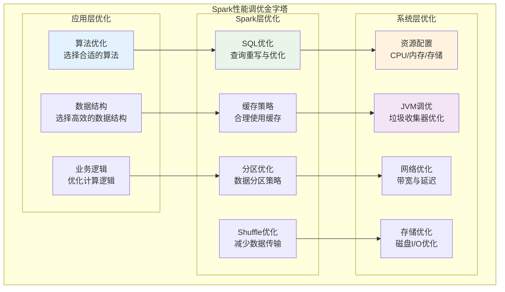

# Spark性能调优与最佳实践深度学习笔记

## 目录
1. [性能调优方法论](#1-性能调优方法论)
2. [资源配置优化](#2-资源配置优化)
3. [代码层面优化](#3-代码层面优化)
4. [数据倾斜处理](#4-数据倾斜处理)
5. [缓存策略优化](#5-缓存策略优化)
6. [生产环境最佳实践](#6-生产环境最佳实践)

---

## 1. 性能调优方法论

### 1.1 性能分析框架



### 1.2 性能诊断工具链

```scala
// Spark性能诊断工具集合
class PerformanceDiagnostics {
  
  val spark = SparkSession.builder().getOrCreate()
  
  // 1. Spark UI分析工具
  def analyzeSparkUI(): Unit = {
    val sc = spark.sparkContext
    
    // 监控作业执行情况
    sc.addSparkListener(new SparkListener {
      override def onJobStart(jobStart: SparkListenerJobStart): Unit = {
        logInfo(s"Job ${jobStart.jobId} started with ${jobStart.stageIds.length} stages")
      }
      
      override def onJobEnd(jobEnd: SparkListenerJobEnd): Unit = {
        val duration = jobEnd.time - getJobStartTime(jobEnd.jobId)
        logInfo(s"Job ${jobEnd.jobId} completed in ${duration}ms")
        
        // 分析作业性能指标
        if (duration > expectedJobDuration) {
          analyzeSlowJob(jobEnd.jobId)
        }
      }
      
      override def onStageCompleted(stageCompleted: SparkListenerStageCompleted): Unit = {
        val stageInfo = stageCompleted.stageInfo
        val taskMetrics = stageInfo.taskMetrics
        
        // 分析Stage性能
        if (taskMetrics.executorRunTime > expectedStageRunTime) {
          logWarning(s"Slow stage detected: ${stageInfo.stageId}")
          analyzeStageMetrics(stageInfo)
        }
      }
    })
  }
  
  // 2. 自定义性能度量
  def customPerformanceMetrics(): Unit = {
    val performanceAccumulator = spark.sparkContext.longAccumulator("PerformanceCounter")
    
    val rdd = spark.sparkContext.parallelize(1 to 1000000)
    val processedRDD = rdd.map { value =>
      val startTime = System.nanoTime()
      
      // 业务处理逻辑
      val result = complexProcessing(value)
      
      val endTime = System.nanoTime()
      val duration = (endTime - startTime) / 1000000  // 转换为毫秒
      
      // 记录处理时间
      performanceAccumulator.add(duration)
      
      result
    }
    
    val results = processedRDD.collect()
    val avgProcessingTime = performanceAccumulator.value / results.length
    
    logInfo(s"Average processing time: ${avgProcessingTime}ms per record")
  }
  
  // 3. 内存使用分析
  def analyzeMemoryUsage(): Unit = {
    val memoryTracker = new MemoryTracker()
    
    val largeDf = spark.range(10000000).toDF("id")
      .withColumn("data", rand() * 1000)
      .withColumn("category", (rand() * 100).cast("int"))
    
    // 缓存前的内存使用
    val beforeCache = memoryTracker.getUsedMemory()
    
    largeDf.cache()
    largeDf.count()  // 触发缓存
    
    // 缓存后的内存使用  
    val afterCache = memoryTracker.getUsedMemory()
    val cacheMemoryUsage = afterCache - beforeCache
    
    logInfo(s"Cache memory usage: ${cacheMemoryUsage / 1024 / 1024}MB")
    
    // 分析存储级别效率
    analyzeCacheEfficiency(largeDf)
  }
  
  // 4. Shuffle分析工具
  def analyzeShufflePerformance(): DataFrame = {
    val df = createLargeDataFrame()
    
    // 记录Shuffle前后的指标
    val shuffleMetrics = spark.sparkContext.longAccumulator("ShuffleBytes")
    
    val result = df
      .repartition(200, $"key")  // 触发Shuffle
      .groupBy("key")
      .agg(
        count("*").as("count"),
        sum("value").as("sum")
      )
    
    // 获取Shuffle指标
    val lastStageInfo = spark.sparkContext.statusTracker.getExecutorInfos
    val shuffleReadBytes = lastStageInfo.map(_.totalShuffleRead).sum
    val shuffleWriteBytes = lastStageInfo.map(_.totalShuffleWrite).sum
    
    logInfo(s"Shuffle Read: ${shuffleReadBytes / 1024 / 1024}MB")
    logInfo(s"Shuffle Write: ${shuffleWriteBytes / 1024 / 1024}MB")
    
    result
  }
}
```

### 1.3 性能基准测试

```scala
// Spark性能基准测试框架
class SparkBenchmark {
  
  val spark = SparkSession.builder().getOrCreate()
  
  // 1. CPU密集型基准测试
  def cpuIntensiveBenchmark(): BenchmarkResult = {
    val testData = spark.range(1000000).toDF("number")
    
    val startTime = System.currentTimeMillis()
    
    val result = testData
      .withColumn("sqrt", sqrt($"number"))
      .withColumn("sin", sin($"number"))
      .withColumn("cos", cos($"number"))
      .withColumn("complex", 
                  sqrt($"number") * sin($"number") + cos($"number"))
      .count()
    
    val endTime = System.currentTimeMillis()
    val duration = endTime - startTime
    
    BenchmarkResult("CPU_INTENSIVE", duration, result, getCPUMetrics())
  }
  
  // 2. 内存密集型基准测试
  def memoryIntensiveBenchmark(): BenchmarkResult = {
    val largeData = spark.range(10000000)
      .withColumn("data1", rand())
      .withColumn("data2", rand()) 
      .withColumn("data3", rand())
      .cache()
    
    val startTime = System.currentTimeMillis()
    
    // 多次访问缓存数据
    val results = (1 to 5).map { _ =>
      largeData.filter($"data1" > 0.5).count()
    }
    
    val endTime = System.currentTimeMillis()
    val duration = endTime - startTime
    
    BenchmarkResult("MEMORY_INTENSIVE", duration, results.sum, getMemoryMetrics())
  }
  
  // 3. 网络I/O基准测试
  def networkIOBenchmark(): BenchmarkResult = {
    val df1 = createDataFrame(1000000, "table1")
    val df2 = createDataFrame(1000000, "table2")
    
    val startTime = System.currentTimeMillis()
    
    // 触发Shuffle操作
    val joinResult = df1.join(df2, "key")
      .groupBy("category")
      .agg(count("*"))
      .collect()
    
    val endTime = System.currentTimeMillis()
    val duration = endTime - startTime
    
    BenchmarkResult("NETWORK_IO", duration, joinResult.length, getNetworkMetrics())
  }
  
  // 4. 磁盘I/O基准测试
  def diskIOBenchmark(): BenchmarkResult = {
    val testData = createLargeDataFrame()
    val outputPath = "hdfs://benchmark/disk-io-test"
    
    val startTime = System.currentTimeMillis()
    
    // 写入测试
    testData.write
      .mode("overwrite")
      .parquet(outputPath)
    
    // 读取测试
    val readData = spark.read.parquet(outputPath)
    val count = readData.count()
    
    val endTime = System.currentTimeMillis() 
    val duration = endTime - startTime
    
    BenchmarkResult("DISK_IO", duration, count, getDiskMetrics())
  }
  
  // 5. 综合基准测试报告
  def generateBenchmarkReport(): BenchmarkSuite = {
    val cpuResult = cpuIntensiveBenchmark()
    val memoryResult = memoryIntensiveBenchmark() 
    val networkResult = networkIOBenchmark()
    val diskResult = diskIOBenchmark()
    
    val suite = BenchmarkSuite(
      timestamp = System.currentTimeMillis(),
      sparkVersion = spark.version,
      results = Seq(cpuResult, memoryResult, networkResult, diskResult),
      environment = getEnvironmentInfo()
    )
    
    // 生成报告
    generateHTMLReport(suite)
    suite
  }
}
```

---

## 2. 资源配置优化

### 2.1 Executor资源配置

```scala
// Executor资源配置最佳实践
class ExecutorResourceOptimization {
  
  // 1. CPU配置策略
  def optimizeCPUConfiguration(): SparkConf = {
    val conf = new SparkConf()
    
    // 基本原则：每个executor核数不要超过5个
    // 原因：避免HDFS客户端并发问题，减少内存竞争
    
    val totalCores = getClusterTotalCores()  // 假设集群总共1000核
    val executorCores = 4  // 每个executor 4核心
    val executorInstances = totalCores / executorCores / 2  // 预留50%资源
    
    conf.set("spark.executor.cores", executorCores.toString)
        .set("spark.executor.instances", executorInstances.toString)
        .set("spark.default.parallelism", (executorInstances * executorCores * 2).toString)
  }
  
  // 2. 内存配置策略
  def optimizeMemoryConfiguration(): SparkConf = {
    val conf = new SparkConf()
    
    // 内存配置公式：
    // executor-memory = (yarn.nodemanager.resource.memory-mb × num-cores-per-executor) / num-executors-per-node - 1GB
    
    val nodeMemory = 64  // GB，节点总内存
    val reservedMemory = 8  // GB，系统预留内存
    val availableMemory = nodeMemory - reservedMemory  // 56GB
    val executorsPerNode = 2  // 每节点executor数量
    val executorMemory = availableMemory / executorsPerNode - 1  // 27GB
    
    conf.set("spark.executor.memory", s"${executorMemory}g")
        .set("spark.executor.memoryFraction", "0.8")  // 80%用于计算和存储
        .set("spark.memory.storageFraction", "0.3")   // 30%用于存储，70%用于计算
        
        // 堆外内存配置
        .set("spark.memory.offHeap.enabled", "true")
        .set("spark.memory.offHeap.size", "8g")  // 堆外内存8GB
  }
  
  // 3. 动态资源分配
  def configureDynamicAllocation(): SparkConf = {
    val conf = new SparkConf()
    
    conf.set("spark.dynamicAllocation.enabled", "true")
        .set("spark.dynamicAllocation.minExecutors", "10")       // 最小executor数量
        .set("spark.dynamicAllocation.maxExecutors", "200")      // 最大executor数量  
        .set("spark.dynamicAllocation.initialExecutors", "20")   // 初始executor数量
        .set("spark.dynamicAllocation.executorIdleTimeout", "60s")  // executor空闲超时
        .set("spark.dynamicAllocation.cachedExecutorIdleTimeout", "300s")  // 缓存数据的executor超时
        .set("spark.dynamicAllocation.schedulerBacklogTimeout", "1s")      // 调度延迟超时
        .set("spark.shuffle.service.enabled", "true")  // 启用外部Shuffle服务
  }
  
  // 4. 资源配置决策树
  def recommendResourceConfiguration(
      dataSize: Long,
      complexity: ProcessingComplexity,
      cluster: ClusterInfo
  ): ResourceConfiguration = {
    
    val (executorMemory, executorCores, executorInstances) = (dataSize, complexity) match {
      
      // 小数据集（<10GB），简单处理
      case (size, ProcessingComplexity.SIMPLE) if size < 10L * 1024 * 1024 * 1024 =>
        ("4g", 2, 10)
      
      // 中等数据集（10GB-100GB），中等复杂度
      case (size, ProcessingComplexity.MODERATE) if size < 100L * 1024 * 1024 * 1024 =>
        ("8g", 4, 20)
      
      // 大数据集（100GB-1TB），复杂处理
      case (size, ProcessingComplexity.COMPLEX) if size < 1024L * 1024 * 1024 * 1024 =>
        ("16g", 4, 50)
      
      // 超大数据集（>1TB），非常复杂
      case (size, ProcessingComplexity.VERY_COMPLEX) =>
        ("32g", 5, 100)
        
      // 默认配置
      case _ =>
        ("8g", 4, 30)
    }
    
    ResourceConfiguration(
      executorMemory = executorMemory,
      executorCores = executorCores,
      executorInstances = executorInstances,
      driverMemory = calculateDriverMemory(executorInstances),
      offHeapMemory = calculateOffHeapMemory(executorMemory)
    )
  }
}
```

### 2.2 Driver资源配置

```scala
// Driver资源配置优化
class DriverResourceOptimization {
  
  // 1. Driver内存配置
  def configureDriverMemory(): SparkConf = {
    val conf = new SparkConf()
    
    // Driver内存需求分析：
    // - 收集结果：collect(), take()操作需要足够内存
    // - 广播变量：大的广播变量需要Driver内存
    // - 程序元数据：大量小文件的元数据
    
    val expectedResultSize = calculateExpectedResultSize()  // 预期结果大小
    val broadcastSize = calculateBroadcastSize()           // 广播变量大小
    val metadataSize = calculateMetadataSize()             // 元数据大小
    
    val totalDriverMemory = (expectedResultSize + broadcastSize + metadataSize) * 1.5  // 50%缓冲
    val driverMemoryGB = Math.max(4, Math.min(totalDriverMemory / 1024 / 1024 / 1024, 32))
    
    conf.set("spark.driver.memory", s"${driverMemoryGB}g")
        .set("spark.driver.maxResultSize", "8g")  // 限制结果集大小
  }
  
  // 2. Driver CPU配置
  def configureDriverCores(): SparkConf = {
    val conf = new SparkConf()
    
    // Driver通常是单线程，但某些操作可以并行：
    // - 文件列举
    // - 任务调度
    // - 结果收集
    
    val executorCount = getExecutorCount()
    val driverCores = if (executorCount > 100) 4 else 2  // 大集群使用更多核心
    
    conf.set("spark.driver.cores", driverCores.toString)
  }
  
  // 3. Driver网络配置
  def configureDriverNetwork(): SparkConf = {
    val conf = new SparkConf()
    
    conf.set("spark.rpc.message.maxSize", "256")          // 增加RPC消息大小限制
        .set("spark.network.timeout", "800s")             // 网络超时配置
        .set("spark.rpc.askTimeout", "600s")              // RPC请求超时
        .set("spark.sql.execution.arrow.maxRecordsPerBatch", "10000")  // Arrow批次大小
  }
}
```

### 2.3 存储系统优化

```scala
// 存储系统性能优化
class StorageOptimization {
  
  // 1. HDFS优化配置
  def optimizeHDFS(): SparkConf = {
    val conf = new SparkConf()
    
    conf.set("spark.hadoop.fs.hdfs.impl.disable.cache", "true")  // 禁用HDFS缓存
        .set("spark.hadoop.fs.file.impl.disable.cache", "true")   // 禁用文件系统缓存
        
        // HDFS客户端优化
        .set("spark.hadoop.dfs.client.read.shortcircuit", "true")  // 短路读取
        .set("spark.hadoop.dfs.domain.socket.path", "/var/lib/hadoop-hdfs/dn_socket")
        .set("spark.hadoop.dfs.client.cache.readahead", "268435456")  // 256MB预读
        
        // 并发控制
        .set("spark.hadoop.fs.hdfs.connection.idle.timeout.ms", "30000")
        .set("spark.hadoop.dfs.client.socket.timeout", "120000")
  }
  
  // 2. S3优化配置
  def optimizeS3(): SparkConf = {
    val conf = new SparkConf()
    
    conf.set("spark.hadoop.fs.s3a.impl", "org.apache.hadoop.fs.s3a.S3AFileSystem")
        .set("spark.hadoop.fs.s3a.fast.upload", "true")
        .set("spark.hadoop.fs.s3a.fast.upload.buffer", "bytebuffer")  // 使用堆外缓冲
        
        // 连接池优化
        .set("spark.hadoop.fs.s3a.connection.maximum", "200")
        .set("spark.hadoop.fs.s3a.threads.max", "64")
        .set("spark.hadoop.fs.s3a.max.total.tasks", "64")
        
        // 多部分上传优化
        .set("spark.hadoop.fs.s3a.multipart.size", "134217728")      // 128MB分块
        .set("spark.hadoop.fs.s3a.multipart.threshold", "536870912")  // 512MB阈值
        
        // 重试机制
        .set("spark.hadoop.fs.s3a.retry.limit", "10")
        .set("spark.hadoop.fs.s3a.retry.interval", "500ms")
  }
  
  // 3. 本地存储优化
  def optimizeLocalStorage(): SparkConf = {
    val conf = new SparkConf()
    
    // 临时目录配置
    val tempDirs = getLocalDisks().map(disk => s"$disk/spark-temp").mkString(",")
    conf.set("spark.local.dir", tempDirs)
    
    // 磁盘I/O优化
    conf.set("spark.shuffle.file.buffer", "64k")           // Shuffle文件缓冲区
        .set("spark.unsafe.sorter.spill.reader.buffer.size", "1m")  // 溢写读取缓冲区
        .set("spark.file.transferTo", "true")              // 零拷贝传输
        .set("spark.shuffle.unsafe.file.output.buffer", "64k")      // Unsafe Shuffle缓冲区
  }
  
  // 4. 存储格式优化
  def optimizeStorageFormat(): Unit = {
    val spark = SparkSession.builder().getOrCreate()
    
    // Parquet优化配置
    spark.conf.set("spark.sql.parquet.columnarReaderBatchSize", "10000")
    spark.conf.set("spark.sql.parquet.compression.codec", "snappy")  // 压缩算法
    spark.conf.set("spark.sql.parquet.filterPushdown", "true")       // 谓词下推
    spark.conf.set("spark.sql.parquet.mergeSchema", "false")         // 禁用Schema合并
    
    // Delta Lake优化配置
    spark.conf.set("spark.sql.adaptive.coalescePartitions.enabled", "true")
    spark.conf.set("spark.databricks.delta.optimizeWrite.enabled", "true")
    spark.conf.set("spark.databricks.delta.autoCompact.enabled", "true")
    
    // 列式存储最佳实践示例
    val df = createSampleDataFrame()
    
    df.write
      .format("delta")
      .mode("overwrite")
      .option("compression", "snappy")
      .option("mergeSchema", "false")
      .partitionBy("date", "region")  // 合理的分区策略
      .save("s3://datalake/optimized_table/")
  }
}
```

---

## 3. 代码层面优化

### 3.1 SQL查询优化

```scala
// SQL查询优化最佳实践
class SQLQueryOptimization {
  
  val spark = SparkSession.builder().getOrCreate()
  
  // 1. 查询重写优化
  def queryRewriteOptimizations(): Unit = {
    
    // ❌ 低效查询：子查询 + 多次扫描
    val inefficientQuery = spark.sql("""
      SELECT u.user_id, u.name,
        (SELECT COUNT(*) FROM orders o WHERE o.user_id = u.user_id) as order_count,
        (SELECT SUM(amount) FROM orders o WHERE o.user_id = u.user_id) as total_amount
      FROM users u
      WHERE u.status = 'ACTIVE'
    """)
    
    // ✅ 高效查询：JOIN + 单次扫描  
    val efficientQuery = spark.sql("""
      SELECT u.user_id, u.name, 
             COALESCE(o.order_count, 0) as order_count,
             COALESCE(o.total_amount, 0.0) as total_amount
      FROM users u
      LEFT JOIN (
        SELECT user_id, 
               COUNT(*) as order_count,
               SUM(amount) as total_amount
        FROM orders
        GROUP BY user_id
      ) o ON u.user_id = o.user_id
      WHERE u.status = 'ACTIVE'
    """)
  }
  
  // 2. 连接优化策略
  def joinOptimizations(): Unit = {
    val users = spark.table("users")
    val orders = spark.table("orders")
    
    // ❌ 低效：大表 JOIN 大表，没有优化提示
    val inefficientJoin = users.join(orders, "user_id")
    
    // ✅ 高效：使用广播JOIN（小表 < 10MB）
    val broadcastJoin = users.join(
      broadcast(orders.filter($"amount" > 1000)),  // 过滤后广播
      "user_id"
    )
    
    // ✅ 高效：桶化表JOIN（避免Shuffle）
    spark.sql("""
      CREATE TABLE users_bucketed (
        user_id BIGINT, name STRING, status STRING
      ) USING DELTA
      CLUSTERED BY (user_id) INTO 50 BUCKETS
    """)
    
    spark.sql("""
      CREATE TABLE orders_bucketed (
        order_id BIGINT, user_id BIGINT, amount DOUBLE
      ) USING DELTA  
      CLUSTERED BY (user_id) INTO 50 BUCKETS
    """)
    
    // 桶化表JOIN，无需Shuffle
    val bucketedJoin = spark.sql("""
      SELECT u.name, COUNT(*) as order_count
      FROM users_bucketed u
      JOIN orders_bucketed o ON u.user_id = o.user_id
      GROUP BY u.name
    """)
  }
  
  // 3. 聚合优化策略
  def aggregationOptimizations(): Unit = {
    
    // ❌ 低效：多个聚合函数，多次扫描
    val multipleScans = spark.sql("""
      SELECT 
        (SELECT COUNT(*) FROM orders WHERE status = 'COMPLETED') as completed,
        (SELECT COUNT(*) FROM orders WHERE status = 'PENDING') as pending,
        (SELECT COUNT(*) FROM orders WHERE status = 'CANCELLED') as cancelled
    """)
    
    // ✅ 高效：单次扫描 + 条件聚合
    val singleScan = spark.sql("""
      SELECT 
        COUNT(CASE WHEN status = 'COMPLETED' THEN 1 END) as completed,
        COUNT(CASE WHEN status = 'PENDING' THEN 1 END) as pending,
        COUNT(CASE WHEN status = 'CANCELLED' THEN 1 END) as cancelled
      FROM orders
    """)
    
    // ✅ 高效：使用CUBE和ROLLUP
    val cubeAggregation = spark.sql("""
      SELECT region, product_category, SUM(sales)
      FROM sales_data
      GROUP BY CUBE(region, product_category)
    """)
  }
  
  // 4. 窗口函数优化
  def windowFunctionOptimizations(): Unit = {
    
    // ❌ 低效：多个窗口函数，不同分区
    val multipleWindows = spark.sql("""
      SELECT user_id, order_date, amount,
        ROW_NUMBER() OVER (PARTITION BY user_id ORDER BY order_date) as rn1,
        RANK() OVER (PARTITION BY region ORDER BY amount DESC) as rn2,
        SUM(amount) OVER (PARTITION BY product_id ORDER BY order_date) as running_sum
      FROM orders
    """)
    
    // ✅ 高效：相同分区的窗口函数合并
    val optimizedWindows = spark.sql("""
      SELECT user_id, order_date, amount,
        ROW_NUMBER() OVER w1 as rn,
        LAG(amount, 1) OVER w1 as prev_amount,
        SUM(amount) OVER w1 as running_sum
      FROM orders
      WINDOW w1 AS (PARTITION BY user_id ORDER BY order_date)
    """)
  }
}
```

### 3.2 DataFrame API优化

```scala
// DataFrame API优化技巧
class DataFrameOptimization {
  
  val spark = SparkSession.builder().getOrCreate()
  import spark.implicits._
  
  // 1. 列选择优化
  def columnSelectionOptimization(): Unit = {
    val df = spark.table("large_table")  // 假设有50个列
    
    // ❌ 低效：读取所有列后再选择
    val inefficient = df.filter($"status" === "ACTIVE")
                       .select("user_id", "name", "email")
    
    // ✅ 高效：提前列裁剪
    val efficient = df.select("user_id", "name", "email", "status")
                     .filter($"status" === "ACTIVE")
                     .drop("status")
  }
  
  // 2. 过滤条件优化
  def filterOptimization(): Unit = {
    val df = spark.table("events")
    
    // ❌ 低效：复杂条件，难以下推
    val complexFilter = df.filter(
      $"event_date".isNotNull && 
      year($"event_date") === 2023 && 
      month($"event_date").isin(List(1,2,3): _*) &&
      $"user_id".isNotNull
    )
    
    // ✅ 高效：简单条件，易于下推
    val simpleFilter = df
      .filter($"event_date" >= "2023-01-01" && $"event_date" < "2023-04-01")
      .filter($"user_id".isNotNull)
  }
  
  // 3. 类型转换优化
  def typeConversionOptimization(): Unit = {
    val df = spark.read.csv("data.csv")
    
    // ❌ 低效：多次类型转换
    val inefficient = df
      .withColumn("amount", $"amount".cast("double"))
      .withColumn("user_id", $"user_id".cast("long"))
      .withColumn("timestamp", $"timestamp".cast("timestamp"))
      .withColumn("amount_rounded", round($"amount", 2))
    
    // ✅ 高效：批量类型转换
    val efficient = df.select(
      $"user_id".cast("long"),
      $"amount".cast("double"),
      $"timestamp".cast("timestamp"),
      round($"amount".cast("double"), 2).as("amount_rounded")
    )
  }
  
  // 4. UDF优化
  def udfOptimization(): Unit = {
    
    // ❌ 低效：Python UDF（序列化开销大）
    val pythonUDF = spark.udf.register("python_func", (x: String) => {
      // 复杂处理逻辑
      x.toUpperCase.reverse
    })
    
    // ✅ 高效：内置函数组合
    val builtinFunctions = df.withColumn("result", 
      reverse(upper($"text"))
    )
    
    // ✅ 高效：Scala UDF（性能更好）
    val scalaUDF = udf((text: String) => {
      if (text != null) text.toUpperCase.reverse else null
    })
    
    val optimizedDF = df.withColumn("result", scalaUDF($"text"))
  }
  
  // 5. 分组聚合优化
  def groupByOptimization(): Unit = {
    val df = spark.table("sales")
    
    // ❌ 低效：多次groupBy操作
    val multiple = df.groupBy("region").count().union(
      df.groupBy("region").agg(sum("amount"))
    ).union(
      df.groupBy("region").agg(avg("amount"))
    )
    
    // ✅ 高效：单次groupBy，多个聚合
    val single = df.groupBy("region").agg(
      count("*").as("count"),
      sum("amount").as("total_amount"), 
      avg("amount").as("avg_amount")
    )
    
    // ✅ 高效：预聚合 + 最终聚合
    val preAggregated = df
      .groupBy("region", "product_category", "date")
      .agg(sum("amount").as("daily_sum"))
      .groupBy("region", "product_category") 
      .agg(sum("daily_sum").as("total_sum"))
  }
}
```

### 3.3 RDD操作优化

```scala
// RDD操作优化技巧
class RDDOptimization {
  
  val spark = SparkSession.builder().getOrCreate()
  val sc = spark.sparkContext
  
  // 1. 转换操作优化
  def transformationOptimization(): Unit = {
    val rdd = sc.textFile("hdfs://data/large_file.txt")
    
    // ❌ 低效：多次map操作
    val inefficient = rdd
      .map(_.trim)
      .map(_.toLowerCase) 
      .map(_.split(","))
      .map(arr => (arr(0), arr(1)))
    
    // ✅ 高效：单次map操作
    val efficient = rdd.map { line =>
      val parts = line.trim.toLowerCase.split(",")
      (parts(0), parts(1))
    }
    
    // ✅ 高效：mapPartitions批量处理
    val batchProcessed = rdd.mapPartitions { partition =>
      val processor = createProcessor()  // 每分区初始化一次
      partition.map { line =>
        processor.process(line)  // 复用处理器
      }
    }
  }
  
  // 2. 键值对操作优化
  def keyValueOptimization(): Unit = {
    val rdd1 = sc.parallelize(List(("a", 1), ("b", 2), ("c", 3)))
    val rdd2 = sc.parallelize(List(("a", 4), ("b", 5), ("d", 6)))
    
    // ❌ 低效：使用groupByKey（数据量大时内存问题）
    val grouped = rdd1.union(rdd2)
                     .groupByKey()
                     .map { case (k, values) => (k, values.sum) }
    
    // ✅ 高效：使用reduceByKey（预聚合）
    val reduced = rdd1.union(rdd2)
                     .reduceByKey(_ + _)
    
    // ✅ 高效：使用combineByKey（自定义聚合）
    val combined = rdd1.combineByKey(
      (v: Int) => v,              // createCombiner
      (acc: Int, v: Int) => acc + v,  // mergeValue
      (acc1: Int, acc2: Int) => acc1 + acc2  // mergeCombiner
    )
  }
  
  // 3. 分区优化
  def partitionOptimization(): Unit = {
    val rdd = sc.textFile("hdfs://data/", minPartitions = 200)
    
    // ❌ 低效：分区数过多，任务过小
    val overPartitioned = rdd.repartition(1000)
    
    // ✅ 高效：合理的分区数（通常是cores的2-3倍）
    val reasonablePartitions = rdd.coalesce(100)
    
    // ✅ 高效：自定义分区器
    class CustomPartitioner(numParts: Int) extends Partitioner {
      override def numPartitions: Int = numParts
      override def getPartition(key: Any): Int = {
        // 基于业务逻辑的分区策略
        key.hashCode() % numPartitions match {
          case p if p < 0 => p + numPartitions
          case p => p
        }
      }
    }
    
    val customPartitioned = rdd.map(line => (extractKey(line), line))
                              .partitionBy(new CustomPartitioner(100))
                              .values
  }
  
  // 4. 持久化优化
  def persistenceOptimization(): Unit = {
    val rdd = sc.textFile("hdfs://data/large_dataset.txt")
    
    val processedRDD = rdd
      .map(parseRecord)
      .filter(isValid)
      .map(transform)
    
    // ❌ 低效：重复计算
    val count1 = processedRDD.count()
    val count2 = processedRDD.filter(_.value > 100).count()
    
    // ✅ 高效：适当持久化
    processedRDD.persist(StorageLevel.MEMORY_AND_DISK_SER)
    val count1_cached = processedRDD.count()
    val count2_cached = processedRDD.filter(_.value > 100).count()
    
    // 及时清理缓存
    processedRDD.unpersist(blocking = true)
  }
}
```

---

## 4. 数据倾斜处理

### 4.1 数据倾斜检测

```scala
// 数据倾斜检测工具
class DataSkewDetector {
  
  val spark = SparkSession.builder().getOrCreate()
  import spark.implicits._
  
  // 1. 分区数据分布检测
  def detectPartitionSkew(df: DataFrame): PartitionSkewReport = {
    val partitionSizes = df.rdd.mapPartitionsWithIndex { (index, partition) =>
      val count = partition.size
      val memoryUsage = estimatePartitionMemory(partition)
      Iterator((index, count, memoryUsage))
    }.collect()
    
    val stats = partitionSizes.map(_._2)  // 各分区记录数
    val mean = stats.sum.toDouble / stats.length
    val std = math.sqrt(stats.map(x => math.pow(x - mean, 2)).sum / stats.length)
    val cv = std / mean  // 变异系数
    
    val skewedPartitions = partitionSizes.filter(_._2 > mean + 2 * std)
    
    PartitionSkewReport(
      totalPartitions = partitionSizes.length,
      averageSize = mean.toLong,
      standardDeviation = std,
      coefficientOfVariation = cv,
      skewedPartitions = skewedPartitions.toSeq,
      isSkewed = cv > 0.5  // CV > 0.5认为存在倾斜
    )
  }
  
  // 2. Key分布检测
  def detectKeySkew(df: DataFrame, keyColumn: String): KeySkewReport = {
    val keyDistribution = df
      .groupBy(keyColumn)
      .count()
      .orderBy($"count".desc)
    
    val stats = keyDistribution.select($"count").as[Long].collect()
    val total = stats.sum
    val mean = total.toDouble / stats.length
    
    // 计算Top Keys的数据占比
    val top10Keys = keyDistribution.limit(10).collect()
    val top10Percentage = top10Keys.map(_.getLong(1)).sum.toDouble / total
    
    // 检测热点Key
    val hotKeys = top10Keys.filter(_.getLong(1) > mean * 10)
    
    KeySkewReport(
      totalKeys = stats.length,
      totalRecords = total,
      averageRecordsPerKey = mean.toLong,
      top10KeysPercentage = top10Percentage,
      hotKeys = hotKeys.map(row => (row.getString(0), row.getLong(1))).toSeq,
      isSkewed = top10Percentage > 0.8 || hotKeys.nonEmpty
    )
  }
  
  // 3. Join倾斜检测
  def detectJoinSkew(left: DataFrame, right: DataFrame, joinKeys: Seq[String]): JoinSkewReport = {
    val leftKeyDist = analyzeKeyDistribution(left, joinKeys)
    val rightKeyDist = analyzeKeyDistribution(right, joinKeys)
    
    // 预估Join后的数据分布
    val joinedKeys = leftKeyDist.intersect(rightKeyDist)
    val potentialHotKeys = joinedKeys.filter { case (key, leftCount, rightCount) =>
      leftCount * rightCount > 1000000  // 预估单个Key的输出记录数超过100万
    }
    
    JoinSkewReport(
      leftTableKeys = leftKeyDist.size,
      rightTableKeys = rightKeyDist.size,
      commonKeys = joinedKeys.size,
      potentialHotKeys = potentialHotKeys,
      estimatedSkewImpact = calculateSkewImpact(potentialHotKeys)
    )
  }
}
```

### 4.2 数据倾斜解决方案

```scala
// 数据倾斜解决方案集合
class DataSkewSolutions {
  
  val spark = SparkSession.builder().getOrCreate()
  import spark.implicals._
  
  // 1. 两阶段聚合（加盐聚合）
  def twoPhaseAggregation(
      df: DataFrame, 
      groupCols: Seq[String], 
      aggCol: String
  ): DataFrame = {
    
    // 第一阶段：局部聚合（加盐）
    val saltFactor = 100  // 盐值范围
    val saltedDF = df.withColumn("salt", 
      concat(col(groupCols.head), lit("_"), (rand() * saltFactor).cast("int"))
    )
    
    val localAgg = saltedDF
      .groupBy("salt" +: groupCols.tail: _*)
      .agg(sum(aggCol).as("local_sum"))
    
    // 第二阶段：全局聚合（去盐）
    val globalAgg = localAgg
      .withColumn("original_key", split($"salt", "_").getItem(0))
      .drop("salt")
      .groupBy("original_key" +: groupCols.tail: _*)
      .agg(sum("local_sum").as(s"sum_$aggCol"))
    
    globalAgg
  }
  
  // 2. 倾斜Key隔离处理
  def isolateSkewedKeys(
      df: DataFrame,
      joinKey: String,
      skewedKeys: Seq[String],
      threshold: Long = 100000
  ): DataFrame = {
    
    // 分离倾斜数据和正常数据
    val skewedData = df.filter(col(joinKey).isin(skewedKeys: _*))
    val normalData = df.filter(!col(joinKey).isin(skewedKeys: _*))
    
    // 对倾斜数据进行特殊处理（重分区到更多分区）
    val processedSkewedData = skewedData
      .repartition(200, col(joinKey))  // 增加分区数
      .withColumn("processing_flag", lit("skewed"))
    
    // 正常数据常规处理
    val processedNormalData = normalData
      .withColumn("processing_flag", lit("normal"))
    
    // 合并结果
    processedSkewedData.union(processedNormalData)
  }
  
  // 3. 广播Join优化（小表扩展）
  def broadcastJoinWithReplication(
      largeDf: DataFrame,
      smallDf: DataFrame, 
      joinKey: String,
      replicationFactor: Int = 100
  ): DataFrame = {
    
    // 检测小表大小
    val smallTableSize = estimateDataFrameSize(smallDf)
    
    if (smallTableSize < 100 * 1024 * 1024) {  // 小于100MB
      // 直接广播Join
      largeDf.join(broadcast(smallDf), joinKey)
    } else {
      // 小表复制 + 大表加盐
      val saltedLargeDF = largeDf.withColumn("salt", 
        (rand() * replicationFactor).cast("int")
      ).withColumn("salted_key", 
        concat(col(joinKey), lit("_"), col("salt"))
      )
      
      // 小表复制到多个盐值
      val replicatedSmallDF = smallDf
        .withColumn("salt", explode(array((0 until replicationFactor).map(lit): _*)))
        .withColumn("salted_key", 
          concat(col(joinKey), lit("_"), col("salt"))
        )
      
      // 基于盐值Key进行Join
      saltedLargeDF.join(broadcast(replicatedSmallDF), "salted_key")
        .drop("salt", "salted_key")
    }
  }
  
  // 4. 随机前缀Join（双倾斜表）
  def randomPrefixJoin(
      left: DataFrame,
      right: DataFrame,
      joinKey: String,
      prefixRange: Int = 100
  ): DataFrame = {
    
    // 左表添加随机前缀
    val prefixedLeft = left.withColumn("prefix", 
      (rand() * prefixRange).cast("int")
    ).withColumn("prefixed_key", 
      concat(col("prefix"), lit("_"), col(joinKey))
    )
    
    // 右表扩展所有前缀
    val expandedRight = right
      .withColumn("prefix", explode(array((0 until prefixRange).map(lit): _*)))
      .withColumn("prefixed_key", 
        concat(col("prefix"), lit("_"), col(joinKey))
      )
    
    // 基于前缀Key进行Join
    prefixedLeft.join(expandedRight, "prefixed_key")
      .drop("prefix", "prefixed_key")
  }
  
  // 5. 动态倾斜检测与处理
  def adaptiveSkewHandling(
      df: DataFrame,
      groupCol: String,
      aggCol: String
  ): DataFrame = {
    
    // 运行时检测数据倾斜
    val keyDistribution = df.groupBy(groupCol).count()
    val stats = keyDistribution.agg(
      avg("count").as("avg_count"),
      stddev("count").as("std_count")
    ).collect().head
    
    val avgCount = stats.getDouble(0)
    val stdCount = stats.getDouble(1)
    val threshold = avgCount + 3 * stdCount  // 3σ原则
    
    val skewedKeys = keyDistribution
      .filter($"count" > threshold)
      .select(groupCol)
      .as[String]
      .collect()
    
    if (skewedKeys.nonEmpty) {
      logInfo(s"Detected ${skewedKeys.length} skewed keys, applying two-phase aggregation")
      twoPhaseAggregation(df, Seq(groupCol), aggCol)
    } else {
      logInfo("No skew detected, using normal aggregation")
      df.groupBy(groupCol).agg(sum(aggCol))
    }
  }
}
```

### 4.3 Join倾斜优化

```scala
// Join倾斜优化策略
class JoinSkewOptimization {
  
  val spark = SparkSession.builder().getOrCreate()
  import spark.implicits._
  
  // 1. 自适应Join策略选择
  def adaptiveJoinStrategy(
      left: DataFrame,
      right: DataFrame, 
      joinKeys: Seq[String]
  ): DataFrame = {
    
    val leftSize = estimateSize(left)
    val rightSize = estimateSize(right) 
    val joinKeySkew = detectJoinSkew(left, right, joinKeys)
    
    (leftSize, rightSize, joinKeySkew.isSkewed) match {
      
      // 小表广播Join
      case (_, rightSz, false) if rightSz < 100 * 1024 * 1024 =>
        left.join(broadcast(right), joinKeys)
      
      // 大表但数据均匀 -> Sort Merge Join
      case (_, _, false) =>
        left.join(right, joinKeys) 
      
      // 存在倾斜 -> 倾斜处理策略
      case (_, _, true) =>
        skewedJoinOptimization(left, right, joinKeys, joinKeySkew.hotKeys)
    }
  }
  
  // 2. 倾斜Join处理
  def skewedJoinOptimization(
      left: DataFrame,
      right: DataFrame,
      joinKeys: Seq[String], 
      hotKeys: Seq[String]
  ): DataFrame = {
    
    // 分离热点数据和正常数据
    val (leftHot, leftNormal) = partitionByKeys(left, joinKeys.head, hotKeys)
    val (rightHot, rightNormal) = partitionByKeys(right, joinKeys.head, hotKeys)
    
    // 正常数据：常规Join
    val normalJoin = leftNormal.join(rightNormal, joinKeys)
    
    // 热点数据：特殊处理
    val hotJoin = if (estimateSize(rightHot) < 50 * 1024 * 1024) {
      // 小热点表：广播Join
      leftHot.join(broadcast(rightHot), joinKeys)
    } else {
      // 大热点表：盐值Join
      saltedJoin(leftHot, rightHot, joinKeys.head)
    }
    
    // 合并结果
    normalJoin.union(hotJoin)
  }
  
  // 3. 盐值Join实现
  def saltedJoin(
      left: DataFrame,
      right: DataFrame,
      joinKey: String,
      saltRange: Int = 100
  ): DataFrame = {
    
    // 左表加随机盐值
    val saltedLeft = left.withColumn("salt", 
      (rand() * saltRange).cast("int")
    ).withColumn("salted_key", 
      concat(col(joinKey), lit("_"), col("salt"))
    )
    
    // 右表扩展所有盐值
    val expandedRight = right
      .withColumn("salt_id", explode(array((0 until saltRange).map(lit): _*)))
      .withColumn("salted_key", 
        concat(col(joinKey), lit("_"), col("salt_id"))
      )
      .drop("salt_id")
    
    // Join并清理辅助列
    saltedLeft.join(expandedRight, "salted_key")
      .drop("salt", "salted_key")
  }
  
  // 4. 分桶Join优化（预处理策略）
  def bucketedJoinOptimization(): Unit = {
    
    // 创建分桶表
    spark.sql("""
      CREATE TABLE users_bucketed (
        user_id BIGINT, name STRING, region STRING
      ) USING DELTA
      CLUSTERED BY (user_id) INTO 200 BUCKETS
    """)
    
    spark.sql("""  
      CREATE TABLE orders_bucketed (
        order_id BIGINT, user_id BIGINT, amount DOUBLE
      ) USING DELTA
      CLUSTERED BY (user_id) INTO 200 BUCKETS
    """)
    
    // 写入数据时自动分桶
    val users = spark.table("users") 
    val orders = spark.table("orders")
    
    users.write
      .format("delta")
      .mode("overwrite") 
      .option("path", "s3://warehouse/users_bucketed")
      .bucketBy(200, "user_id")
      .saveAsTable("users_bucketed")
    
    orders.write
      .format("delta")
      .mode("overwrite")
      .option("path", "s3://warehouse/orders_bucketed") 
      .bucketBy(200, "user_id")
      .saveAsTable("orders_bucketed")
    
    // 分桶表Join（无Shuffle）
    val result = spark.sql("""
      SELECT u.name, COUNT(*) as order_count, SUM(o.amount) as total_amount
      FROM users_bucketed u
      JOIN orders_bucketed o ON u.user_id = o.user_id
      GROUP BY u.name
    """)
  }
}
```

---

## 5. 缓存策略优化

### 5.1 缓存策略选择

```scala
// 缓存策略优化指南
class CacheStrategyOptimizer {
  
  val spark = SparkSession.builder().getOrCreate()
  
  // 1. 智能缓存策略选择
  def chooseCacheStrategy(
      df: DataFrame,
      accessPattern: AccessPattern,
      dataCharacteristics: DataCharacteristics
  ): StorageLevel = {
    
    val estimatedSize = estimateDataFrameSize(df)
    val availableMemory = getAvailableMemory()
    
    (accessPattern, dataCharacteristics, estimatedSize) match {
      
      // 频繁访问 + 小数据 -> 内存存储
      case (AccessPattern.FREQUENT, _, size) if size < availableMemory * 0.3 =>
        StorageLevel.MEMORY_ONLY
      
      // 频繁访问 + 中等数据 -> 序列化内存存储  
      case (AccessPattern.FREQUENT, DataCharacteristics.SERIALIZABLE, size) 
           if size < availableMemory * 0.6 =>
        StorageLevel.MEMORY_ONLY_SER
        
      // 偶尔访问 + 大数据 -> 内存+磁盘
      case (AccessPattern.OCCASIONAL, _, _) =>
        StorageLevel.MEMORY_AND_DISK_SER
        
      // CPU密集型处理 -> 避免序列化开销
      case (_, DataCharacteristics.CPU_INTENSIVE, _) =>
        StorageLevel.MEMORY_AND_DISK
        
      // 多副本需求 -> 带副本的存储
      case (AccessPattern.FREQUENT, DataCharacteristics.FAULT_TOLERANT, _) =>
        StorageLevel.MEMORY_AND_DISK_2
        
      // 默认策略
      case _ =>
        StorageLevel.MEMORY_AND_DISK
    }
  }
  
  // 2. 分层缓存策略
  def multilevelCacheStrategy(): Unit = {
    val rawData = spark.read.parquet("hdfs://raw_data/")
    val processedData = rawData.filter($"status" === "ACTIVE")
    val aggregatedData = processedData.groupBy("category").count()
    
    // L1缓存：热点数据，内存存储
    val hotData = processedData.filter($"priority" === "HIGH")
    hotData.persist(StorageLevel.MEMORY_ONLY)
    
    // L2缓存：温数据，序列化内存存储
    processedData.persist(StorageLevel.MEMORY_ONLY_SER)
    
    // L3缓存：冷数据，内存+磁盘存储
    rawData.persist(StorageLevel.MEMORY_AND_DISK_SER)
    
    // 执行查询
    val result1 = hotData.count()           // 从L1缓存读取
    val result2 = processedData.count()     // 从L2缓存读取
    val result3 = aggregatedData.collect()  // 从L2缓存计算
    
    // 及时清理缓存
    cleanupCache(hotData, processedData, rawData)
  }
  
  // 3. 动态缓存管理
  def dynamicCacheManagement(): Unit = {
    val cacheManager = new DynamicCacheManager()
    
    val datasets = List(
      ("dataset_A", spark.table("table_A")),
      ("dataset_B", spark.table("table_B")), 
      ("dataset_C", spark.table("table_C"))
    )
    
    datasets.foreach { case (name, df) =>
      // 基于访问频率动态调整缓存策略
      val accessFreq = cacheManager.getAccessFrequency(name)
      val storageLevel = if (accessFreq > 10) {
        StorageLevel.MEMORY_ONLY
      } else if (accessFreq > 5) {
        StorageLevel.MEMORY_ONLY_SER
      } else {
        StorageLevel.MEMORY_AND_DISK_SER
      }
      
      df.persist(storageLevel)
      cacheManager.registerCache(name, df, storageLevel)
    }
    
    // 定期清理低频访问的缓存
    cacheManager.cleanupLowFrequencyCache()
  }
  
  // 4. 缓存预热策略
  def cacheWarmupStrategy(): Unit = {
    val commonQueries = List(
      spark.table("users").filter($"status" === "ACTIVE"),
      spark.table("products").filter($"category" === "electronics"),
      spark.table("orders").filter($"order_date" >= "2023-01-01")
    )
    
    // 后台预热缓存
    val warmupFutures = commonQueries.map { df =>
      Future {
        df.persist(StorageLevel.MEMORY_ONLY_SER)
        df.count()  // 触发缓存加载
        logInfo(s"Cache warmed up for query: ${df.queryExecution.logical}")
      }
    }
    
    // 等待所有缓存预热完成
    Future.sequence(warmupFutures).foreach { _ =>
      logInfo("All caches warmed up successfully")
    }
  }
}
```

### 5.2 缓存性能监控

```scala
// 缓存性能监控
class CachePerformanceMonitor {
  
  val spark = SparkSession.builder().getOrCreate()
  
  // 1. 缓存命中率监控
  def monitorCacheHitRate(): CacheMetrics = {
    val sc = spark.sparkContext
    
    // 获取存储信息
    val storageStatus = sc.getExecutorStorageStatus
    val rddInfos = sc.getPersistentRDDs
    
    val cacheMetrics = rddInfos.map { case (id, rdd) =>
      val rddInfo = sc.statusTracker.getRDDInfo(id)
      
      rddInfo.map { info =>
        val totalPartitions = info.numPartitions
        val cachedPartitions = info.numCachedPartitions
        val hitRate = if (totalPartitions > 0) {
          cachedPartitions.toDouble / totalPartitions
        } else 0.0
        
        RDDCacheMetrics(
          rddId = id,
          name = rdd.name,
          hitRate = hitRate,
          memorySize = info.memoryUsed,
          diskSize = info.diskUsed,
          partitions = totalPartitions,
          cachedPartitions = cachedPartitions
        )
      }
    }.flatten.toSeq
    
    CacheMetrics(
      totalCachedRDDs = cacheMetrics.size,
      averageHitRate = cacheMetrics.map(_.hitRate).sum / cacheMetrics.size,
      totalMemoryUsed = cacheMetrics.map(_.memorySize).sum,
      totalDiskUsed = cacheMetrics.map(_.diskSize).sum,
      rddMetrics = cacheMetrics
    )
  }
  
  // 2. 缓存成本收益分析
  def analyzeCacheCostBenefit(df: DataFrame): CacheCostBenefitAnalysis = {
    val startTime = System.currentTimeMillis()
    
    // 不使用缓存的执行时间
    val uncachedTime = measureExecutionTime {
      df.count()
      df.filter($"value" > 100).count()
      df.groupBy("category").count().collect()
    }
    
    // 使用缓存的执行时间
    df.cache()
    val firstAccess = measureExecutionTime { df.count() }  // 缓存加载时间
    
    val cachedTime = measureExecutionTime {
      df.filter($"value" > 100).count()
      df.groupBy("category").count().collect()
    }
    
    val cacheSize = estimateDataFrameSize(df)
    val speedup = uncachedTime.toDouble / (firstAccess + cachedTime)
    val efficiency = speedup / (cacheSize / 1024 / 1024)  // 每MB缓存的加速比
    
    CacheCostBenefitAnalysis(
      uncachedExecutionTime = uncachedTime,
      cachedExecutionTime = cachedTime,
      cacheLoadTime = firstAccess,
      cacheSize = cacheSize,
      speedupRatio = speedup,
      efficiency = efficiency,
      recommendation = if (speedup > 2.0 && efficiency > 0.1) "BENEFICIAL" else "NOT_BENEFICIAL"
    )
  }
  
  // 3. 自动缓存清理
  def automaticCacheCleanup(): Unit = {
    val cacheTracker = new CacheUsageTracker()
    
    // 定期检查缓存使用情况
    val cleanupScheduler = Executors.newScheduledThreadPool(1)
    cleanupScheduler.scheduleAtFixedRate(
      new Runnable {
        override def run(): Unit = {
          val metrics = monitorCacheHitRate()
          
          metrics.rddMetrics.foreach { rddMetric =>
            val usage = cacheTracker.getUsageHistory(rddMetric.rddId)
            
            // 清理低效缓存的条件：
            // 1. 命中率 < 20%
            // 2. 最近10分钟未访问
            // 3. 占用内存 > 1GB
            if (rddMetric.hitRate < 0.2 && 
                usage.lastAccessTime < System.currentTimeMillis() - 10 * 60 * 1000 &&
                rddMetric.memorySize > 1024 * 1024 * 1024) {
              
              logInfo(s"Cleaning up inefficient cache: RDD ${rddMetric.rddId}")
              spark.sparkContext.getPersistentRDDs.get(rddMetric.rddId).foreach(_.unpersist(true))
              cacheTracker.removeTracking(rddMetric.rddId)
            }
          }
        }
      },
      5,    // 初始延迟5分钟
      5,    // 每5分钟检查一次
      TimeUnit.MINUTES
    )
  }
}
```

---

## 6. 生产环境最佳实践

### 6.1 资源隔离与配置

```scala
// 生产环境资源隔离配置
class ProductionResourceConfiguration {
  
  // 1. YARN队列配置
  def configureYarnQueues(): Map[String, SparkConf] = {
    
    // ETL作业队列（批处理，高吞吐量）
    val etlConf = new SparkConf()
      .set("spark.yarn.queue", "etl")
      .set("spark.executor.instances", "50")
      .set("spark.executor.cores", "4") 
      .set("spark.executor.memory", "16g")
      .set("spark.dynamicAllocation.enabled", "true")
      .set("spark.dynamicAllocation.maxExecutors", "100")
    
    // 实时分析队列（低延迟）
    val realtimeConf = new SparkConf()
      .set("spark.yarn.queue", "realtime")
      .set("spark.executor.instances", "20")
      .set("spark.executor.cores", "2")
      .set("spark.executor.memory", "8g") 
      .set("spark.streaming.backpressure.enabled", "true")
      .set("spark.locality.wait", "1s")  // 降低本地性等待时间
    
    // 交互式查询队列（快速响应）
    val interactiveConf = new SparkConf()
      .set("spark.yarn.queue", "interactive")
      .set("spark.executor.instances", "10")
      .set("spark.executor.cores", "2")
      .set("spark.executor.memory", "4g")
      .set("spark.sql.adaptive.enabled", "true")
      .set("spark.sql.adaptive.coalescePartitions.enabled", "true")
    
    Map(
      "etl" -> etlConf,
      "realtime" -> realtimeConf, 
      "interactive" -> interactiveConf
    )
  }
  
  // 2. 环境隔离配置
  def configureEnvironmentIsolation(): Map[String, SparkConf] = {
    
    // 开发环境
    val devConf = new SparkConf()
      .set("spark.executor.instances", "5")
      .set("spark.executor.memory", "2g")
      .set("spark.sql.shuffle.partitions", "20")
      .set("spark.serializer", "org.apache.spark.serializer.JavaSerializer")  // 开发调试友好
    
    // 测试环境  
    val testConf = new SparkConf()
      .set("spark.executor.instances", "10")
      .set("spark.executor.memory", "4g")
      .set("spark.sql.shuffle.partitions", "100")
      .set("spark.serializer", "org.apache.spark.serializer.KryoSerializer")
    
    // 生产环境
    val prodConf = new SparkConf()
      .set("spark.executor.instances", "50") 
      .set("spark.executor.memory", "16g")
      .set("spark.sql.shuffle.partitions", "800")
      .set("spark.serializer", "org.apache.spark.serializer.KryoSerializer")
      .set("spark.sql.adaptive.enabled", "true")
      .set("spark.memory.offHeap.enabled", "true")
      .set("spark.memory.offHeap.size", "8g")
    
    Map(
      "dev" -> devConf,
      "test" -> testConf,
      "prod" -> prodConf
    )
  }
  
  // 3. 安全配置
  def configureSecuritySettings(): SparkConf = {
    new SparkConf()
      // Kerberos认证
      .set("spark.kerberos.keytab", "/path/to/spark.keytab")
      .set("spark.kerberos.principal", "spark/hostname@REALM.COM")
      
      // SSL加密
      .set("spark.ssl.enabled", "true")
      .set("spark.ssl.keyStore", "/path/to/keystore.jks")
      .set("spark.ssl.keyStorePassword", "keystore-password")
      .set("spark.ssl.trustStore", "/path/to/truststore.jks")
      .set("spark.ssl.trustStorePassword", "truststore-password")
      
      // 网络加密
      .set("spark.network.crypto.enabled", "true")
      .set("spark.io.encryption.enabled", "true")
      
      // 审计日志
      .set("spark.eventLog.enabled", "true")
      .set("spark.eventLog.dir", "hdfs://audit-logs/spark-events")
  }
}
```

### 6.2 监控与告警

```scala
// 生产环境监控系统
class ProductionMonitoring {
  
  val spark = SparkSession.builder().getOrCreate()
  
  // 1. 作业健康监控
  def jobHealthMonitoring(): Unit = {
    val healthChecker = new SparkJobHealthChecker()
    
    spark.sparkContext.addSparkListener(new SparkListener {
      
      override def onJobStart(jobStart: SparkListenerJobStart): Unit = {
        val jobId = jobStart.jobId
        val startTime = jobStart.time
        
        // 记录作业开始
        healthChecker.recordJobStart(jobId, startTime)
        
        // 设置超时监控
        scheduleTimeoutCheck(jobId, expectedJobDuration = 30 * 60 * 1000) // 30分钟
      }
      
      override def onJobEnd(jobEnd: SparkListenerJobEnd): Unit = {
        val jobId = jobEnd.jobId
        val endTime = jobEnd.time
        val duration = endTime - healthChecker.getJobStartTime(jobId)
        
        // 性能告警
        if (duration > expectedJobDuration) {
          sendAlert(AlertType.SLOW_JOB, s"Job $jobId took ${duration/1000}s to complete")
        }
        
        // 失败告警
        jobEnd.jobResult match {
          case JobSucceeded => 
            logInfo(s"Job $jobId completed successfully in ${duration}ms")
          case JobFailed(exception) =>
            sendAlert(AlertType.JOB_FAILURE, s"Job $jobId failed: ${exception.getMessage}")
        }
      }
      
      override def onTaskEnd(taskEnd: SparkListenerTaskEnd): Unit = {
        val taskInfo = taskEnd.taskInfo
        val taskMetrics = taskEnd.taskMetrics
        
        // 检测异常任务
        if (taskInfo.duration > 5 * 60 * 1000) {  // 任务超过5分钟
          logWarning(s"Slow task detected: ${taskInfo.taskId}, duration: ${taskInfo.duration}ms")
        }
        
        if (taskMetrics != null) {
          // 内存使用告警
          val memoryUsage = taskMetrics.memoryBytesSpilled + taskMetrics.diskBytesSpilled
          if (memoryUsage > 1024 * 1024 * 1024) {  // 1GB溢写
            logWarning(s"High spill detected: ${memoryUsage / 1024 / 1024}MB")
          }
        }
      }
    })
  }
  
  // 2. 资源使用监控
  def resourceUsageMonitoring(): Unit = {
    val scheduler = Executors.newScheduledThreadPool(1)
    
    scheduler.scheduleAtFixedRate(new Runnable {
      override def run(): Unit = {
        try {
          val executorInfos = spark.sparkContext.statusTracker.getExecutorInfos
          
          executorInfos.foreach { executor =>
            val memoryUsed = executor.memoryUsed
            val memoryTotal = executor.maxMemory
            val memoryUtilization = memoryUsed.toDouble / memoryTotal
            
            // 内存使用告警
            if (memoryUtilization > 0.9) {
              sendAlert(AlertType.HIGH_MEMORY_USAGE, 
                       s"Executor ${executor.executorId} memory usage: ${(memoryUtilization * 100).toInt}%")
            }
            
            // GC告警
            val gcTime = executor.totalGCTime
            if (gcTime > lastGCTime.getOrElse(executor.executorId, 0L) + 60000) { // GC时间增长超过1分钟
              sendAlert(AlertType.HIGH_GC_TIME, 
                       s"Executor ${executor.executorId} GC time increased significantly")
            }
            lastGCTime(executor.executorId) = gcTime
          }
          
          // 集群资源告警
          val totalExecutors = executorInfos.length
          val activeStages = spark.sparkContext.statusTracker.getActiveStageIds().length
          
          if (totalExecutors < minRequiredExecutors) {
            sendAlert(AlertType.INSUFFICIENT_RESOURCES, s"Only $totalExecutors executors available")
          }
          
        } catch {
          case e: Exception =>
            logError("Error in resource monitoring", e)
        }
      }
    }, 30, 30, TimeUnit.SECONDS)  // 每30秒检查一次
  }
  
  // 3. 数据质量监控
  def dataQualityMonitoring(): Unit = {
    val qualityRules = List(
      DataQualityRule("null_check", "Check for null values in critical columns"),
      DataQualityRule("range_check", "Check if values are within expected ranges"),
      DataQualityRule("format_check", "Check data format consistency"),
      DataQualityRule("duplicate_check", "Check for duplicate records")
    )
    
    def validateDataQuality(df: DataFrame, tableName: String): DataQualityReport = {
      val totalRecords = df.count()
      val qualityResults = mutable.ArrayBuffer[QualityCheckResult]()
      
      // 空值检查
      val nullCounts = df.columns.map { col =>
        val nullCount = df.filter(df(col).isNull).count()
        (col, nullCount, nullCount.toDouble / totalRecords)
      }.filter(_._3 > 0.05)  // 空值率超过5%
      
      if (nullCounts.nonEmpty) {
        qualityResults += QualityCheckResult(
          rule = "null_check",
          status = "FAILED",
          message = s"High null rate in columns: ${nullCounts.map(_._1).mkString(", ")}"
        )
      }
      
      // 重复记录检查
      val distinctRecords = df.distinct().count()
      val duplicateRate = 1.0 - (distinctRecords.toDouble / totalRecords)
      
      if (duplicateRate > 0.01) {  // 重复率超过1%
        qualityResults += QualityCheckResult(
          rule = "duplicate_check",
          status = "FAILED", 
          message = s"Duplicate rate: ${(duplicateRate * 100).toInt}%"
        )
      }
      
      DataQualityReport(
        tableName = tableName,
        totalRecords = totalRecords,
        checkResults = qualityResults.toSeq,
        overallScore = calculateQualityScore(qualityResults.toSeq)
      )
    }
    
    // 对关键表进行质量检查
    val criticalTables = List("users", "orders", "products")
    criticalTables.foreach { tableName =>
      val df = spark.table(tableName)
      val report = validateDataQuality(df, tableName)
      
      if (report.overallScore < 0.8) {  // 质量分数低于80%
        sendAlert(AlertType.DATA_QUALITY_ISSUE, 
                 s"Data quality issue in $tableName: ${report.overallScore}")
      }
    }
  }
  
  // 4. 告警系统集成
  def sendAlert(alertType: AlertType, message: String): Unit = {
    val alert = Alert(
      id = UUID.randomUUID().toString,
      timestamp = Timestamp.valueOf(LocalDateTime.now()),
      alertType = alertType,
      severity = determineSeverity(alertType),
      message = message,
      environment = getCurrentEnvironment()
    )
    
    // 发送到不同渠道
    alertType.severity match {
      case Severity.CRITICAL => 
        sendToSlack(alert)
        sendToPagerDuty(alert)
        sendToEmail(alert)
        
      case Severity.HIGH =>
        sendToSlack(alert)
        sendToEmail(alert)
        
      case Severity.MEDIUM =>
        sendToSlack(alert)
        
      case Severity.LOW =>
        logWarning(alert.message)
    }
    
    // 存储告警历史
    storeAlert(alert)
  }
}
```

### 6.3 性能基准与回归测试

```scala
// 性能基准与回归测试框架
class PerformanceRegressionTesting {
  
  val spark = SparkSession.builder().getOrCreate()
  
  // 1. 性能基准测试套件
  case class BenchmarkSuite(
    name: String,
    benchmarks: Seq[Benchmark]
  )
  
  case class Benchmark(
    name: String,
    setupFunction: () => DataFrame,
    testFunction: DataFrame => Any,
    expectedDuration: Long,  // 预期执行时间（毫秒）
    tolerance: Double = 0.2  // 容忍度（20%）
  )
  
  def createBenchmarkSuite(): BenchmarkSuite = {
    BenchmarkSuite(
      name = "Core Performance Suite",
      benchmarks = Seq(
        
        // 基础查询性能
        Benchmark(
          name = "simple_aggregation",
          setupFunction = () => createTestData(10000000),
          testFunction = df => df.groupBy("category").count().collect(),
          expectedDuration = 30000  // 30秒
        ),
        
        // Join性能测试
        Benchmark(
          name = "large_join",
          setupFunction = () => {
            val left = createTestData(5000000)
            val right = createTestData(5000000) 
            left.createOrReplaceTempView("left")
            right.createOrReplaceTempView("right")
            spark.sql("SELECT * FROM left JOIN right ON left.id = right.id")
          },
          testFunction = df => df.count(),
          expectedDuration = 60000  // 1分钟
        ),
        
        // 窗口函数性能
        Benchmark(
          name = "window_function",
          setupFunction = () => createTimeSeries(1000000),
          testFunction = df => df.withColumn("row_number", 
            row_number().over(Window.partitionBy("category").orderBy("timestamp"))).collect(),
          expectedDuration = 45000  // 45秒
        )
      )
    )
  }
  
  // 2. 基准测试执行器
  def runBenchmarkSuite(suite: BenchmarkSuite): BenchmarkReport = {
    val results = suite.benchmarks.map { benchmark =>
      logInfo(s"Running benchmark: ${benchmark.name}")
      
      val setupStartTime = System.currentTimeMillis()
      val testData = benchmark.setupFunction()
      val setupDuration = System.currentTimeMillis() - setupStartTime
      
      // 预热JVM
      try {
        benchmark.testFunction(testData)
      } catch {
        case _: Exception => // 忽略预热阶段的异常
      }
      
      // 正式测试（多次运行取平均值）
      val runTimes = (1 to 3).map { _ =>
        val startTime = System.currentTimeMillis()
        try {
          benchmark.testFunction(testData)
          val endTime = System.currentTimeMillis()
          Some(endTime - startTime)
        } catch {
          case e: Exception =>
            logError(s"Benchmark ${benchmark.name} failed", e)
            None
        }
      }.flatten
      
      val avgDuration = if (runTimes.nonEmpty) runTimes.sum / runTimes.length else Long.MaxValue
      val deviation = (avgDuration - benchmark.expectedDuration).toDouble / benchmark.expectedDuration
      
      BenchmarkResult(
        name = benchmark.name,
        expectedDuration = benchmark.expectedDuration,
        actualDuration = avgDuration,
        setupDuration = setupDuration,
        deviation = deviation,
        passed = math.abs(deviation) <= benchmark.tolerance,
        error = if (runTimes.isEmpty) Some("Test failed to execute") else None
      )
    }
    
    BenchmarkReport(
      suiteNam = suite.name,
      timestamp = System.currentTimeMillis(),
      sparkVersion = spark.version,
      results = results,
      overallPassed = results.forall(_.passed)
    )
  }
  
  // 3. 性能回归检测
  def detectPerformanceRegression(
      currentReport: BenchmarkReport,
      baselineReport: BenchmarkReport
  ): RegressionAnalysis = {
    
    val regressions = currentReport.results.zip(baselineReport.results).map {
      case (current, baseline) =>
        val performanceChange = (current.actualDuration - baseline.actualDuration).toDouble / baseline.actualDuration
        
        RegressionResult(
          benchmarkName = current.name,
          baselineDuration = baseline.actualDuration,
          currentDuration = current.actualDuration,
          performanceChange = performanceChange,
          isRegression = performanceChange > 0.1,  // 性能下降超过10%认为是回归
          severity = classifyRegressionSeverity(performanceChange)
        )
    }
    
    val significantRegressions = regressions.filter(_.isRegression)
    
    RegressionAnalysis(
      totalBenchmarks = regressions.length,
      regressionsFound = significantRegressions.length,
      regressions = significantRegressions,
      overallHealthy = significantRegressions.isEmpty,
      recommendation = generateRegressionRecommendation(significantRegressions)
    )
  }
  
  // 4. CI/CD集成
  def integrateContinuousPerformanceTesting(): Unit = {
    // 在构建流水线中集成性能测试
    val suite = createBenchmarkSuite()
    val currentReport = runBenchmarkSuite(suite)
    
    // 与历史基准对比
    val baselineReport = loadBaselineReport()
    val regressionAnalysis = detectPerformanceRegression(currentReport, baselineReport)
    
    // 生成测试报告
    generatePerformanceReport(currentReport, regressionAnalysis)
    
    // 如果发现严重性能回归，阻止部署
    if (regressionAnalysis.regressions.exists(_.severity == Severity.CRITICAL)) {
      throw new RuntimeException("Critical performance regression detected, blocking deployment")
    }
    
    // 更新基准
    if (regressionAnalysis.overallHealthy) {
      updateBaseline(currentReport)
    }
  }
}
```

---

## 总结

本章全面介绍了Spark性能调优与最佳实践：

1. **调优方法论**：系统化的性能分析框架、诊断工具、基准测试
2. **资源配置**：Executor、Driver、存储系统的优化配置策略
3. **代码优化**：SQL查询、DataFrame API、RDD操作的优化技巧
4. **数据倾斜**：检测工具、解决方案、Join优化策略
5. **缓存策略**：智能缓存选择、性能监控、动态管理
6. **生产实践**：资源隔离、监控告警、性能回归测试

这些实践经验来自真实的生产环境，可以直接应用到实际项目中，显著提升Spark应用的性能和稳定性。

下一节我们将结合项目代码分析实际的Spark应用模式。

---

## 推荐阅读
- [Spark官方调优指南](https://spark.apache.org/docs/latest/tuning.html)
- 《Spark性能调优实战》
- [Databricks性能优化最佳实践](https://docs.databricks.com/optimizations/index.html)
