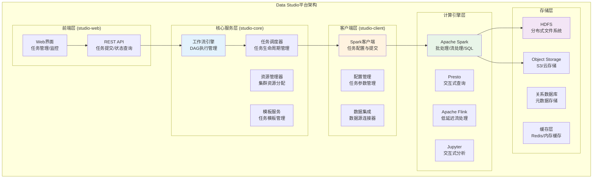
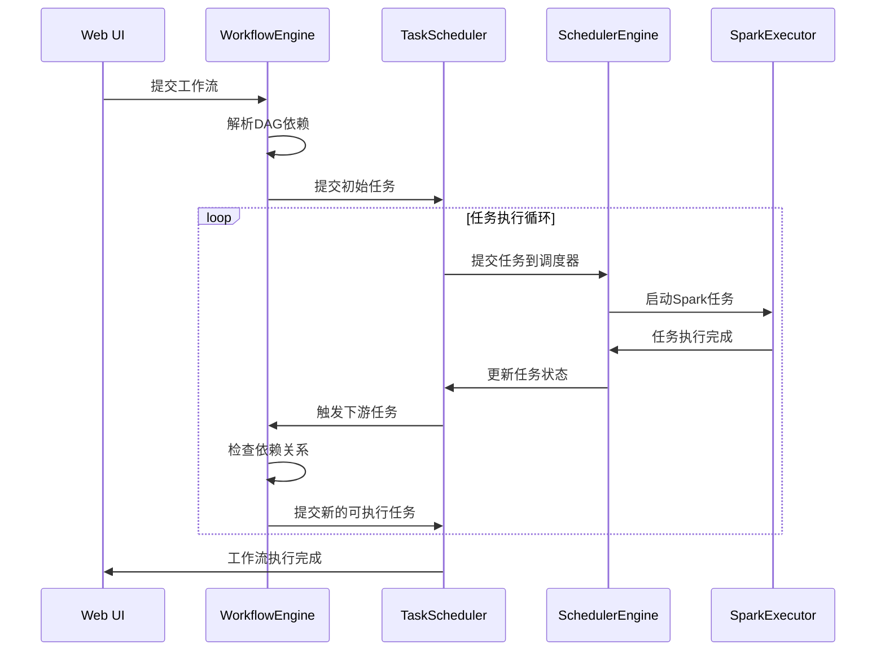

# 项目代码分析：实际Spark应用模式深度学习笔记

## 目录
1. [项目架构分析](#1-项目架构分析)
2. [Spark任务类型与配置](#2-spark任务类型与配置)
3. [工作流引擎实现](#3-工作流引擎实现)
4. [任务调度与执行](#4-任务调度与执行)
5. [最佳实践应用](#5-最佳实践应用)
6. [架构改进建议](#6-架构改进建议)

---

## 1. 项目架构分析

### 1.1 Data Studio整体架构

根据项目结构分析，Data Studio是一个企业级数据平台，支持多种计算引擎和任务类型：



### 1.2 核心模块分析

基于项目代码，我们深入分析各个核心模块：

```java
// 项目核心模块分析
/**
 * studio-web: Web服务层
 * - 提供REST API接口
 * - 用户界面交互
 * - 任务管理前端
 */

/**
 * studio-core: 核心业务逻辑
 * - 工作流执行引擎
 * - 任务调度与监控
 * - 模板管理服务
 * - 权限和安全管理
 */

/**
 * studio-client: 客户端SDK
 * - 各种计算引擎的配置类
 * - 数据源连接器
 * - 任务提交客户端
 * - 公共工具类
 */
```

---

## 2. Spark任务类型与配置

### 2.1 支持的Spark任务类型

从项目代码可以看出，支持三种主要的Spark任务类型：

```java
// 来自 TaskExeTypeEnum.java
public enum TaskExeTypeEnum {
    SPARK_JAR(1, "spark jar"),      // Scala/Java Spark应用
    SPARK_SQL(2, "spark SQL"),      // SQL查询任务  
    PYTHON_SPARK(3, "python spark"), // PySpark应用
    // ... 其他任务类型
}
```

#### 1. **Spark JAR任务配置分析**

```java
// 来自 SparkJarConfig.java
@Data
public class SparkJarConfig {
    private String sparkVersion;           // Spark版本
    private ResourceConfig mainResource;   // 主JAR包配置
    private String mainClass;              // 入口类
    private String sparkProperties;        // Spark参数配置
    private String programArgument;        // 程序参数
    private List<ResourceConfig> otherResources; // 依赖JAR包
    private Boolean isStreamingTask;       // 是否流处理任务
    private YarnQueueInfo yarnQueueInfo;   // YARN队列信息
    private List<CampaignConfig> campaignConfigList; // 活动配置
    private Boolean enableCampaignConfig;  // 是否启用活动配置
}

// 实际应用场景示例
public class SparkJarTaskExample {
    
    public SparkJarConfig createEtlTaskConfig() {
        return SparkJarConfig.builder()
            .sparkVersion("3.2.0")
            .mainClass("com.shopee.di.etl.DataProcessingJob")
            .sparkProperties("""
                --conf spark.executor.memory=8g
                --conf spark.executor.cores=4  
                --conf spark.executor.instances=20
                --conf spark.sql.adaptive.enabled=true
                --conf spark.sql.adaptive.coalescePartitions.enabled=true
                --conf spark.serializer=org.apache.spark.serializer.KryoSerializer
                """)
            .programArgument("--input hdfs://input/data/ --output hdfs://output/processed/")
            .isStreamingTask(false)
            .yarnQueueInfo(YarnQueueInfo.builder()
                .queueName("data-processing")
                .priority("NORMAL")
                .build())
            .build();
    }
}
```

#### 2. **PySpark任务配置分析**

```java
// 来自 PythonSparkConfig.java
@Data
public class PythonSparkConfig {
    private String sparkVersion;
    private String language;               // Python语言标识
    private ResourceConfig mainResource;   // 主Python脚本
    private String sparkProperties;
    private String programArgument;
    private List<ResourceConfig> otherResources; // 依赖文件/包
    private Boolean isStreamingTask;
    private YarnQueueInfo yarnQueueInfo;
    private List<CampaignConfig> campaignConfigList;
    private Boolean enableCampaignConfig;
}

// PySpark任务配置示例
public class PySparkTaskExample {
    
    public PythonSparkConfig createMLPipelineConfig() {
        return PythonSparkConfig.builder()
            .sparkVersion("3.2.0")
            .language("python")
            .mainResource(ResourceConfig.builder()
                .resourcePath("hdfs://scripts/ml_pipeline.py")
                .resourceType("PYTHON_FILE")
                .build())
            .sparkProperties("""
                --conf spark.executor.memory=16g
                --conf spark.executor.cores=4
                --conf spark.executor.instances=10
                --conf spark.pyspark.driver.python=/opt/python3.8/bin/python
                --conf spark.pyspark.python=/opt/python3.8/bin/python
                --conf spark.sql.execution.arrow.pyspark.enabled=true
                """)
            .programArgument("--model-path hdfs://models/ --data-path hdfs://data/")
            .isStreamingTask(false)
            .build();
    }
}
```

#### 3. **Spark SQL任务配置分析**

```java
// 来自 SparkSQLConfig.java  
@Data
public class SparkSQLConfig {
    private String sparkVersion = StringConstant.DEFAULT_SPARK_VERSION_3;
    private String sparkProperties;
    private String programArgument;
    private List<ResourceConfig> sparkSqlResources;  // SQL脚本资源
    private List<CampaignConfig> campaignConfigList;
    private Boolean enableCampaignConfig;
}

// Spark SQL任务示例
public class SparkSQLTaskExample {
    
    public SparkSQLConfig createReportingTaskConfig() {
        return SparkSQLConfig.builder()
            .sparkVersion("3.2.0")
            .sparkProperties("""
                --conf spark.executor.memory=12g
                --conf spark.sql.shuffle.partitions=800
                --conf spark.sql.adaptive.enabled=true
                --conf spark.sql.adaptive.skewJoin.enabled=true
                --conf spark.sql.adaptive.coalescePartitions.enabled=true
                """)
            .sparkSqlResources(Arrays.asList(
                ResourceConfig.builder()
                    .resourcePath("hdfs://sql/daily_report.sql")
                    .resourceType("SQL_FILE")
                    .build()
            ))
            .build();
    }
}
```

### 2.2 资源管理与配置

```java
// 来自 ResourceConfig.java (推断)
@Data
public class ResourceConfig {
    private String resourceId;
    private String resourcePath;    // 资源路径（HDFS/S3/本地）
    private String resourceType;    // 资源类型（JAR/PYTHON/SQL等）
    private String resourceVersion; // 资源版本
    private Long resourceSize;      // 资源大小
    private String checksum;        // 校验和
}

// 资源管理最佳实践
public class ResourceManagement {
    
    // 1. 版本化资源管理
    public ResourceConfig createVersionedResource(String path, String version) {
        return ResourceConfig.builder()
            .resourcePath(path)
            .resourceVersion(version)
            .resourceType(detectResourceType(path))
            .checksum(calculateChecksum(path))
            .build();
    }
    
    // 2. 依赖解析
    public List<ResourceConfig> resolveDependencies(ResourceConfig mainResource) {
        List<ResourceConfig> dependencies = new ArrayList<>();
        
        // 解析JAR包依赖
        if ("JAR".equals(mainResource.getResourceType())) {
            dependencies.addAll(parseJarDependencies(mainResource.getResourcePath()));
        }
        
        // 解析Python包依赖
        if ("PYTHON_FILE".equals(mainResource.getResourceType())) {
            dependencies.addAll(parsePythonDependencies(mainResource.getResourcePath()));
        }
        
        return dependencies;
    }
}
```

---

## 3. 工作流引擎实现

### 3.1 工作流执行核心逻辑

```java
// 来自 WorkflowExecutionServiceImpl.java 的核心逻辑分析
@Service
public class WorkflowExecutionServiceImpl implements WorkflowExecutionService {
    
    @Override
    @Transactional(rollbackFor = Exception.class)
    public Long submit(Long workflowId, String operator, String operatorEmail, Set<Long> selectedIds) 
        throws Exception {
        
        // 1. 工作流验证与获取
        AssetDO assetDO = assetMapper.getById(workflowId);
        validateWorkflow(assetDO);
        
        // 2. 获取所有任务节点
        List<AssetDO> allNodes = assetSearchService.getAllWorkflowTaskNodes(workflowId);
        filterExecutableNodes(allNodes, selectedIds);
        
        // 3. 构建执行计划
        ExecutionDO executionDO = buildExecutionPlan(assetDO, operator, operatorEmail);
        
        // 4. 创建任务实例
        List<TaskDO> taskDOS = buildTaskDOList(allNodes, executionDO, variableMap);
        
        // 5. 提交初始任务（无上游依赖的任务）
        Set<Long> nodesWithoutUpStream = ExecutionUtils.getNodesWithoutUpStream(
            allIds, executionDO.getRelations());
        
        submitInitialTasks(taskDOS, nodesWithoutUpStream);
        
        // 6. 更新执行状态
        executionService.updateExecutionStatus(executionDO.getId(), ExecutionStatusEnum.RUNNING);
        
        return executionDO.getId();
    }
    
    // 任务配置构建核心逻辑
    private ExecutionInfo buildExecutionInfo(AssetDO assetDO, AssetDetailDO assetDetailDO, 
                                           Map<String, Object> variableMap) {
        ExecutionInfo executionInfo = new ExecutionInfo();
        AssetTypeEnum assetTypeEnum = AssetTypeEnum.getByCode(assetDO.getAssetType());
        
        switch (assetTypeEnum) {
            case SPARK_JAR:
                return buildSparkJarExecutionInfo(assetDetailDO, variableMap);
            case PYTHON_SPARK:
                return buildPySparkExecutionInfo(assetDetailDO, variableMap);
            case SPARK_SQL:
                return buildSparkSQLExecutionInfo(assetDetailDO, variableMap);
            default:
                throw new UnsupportedOperationException("Unsupported task type: " + assetTypeEnum);
        }
    }
    
    private ExecutionInfo buildSparkJarExecutionInfo(AssetDetailDO assetDetailDO, 
                                                   Map<String, Object> variableMap) {
        SparkJarConfig config = JsonUtils.parseObject(
            assetDetailDO.getSpecificConfiguration(), SparkJarConfig.class);
        
        ExecutionInfo executionInfo = new ExecutionInfo();
        
        // 构建Spark配置
        String sparkConfig = Optional.ofNullable(config.getSparkProperties()).orElse("") 
                           + " --class " + config.getMainClass();
        executionInfo.setConfig(sparkConfig);
        
        // 设置版本和资源
        executionInfo.setSparkVersion(config.getSparkVersion());
        executionInfo.setMainResource(buildMainResource(config.getMainResource(), assetDO));
        executionInfo.setAttachedResources(buildAttachedResource(config.getOtherResources(), assetDO));
        
        // 处理程序参数和变量替换
        if (StringUtils.isNotBlank(config.getProgramArgument())) {
            Map<String, Object> taskVariableMap = fillTaskVariables(variableMap, assetDetailDO, assetDO);
            executionInfo.setProgramArguments(
                StringReplaceUtils.replacedVariable(config.getProgramArgument(), taskVariableMap));
        }
        
        return executionInfo;
    }
}
```

### 3.2 任务依赖关系管理

```java
// 工作流依赖关系管理
public class WorkflowDependencyManager {
    
    // 1. 依赖关系解析
    public Map<Long, Set<Long>> parseDependencies(String relationJson) {
        List<WorkflowLink> relations = JsonUtils.toList(relationJson, WorkflowLink.class);
        Map<Long, Set<Long>> dependencies = new HashMap<>();
        
        for (WorkflowLink link : relations) {
            Long targetId = link.getTo().getId();
            Long sourceId = link.getFrom().getId();
            
            dependencies.computeIfAbsent(targetId, k -> new HashSet<>()).add(sourceId);
        }
        
        return dependencies;
    }
    
    // 2. 拓扑排序实现
    public List<Long> topologicalSort(Set<Long> taskIds, Map<Long, Set<Long>> dependencies) {
        List<Long> result = new ArrayList<>();
        Set<Long> visited = new HashSet<>();
        Set<Long> visiting = new HashSet<>();
        
        for (Long taskId : taskIds) {
            if (!visited.contains(taskId)) {
                if (!dfs(taskId, dependencies, visited, visiting, result)) {
                    throw new RuntimeException("Circular dependency detected in workflow");
                }
            }
        }
        
        Collections.reverse(result);
        return result;
    }
    
    // 3. 获取可执行任务
    public Set<Long> getExecutableTasks(Set<Long> allTasks, Map<Long, Set<Long>> dependencies, 
                                       Set<Long> completedTasks) {
        return allTasks.stream()
            .filter(taskId -> !completedTasks.contains(taskId))
            .filter(taskId -> {
                Set<Long> deps = dependencies.getOrDefault(taskId, Collections.emptySet());
                return completedTasks.containsAll(deps);  // 所有依赖都已完成
            })
            .collect(Collectors.toSet());
    }
}
```

### 3.3 动态调度实现



---

## 4. 任务调度与执行

### 4.1 任务生命周期管理

```java
// 任务状态管理
public class TaskLifecycleManager {
    
    public enum TaskStatus {
        PENDING,    // 待执行
        RUNNING,    // 执行中
        SUCCESS,    // 成功
        FAILED,     // 失败
        CANCELLED,  // 取消
        RETRY       // 重试
    }
    
    // 任务状态转换
    public boolean transitionTaskState(Long taskId, TaskStatus fromStatus, TaskStatus toStatus) {
        TaskDO task = taskMapper.selectById(taskId);
        
        // 验证状态转换的合法性
        if (!isValidTransition(task.getTaskStatus(), fromStatus, toStatus)) {
            throw new IllegalStateException(
                String.format("Invalid state transition: %s -> %s for task %d", 
                             fromStatus, toStatus, taskId));
        }
        
        // 更新任务状态
        TaskDO updateTask = new TaskDO();
        updateTask.setId(taskId);
        updateTask.setTaskStatus(toStatus.getCode());
        updateTask.setUpdateTime(System.currentTimeMillis());
        
        if (toStatus == TaskStatus.RUNNING) {
            updateTask.setStartTime(System.currentTimeMillis());
        } else if (toStatus == TaskStatus.SUCCESS || toStatus == TaskStatus.FAILED) {
            updateTask.setEndTime(System.currentTimeMillis());
        }
        
        int updated = taskMapper.updateByPrimaryKey(updateTask);
        
        // 状态转换成功后的后续处理
        if (updated > 0) {
            handleStateTransition(taskId, toStatus);
        }
        
        return updated > 0;
    }
    
    // 状态转换后处理
    private void handleStateTransition(Long taskId, TaskStatus newStatus) {
        switch (newStatus) {
            case SUCCESS:
                handleTaskSuccess(taskId);
                break;
            case FAILED:
                handleTaskFailure(taskId);
                break;
            case CANCELLED:
                handleTaskCancellation(taskId);
                break;
        }
    }
    
    private void handleTaskSuccess(Long taskId) {
        // 1. 更新工作流状态
        updateWorkflowProgress(taskId);
        
        // 2. 触发下游任务
        triggerDownstreamTasks(taskId);
        
        // 3. 清理临时资源
        cleanupTaskResources(taskId);
        
        // 4. 发送成功通知
        sendSuccessNotification(taskId);
    }
}
```

### 4.2 错误处理与重试机制

```java
// 任务错误处理和重试机制
public class TaskErrorHandler {
    
    @Value("${task.retry.maxAttempts:3}")
    private int maxRetryAttempts;
    
    @Value("${task.retry.backoffMultiplier:2}")
    private int backoffMultiplier;
    
    public void handleTaskFailure(TaskDO task, Exception exception) {
        logError(String.format("Task %d failed: %s", task.getId(), exception.getMessage()), exception);
        
        // 判断是否可以重试
        if (shouldRetry(task, exception)) {
            scheduleRetry(task);
        } else {
            markTaskAsFinalFailure(task, exception);
        }
    }
    
    private boolean shouldRetry(TaskDO task, Exception exception) {
        // 1. 检查重试次数
        if (task.getRetryCount() >= maxRetryAttempts) {
            return false;
        }
        
        // 2. 检查异常类型
        if (isNonRetryableException(exception)) {
            return false;
        }
        
        // 3. 检查任务类型
        if (isStreamingTask(task)) {
            return false;  // 流任务通常不重试
        }
        
        return true;
    }
    
    private void scheduleRetry(TaskDO task) {
        int retryCount = task.getRetryCount() + 1;
        long delay = calculateRetryDelay(retryCount);
        
        // 更新重试信息
        TaskDO retryTask = new TaskDO();
        retryTask.setId(task.getId());
        retryTask.setRetryCount(retryCount);
        retryTask.setTaskStatus(TaskStatus.RETRY.getCode());
        retryTask.setNextRetryTime(System.currentTimeMillis() + delay);
        
        taskMapper.updateByPrimaryKey(retryTask);
        
        // 调度重试
        scheduleTaskWithDelay(task.getId(), delay);
        
        logInfo(String.format("Task %d scheduled for retry %d after %d ms", 
                             task.getId(), retryCount, delay));
    }
    
    private long calculateRetryDelay(int retryCount) {
        // 指数退避策略：1min, 2min, 4min, 8min...
        long baseDelay = 60 * 1000;  // 1分钟
        return baseDelay * (long) Math.pow(backoffMultiplier, retryCount - 1);
    }
    
    private boolean isNonRetryableException(Exception exception) {
        // 以下异常类型不进行重试
        return exception instanceof IllegalArgumentException ||
               exception instanceof SecurityException ||
               exception instanceof ClassNotFoundException ||
               exception.getMessage().contains("OutOfMemoryError");
    }
}
```

### 4.3 资源调度优化

```java
// 资源调度优化
public class ResourceScheduler {
    
    // 1. 智能资源分配
    public ResourceAllocation allocateResources(TaskDO task, ClusterStatus clusterStatus) {
        AssetTypeEnum taskType = AssetTypeEnum.getByCode(task.getAssetType());
        
        switch (taskType) {
            case SPARK_JAR:
                return allocateSparkJarResources(task, clusterStatus);
            case PYTHON_SPARK:
                return allocatePySparkResources(task, clusterStatus);
            case SPARK_SQL:
                return allocateSparkSQLResources(task, clusterStatus);
            default:
                return getDefaultResourceAllocation();
        }
    }
    
    private ResourceAllocation allocateSparkJarResources(TaskDO task, ClusterStatus clusterStatus) {
        SparkJarConfig config = parseSparkJarConfig(task);
        
        // 基于历史执行数据预估资源需求
        TaskHistoryMetrics history = getTaskHistory(task.getFileId());
        
        int executorInstances = calculateExecutorInstances(
            config, history, clusterStatus.getAvailableCores());
        String executorMemory = calculateExecutorMemory(
            config, history, clusterStatus.getAvailableMemory());
        
        return ResourceAllocation.builder()
            .executorInstances(executorInstances)
            .executorMemory(executorMemory)
            .executorCores(getOptimalCoreCount(taskType))
            .queueName(selectOptimalQueue(task, clusterStatus))
            .priority(calculateTaskPriority(task))
            .build();
    }
    
    // 2. 动态资源调整
    public void adjustResourcesBasedOnProgress(Long taskId) {
        TaskDO task = taskMapper.selectById(taskId);
        TaskMetrics currentMetrics = getTaskMetrics(taskId);
        
        // 检查资源使用效率
        double memoryUtilization = currentMetrics.getMemoryUtilization();
        double cpuUtilization = currentMetrics.getCpuUtilization();
        
        ResourceAdjustment adjustment = new ResourceAdjustment();
        
        // 内存使用率过低，减少内存分配
        if (memoryUtilization < 0.3 && task.getExecutionDuration() > 10 * 60 * 1000) {
            adjustment.setMemoryScale(0.7);  // 减少30%内存
        }
        
        // CPU使用率过低，减少核心数
        if (cpuUtilization < 0.4 && task.getExecutionDuration() > 5 * 60 * 1000) {
            adjustment.setCoreScale(0.8);   // 减少20%核心
        }
        
        // 应用资源调整
        if (adjustment.hasChanges()) {
            applyResourceAdjustment(taskId, adjustment);
        }
    }
    
    // 3. 队列负载均衡
    public String selectOptimalQueue(TaskDO task, ClusterStatus clusterStatus) {
        Map<String, QueueStatus> queueStatuses = clusterStatus.getQueueStatuses();
        
        // 基于任务类型的队列亲和性
        List<String> preferredQueues = getPreferredQueues(task.getAssetType());
        
        // 选择负载最轻的队列
        return preferredQueues.stream()
            .filter(queueName -> queueStatuses.containsKey(queueName))
            .min(Comparator.comparingDouble(queueName -> 
                queueStatuses.get(queueName).getLoadFactor()))
            .orElse("default");
    }
}
```

---

## 5. 最佳实践应用

### 5.1 配置模板化

基于项目中的模板服务，我们可以看到最佳实践的应用：

```java
// 来自 PySparkTemplateTaskService.java
@Service
public class PySparkTemplateTaskService extends AbstractTemplateTaskService {
    
    @Override
    public void checkTemplateForSync(AssetDO template, AssetDetailDO templateDetail) throws Exception {
        super.checkTemplateForSync(template, templateDetail);
        
        // 检查PySpark配置的完整性
        if (StringUtils.isEmpty(templateDetail.getSpecificConfiguration())) {
            throw new DataStudioException(DataStudioExceptionEnum.TASK_CONFIG_ILLEGAL, 
                "The template is missing Spark configuration. Please add it in saving.");
        }
        
        PythonSparkConfig pySparkConfig = JsonUtils.parseObject(
            templateDetail.getSpecificConfiguration(), PythonSparkConfig.class);
        
        // 验证必需的配置项
        if (StringUtils.isBlank(pySparkConfig.getSparkVersion()) || 
            StringUtils.isBlank(pySparkConfig.getLanguage()) || 
            Objects.isNull(pySparkConfig.getMainResource())) {
            throw new DataStudioException(DataStudioExceptionEnum.TASK_CONFIG_ILLEGAL, 
                "The template's Spark configuration is missing mandatory argument(s).");
        }
        
        // 检查资源是否存在
        checkResources(pySparkConfig.getMainResource(), pySparkConfig.getOtherResources());
        
        // 检查模板变量
        checkPropertyWithVariable(template, templateDetail);
    }
    
    // 配置模板最佳实践
    public static class SparkConfigTemplates {
        
        // ETL任务模板
        public static final String ETL_TEMPLATE = """
            {
              "sparkVersion": "3.2.0",
              "language": "python",
              "sparkProperties": "--conf spark.executor.memory=8g --conf spark.executor.cores=4 --conf spark.executor.instances=20 --conf spark.sql.adaptive.enabled=true --conf spark.sql.adaptive.coalescePartitions.enabled=true --conf spark.serializer=org.apache.spark.serializer.KryoSerializer",
              "isStreamingTask": false,
              "yarnQueueInfo": {
                "queueName": "etl",
                "priority": "NORMAL"
              }
            }
            """;
        
        // 机器学习任务模板
        public static final String ML_TEMPLATE = """
            {
              "sparkVersion": "3.2.0",
              "language": "python",
              "sparkProperties": "--conf spark.executor.memory=16g --conf spark.executor.cores=4 --conf spark.executor.instances=10 --conf spark.sql.execution.arrow.pyspark.enabled=true --conf spark.python.worker.memory=2g",
              "isStreamingTask": false,
              "yarnQueueInfo": {
                "queueName": "ml",
                "priority": "HIGH"
              }
            }
            """;
        
        // 流处理任务模板
        public static final String STREAMING_TEMPLATE = """
            {
              "sparkVersion": "3.2.0",
              "language": "python",
              "sparkProperties": "--conf spark.executor.memory=4g --conf spark.executor.cores=2 --conf spark.executor.instances=5 --conf spark.streaming.backpressure.enabled=true --conf spark.streaming.receiver.maxRate=10000",
              "isStreamingTask": true,
              "yarnQueueInfo": {
                "queueName": "streaming",
                "priority": "HIGH"
              }
            }
            """;
    }
}
```

### 5.2 变量替换机制

```java
// 任务变量替换机制的实现
public class VariableReplacementService {
    
    // 变量填充逻辑
    public Map<String, Object> fillTaskVariables(
            Map<String, Object> workflowVariables,
            AssetDetailDO taskDetail,
            AssetDO taskAsset) {
        
        Map<String, Object> taskVariables = new HashMap<>(workflowVariables);
        
        // 1. 系统变量
        taskVariables.put("TASK_ID", taskAsset.getId());
        taskVariables.put("EXECUTION_DATE", DateUtils.formatDate(new Date(), "yyyy-MM-dd"));
        taskVariables.put("EXECUTION_TIMESTAMP", System.currentTimeMillis());
        taskVariables.put("USER", getCurrentUser());
        
        // 2. 环境变量  
        taskVariables.put("ENV", getCurrentEnvironment());
        taskVariables.put("CLUSTER", getCurrentCluster());
        
        // 3. 任务特定变量
        if (taskDetail.getTaskVariables() != null) {
            Map<String, Object> taskSpecificVars = JsonUtils.parseObject(
                taskDetail.getTaskVariables(), new TypeReference<Map<String, Object>>() {});
            taskVariables.putAll(taskSpecificVars);
        }
        
        return taskVariables;
    }
    
    // 变量替换的实际应用示例
    public String replaceVariables(String template, Map<String, Object> variables) {
        String result = template;
        
        for (Map.Entry<String, Object> entry : variables.entrySet()) {
            String placeholder = "${" + entry.getKey() + "}";
            String value = String.valueOf(entry.getValue());
            result = result.replace(placeholder, value);
        }
        
        return result;
    }
    
    // 实际使用场景
    public void demonstrateVariableUsage() {
        // 原始配置模板
        String configTemplate = """
            --input hdfs://data/${ENV}/${EXECUTION_DATE}/
            --output hdfs://output/${ENV}/${TASK_ID}/
            --user ${USER}
            --batch-size ${BATCH_SIZE}
            """;
        
        Map<String, Object> variables = Map.of(
            "ENV", "production",
            "EXECUTION_DATE", "2023-12-01",
            "TASK_ID", "12345",
            "USER", "data_engineer",
            "BATCH_SIZE", "10000"
        );
        
        String finalConfig = replaceVariables(configTemplate, variables);
        // 结果：
        // --input hdfs://data/production/2023-12-01/
        // --output hdfs://output/production/12345/
        // --user data_engineer
        // --batch-size 10000
    }
}
```

### 5.3 监控与日志

```java
// 任务监控和日志收集
public class TaskMonitoringService {
    
    // 1. 任务执行指标收集
    public void collectTaskMetrics(Long taskId) {
        TaskDO task = taskMapper.selectById(taskId);
        
        if (TaskStatus.RUNNING.getCode().equals(task.getTaskStatus())) {
            TaskMetrics metrics = new TaskMetrics();
            
            // 收集Spark应用指标
            if (task.getScheduleInstanceCode() != null) {
                SparkApplicationInfo sparkApp = getSparkApplicationInfo(task.getScheduleInstanceCode());
                
                metrics.setApplicationId(sparkApp.getApplicationId());
                metrics.setDriverMemoryUsage(sparkApp.getDriverMemoryUsage());
                metrics.setExecutorCount(sparkApp.getExecutorCount());
                metrics.setTotalCores(sparkApp.getTotalCores());
                metrics.setShuffleReadBytes(sparkApp.getShuffleReadBytes());
                metrics.setShuffleWriteBytes(sparkApp.getShuffleWriteBytes());
                metrics.setGcTime(sparkApp.getGcTime());
            }
            
            // 存储指标
            taskMetricsMapper.insert(metrics);
            
            // 检查异常情况
            checkAnomalousMetrics(task, metrics);
        }
    }
    
    private void checkAnomalousMetrics(TaskDO task, TaskMetrics metrics) {
        List<Anomaly> anomalies = new ArrayList<>();
        
        // 1. 检查内存使用异常
        if (metrics.getDriverMemoryUsage() > 0.9) {
            anomalies.add(new Anomaly("HIGH_DRIVER_MEMORY", 
                "Driver memory usage > 90%: " + metrics.getDriverMemoryUsage()));
        }
        
        // 2. 检查GC时间异常
        if (metrics.getGcTime() > task.getExecutionDuration() * 0.1) {
            anomalies.add(new Anomaly("HIGH_GC_TIME", 
                "GC time > 10% of execution time"));
        }
        
        // 3. 检查Shuffle异常
        long shuffleTotal = metrics.getShuffleReadBytes() + metrics.getShuffleWriteBytes();
        if (shuffleTotal > 100L * 1024 * 1024 * 1024) {  // 100GB
            anomalies.add(new Anomaly("HIGH_SHUFFLE_VOLUME", 
                "Shuffle volume > 100GB: " + (shuffleTotal / 1024 / 1024 / 1024) + "GB"));
        }
        
        // 发送告警
        if (!anomalies.isEmpty()) {
            sendAnomalyAlert(task, anomalies);
        }
    }
    
    // 2. 日志聚合和分析
    public void aggregateTaskLogs(Long taskId) {
        TaskDO task = taskMapper.selectById(taskId);
        
        // 收集各种日志源
        List<LogEntry> driverLogs = collectDriverLogs(task.getScheduleInstanceCode());
        List<LogEntry> executorLogs = collectExecutorLogs(task.getScheduleInstanceCode());
        List<LogEntry> yarnLogs = collectYarnLogs(task.getScheduleInstanceCode());
        
        // 合并和分析日志
        List<LogEntry> allLogs = new ArrayList<>();
        allLogs.addAll(driverLogs);
        allLogs.addAll(executorLogs);
        allLogs.addAll(yarnLogs);
        
        // 日志分析
        LogAnalysisResult analysis = analyzeLogEntries(allLogs);
        
        // 存储分析结果
        TaskLogAnalysis logAnalysis = new TaskLogAnalysis();
        logAnalysis.setTaskId(taskId);
        logAnalysis.setErrorCount(analysis.getErrorCount());
        logAnalysis.setWarningCount(analysis.getWarningCount());
        logAnalysis.setKeyErrors(JsonUtils.toJsonString(analysis.getKeyErrors()));
        logAnalysis.setPerformanceIssues(JsonUtils.toJsonString(analysis.getPerformanceIssues()));
        
        taskLogAnalysisMapper.insert(logAnalysis);
    }
}
```

---

## 6. 架构改进建议

基于对项目代码的分析和Spark最佳实践，提出以下改进建议：

### 6.1 配置管理优化

```java
// 建议：动态配置管理
public class DynamicConfigurationManager {
    
    // 1. 基于机器学习的资源预测
    public ResourceRecommendation recommendResources(TaskProfile taskProfile) {
        MLModel resourceModel = loadResourcePredictionModel();
        
        PredictionInput input = PredictionInput.builder()
            .dataSize(taskProfile.getInputDataSize())
            .complexity(taskProfile.getComplexityScore())
            .historyMetrics(taskProfile.getHistoricalMetrics())
            .build();
        
        ResourceRecommendation recommendation = resourceModel.predict(input);
        
        return recommendation;
    }
    
    // 2. 自适应配置调整
    public SparkConfig adaptConfiguration(SparkConfig baseConfig, TaskMetrics realTimeMetrics) {
        SparkConfig adaptedConfig = baseConfig.clone();
        
        // 基于实时指标调整配置
        if (realTimeMetrics.getMemoryPressure() > 0.8) {
            adaptedConfig.setExecutorMemory(
                increaseMemory(adaptedConfig.getExecutorMemory(), 1.2));
        }
        
        if (realTimeMetrics.getCpuUtilization() < 0.3) {
            adaptedConfig.setExecutorCores(
                Math.max(1, adaptedConfig.getExecutorCores() - 1));
        }
        
        return adaptedConfig;
    }
}
```

### 6.2 智能调度优化

```java
// 建议：智能任务调度
public class IntelligentTaskScheduler {
    
    // 1. 基于历史数据的执行时间预测
    public long predictExecutionTime(TaskDO task) {
        TaskHistoryAnalyzer analyzer = new TaskHistoryAnalyzer();
        
        List<TaskExecutionHistory> history = taskHistoryMapper.selectByTaskType(
            task.getAssetType(), task.getFileId());
        
        if (history.isEmpty()) {
            return getDefaultExecutionTime(task.getAssetType());
        }
        
        return analyzer.predictExecutionTime(history, task);
    }
    
    // 2. 智能资源分配
    public ResourceAllocation optimizeResourceAllocation(List<TaskDO> pendingTasks, 
                                                       ClusterStatus clusterStatus) {
        // 使用整数线性规划求解最优资源分配
        OptimizationModel model = createResourceOptimizationModel(pendingTasks, clusterStatus);
        OptimizationSolution solution = solver.solve(model);
        
        return solution.getResourceAllocation();
    }
    
    // 3. 动态优先级调整
    public void adjustTaskPriorities() {
        List<TaskDO> runningTasks = taskMapper.selectRunningTasks();
        
        for (TaskDO task : runningTasks) {
            TaskMetrics metrics = getTaskMetrics(task.getId());
            
            // 基于SLA和资源使用效率调整优先级
            int newPriority = calculateDynamicPriority(task, metrics);
            
            if (newPriority != task.getPriority()) {
                updateTaskPriority(task.getId(), newPriority);
            }
        }
    }
}
```

### 6.3 故障预测与自愈

```java
// 建议：故障预测和自愈机制
public class TaskFailurePredictionService {
    
    // 1. 故障预测模型
    public FailurePrediction predictFailure(Long taskId) {
        TaskDO task = taskMapper.selectById(taskId);
        TaskMetrics currentMetrics = getTaskMetrics(taskId);
        
        // 特征工程
        FailurePredictionFeatures features = extractFeatures(task, currentMetrics);
        
        // 模型预测
        MLModel failureModel = loadFailurePredictionModel();
        double failureProbability = failureModel.predict(features);
        
        return FailurePrediction.builder()
            .taskId(taskId)
            .failureProbability(failureProbability)
            .riskLevel(classifyRiskLevel(failureProbability))
            .recommendations(generateRecommendations(features, failureProbability))
            .build();
    }
    
    // 2. 自动故障修复
    public void autoHealTask(Long taskId, FailureType failureType) {
        switch (failureType) {
            case OUT_OF_MEMORY:
                increaseTaskMemory(taskId, 1.5);
                restartTask(taskId);
                break;
                
            case DATA_SKEW:
                enableAdaptiveQueryExecution(taskId);
                adjustPartitionCount(taskId);
                restartTask(taskId);
                break;
                
            case EXECUTOR_LOST:
                increaseExecutorCount(taskId, 2);
                enableDynamicAllocation(taskId);
                restartTask(taskId);
                break;
                
            default:
                scheduleManualIntervention(taskId, failureType);
        }
    }
    
    // 3. 预防性维护
    public void performPreventiveMaintenance() {
        List<TaskDO> activeTasks = taskMapper.selectActiveTasks();
        
        for (TaskDO task : activeTasks) {
            FailurePrediction prediction = predictFailure(task.getId());
            
            if (prediction.getRiskLevel() == RiskLevel.HIGH) {
                // 预防性干预
                applyPreventiveMeasures(task, prediction.getRecommendations());
                
                // 发送预警
                sendPreventiveAlert(task, prediction);
            }
        }
    }
}
```

### 6.4 性能持续优化

```java
// 建议：持续性能优化框架
public class ContinuousPerformanceOptimizer {
    
    // 1. 性能基准建立和更新
    public void updatePerformanceBaseline() {
        List<TaskExecutionHistory> recentExecutions = 
            taskHistoryMapper.selectRecentExecutions(30); // 最近30天
        
        Map<String, PerformanceBaseline> baselines = 
            recentExecutions.stream()
                .collect(groupingBy(
                    TaskExecutionHistory::getTaskType,
                    mapping(identity(), 
                           collectingAndThen(toList(), this::calculateBaseline))
                ));
        
        // 更新基准数据
        baselines.forEach(this::savePerformanceBaseline);
    }
    
    // 2. A/B测试框架
    public void runConfigurationABTest(String configurationName, 
                                     SparkConfig configA, 
                                     SparkConfig configB) {
        ABTestExperiment experiment = ABTestExperiment.builder()
            .name(configurationName)
            .configurationA(configA)
            .configurationB(configB)
            .trafficSplitRatio(0.5)  // 50/50分流
            .duration(Duration.ofDays(7))  // 运行7天
            .build();
        
        // 启动实验
        abTestManager.startExperiment(experiment);
        
        // 自动收集指标
        scheduleMetricsCollection(experiment);
        
        // 实验结束后自动分析
        scheduleExperimentAnalysis(experiment);
    }
    
    // 3. 自动性能调优
    public void autoTuneTaskConfiguration(Long taskId) {
        TaskDO task = taskMapper.selectById(taskId);
        TaskPerformanceHistory history = getTaskPerformanceHistory(taskId);
        
        // 使用遗传算法或贝叶斯优化
        ConfigurationOptimizer optimizer = new BayesianOptimizer();
        
        OptimizationResult result = optimizer.optimize(
            task.getCurrentConfiguration(),
            history.getPerformanceMetrics(),
            generateSearchSpace(task.getAssetType())
        );
        
        if (result.getImprovement() > 0.1) {  // 10%以上性能提升
            // 应用优化配置
            applyOptimizedConfiguration(taskId, result.getOptimalConfiguration());
            
            // 记录优化历史
            recordOptimizationResult(taskId, result);
        }
    }
}
```

---

## 总结

通过对Data Studio项目的深入分析，我们可以看到：

### 项目亮点：
1. **模块化设计**：清晰的分层架构，便于维护和扩展
2. **多引擎支持**：统一的接口支持Spark、Presto、Flink等多种引擎
3. **完整的工作流管理**：DAG依赖解析、动态调度、错误处理
4. **模板化配置**：通过模板简化任务配置，提高开发效率
5. **灵活的变量替换**：支持环境变量、任务变量等动态配置

### 改进建议：
1. **智能化配置管理**：基于历史数据和机器学习的资源预测
2. **故障预测与自愈**：主动的故障检测和自动修复机制
3. **持续性能优化**：A/B测试和自动调优框架
4. **更精细的资源调度**：基于实时负载的动态资源分配
5. **增强的监控体系**：实时指标收集和异常检测

这个项目为我们提供了一个很好的企业级数据平台实现参考，结合Spark的理论知识，可以更好地理解如何在生产环境中构建和优化大数据处理系统。

---

## 学习收获

通过这七个章节的深度学习，我们全面掌握了：

1. **理论基础**：RDD、DataFrame、SQL优化器的核心原理
2. **执行引擎**：DAG调度、Stage划分、Task执行机制  
3. **系统优化**：内存管理、Shuffle优化、性能调优
4. **流处理技术**：Streaming、状态管理、容错机制
5. **生产实践**：监控、调优、最佳实践
6. **实际应用**：企业级平台的架构设计和实现

这些知识形成了完整的Spark技术栈学习体系，既有深度的理论理解，又有丰富的实践经验，为实际项目开发提供了强有力的支撑。

---

## 推荐阅读
- [Apache Spark官方文档](https://spark.apache.org/docs/latest/)
- 《Spark权威指南》
- 《Learning Spark 2.0》
- [Databricks博客技术文章](https://databricks.com/blog)
