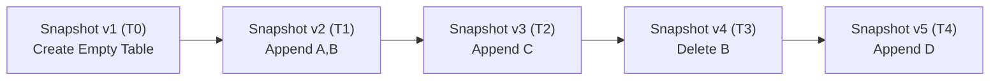
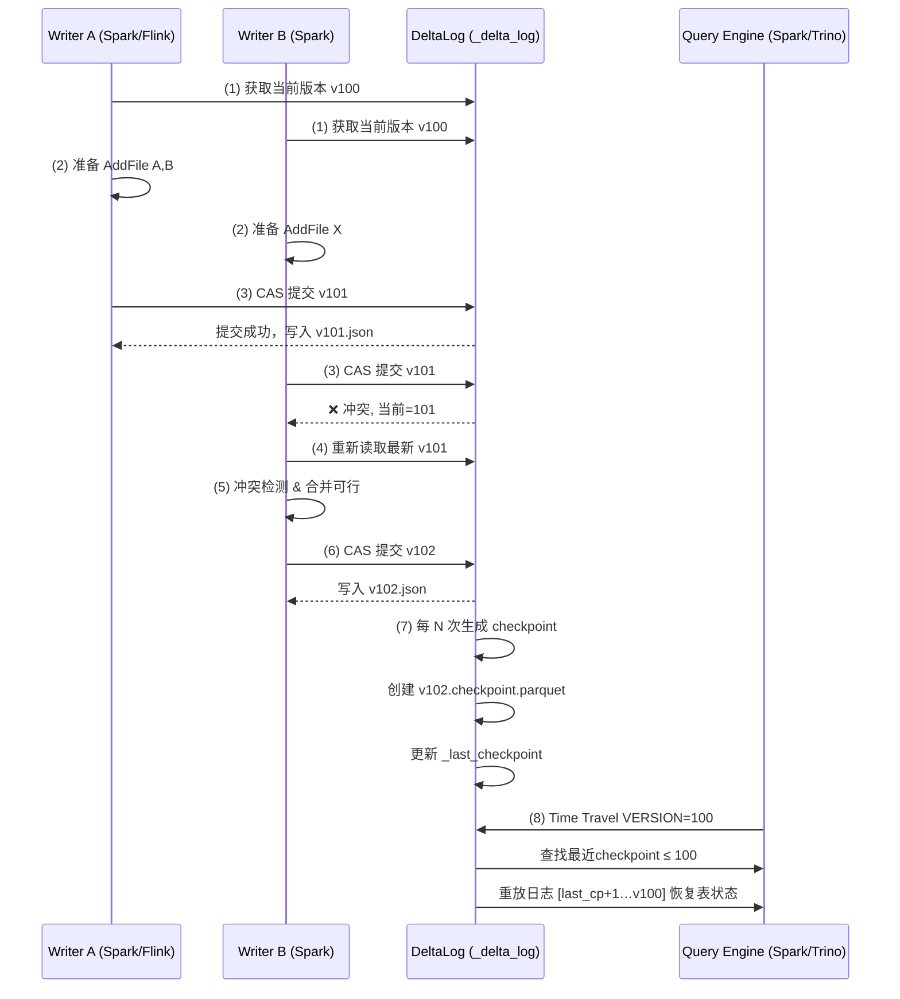
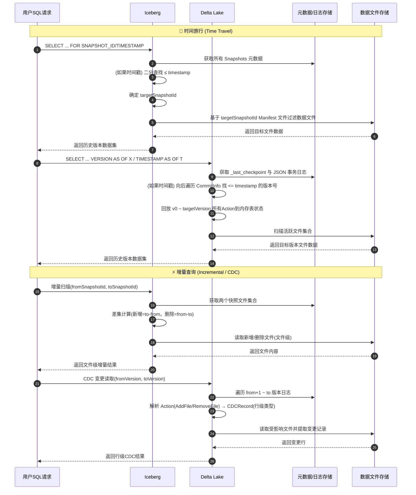

# 09/05 17:53 数据湖表解读

> Trino 数据湖表格式深度解析
> 解释下面
> ## 1. 数据湖表格式演进历程
>
> ### 1.1 传统数据湖的局限性
>
> ```
> 传统Hive表格式的问题:
> ┌─────────────────────────────────────────────────────────────┐
> │ 文件级操作 → 目录结构 → 元数据存储                            │
> ├─────────────────────────────────────────────────────────────┤
> │ 问题1: 缺乏ACID事务支持                                     │
> │ └── 并发写入冲突，数据不一致                                │
> │                                                           │
> │ 问题2: Schema演进困难                                       │
> │ └── 列添加/删除需要重写全量数据                              │
> │                                                           │
> │ 问题3: 小文件问题严重                                       │
> │ └── 频繁写入产生大量小文件，影响查询性能                      │
> │                                                           │
> │ 问题4: 缺乏时间旅行能力                                     │
> │ └── 无法查询历史版本数据                                    │
> │                                                           │
> │ 问题5: 元数据管理低效                                       │
> │ └── 分区发现慢，统计信息维护成本高                          │
> └─────────────────────────────────────────────────────────────┘
> ```
>
> ### 1.2 现代表格式的核心创新
>
> ```java
> // 现代数据湖表格式的设计理念
> public abstract class ModernTableFormat {
>
>     // 核心设计原则
>     enum DesignPrinciple {
>         VERSIONED_METADATA,      // 版本化元数据
>         TRANSACTION_LOG,         // 事务日志
>         SCHEMA_EVOLUTION,        // 模式演进
>         PARTITION_EVOLUTION,     // 分区演进
>         TIME_TRAVEL,             // 时间旅行
>         INCREMENTAL_PROCESSING,  // 增量处理
>         COMPACTION_OPTIMIZATION, // 压缩优化
>         MULTI_ENGINE_SUPPORT     // 多引擎支持
>     }
>
>     // 表格式必须提供的核心能力
>     public interface TableFormatCapabilities {
>         // 事务能力
>         Transaction beginTransaction();
>         void commitTransaction(Transaction tx);
>         void rollbackTransaction(Transaction tx);
>
>         // 版本管理
>         List<Snapshot> getSnapshots();
>         Snapshot getSnapshotAsOf(long timestampMs);
>         Snapshot getSnapshotById(long snapshotId);
>
>         // 模式管理
>         Schema getCurrentSchema();
>         Schema getSchemaAsOf(long timestampMs);
>         void evolveSchema(SchemaUpdate update);
>
>         // 分区管理
>         PartitionSpec getCurrentPartitionSpec();
>         void evolvePartitionSpec(PartitionSpecUpdate update);
>
>         // 文件管理
>         List<DataFile> getDataFiles();
>         void addDataFiles(List<DataFile> files);
>         void deleteDataFiles(List<DataFile> files);
>
>         // 优化操作
>         void compact(CompactionStrategy strategy);
>         void expire(ExpireStrategy strategy);
>
>         // 统计信息
>         TableStatistics getStatistics();
>         void updateStatistics(TableStatistics stats);
>     }
> }
> ```
>
> ---

好嘞，这段内容其实是在对 **Trino 数据湖表格式**的演进历程做一个深度梳理，从传统 Hive 表格式的痛点，到现代数据湖表格式（比如 Iceberg、Delta Lake、Hudi）的核心设计理念与能力。我们可以分成两个层次去理解👇

---

## 1️⃣ 传统数据湖表格式的局限性

在早期数据湖（主要指 Hive on HDFS 这种架构）中，表其实本质上就是 **元数据 + 存储文件夹**：

- 元数据存在 **Hive Metastore（HMS）** 里，记录表 schema、分区路径等信息。
- 数据以 **文件**（ORC / Parquet / Text）形式存放在 HDFS 目录结构中。

虽然简单易实现，但**缺点非常明显**：

| 问题 | 说明 | 影响 |
|------|------|------|
| ❌ 缺乏 ACID 事务 | Hive 表不是原生事务表，多个写入会发生冲突；insert overwrite 时如果失败，数据可能不一致 | 数据质量无法保证，尤其是并发写入场景 |
| ❌ Schema 演进困难 | 列增删需要修改元数据，但底层数据文件不兼容还得全量重写 | 表结构维护困难 |
| ❌ 小文件严重 | 数据导入频繁的小批量产生大量小文件 | 查询成本高，NameNode & I/O 压力大 |
| ❌ 没有时间旅行（Time Travel） | 无法按历史版本回溯查询 | 数据分析缺乏可溯源性 |
| ❌ 元数据管理低效 | 分区过多时元数据发现慢，统计信息成本高 | 查询优化器难以生成高效计划 |

💡 **直观类比**
Hive 表 = Excel 文件夹 + 文件名作为分区，缺乏版本控制 & 事务管理
现代表格式 = 带 Git 版本管理 + 元数据索引 + 自动合并优化的数据库

---

## 2️⃣ 现代表格式的设计理念

在 Apache Iceberg / Delta Lake / Apache Hudi 等新一代数据湖表格式里，核心思想是：

📌 **用事务日志（Metadata Log）管理数据湖文件元数据和变化历史**
📌 **元数据也版本化（Versioned Metadata）**，支持回溯 & 并发写入
📌 **文件管理自动化**，解决小文件 & 分区演进问题
📌 **多引擎支持**（Trino、Spark、Flink、Hive 等都能访问同一份表数据）

在你贴的 Java 示意代码中：
```java
enum DesignPrinciple {
    VERSIONED_METADATA,      // 元数据有版本，可记录历史快照
    TRANSACTION_LOG,         // 事务日志，支持原子提交/回滚
    SCHEMA_EVOLUTION,        // 表结构可演进（加列、改列名、类型转换）
    PARTITION_EVOLUTION,     // 分区方式可变（无需重写全量数据）
    TIME_TRAVEL,             // 支持时间旅行查询
    INCREMENTAL_PROCESSING,  // 支持增量处理（只读变化）
    COMPACTION_OPTIMIZATION, // 自动小文件合并压缩
    MULTI_ENGINE_SUPPORT     // 支持多计算引擎读写
}
```

---

### 例子：事务日志机制
假设当前表是 `sales`
1. 新数据导入会先写到临时文件区（Staging）
2. 生成一个 **Snapshot**（比如 v123），文件列表、Schema、分区信息都会写入 `metadata.json`
3. **原子提交**：将 v123 加到事务日志里
4. 其他查询引擎读取表时就基于最新的 Snapshot，确保读一致性

**效果**：
- 不同引擎（Trino、Spark）读到的数据是一致的
- 如果写入失败可以 rollback 到上一个 Snapshot

---

### Schema 演进 & 分区演进
过去 Hive 如果要调整分区列，要么重新建表，要么导出所有数据重写
☑ Iceberg/Deltalake 直接修改分区策略，未来新数据用新分区存储，旧数据仍可访问

---

### 时间旅行（Time Travel）
例如：
```sql
SELECT * FROM sales FOR VERSION AS OF 123;
SELECT * FROM sales FOR TIMESTAMP AS OF '2024-06-10 12:00:00';
```
就能读取任意历史版本表状态，实现数据可追溯分析。

---

### 优化能力（Compaction）
- 定期将小文件合并成大文件，减少 NameNode 压力 & 提高扫描速度
- 过期 Snapshot 删除无效文件，节省存储

---

## 3️⃣ 在 Trino 里的体现

Trino 本身是一个 **计算引擎**，不存储数据。而这些现代表格式让 Trino：
- 能像查询数据库一样直接在数据湖里做 ACID 查询
- 可以 `SELECT ... WHERE version_id = ...`
- Schema 变更无需重建分区目录
- 多引擎（Flink 写入、Trino 查询）无缝对接

---

## 4️⃣ 总结对比

| 特性 | 传统 Hive 表 | Iceberg / Delta / Hudi |
|------|-------------|------------------------|
| ACID 事务 | ❌ | ✅ |
| Schema 演进 | 部分支持 | ✅ 完整支持（向前/向后兼容） |
| 分区演进 | ❌ | ✅ |
| 时间旅行 | ❌ | ✅ |
| 小文件管理 | ❌ | ✅（合并压缩） |
| 元数据管理 | Hive Metastore | 自带事务日志，外加 HMS 可选 |
| 多引擎 | 仅兼容支持 | 同时支持 Spark / Flink / Trino / Hive |

---

如果你愿意的话，我可以帮你画一张 **[Trino 数据湖表格式演进图]**，用流程视角把 Hive → Iceberg/Delta/Hudi 的演化过程和核心组件一次性梳理出来📊，这样你就能一眼看懂它们的差别。

你要我帮你画这张图吗？🤓

-----

> 画这张图流程视角把 Hive → Iceberg/Delta/Hudi 的演化过程和核心组件一次性梳理出来

好嘞～那我来帮你画一张**流程/架构视角**的对比图，把 Hive → Iceberg / Delta Lake / Hudi 这种演进路线和核心组件一口气梳理清楚 📊

我会分成两个部分：
1. **演进流程图**（时间维度看变化）
2. **核心组件对比图**（架构维度看差异）

---

## **1️⃣ 数据湖表格式演进流程图（时间 + 能力）**

```
传统数据湖(Hive on HDFS)                →        现代表格式(Iceberg / Delta / Hudi)
──────────────────────────────────────          ─────────────────────────────────────────────
[数据文件 + 目录结构]                             [数据文件 + 事务日志 + 版本化元数据]
       │                                                     │
       │                                                     │
       ▼                                                     ▼
┌─────────────┐                                       ┌─────────────────────┐
│ 存储: HDFS   │                                       │ 存储: HDFS/S3/GCS等 │
│ 格式: ORC    │                                       │ 格式: Parquet/ORC   │
│ 分区: 目录   │                                       │ 分区: PartitionSpec │
└─────────────┘                                       └─────────────────────┘
       │                                                     │
       │                                                     │
       ▼                                                     ▼
┌─────────────┐  无事务ACID  ┌────────────────────────┐    有ACID
│ Hive Metastore│──────────▶ │ 事务日志(TransactionLog) │
│ 元数据: 分区信息│          │ 记录快照(Snapshot)       │
└─────────────┘             └────────────────────────┘
       │                                                     │
       │ Schema变更困难                                       │ Schema可演进
       └────────────────────────▶ 支持列增删改
       │                                                     │
       │ 无时间旅行                                           │ 时间旅行(Time Travel)
       └────────────────────────▶ 历史版本查询
       │                                                     │
       │ 查询慢                                               │ 快速元数据索引 + 小文件合并
       └────────────────────────▶ 查询优化
```

💡 可以看到核心区别是：
- **Hive** 借助 HMS 保存元数据，数据和元数据的同步一致性全靠人为维护
- **现代表格式** 引入 **事务日志(类似Git) + Snapshot版本化**，保证多引擎一致性 + 可回溯

---

## **2️⃣ 核心组件对比表**

| 能力/组件                   | Hive 表格式          | Iceberg                     | Delta Lake                  | Apache Hudi                 |
|-----------------------------|----------------------|------------------------------|------------------------------|------------------------------|
| **元数据存储**              | Hive Metastore (HMS) | 与HMS可集成 / 自维护         | 事务日志JSON                 | Timeline + Commit metadata   |
| **事务管理**                | 无                   | ACID Snapshot                | ACID Snapshot                | MVCC(多版本并发控制)         |
| **版本化快照**              | ❌                   | ✅                           | ✅                           | ✅（基于commit timeline）    |
| **Schema 演进**              | 有限（ALTER TABLE）  | 完全支持，加列/删列无重写     | 完全支持                     | 完全支持                     |
| **分区演进**                 | 无                   | ✅                           | ✅                           | ❌ (部分支持)                |
| **时间旅行**                 | 无                   | ✅ `AS OF VERSION/TIMESTAMP` | ✅                           | ✅                           |
| **小文件处理**               | 无                   | ✅自动合并                    | ✅自动合并                    | ✅自动清理 + 合并            |
| **增量读取**                 | 无                   | ✅ (某些API支持)             | ✅                           | ✅（专注增量消费）           |
| **多引擎支持**               | Spark/Hive           | Spark / Flink / Trino / Hive | Spark / Trino                | Spark / Flink / Trino / Hive |

---

## **3️⃣ 架构图（Hive vs Iceberg 对比）**

```
┌─────────────────────────────────────┐            ┌─────────────────────────────────────┐
│             Hive 架构               │            │         现代表格式（Iceberg）        │
├─────────────────────────────────────┤            ├─────────────────────────────────────┤
│ Query Engine: Hive / Trino / Spark  │            │ Query Engine: Trino / Spark / Flink │
│   │                                 │            │   │                                 │
│   ▼                                 │            │   ▼                                 │
│ Hive Metastore (HMS)                │            │ Iceberg Catalog (支持HMS/自维护)   │
│   │  (分区路径/Schema)              │            │   │                                 │
│   ▼                                 │            │   ▼                                 │
│ HDFS (Parquet/ORC 分区目录)          │            │ 数据文件(Data Files)               │
│                                     │            │ 事务日志(Transaction Log) + 元数据 │
└─────────────────────────────────────┘            └─────────────────────────────────────┘
```

---

### 📌 关键知识点总结
1. **Hive表 = 目录+HMS元数据**，无事务ACID，没有版本控制
2. **现代表格式 = 数据文件 + 事务日志 + 元数据版本化**，像 Git 管数据湖文件
3. Trino 可直接基于这些表做 SQL 查询+历史回溯
4. Iceberg/Delta/Hudi 在 ACID、多引擎兼容、Schema/分区演进、Time Travel、性能优化等维度大幅超越 Hive 格式
5. 对于 **多引擎场景（Flink写，Trino查）** 推荐 Iceberg / Delta Lake

---

我建议你如果后续在 Trino 中做落地，可以用 **Iceberg** 作为表格式，然后：
- 开启 **事务日志存储在对象存储**（S3、OSS 等）
- 结合 **Trino Catalog** 直接查询
- 用 Flink / Spark 来写，保证 ACID

---

🤓 你要不要我帮你画一个**Git类比的事务日志工作流图**，直观展示 “数据湖=数据库+Git版本控制” 的理解？这样以后讲解给别人时会非常形象。

-----

> 解释下面关于 Iceberg
> ## 2. Apache Iceberg架构深度解析
>
> ### 2.1 Iceberg元数据架构
>
> ```
> Iceberg表的三层元数据结构:
>
>                     Table Metadata
>                          │
>         ┌────────────────┼────────────────┐
>         │                │                │
>    Manifests List   Manifests List   Manifests List
>      (Snapshot 1)    (Snapshot 2)    (Snapshot N)
>         │                │                │
>    ┌────┼────┐      ┌────┼────┐      ┌────┼────┐
>    │    │    │      │    │    │      │    │    │
> Manifest Manifest Manifest Manifest Manifest Manifest
> File-1   File-2   File-3   File-4   File-5   File-6
>    │      │        │        │        │        │
>    │      │        │        │        │        │
> Data   Data    Data     Data     Data     Data
> Files  Files   Files    Files    Files    Files
> ```
>
> #### Table Metadata结构详解
>
> ```java
> // Iceberg表元数据的完整结构
> public class TableMetadata {
>     private final int formatVersion;           // 格式版本
>     private final String tableUuid;            // 表唯一标识
>     private final String location;             // 表根路径
>     private final long lastUpdatedMillis;      // 最后更新时间
>     private final int lastColumnId;            // 最大列ID
>     private final Schema schema;               // 当前模式
>     private final PartitionSpec defaultSpec;   // 默认分区规格
>     private final List<PartitionSpec> specs;   // 历史分区规格
>     private final Map<String, String> properties; // 表属性
>     private final long currentSnapshotId;      // 当前快照ID
>     private final List<Snapshot> snapshots;    // 快照列表
>     private final List<MetadataLogEntry> metadataLog; // 元数据变更历史
>
>     // 快照详细信息
>     public static class Snapshot {
>         private final long snapshotId;         // 快照ID
>         private final Long parentId;           // 父快照ID
>         private final long timestampMillis;    // 快照时间戳
>         private final String operation;        // 操作类型(append/replace/delete)
>         private final Map<String, String> summary; // 摘要信息
>         private final String manifestList;     // Manifest列表文件路径
>
>         // 获取快照中的所有数据文件
>         public List<ManifestFile> getAllManifests(FileIO io) {
>             return ManifestLists.read(io.newInputFile(manifestList));
>         }
>     }
>
>     // 模式演进历史
>     public static class Schema {
>         private final List<Types.NestedField> columns; // 列定义
>         private final Map<Integer, String> aliasToId;   // 列名映射
>         private final int schemaId;                     // 模式ID
>
>         // 模式兼容性检查
>         public boolean isCompatibleWith(Schema other) {
>             return SchemaCompatibility.checkCompatibility(this, other);
>         }
>     }
> }
> ```
>
> ### 2.2 Manifest文件结构
>
> ```java
> // Manifest文件是Iceberg的核心索引结构
> public class ManifestFile {
>
>     // Manifest文件头信息
>     public static class ManifestHeader {
>         private final String path;             // 文件路径
>         private final long length;             // 文件大小
>         private final int specId;              // 分区规格ID
>         private final SequenceNumber minSequenceNumber; // 最小序列号
>         private final SequenceNumber maxSequenceNumber; // 最大序列号
>         private final Long snapshotId;         // 关联快照ID
>         private final Integer addedFilesCount; // 新增文件数
>         private final Integer existingFilesCount; // 已存在文件数
>         private final Integer deletedFilesCount; // 删除文件数
>         private final List<FieldSummary> partitions; // 分区统计
>
>         // 分区级别的统计信息
>         public static class FieldSummary {
>             private final boolean containsNull;    // 是否包含NULL
>             private final boolean containsNaN;     // 是否包含NaN
>             private final ByteBuffer lowerBound;   // 最小值
>             private final ByteBuffer upperBound;   // 最大值
>         }
>     }
>
>     // Manifest条目 - 描述单个数据文件的元数据
>     public static class ManifestEntry {
>         private final Status status;           // 文件状态: EXISTING/ADDED/DELETED
>         private final Long snapshotId;         // 快照ID
>         private final DataFile dataFile;       // 数据文件信息
>
>         // 数据文件的详细信息
>         public static class DataFile {
>             private final String path;          // 文件路径
>             private final FileFormat format;    // 文件格式(PARQUET/ORC/AVRO)
>             private final StructLike partition; // 分区值
>             private final long recordCount;     // 记录数
>             private final long fileSizeInBytes; // 文件大小
>             private final Map<Integer, ByteBuffer> columnSizes; // 列大小
>             private final Map<Integer, Long> valueCounts;       // 值计数
>             private final Map<Integer, Long> nullValueCounts;   // 空值计数
>             private final Map<Integer, Long> nanValueCounts;    // NaN计数
>             private final Map<Integer, ByteBuffer> lowerBounds; // 列最小值
>             private final Map<Integer, ByteBuffer> upperBounds; // 列最大值
>             private final ByteBuffer keyMetadata;               // 加密密钥
>             private final List<Integer> splitOffsets;           // 分割偏移量
>         }
>     }
> }
> ```
>
> ### 2.3 Iceberg事务实现机制
>
> ```java
> // Iceberg的乐观并发控制事务实现
> public class IcebergTransaction {
>
>     private final Table table;
>     private final List<PendingUpdate> pendingUpdates = new ArrayList<>();
>     private TableMetadata baseMetadata;
>     private TableMetadata currentMetadata;
>
>     // 事务的基本操作类型
>     public enum OperationType {
>         APPEND_FILES,       // 追加文件
>         REPLACE_FILES,      // 替换文件
>         DELETE_FILES,       // 删除文件
>         UPDATE_SCHEMA,      // 更新模式
>         UPDATE_PARTITION_SPEC, // 更新分区规格
>         UPDATE_PROPERTIES   // 更新属性
>     }
>
>     // 追加数据文件的实现
>     public AppendFiles newAppend() {
>         return new BaseAppendFiles(this) {
>             @Override
>             public void commit() {
>                 // 1. 验证并发冲突
>                 validateNoConcurrentUpdates();
>
>                 // 2. 创建新的Manifest文件
>                 ManifestFile newManifest = createNewManifest();
>
>                 // 3. 创建新的快照
>                 Snapshot newSnapshot = createSnapshot(
>                     OperationType.APPEND_FILES,
>                     Arrays.asList(newManifest)
>                 );
>
>                 // 4. 更新表元数据
>                 TableMetadata updatedMetadata = currentMetadata
>                     .withSnapshot(newSnapshot)
>                     .withCurrentSnapshotId(newSnapshot.snapshotId());
>
>                 // 5. 原子性提交
>                 commitTransaction(updatedMetadata);
>             }
>
>             private ManifestFile createNewManifest() {
>                 ManifestWriter writer = createManifestWriter();
>
>                 for (DataFile file : filesToAdd) {
>                     writer.add(ManifestEntry.builder()
>                         .status(ManifestEntry.Status.ADDED)
>                         .dataFile(file)
>                         .build());
>                 }
>
>                 return writer.close();
>             }
>         };
>     }
>
>     // 并发冲突检测
>     private void validateNoConcurrentUpdates() {
>         TableMetadata currentRemoteMetadata = table.refresh();
>
>         if (currentRemoteMetadata.lastUpdatedMillis() > baseMetadata.lastUpdatedMillis()) {
>             // 检查是否有冲突的更新
>             ConflictDetection.validateNoConflicts(
>                 baseMetadata,
>                 currentRemoteMetadata,
>                 pendingUpdates
>             );
>         }
>     }
>
>     // 原子性提交实现
>     private void commitTransaction(TableMetadata newMetadata) {
>         // 1. 写入新的元数据文件
>         String newMetadataPath = createMetadataFile(newMetadata);
>
>         // 2. 使用条件更新确保原子性
>         boolean success = table.io().atomicUpdate(
>             table.metadataFileLocation(),
>             baseMetadata.metadataFileLocation(), // 期望的当前版本
>             newMetadataPath                       // 新版本
>         );
>
>         if (!success) {
>             throw new CommitFailedException("Concurrent update detected");
>         }
>
>         // 3. 更新本地状态
>         this.currentMetadata = newMetadata;
>     }
> }
> ```
>
> ---

好，这一段其实是 **Apache Iceberg 架构的核心精髓** 了 🤓
我帮你把它拆成 **三个层次来解释**：

1. **元数据三层结构**（Table Metadata → Manifest List → Manifest File → Data File）
2. **Manifest 文件细节**（元数据索引）
3. **事务机制实现原理**（乐观并发 + 原子提交）

---

## **1️⃣ Iceberg 元数据三层架构**

🔍 逻辑图（可以想成一个“Git仓库”存代码）

```
TableMetadata   （表级别元信息，像 Git 仓库根的 .git/config）
     │
     ├── Snapshot（每个版本的快照，像 Git commit）
     │       │
     │       └── Manifest List（快照对应的索引文件列表）
     │                    │
     │                    └── Manifest File（详细列出数据文件，像 Git tree）
     │                                  │
     │                                  └── Data File（真正的 Parquet/ORC 数据）
```

### **1. Table Metadata 结构**
包含：
- 表的唯一 ID（`tableUuid`）
- 当前 Schema & 历史 Schema（`schema`, `specs`）
- 当前分区规格（`defaultSpec` + 版本历史）
- 当前快照 ID （`currentSnapshotId`）
- 所有快照历史列表（`snapshots`）
- 元数据更新历史（`metadataLog`）

📌 **重要点**：
- 每一次提交数据（append/delete/replace schema change）会生成**一个新的 Snapshot**，Snapshot 指向一个 `Manifest List` 文件。
- **元数据文件也是不可变的**，新版本生成一个新的 JSON 元数据文件，表路径的 **metadata.json** 只是一个指针文件，指向最新版本。

---

### **2. Snapshot & Manifest List**
一个 **Snapshot** 表示表在某一个时刻的完全状态（可用来做 Time Travel）：
- `snapshotId`：快照 ID（全局唯一）
- `parentId`：父快照 ID（形成版本链）
- `operation`：操作类型（追加 / 替换 / 删除）
- `manifestList`：索引所有 manifest 文件的文件路径

一个 Snapshot 对应一个 **Manifest List**（Iceberg v2 里一般是一个单独 .avro 文件），里面保存了多个 Manifest File 的路径，这些 Manifest File 中每一个记录了数据文件的元数据。

---

## **2️⃣ Manifest 文件结构**

💡 **Manifest 文件**是 **Iceberg 高效元数据检索**的核心结构，相当于“数据索引文件”
⚡ 好处：查询时可以直接用 Manifest 中的列值范围、分区列统计等信息来 **跳过不相关文件**（Predicate Pushdown）。

### **Manifest File 包含两块信息：**
1. **Manifest Header**（文件级别元数据）
    - `path`：该 Manifest File 自己的位置
    - 分区规格ID (`specId`)
    - **最小/最大 sequence number** （决定版本范围）
    - 相关 `snapshotId`（对应哪个快照生成的）
    - 各分区值的统计信息（`lowerBound/upperBound`、`containsNull/NaN`）

2. **Manifest Entry**（记录某个数据文件的元数据）
    - `status`：Added / Existing / Deleted
    - `dataFile`：数据文件的详细结构，包括：
        - 文件路径
        - 格式（Parquet / ORC / Avro）
        - 行数 / 文件大小
        - 列级别统计（列最小值、最大值、null数…）
        - 分区值

📌 **查询加速原理**
当 Trino / Spark 读取 Iceberg 表时，它会：
1. 先加载 Manifest List（找到所有 Manifest File 路径）
2. 读取 Manifest File 的 Header + 分区统计
3. 结合 SQL 里的 WHERE 条件，直接跳过不相关的数据文件
🎯 这样避免了扫描整个 HDFS/S3，极大提升性能（尤其是在 S3 场景）。

---

## **3️⃣ Iceberg 事务机制（乐观并发控制）**

📍 核心思想：
- **写入端不会加全局锁**（即 "Optimistic Concurrency Control"）
- 提交时验证当前表的元数据版本是否和开始事务时一致，如果不一致则判断是否有冲突，否则报错重试

### **事务主要流程（以 AppendFiles 为例）**

1. **开始事务**
   ```java
   baseMetadata = table.currentMetadata();
   currentMetadata = baseMetadata;
   ```

2. **准备更新**
   - 收集新增数据文件，写入一个新的 ManifestFile
   - 构建新的 Snapshot，指向这个 ManifestFile

3. **并发冲突检测**
   ```java
   if remote.lastUpdated > base.lastUpdated:
       检查是否修改了相同文件/Schema -> 冲突
   ```

4. **原子提交**
   - 将新的 TableMetadata（包含这个新 Snapshot）写成新的 metadata.json
   - 用 **CAS 条件更新**（Compare-And-Swap）原子替换元数据指针：
     ```java
     success = io.atomicUpdate(
         currentMetadataPointer,
         oldMetadataFilePath,    // 期望值
         newMetadataFilePath     // 新值
     )
     if !success:
         throw CommitFailedException
     ```

5. **更新客户端内存状态**

---

## **4️⃣ 总结整体数据流**

🔄 **提交数据流程**（Append 举例）

```
1. 写新数据文件到 Data File 目录（Parquet/ORC）
2. 生成新的 Manifest File（记录这些新数据文件的元信息）
3. 创建新的 Snapshot（指向 Manifest List -> Manifest File）
4. 更新 Table Metadata（生成新 metadata.json）
5. 原子替换指针文件，确保多客户端一致
```

🔍 **查询数据流程**
```
1. 读取最新的 Table Metadata（metadata.json）
2. 根据 currentSnapshotId 拿到对应 Manifest List
3. 按需加载 Manifest File
4. 根据分区统计 & 列统计做文件级别过滤
5. 只扫描匹配条件的数据文件
```

---

💡 **核心优势**：
- 事务原子性 + 多版本管理
- 高效元数据索引（避免全表扫描）
- 分区演进 & Schema 演进不破坏历史数据
- 支持 Time Travel & Incremental Read
- 对象存储友好（S3/OSS/ABFS）

---

我给你画一个超清的 **Iceberg 元数据三层结构图** 📊 来帮你记忆：

```
┌───────────────────────────────────────────────────────┐
│                 Table Metadata (JSON)                 │
│ schema, partitionSpec, snapshots[], properties...     │
│ currentSnapshotId ──────┐                              │
└─────────────────────────┼─────────────────────────────┘
                          │
                   ┌──────▼───────────────────────────────────┐
                   │ Snapshot                                  │
                   │ snapshotId, operation, manifestList path  │
                   └──────────────────────┬────────────────────┘
                                          │
                      ┌───────────────────▼────────────────────┐
                      │ Manifest List (Avro)                    │
                      │ 列出当前快照对应的 Manifest File 列表    │
                      └───────────────────┬────────────────────┘
                                          │
                   ┌──────────────────────▼───────────────────────┐
                   │ Manifest File (Avro)                          │
                   │ 文件头+每个DataFile的列/分区统计+状态          │
                   └──────────────────────┬───────────────────────┘
                                          │
             ┌────────────────────────────▼─────────────────────────┐
             │ Data File (Parquet / ORC / Avro)                       │
             │ 真正存储数据记录                                       │
             └──────────────────────────────────────────────────────┘
```

---

我建议下一步我可以帮你画一个 **“Iceberg事务执行时序图”**，这样你会清楚理解它是怎么**原子提交**的，尤其是为什么它能做到多引擎并发写入而不损坏数据 🙌
你要我画这张事务时序图吗？这样看完你就能完全掌握 Iceberg 的并发安全原理了 💡

-----

> 画一个 “Iceberg事务执行时序图”

好嘞~ 既然你想看 **"Iceberg 事务执行时序图"**，我就给你画一个详细的 **乐观并发控制（Optimistic Concurrency Control）** 的时序图，让你一眼看懂 Iceberg 怎么保证多引擎并发写入依然 ACID ✅

---

# **📌 Iceberg 事务执行时序图**

💡 假设场景：
- 有两个客户端（Writer A & Writer B）
- 都连接到同一张 Iceberg 表
- 存储在对象存储（S3/OSS/HDFS）中
- 事务类型：追加文件（`AppendFiles`）
- 并发提交时用 **Compare-And-Swap（CAS）** 实现原子性，冲突则重试

---

## **1️⃣ 时序流程图**

```text
 ┌────────────────────┐      ┌──────────────────┐     ┌────────────────────────┐
 │   Writer A (Flink) │      │ Writer B (Spark) │     │  Object Store (S3/HDFS) │
 └─────────┬──────────┘      └───────┬──────────┘     └────────────┬───────────┘
           │                           │                           │
           │ ① 读取当前 Table Metadata │                           │
           │──────────────────────────>│                           │
           │                            │                           │
           │        {metadata v10}      │                           │
           │<────────────────────────── │                           │
           │                           │ ① 读取当前 Table Metadata │
           │                           │──────────────────────────>│
           │                           │        {metadata v10}     │
           │                           │<────────────────────────── │
           │                           │                           │
           │ ② 写入 Data Files         │                           │
           │──────────────────────────────────────────────────────>│
           │                           │                           │
           │ ③ 创建 Manifest File      │                           │
           │ (记录新增数据文件索引)     │                           │
           │──────────────────────────────────────────────────────>│
           │                           │                           │
           │ ④ 创建 Snapshot v11       │                           │
           │ (指向 Manifest List)      │                           │
           │──────────────────────────────────────────────────────>│
           │                           │                           │
           │ ⑤ CAS原子提交 metadata v11│                           │
           │ metadata.json: v10→v11    │                           │
           │ (Compare base= v10)       │                           │
           │──────────────────────────────────────────────────────>│
           │                           │                           │
           │             提交成功       │                           │
           │<────────────────────────────────────────────────────── │
           │                           │                           │
           │                           │ ② 写入 Data Files         │
           │                           │──────────────────────────>│
           │                           │                           │
           │                           │ ③ 创建 Manifest File      │
           │                           │──────────────────────────>│
           │                           │                           │
           │                           │ ④ 创建 Snapshot v11       │
           │                           │──────────────────────────>│
           │                           │                           │
           │                           │ ⑤ CAS原子提交 metadata    │
           │                           │ metadata.json: v10→v11    │
           │                           │──────────────────────────>│
           │                           │   ❌ 失败：当前已是 v11    │
           │                           │<────────────────────────── │
           │                           │                           │
           │                           │ 🔄 ⑥ 重新读取最新 metadata │
           │                           │──────────────────────────>│
           │                           │    {metadata v11}         │
           │                           │<────────────────────────── │
           │                           │ 重新构建 Snapshot v12 并重试CAS
```

---

## **2️⃣ 事务关键步骤解析**

1. **读取当前元数据（Base Metadata）**
   两个客户端都读到 `metadata v10` 作为起始版本。

2. **生成新数据文件（Data Files）**
   各自往 S3/HDFS 写 Parquet/ORC 文件，还没变更元数据。

3. **写 Manifest Files**
   为新增 Data File 创建 Manifest File（列出文件路径、分区值、列统计等）。

4. **创建新快照（Snapshot）**
   快照记录 Manifest List 的路径，形成一个能完全回溯的版本。

5. **原子提交（CAS 更新元数据）**
   - 元数据指针文件（`metadata.json`）是唯一的写入点
   - CAS（Compare-And-Set）检查当前版本是否仍是 `v10`
   - A 成功更新到 `v11`
   - B 因版本冲突 CAS 失败（期望 `v10` 但实际已是 `v11`）

6. **冲突检测 + 重试机制**
   - B 读取最新元数据 `v11`
   - 检查自己的更改是否与 v11 冲突（例如是否修改了相同文件/Schema）
   - 如果没冲突则生成新的 Snapshot（v12）再 CAS 提交
   - 如果有冲突则放弃或由业务端决定回退/合并

---

## **3️⃣ 事务提交的三大保证**

1. **原子性**
   元数据指针文件更新是单操作，要么全部成功，要么不改动。

2. **一致性**
   Snapshot 完整记录表状态，读写永远基于某个确定版本。

3. **并发安全**
   采用乐观锁（OCC）+ CAS，避免加全局锁造成性能瓶颈。

---

## **4️⃣ 时序图核心点总结**
- Iceberg **不锁定表**，而是通过 **版本比较 + 重试** 实现并发安全
- 主要冲突来源：
  - Schema 同时变更
  - 相同文件重复删除/添加
- 无冲突多客户端可以**同时追加数据**，只需要按顺序递增 Snapshot ID
- 存储侧（S3/HDFS）只需要满足 **原子替换元数据文件** 的能力

---

## **5️⃣ 结合 Trino、Spark、Flink 协作**
- Flink 写 → 生成 Manifest 文件，CAS 提交
- Trino 读 → 直接基于最新 Snapshot 查询，完全隔离
- 可以做到 **实时流式写 + 交互式分析** 同时进行，而不互相锁阻塞

---

⚡ **高能结论**：
Iceberg 的事务提交本质上就是：
```
新快照(Snapshot) = 旧快照(Base Snapshot) + 改动数据文件集合
元数据文件指针 CAS 原子更新 → 成功即全局可见
```

---

我建议下一步，我可以帮你画一个 **"Iceberg 并发提交冲突判断流程图"**，让你更细化地理解事务失败后是如何判断冲突和选择重试的 🔍
你要我画这张冲突判断流程图吗？这样你能完全掌握 Iceberg 多引擎并发写的细节 🚀

-----

> 画一个 "Iceberg 并发提交冲突判断流程图"

好嘞~ 咱们就来画一个 **「Iceberg 并发提交冲突判断流程图」**，让你彻底吃透 **多个引擎同时写表** 时 Iceberg 是怎么判断冲突、决定重试还是放弃的 🔍

这个流程其实就是 **乐观并发控制（OCC）** 在 Iceberg 元数据提交中的应用，核心逻辑是：
- 所有写操作都基于读取到的某个 **快照版本**（Base Snapshot）
- 提交时检查当前表版本是否还是当初读取的版本
- 不一致则进入 **冲突检查**，判断是否允许合并提交，否则重试或失败

---

## **📌 Iceberg 并发提交冲突判断流程**

```
          ┌───────────────────────────────────┐
          │   Writer（任意写客户端，如Flink）  │
          └───────────────────────────────────┘
                           │
                 [1] 读取当前 Table Metadata
                           │
                           ▼
                 baseMetadata = metadata_vX
                           │
                [2] 准备改动（追加/删除/更新 schema）
                           │
                           ▼
                [3] 提交时 CAS( vX → vX+1 )
                           │
              ┌────────────┴────────────┐
      成功 ✔ │                           │ 失败 ❌
              ▼                           ▼
   [4] 提交完成，ACID保障      [4] 发现远端版本 != vX
                              │
                              ▼
                     [5] 加载最新metadata_vY
                              │
                              ▼
                 [6] 冲突检测 ConflictDetection
     ┌────────────────────────────────────────────────────┐
     │ 检查内容：                                           │
     │  ① Schema变更 谁先改？是否冲突（列删改、类型变动）   │
     │  ② 分区规格变更 是否影响对方数据分布                │
     │  ③ 文件操作冲突 相同数据文件被同时删除/替换         │
     │  ④ Snapshot父子关系 是否是连续版本可合并           │
     └────────────────────────────────────────────────────┘
                              │
                ┌─────────────┴─────────────┐
        无冲突  │                           │  检测到冲突
                ▼                           ▼
 [7] 基于metadata_vY 重新生成改动快照       Abort事务 / 抛异常
                │
         [8] CAS( vY → vY+1 )
```

---

## **🛠 冲突判断核心逻辑 (ConflictDetection)**

Iceberg 在 `validateNoConcurrentUpdates()` 时，会遵循以下步骤：

1. **Schema 冲突**
   - 如果两个事务同时修改 Schema，并且 **修改的列相同且类型不兼容** → 冲突
   - 如果其中一个只是增加列，另一个增加不同列 → 可合并

2. **分区规格（PartitionSpec）冲突**
   - 同时更改为不同的分区策略 → 冲突
   - 一个只读、一个改动 → 可合并

3. **文件操作冲突**
   - 同一数据文件在一个事务中被删除、另一个追加 → 冲突
   - 不同文件变动 → 可合并

4. **快照链冲突**
   - 检查当前新快照的`parentId`是否为最新表的`currentSnapshotId`
   - 如果不是直接父子关系，则有并行提交 → 进入合并判断

---

## **💡 举个例子（并发追加数据）**

| 时间 | Writer A（Flink）                 | Writer B（Spark）                 |
|------|-----------------------------------|------------------------------------|
| T1   | 读取表版本 v10                    | 读取表版本 v10                     |
| T2   | 生成 manifest + snapshot v11      |                                    |
| T3   | CAS(v10 → v11) 成功                |                                    |
| T4   |                                   | 生成 manifest + snapshot v11       |
| T5   |                                   | CAS(v10 → v11) → 失败               |
| T6   |                                   | 读取最新版本 v11                    |
| T7   |                                   | 冲突检测（无文件冲突）              |
| T8   |                                   | 基于 v11 生成 snapshot v12         |
| T9   |                                   | CAS(v11 → v12) 成功                 |

最终版本链： v10 → v11（A） → v12（B） ✅

---

## **⚠️ 冲突时怎么办？**
- **可合并**：直接基于最新 metadata 重新构造提交内容（例如新增文件列表 + 最新分区策略）
- **不可合并**：报错 `CommitFailedException`，由客户端重试或中断写入
- **自动重试策略**：大多数引擎（Flink/Spark）会有 retry 机制

---

## **🚀 图示版流程图（Mermaid）**
（你在支持 Mermaid 的编辑器/文档里可以直接可视化）

```mermaid
flowchart TD
    A[读取 baseMetadata vX] --> B[生成变更内容]
    B --> C[CAS(vX -> vX+1) 提交]
    C -->|成功| D[提交完成]
    C -->|失败(版本变化)| E[读取最新metadata vY]
    E --> F[冲突检测 ConflictDetection]
    F -->|无冲突| G[基于 vY 重新生成快照]
    G --> H[CAS(vY -> vY+1)]
    F -->|有冲突| I[Abort 提交 / 抛异常]
```

---

## **🥇 重点记忆公式**
Iceberg 冲突判断 ≈
```
冲突 = 同时修改同一元数据实体 且改动不兼容
```
实体包括：
- Schema
- Partition Spec
- 数据文件列表（同文件被重复操作）

---

🙋 我建议下一步我还可以帮你画一个 **「Iceberg 多版本快照链（Time Travel）演化图」**，让你把事务、版本、时间旅行串成一个完整脑图。
要我帮你画吗？这样你就能从“版本链”维度完整理解 Iceberg 👍

-----

> 画一个 「Iceberg 多版本快照链（Time Travel）演化图」

好嘞～既然你要看 **「Iceberg 多版本快照链 (Time Travel) 演化图」**，那我就帮你完整画出来，让你一眼看懂 Iceberg 是怎么用 **多快照链** 实现 **时间旅行 / 增量读取** 🚀

---

## 1️⃣ 概念前置

**Iceberg 的快照链（Snapshot Chain）**
- 每一次提交**都会生成一个新的 Snapshot**，形成一条有父子关系的版本链，类似 **Git 的 commit 链**
- 每个 Snapshot 记录：
  - 数据文件（DataFiles）
  - manifest 列表
  - 操作类型（append/replace/delete）
  - 创建时间
- **时间旅行 (Time Travel)** 功能就是基于版本链读取任意历史 Snapshot 的内容
- **增量读取 (Incremental Read)**：通过比较两个 Snapshot 之间的差异，获取变化的数据文件

---

## 2️⃣ ASCII 演化图

下面是一段时间内，一个 Iceberg 表的快照演化过程：

```
时间轴 ────────────────────────────────────────────────▶

   v1 (T0)  创建表（空）
     │
     │ append files: fileA.parquet, fileB.parquet
     ▼
   v2 (T1)  数据快照
     │ manifest: m1.avro
     │ files: [fileA, fileB]
     │
     │ append files: fileC.parquet
     ▼
   v3 (T2)  数据快照
     │ manifest: m1, m2
     │ files: [fileA, fileB, fileC]
     │
     │ delete fileB
     ▼
   v4 (T3)  数据快照（删除B）
     │ files: [fileA, fileC]
     │
     │ append fileD
     ▼
   v5 (T4)  数据快照
     │ files: [fileA, fileC, fileD]
```

---

## 3️⃣ Mermaid 可视化快照链 & Time Travel

> 在支持 Mermaid 的 Markdown / 工具里可以直接渲染



📌 **特性**：
- **时间旅行**：
  ```sql
  SELECT * FROM my_table FOR VERSION AS OF 2;  -- 读取 v2 的数据 (A,B)
  SELECT * FROM my_table FOR TIMESTAMP AS OF '2024-06-10 12:00:00';
  ```
- **增量读取**：
  ```sql
  CALL my_catalog.system.snapshot_diff('my_table', 2, 4);
  -- 会返回 v2 到 v4 之间新增/删除的文件
  ```

---

## 4️⃣ 快照链 + 多分支（Merge-On-Read 类似 Git 分支）

有些情况下，分支提交会产生「非线性」版本链（特别是分区演进 / schema 修改），Iceberg 会保留完整链路迁移情况：

```
v1 ──► v2 ──► v3 ──► v4 ──► v5
          │
          ▼
         v2a (并发提交分支) ──► v3a (Merge回主链成 v6)
```

合并规则：
1. 如果分支上的改动和主链版本无冲突，可以直接合并 (`MergeCommits`)
2. 如果有冲突，需要手动或引擎端决定丢弃 or 重试

---

## 5️⃣ 一个真实查询用例（Trino / Spark）

**时间旅行查询**（按版本号）：
```sql
SELECT *
FROM iceberg.mydb.sales FOR VERSION AS OF 42;
```

**时间旅行查询**（按时间戳）：
```sql
SELECT *
FROM iceberg.mydb.sales FOR TIMESTAMP AS OF '2024-06-01 00:00:00';
```

**增量差异文件列表**（快照对比）：
```sql
CALL iceberg.system.snapshot_diff(
    table => 'mydb.sales',
    from_snapshot_id => 42,
    to_snapshot_id => 45
);
```

---

## 6️⃣ 核心记忆图（时间旅行三层关联）

```
Time Travel                                   Incremental Read
 ──────────────────────────────────────      ─────────────────────────────
 版本号 / 时间戳  ──▶  找到 Snapshot ID     from_snapshot_id  → to_snapshot_id
          │                                    │
          ▼                                    ▼
 Snapshot 元数据       Manifest File 列表       分析 Manifest 差异
          │                                    │
          ▼                                    ▼
 对应数据文件集合      差异数据文件集合
```

---

## 7️⃣ 💡 总结

Iceberg 多版本快照链的核心价值：
1. **可追溯性**：任何历史版本都能重现（像 Git checkout）
2. **并发安全**：每次提交都会生成新的快照，不会覆盖旧版本
3. **增量处理**：天然支持增量读取（ETL、CDC）
4. **时间点分析**：支持回到任意时间点的数据状态

---

我建议下一步，我可以帮你画一个加强版的
**「Iceberg 元数据文件关系图（Metadata.json ↔ Snapshot ↔ Manifest）+ 快照链」**
这样你就能一次性把“事务 + 版本链 + 数据文件索引” 全在一个图里看懂 🔍

你要我帮你画吗？这样三大知识块就完全闭环了 📦

-----

> 解释下面关于 Delta Lake
> ## 3. Delta Lake实现机理剖析
>
> ### 3.1 Delta事务日志架构
>
> ```
> Delta Lake的核心: 事务日志 (_delta_log)
>
> table_root/
> ├── part-00000-xxx.parquet     # 数据文件
> ├── part-00001-xxx.parquet
> ├── part-00002-xxx.parquet
> └── _delta_log/                # 事务日志目录
>     ├── 00000000000000000000.json    # Version 0
>     ├── 00000000000000000001.json    # Version 1
>     ├── 00000000000000000002.json    # Version 2
>     ├── ...
>     ├── 00000000000000000010.checkpoint.parquet  # 检查点文件
>     └── _last_checkpoint                          # 最新检查点
> ```
>
> #### 事务日志条目结构
>
> ```java
> // Delta Lake事务日志的条目类型
> public abstract class Action {
>
>     // 元数据操作
>     public static class Metadata extends Action {
>         public String id;                    // 表ID
>         public String name;                  // 表名
>         public String description;           // 描述
>         public Format format;               // 存储格式
>         public String schemaString;          // Schema JSON
>         public List<String> partitionColumns; // 分区列
>         public Map<String, String> configuration; // 配置
>         public Long createdTime;             // 创建时间
>     }
>
>     // 协议版本操作
>     public static class Protocol extends Action {
>         public int minReaderVersion;        // 最小读取版本
>         public int minWriterVersion;        // 最小写入版本
>         public List<String> readerFeatures; // 读取特性
>         public List<String> writerFeatures; // 写入特性
>     }
>
>     // 添加文件操作
>     public static class AddFile extends Action {
>         public String path;                  // 文件路径
>         public Map<String, String> partitionValues; // 分区值
>         public long size;                    // 文件大小
>         public long modificationTime;        // 修改时间
>         public boolean dataChange;           // 是否数据变更
>         public String stats;                 // 统计信息JSON
>         public Map<String, String> tags;     // 标签
>
>         // 解析统计信息
>         public FileStatistics getStatistics() {
>             return stats != null ?
>                 FileStatistics.fromJson(stats) :
>                 FileStatistics.empty();
>         }
>     }
>
>     // 删除文件操作
>     public static class RemoveFile extends Action {
>         public String path;                  // 文件路径
>         public Long deletionTimestamp;       // 删除时间戳
>         public boolean dataChange;           // 是否数据变更
>         public boolean extendedFileMetadata; // 扩展元数据
>         public Map<String, String> partitionValues; // 分区值
>         public Long size;                    // 文件大小
>         public String stats;                 // 统计信息
>         public Map<String, String> tags;     // 标签
>     }
>
>     // 提交信息操作
>     public static class CommitInfo extends Action {
>         public Long version;                 // 版本号
>         public Long timestamp;               // 时间戳
>         public String userId;                // 用户ID
>         public String userName;              // 用户名
>         public String operation;             // 操作类型
>         public Map<String, Object> operationParameters; // 操作参数
>         public Map<String, String> job;      // 作业信息
>         public String notebook;              // 笔记本信息
>         public String clusterId;             // 集群ID
>         public Long readVersion;             // 读取版本
>         public String isolationLevel;        // 隔离级别
>         public Boolean isBlindAppend;        // 是否盲追加
>         public Map<String, String> operationMetrics; // 操作指标
>     }
> }
> ```
>
> ### 3.2 Delta Lake事务处理
>
> ```java
> // Delta Lake的事务处理实现
> public class DeltaTransaction {
>
>     private final DeltaLog deltaLog;
>     private final long readVersion;
>     private final List<Action> actions = new ArrayList<>();
>     private boolean committed = false;
>
>     // Delta Lake的ACID事务实现
>     public void commit() throws DeltaCommitException {
>         if (committed) {
>             throw new IllegalStateException("Transaction already committed");
>         }
>
>         try {
>             // 1. 准备提交信息
>             CommitInfo commitInfo = prepareCommitInfo();
>             actions.add(commitInfo);
>
>             // 2. 冲突检测和解决
>             resolveConflicts();
>
>             // 3. 写入事务日志
>             long newVersion = writeTransactionLog();
>
>             // 4. 更新检查点 (如果需要)
>             maybeCreateCheckpoint(newVersion);
>
>             this.committed = true;
>
>         } catch (Exception e) {
>             throw new DeltaCommitException("Failed to commit transaction", e);
>         }
>     }
>
>     // 冲突检测和解决
>     private void resolveConflicts() throws ConflictException {
>         long currentVersion = deltaLog.getCurrentVersion();
>
>         if (currentVersion > readVersion) {
>             // 有并发提交，需要检查冲突
>             List<Action> conflictingActions = getActionsSince(readVersion);
>
>             ConflictChecker checker = new ConflictChecker(actions, conflictingActions);
>
>             if (checker.hasUnresolvableConflicts()) {
>                 throw new ConflictException("Unresolvable conflicts detected");
>             }
>
>             // 应用冲突解决策略
>             actions.addAll(checker.getResolutionActions());
>         }
>     }
>
>     // 写入事务日志
>     private long writeTransactionLog() throws IOException {
>         long newVersion = deltaLog.getCurrentVersion() + 1;
>         String logFileName = String.format("%020d.json", newVersion);
>         String logFilePath = deltaLog.getLogPath() + "/" + logFileName;
>
>         // 原子性写入
>         try (FileWriter writer = deltaLog.getFileSystem().createFile(logFilePath)) {
>             for (Action action : actions) {
>                 writer.write(action.toJson() + "\n");
>             }
>         }
>
>         // 验证写入成功
>         if (!deltaLog.getFileSystem().exists(logFilePath)) {
>             throw new IOException("Failed to write transaction log");
>         }
>
>         return newVersion;
>     }
> }
> ```
>
> ### 3.3 检查点机制
>
> ```java
> // Delta Lake检查点优化机制
> public class CheckpointManager {
>
>     private final DeltaLog deltaLog;
>     private final int checkpointInterval; // 检查点间隔
>
>     // 创建检查点文件
>     public void createCheckpoint(long version) throws IOException {
>         // 1. 计算当前表状态
>         DeltaTableState tableState = computeTableState(version);
>
>         // 2. 生成检查点文件
>         String checkpointPath = String.format(
>             "%s/%020d.checkpoint.parquet",
>             deltaLog.getLogPath(),
>             version
>         );
>
>         // 3. 写入检查点数据
>         writeCheckpointFile(checkpointPath, tableState);
>
>         // 4. 更新_last_checkpoint文件
>         updateLastCheckpointFile(version, checkpointPath);
>     }
>
>     // 计算表的当前状态
>     private DeltaTableState computeTableState(long version) {
>         DeltaTableState state = new DeltaTableState();
>
>         // 从最新检查点开始重放日志
>         long startVersion = getLastCheckpointVersion();
>
>         if (startVersion >= 0) {
>             // 加载检查点状态
>             state = loadCheckpointState(startVersion);
>             startVersion++;
>         }
>
>         // 重放从检查点到目标版本的所有操作
>         for (long v = startVersion; v <= version; v++) {
>             List<Action> actions = readTransactionLog(v);
>             state.apply(actions);
>         }
>
>         return state;
>     }
>
>     // 表状态的内存表示
>     public static class DeltaTableState {
>         private Metadata metadata;
>         private Protocol protocol;
>         private final Map<String, AddFile> activeFiles = new HashMap<>();
>         private final Set<String> removedFiles = new HashSet<>();
>
>         // 应用操作到状态
>         public void apply(List<Action> actions) {
>             for (Action action : actions) {
>                 if (action instanceof Metadata) {
>                     this.metadata = (Metadata) action;
>                 } else if (action instanceof Protocol) {
>                     this.protocol = (Protocol) action;
>                 } else if (action instanceof AddFile) {
>                     AddFile addFile = (AddFile) action;
>                     activeFiles.put(addFile.path, addFile);
>                     removedFiles.remove(addFile.path);
>                 } else if (action instanceof RemoveFile) {
>                     RemoveFile removeFile = (RemoveFile) action;
>                     activeFiles.remove(removeFile.path);
>                     removedFiles.add(removeFile.path);
>                 }
>             }
>         }
>
>         // 获取当前活跃文件列表
>         public List<AddFile> getActiveFiles() {
>             return new ArrayList<>(activeFiles.values());
>         }
>     }
> }
> ```
>
> ---

好嘞，这段其实是 **Delta Lake 的内部工作原理全景剖析**，它的结构和 Iceberg 有相似之处，但实现机制和元数据管理方式差异很大 🚀
我帮你分成 **三大部分** 给你详细拆解：

---

## **1️⃣ Delta Lake 核心事务日志架构 (_delta_log)**

📌 **本质**：
- Delta Lake 把表的数据和元数据都放在一个统一的目录里
- **数据文件（Parquet / ORC 等）**存储在表路径根目录下
- **事务日志**存储在 `_delta_log/` 目录，记录按顺序的所有操作（像 Git 提交记录）
- 每个事务是一个**追加的 JSON 日志文件**，文件名是 **20位零填充的版本号**
- 定期生成 **checkpoint**（Parquet 格式的元数据快照）

💡 **目录结构示例**：
```
table_root/
├── part-00000-xxx.parquet           # 数据文件
├── part-00001-xxx.parquet
└── _delta_log/
    ├── 00000000000000000000.json    # 事务日志 v0
    ├── 00000000000000000001.json    # 事务日志 v1
    ├── ...
    ├── 00000000000000000010.checkpoint.parquet # 检查点
    └── _last_checkpoint             # 存储最后一个检查点版本
```

---

### **事务日志文件内容（Action 类型）**
Delta 的每个 `.json` 事务日志文件由多个 **Action** 组成，每个 Action 描述一次元数据或数据变化：

#### ① Metadata（表元信息）
- 表 ID、Schema、分区列、表属性（类似 Iceberg 的 Table Metadata）
#### ② Protocol（读写协议版本）
- 最低读写版本（确保不同版本 Delta 引擎的兼容性）
#### ③ AddFile（添加数据文件）
- 文件路径、文件大小、分区值、列统计（Min/Max/Null Counts）
#### ④ RemoveFile（删除数据文件）
- 被删除的文件路径、时间戳
#### ⑤ CommitInfo（提交信息）
- 谁提交、何时提交、提交类型（append / delete / optimize）

📌 **特点**：
- 多个 Action 顺序执行，就能还原表的完整状态
- 每个 JSON 文件就是表的一个事务版本变更（全局递增）

---

## **2️⃣ Delta Lake 事务处理流程**

📍 **关键点**：和 Iceberg 一样采用 **乐观并发控制（OCC）**，但元数据是按**顺序日志追加**而非多层结构

#### 流程（以 Append 为例）：
1. **启动事务**
   - 记录当前读取版本 `readVersion`
   - 准备要添加的 AddFile、更新 Metadata 或 RemoveFile

2. **并发冲突检测**
   - 检查自 `readVersion` 以来有没有冲突的变更：
     - 是否删除了我正在依赖的数据文件
     - Schema 是否被其他人改过
     - 分区布局是否有变化
   - 若冲突无法合并 → 抛 `ConflictException`

3. **写事务日志**
   - 获取新版本号 `newVersion = currentVersion + 1`
   - 创建对应 `newVersion.json` 文件，把本次所有 Action 写进去
   - 原子写入（保证事务 ACID）

4. **更新检查点（Checkpoint）**
   - 每隔一定版本生成检查点文件 `.checkpoint.parquet`
   - 检查点记录的是**某一版本时表的完整状态**（活跃文件 / Schema / 分区）

---

### **Delta vs Iceberg 元数据管理区别**
| 特性 | Delta Lake `_delta_log` | Iceberg 元数据 |
|------|------------------------|----------------|
| 存储方式 | 线性追加 JSON + 周期性 checkpoint | 多层结构（Table Metadata + Manifest List + Manifest File） |
| 索引优化 | 不直接索引 Parquet 数据列，依赖 stats 字段 + 分区裁剪 | Manifest 中列值范围索引，可跳过无关 DataFile |
| Time Travel | 读取指定 version 的日志回溯 | 读取指定 snapshot 回溯 |
| 增量读取 | 比较两个版本号间日志的 Add/RemoveFile | 直接 snapshot diff |

---

## **3️⃣ 检查点机制（Checkpoint）**

📍 **为什么需要 Checkpoint？**
- 如果要重构某个版本的表状态，需要从 `v0` 开始回放所有版本日志 → 太慢
- Checkpoint 是中间结果快照，可以直接从最近的 checkpoint 开始复原表状态

#### **生成流程**：
1. 找到当前版本 `V`（比如 v100）
2. 从上一个检查点版本 `C` （比如 v90）开始读取各版本 JSON 日志
3. 应用动作（Action）到内存对象 `DeltaTableState`
4. 将最终状态（活跃文件列表 + Schema + 协议版本）写成 Parquet 格式 checkpoint 文件：`00000000000000000100.checkpoint.parquet`
5. 更新 `_last_checkpoint` 文件，指向最新 checkpoint 版本

#### **读取优化**：
- 读 Delta 表时，先加载 `_last_checkpoint`
- 从最近的 checkpoint 文件开始继续读取 JSON 日志 → 快速获得表的最新状态

---

## **4️⃣ ASCII 流程图：Delta 事务提交**

```
┌──────────────┐
│ Client (Spark)│
└─────┬─────────┘
      │ start transaction at readVersion = 105
      ▼
┌──────────────┐
│ Prepare Actions│(AddFile, Metadata, CommitInfo)
└─────┬─────────┘
      ▼
┌──────────────────────┐
│ Conflict Detection   │ compare with logs since v105
└─────┬────────────────┘
      │ no conflict
      ▼
┌──────────────────────┐
│ Write 00000000000106.json
│ (atomic commit)
└─────┬────────────────┘
      ▼
┌──────────────────────┐
│ Maybe create checkpoint│ every N commits
└───────────────────────┘
```

---

## **5️⃣ 时间旅行 & 增量读取**

💡 **时间旅行（Time Travel）**
```sql
-- 按版本号
SELECT * FROM delta.`/path/to/table` VERSION AS OF 42;

-- 按时间戳
SELECT * FROM delta.`/path/to/table` TIMESTAMP AS OF '2024-06-10T12:00:00';
```

💡 **增量读取**
```sql
-- 获取版本 40 到 45 的变更
deltaTable.history().filter("version >= 40 AND version <= 45")
```

---

## **6️⃣ 总结对比 Iceberg**
| 维度 | Delta Lake | Iceberg |
|------|------------|---------|
| 元数据结构 | 事务日志（JSON）+ Checkpoint | 三层结构（Table Metadata / Manifest List / Manifest） |
| 文件跳过 | 基于数据文件的 stats + 分区裁剪 | Manifest 文件中的列范围统计 |
| 写入模式 | Append-only 日志文件 | 基于快照的全局元数据替换 |
| 检查点 | 定期生成 Parquet 快照 | 每个版本元数据文件都是快照 |
| 时间旅行 | 基于版本号日志回放 | 基于快照 ID 或时间戳 |
| 增量处理 | 日志差异 | Snapshot diff |

---

我建议下一步我可以帮你画一个 **“Delta Lake 事务 & 检查点工作流时序图”**，把 **并发提交 + checkpoint 回放 + time travel** 三个机制一次性串起来，你要看看吗？这样 Delta 的核心逻辑你就完全闭环了 🔄

-----

> 画一个 “Delta Lake 事务 & 检查点工作流时序图”，把 并发提交 + checkpoint 回放 + time travel 三个机制一次性串起来

好嘞～我帮你画一个 **「Delta Lake 事务 & 检查点工作流时序图」**，把 **并发提交 + Checkpoint 回放 + Time Travel** 三大机制一口气串起来，你看完就能完全闭环 Delta Lake 的核心运行原理 🚀

---

## **📌 背景**
Delta Lake 中：
- **_delta_log/** 存储所有操作的 JSON 日志文件 + 周期性 checkpoint.parquet 文件
- **事务提交** 采用 **乐观并发控制 OCC**
- **查询 & Time Travel** 通过 checkpoint + 日志回放 恢复目标版本表状态

---

## **1️⃣ 时序图（文本版）**

```
Actors:
Writer A (Spark/Flink)
Writer B (Spark)
DeltaLog (_delta_log 目录)
Query Engine (Spark/Trino)

------------------------------------------------------------------

Writer A              Writer B             DeltaLog             Query Engine
   │                     │                    │                     │
   │ (1) 读取当前版本 v100  │                    │                     │
   │────────────────────>│                    │                     │
   │                     │(1) 读取当前版本 v100 │                     │
   │                     │────────────────────>│                     │
   │                     │                    │                     │
   │ (2) 添加文件A,B       │                    │                     │
   │                     │(2) 添加文件X         │                     │
   │                     │                    │                     │
   │ (3) OCC CAS 提交 v101 │                    │                     │
   │────────────────────>│                    │                     │
   │                     │                    │ 写入 00000000000101.json
   │                     │                    │────────────────────>│
   │                     │                    │                     │
   │                     │ (3) OCC CAS v101    │                     │
   │                     │────────────────────>│                     │
   │                     │                    │ ❌ 冲突：当前=101    │
   │                     │                    │ 返回失败             │
   │                     │<────────────────── │                     │
   │                     │ (4) 重读 v101       │                     │
   │                     │────────────────────>│                     │
   │                     │ (5) 冲突检测+合并成功│                     │
   │                     │ (6) CAS 提交 v102   │                     │
   │                     │────────────────────>│                     │
   │                     │                    │ 写入 00000000000102.json
   │                     │                    │────────────────────>│
   │                     │                    │                     │
   │                     │                    │ (7) 每N次版本 -> 创建 checkpoint v102
   │                     │                    │ 写入 00000000000102.checkpoint.parquet
   │                     │                    │ 更新 _last_checkpoint
   │                     │                    │
   │                     │                    │
   │                     │                    │<───(8) 查询 Time Travel VERSION AS OF 100
   │                     │                    │ 查找最近 checkpoint <= v100
   │                     │                    │ 从 checkpoint 重放 v(last_cp+1)…v100
   │                     │                    │ 恢复 v100 表状态
   │                     │                    │ 发送结果给 Query Engine
```

---

## **2️⃣ Mermaid 版时序图**

方便你在支持 Mermaid 的 Markdown 工具中渲染，直观可视化：



---

## **3️⃣ 机制详细说明**

### **事务提交（并发写入）**
- **OCC 乐观并发控制**：
  提交时 CAS 校验 `readVersion == currentVersion`
  - 成功：写入 `新版本.json`
  - 失败：重读最新版本，冲突检测（检测 Schema/DATA/Partition 冲突）
  - 无冲突：基于最新版本生成合并日志重新提交
  - 冲突不可合并：抛异常

---

### **Checkpoint 回放（优化读取）**
1. `_last_checkpoint` 指向最近 checkpoint 版本（例如 v90）
2. 从 checkpoint.parquet 中直接恢复 v90 表状态
3. 顺序加载 v91.json → v100.json 附加变更
4. 得到 v100 的表数据

---

### **Time Travel 查询**
两种方式：
- **按版本号**：
```sql
SELECT * FROM delta.`/path/to/table` VERSION AS OF 100;
```
- **按时间戳**：
```sql
SELECT * FROM delta.`/path/to/table` TIMESTAMP AS OF '2024-06-10 12:00:00';
```
执行器流程：
1. 解析用户版本（version / timestamp）
2. 找最近 checkpoint ≤ version
3. checkpoint 状态 + JSON 日志回放 → 恢复该版本表

---

## **4️⃣ 全局对比 Iceberg**
| 特性              | Delta Lake | Iceberg |
|------------------|-----------|---------|
| 元数据存储       | 单一目录 `_delta_log` 线性日志+checkpoint | 三层结构 Manifest 索引 + Table Metadata |
| 冲突处理         | OCC + 合并策略 | OCC + Snapshot 合并 |
| 检查点机制       | 周期性 parquet 快照 | 每个版本自带完整 metadata.json |
| Time Travel      | 日志版本号回放 | Snapshot Id / Timestamp |
| 增量读取         | 日志版本对比 Add/RemoveFile | Snapshot diff |

---

💡 **一句话总结**
> Delta Lake 把所有变更线性写入 `_delta_log`，周期性 checkpoint 加速读取，事务基于 OCC 保证 ACID，Time Travel 通过 checkpoint 回放恢复历史版本状态。

---

要不要我帮你画一个 **「Delta Lake vs Iceberg 元数据与事务机制对比图」**，用一张图把两者的结构、提交、回溯机制区别直观展示？这样你能在架构选型时一秒判断用谁 🔍

-----

> 解释下面关于 Hudi
> ## 4. Apache Hudi技术对比
>
> ### 4.1 Hudi的表类型和存储布局
>
> ```java
> // Hudi支持两种表类型，各有不同的优化场景
> public enum HoodieTableType {
>
>     // Copy On Write - 写时复制
>     COPY_ON_WRITE {
>         @Override
>         public String getStorageLayout() {
>             return "Parquet文件 + 更新时重写整个文件组";
>         }
>
>         @Override
>         public Characteristics getCharacteristics() {
>             return Characteristics.builder()
>                 .readLatency("低 - 直接读取Parquet")
>                 .writeLatency("高 - 需要重写文件")
>                 .storageEfficiency("高 - 无重复数据")
>                 .queryComplexity("简单 - 标准Parquet查询")
>                 .useCase("读多写少，批处理场景")
>                 .build();
>         }
>     },
>
>     // Merge On Read - 读时合并
>     MERGE_ON_READ {
>         @Override
>         public String getStorageLayout() {
>             return "Parquet基线文件 + Avro增量日志文件";
>         }
>
>         @Override
>         public Characteristics getCharacteristics() {
>             return Characteristics.builder()
>                 .readLatency("中等 - 需要合并日志")
>                 .writeLatency("低 - 追加到日志")
>                 .storageEfficiency("中等 - 有重复数据")
>                 .queryComplexity("复杂 - 需要合并逻辑")
>                 .useCase("写多读少，近实时场景")
>                 .build();
>         }
>     };
>
>     public abstract String getStorageLayout();
>     public abstract Characteristics getCharacteristics();
> }
>
> // Hudi的时间线管理
> public class HoodieTimeline {
>
>     // Hudi的操作类型
>     public enum HoodieInstantAction {
>         COMMIT("commit"),           // 提交
>         DELTA_COMMIT("deltacommit"), // 增量提交
>         CLEAN("clean"),             // 清理
>         COMPACTION("compaction"),   // 压缩
>         ROLLBACK("rollback"),       // 回滚
>         SAVEPOINT("savepoint"),     // 保存点
>         RESTORE("restore");         // 恢复
>
>         private final String value;
>
>         HoodieInstantAction(String value) {
>             this.value = value;
>         }
>     }
>
>     // 时间线条目
>     public static class HoodieInstant {
>         private final State state;              // 状态: REQUESTED/INFLIGHT/COMPLETED
>         private final String action;            // 操作类型
>         private final String timestamp;         // 时间戳
>         private final String fileName;          // 元数据文件名
>
>         public enum State {
>             REQUESTED,  // 请求状态
>             INFLIGHT,   // 进行中状态
>             COMPLETED   // 完成状态
>         }
>     }
> }
> ```
>
> ### 4.2 表格式对比分析
>
> ```java
> // 三种主流数据湖表格式的全面对比
> public class TableFormatComparison {
>
>     public static class ComparisonMatrix {
>
>         // ACID事务支持对比
>         public Map<String, TransactionSupport> getTransactionSupport() {
>             return Map.of(
>                 "Iceberg", TransactionSupport.builder()
>                     .isolation("Serializable")
>                     .concurrencyControl("乐观并发控制")
>                     .conflictResolution("基于快照的自动检测")
>                     .multiTableTransaction("不支持")
>                     .writePerformance("中等")
>                     .build(),
>
>                 "Delta Lake", TransactionSupport.builder()
>                     .isolation("Serializable")
>                     .concurrencyControl("乐观并发控制")
>                     .conflictResolution("基于版本的冲突检测")
>                     .multiTableTransaction("不支持")
>                     .writePerformance("好")
>                     .build(),
>
>                 "Hudi", TransactionSupport.builder()
>                     .isolation("Read Committed")
>                     .concurrencyControl("时间戳排序")
>                     .conflictResolution("基于时间线的协调")
>                     .multiTableTransaction("不支持")
>                     .writePerformance("很好(MoR模式)")
>                     .build()
>             );
>         }
>
>         // 模式演进支持对比
>         public Map<String, SchemaEvolutionSupport> getSchemaEvolution() {
>             return Map.of(
>                 "Iceberg", SchemaEvolutionSupport.builder()
>                     .addColumn("完全支持，包括嵌套结构")
>                     .dropColumn("支持，保持向后兼容")
>                     .renameColumn("支持")
>                     .changeDataType("有限支持，兼容类型")
>                     .reorderColumns("支持")
>                     .promoteType("支持(int→long等)")
>                     .build(),
>
>                 "Delta Lake", SchemaEvolutionSupport.builder()
>                     .addColumn("完全支持")
>                     .dropColumn("不支持(会失败)")
>                     .renameColumn("不直接支持")
>                     .changeDataType("有限支持")
>                     .reorderColumns("不支持")
>                     .promoteType("部分支持")
>                     .build(),
>
>                 "Hudi", SchemaEvolutionSupport.builder()
>                     .addColumn("支持")
>                     .dropColumn("支持")
>                     .renameColumn("不支持")
>                     .changeDataType("有限支持")
>                     .reorderColumns("不支持")
>                     .promoteType("有限支持")
>                     .build()
>             );
>         }
>
>         // 查询引擎兼容性对比
>         public Map<String, EngineCompatibility> getEngineCompatibility() {
>             return Map.of(
>                 "Iceberg", EngineCompatibility.builder()
>                     .trino("原生支持，性能最佳")
>                     .spark("原生支持，功能完整")
>                     .flink("原生支持，流批一体")
>                     .hive("支持，需要额外配置")
>                     .presto("原生支持")
>                     .impala("实验性支持")
>                     .build(),
>
>                 "Delta Lake", EngineCompatibility.builder()
>                     .trino("良好支持，部分功能受限")
>                     .spark("原生支持，功能最强")
>                     .flink("社区支持")
>                     .hive("不支持")
>                     .presto("不支持")
>                     .impala("不支持")
>                     .build(),
>
>                 "Hudi", EngineCompatibility.builder()
>                     .trino("良好支持")
>                     .spark("原生支持")
>                     .flink("原生支持")
>                     .hive("支持")
>                     .presto("支持")
>                     .impala("支持")
>                     .build()
>             );
>         }
>     }
> }
> ```
>
> ---

好，这一段是对 **Apache Hudi** 的技术解析和与 Iceberg / Delta Lake 的对比分析，非常适合放在数据湖表格式选型分析中。
我帮你分三块详细解释一下：

---

## **1️⃣ Hudi 的表类型与存储布局**

Hudi 支持两种表存储模式（**Copy On Write / Merge On Read**），可以针对不同的业务需求选择。

---

### **① Copy On Write (COW)**
- **存储布局**：只有 Parquet 数据文件（紧凑存储），更新时直接重写整个文件
- **读性能**：高（直接读 Parquet 数据，适合 Trino/Hive/Spark SQL 直接查询）
- **写性能**：低（即使小更新也要重写整个文件）
- **存储效率**：高（无需额外日志文件，没有重复数据）
- **查询复杂度**：低，Engine 直接扫描 Parquet 文件即可
- **适用场景**：批处理+读多写少，比如日报/周报分析
```
[Parquet_1]   [Parquet_2]   → 更新 → [Parquet_1’] 重写
```

---

### **② Merge On Read (MoR)**
- **存储布局**：
  - **基线文件**（Parquet Base Files）
  - **增量日志文件**（Avro Log Files，用于存放新插入/更新的数据记录）
- **读性能**：中等（需要读 Parquet 再合并 Avro 日志）
- **写性能**：高（快速追加到日志文件，不重写整个文件）
- **存储效率**：中等（会存在数据重复，数据在 Base 和 Log 同时出现直到压缩）
- **查询复杂度**：高（需要 LSM Tree 类似的合并过程）
- **适用场景**：写多读少 + 低延迟查询（近实时数据摄取/CDC）
```
Base_Parquet_1 + Log_001.avro + Log_002.avro → 查询时合并
```

---

📌 **总结对比：**

| 特性 | COW | MoR |
|------|-----|-----|
| 存储格式 | Parquet | Parquet + Avro |
| 写延迟 | 高 | 低 |
| 读延迟 | 低 | 中等 |
| 存储效率 | 高 | 中等 |
| 查询复杂度 | 简单 | 较复杂 |
| 场景 | 离线批处理，读多写少 | 近实时，高频写入 |

---

## **2️⃣ Hudi 的时间线管理（Timeline）**

Hudi 的一个亮点在于**数据时间线管理**（类似 Git 的 commit log + 状态标记），核心是 **HoodieTimeline** 和 **HoodieInstant**。

---

### **时间线上的操作类型（HoodieInstantAction）**
| 操作类型 | 说明 | 目的 |
|----------|------|------|
| COMMIT | 完成一次批量写入（COW/MoR 均有） | 生成新的 Base 文件（COW）或合并日志（MoR） |
| DELTA_COMMIT | MoR 模式的增量写 | 写入 Avro 日志文件 |
| CLEAN | 清理无效文件 | 删除老版本/冗余 Base/Log |
| COMPACTION | MoR 模式压缩 | Base 文件与日志文件合并 |
| ROLLBACK | 回滚事务 | 撤销一次失败或中断的提交 |
| SAVEPOINT | 保存点 | 标记一个可长期保留的版本 |
| RESTORE | 恢复到保存点 | 从 SAVEPOINT 版本回退 |

---

### **HoodieInstant (时间线条目)**
一个时间线条目包含：
- **状态（State）**：
  - `REQUESTED`（已请求）
  - `INFLIGHT`（执行中）
  - `COMPLETED`（已完成）
- **时间戳**：操作提交的时间
- **文件名**：指向的元数据文件

📍 这种时间线机制让 Hudi 原生支持：
- **时间旅行（Time Travel）**
- **增量拉取（Incremental Query）**
- **故障恢复（回滚 / 恢复）**
- **清理无效文件（CLEAN）**

---

## **3️⃣ 三大湖仓表格式对比**

### **① 事务支持（ACID）**
| 格式 | 隔离级别 | 并发控制 | 冲突检测 | 多表事务 | 写性能 |
|------|----------|----------|----------|----------|--------|
| Iceberg | Serializable | 乐观并发控制 | 基于快照 | ❌ | 中等 |
| Delta Lake | Serializable | 乐观并发控制 | 基于版本 | ❌ | 好 |
| Hudi | Read Committed | 时间戳排序 | 基于时间线 | ❌ | 很好（MoR） |

> 📌 差别：Hudi 在高并发写入场景下延迟最低（MoR），但隔离级别比 Iceberg / Delta 低一档 （Read Committed）

---

### **② Schema 演进**
| 能力 | Iceberg | Delta Lake | Hudi |
|------|---------|------------|------|
| 加列 | ✅ 完全支持 | ✅ | ✅ |
| 删列 | ✅ 后向兼容 | ❌ | ✅ |
| 列重命名 | ✅ | ❌ | ❌ |
| 改数据类型 | 部分支持（兼容类型） | 部分支持 | 部分支持 |
| 列顺序调整 | ✅ | ❌ | ❌ |
| 类型提升 | ✅ | 部分支持 | 部分支持 |

---

### **③ 引擎支持**
| 引擎 | Iceberg | Delta Lake | Hudi |
|------|---------|------------|------|
| Trino | ✅ 原生 | 部分功能 | ✅ |
| Spark | ✅ 原生 | ✅ 最强 | ✅ 原生 |
| Flink | ✅ 原生 | 社区支持 | ✅ 原生 |
| Hive | 支持 | ❌ | ✅ |
| Presto | ✅ | ❌ | ✅ |
| Impala | 实验性 | ❌ | ✅ |

---

## **4️⃣ 关键选型建议**

- **高频写（实时摄取/流式处理）**
  → 首选 **Hudi MoR**（最低写延迟）
- **复杂离线分析 & 多引擎读写一致**
  → 推荐 **Iceberg**（一致性最好 & Schema 演进最强）
- **以 Spark 为核心 & 对 Delta API 依赖深**
  → 选择 **Delta Lake**（Spark 生态无缝支持）

---

## **5️⃣ 一句话总结**
> Hudi 更像是 **带有实时增量能力的“流式+批处理集成框架”**，靠 Timeline 管理多版本、多状态，MoR 模式可以做到实时低延迟写入，而 COW 则能获得高效的批量读性能。

---

如果你需要的话，我可以帮你画一个 **「Iceberg / Delta / Hudi 对比的蜘蛛图 + 场景选型图」**，可视化三者在事务、演进、性能、实时能力等维度的优劣。
你要我画吗？这样你在团队做技术选型汇报时，PPT 上能直接拿来用 🎯

-----

> 解释下面 Trino表格式集成机制
> ## 5. Trino表格式集成机制
>
> ### 5.1 Trino连接器架构
>
> ```java
> // Trino表格式连接器的统一架构
> public abstract class DataLakeConnector implements Connector {
>
>     // 连接器核心组件
>     @Override
>     public ConnectorMetadata getMetadata(ConnectorTransactionHandle transaction) {
>         return new DataLakeMetadata(this, transaction);
>     }
>
>     @Override
>     public ConnectorSplitManager getSplitManager() {
>         return new DataLakeSplitManager(this);
>     }
>
>     @Override
>     public ConnectorPageSourceProvider getPageSourceProvider() {
>         return new DataLakePageSourceProvider(this);
>     }
>
>     @Override
>     public ConnectorPageSinkProvider getPageSinkProvider() {
>         return new DataLakePageSinkProvider(this);
>     }
> }
>
> // Iceberg连接器实现
> public class IcebergConnector extends DataLakeConnector {
>
>     private final IcebergConfig config;
>     private final CatalogManager catalogManager;
>
>     // Iceberg特有的元数据操作
>     public class IcebergMetadata implements ConnectorMetadata {
>
>         @Override
>         public List<ConnectorTableHandle> listTables(ConnectorSession session,
>                                                    Optional<String> schemaName) {
>             // 通过Iceberg Catalog API获取表列表
>             return catalogManager.getCatalog(session)
>                 .listTables(session, schemaName)
>                 .stream()
>                 .map(IcebergTableHandle::new)
>                 .collect(toList());
>         }
>
>         @Override
>         public ConnectorTableHandle getTableHandle(ConnectorSession session,
>                                                   SchemaTableName tableName) {
>             Table icebergTable = catalogManager.getCatalog(session)
>                 .loadTable(session, tableName);
>
>             return new IcebergTableHandle(
>                 tableName.getSchemaName(),
>                 tableName.getTableName(),
>                 icebergTable.currentSnapshot().snapshotId(),
>                 icebergTable.schema(),
>                 icebergTable.spec()
>             );
>         }
>
>         @Override
>         public ConnectorTableMetadata getTableMetadata(ConnectorSession session,
>                                                       ConnectorTableHandle table) {
>             IcebergTableHandle handle = (IcebergTableHandle) table;
>             Table icebergTable = catalogManager.getTable(session, handle);
>
>             // 转换Iceberg Schema到Trino Schema
>             List<ColumnMetadata> columns = icebergTable.schema().columns()
>                 .stream()
>                 .map(this::convertIcebergColumn)
>                 .collect(toList());
>
>             return new ConnectorTableMetadata(
>                 handle.getSchemaTableName(),
>                 columns,
>                 convertIcebergProperties(icebergTable.properties())
>             );
>         }
>     }
> }
>
> // 分片管理 - 将Iceberg数据文件转换为Trino分片
> public class IcebergSplitManager implements ConnectorSplitManager {
>
>     @Override
>     public ConnectorSplitSource getSplits(
>             ConnectorTransactionHandle transaction,
>             ConnectorSession session,
>             ConnectorTableHandle tableHandle,
>             SplitSchedulingStrategy splitSchedulingStrategy) {
>
>         IcebergTableHandle handle = (IcebergTableHandle) tableHandle;
>
>         // 获取Iceberg表的数据文件
>         List<FileScanTask> tasks = getFileScanTasks(session, handle);
>
>         // 转换为Trino分片
>         List<ConnectorSplit> splits = tasks.stream()
>             .map(task -> new IcebergSplit(
>                 task.file().path().toString(),
>                 task.start(),
>                 task.length(),
>                 task.file().fileSizeInBytes(),
>                 task.file().recordCount(),
>                 convertPartitionData(task.file().partition())
>             ))
>             .collect(toList());
>
>         return new FixedSplitSource(splits);
>     }
>
>     // 基于谓词和分区信息过滤数据文件
>     private List<FileScanTask> getFileScanTasks(ConnectorSession session,
>                                                IcebergTableHandle handle) {
>         Table icebergTable = catalogManager.getTable(session, handle);
>
>         // 构建表扫描计划
>         TableScan tableScan = icebergTable.newScan();
>
>         // 应用谓词过滤
>         if (handle.getEnforcedPredicate().isPresent()) {
>             Expression icebergPredicate = convertTrinoToIcebergExpression(
>                 handle.getEnforcedPredicate().get()
>             );
>             tableScan = tableScan.filter(icebergPredicate);
>         }
>
>         // 应用投影下推
>         if (handle.getProjectedColumns().isPresent()) {
>             tableScan = tableScan.select(handle.getProjectedColumns().get());
>         }
>
>         // 执行规划
>         return Lists.newArrayList(tableScan.planFiles());
>     }
> }
> ```
>
> ### 5.2 查询下推优化
>
> ```java
> // Trino到表格式的查询下推优化
> public class QueryPushdownOptimizer {
>
>     // 谓词下推到Iceberg
>     public class IcebergPredicatePushdown {
>
>         public Expression convertTrinoToIcebergPredicate(Expression trinoExpression) {
>             return trinoExpression.accept(new ExpressionConverter(), null);
>         }
>
>         private class ExpressionConverter extends DefaultExpressionTraversalVisitor<Expression, Void> {
>
>             @Override
>             public Expression visitComparisonExpression(ComparisonExpression node, Void context) {
>                 // 转换比较表达式
>                 if (node.getOperator() == ComparisonExpression.Operator.EQUAL) {
>                     String columnName = extractColumnName(node.getLeft());
>                     Object value = extractLiteral(node.getRight());
>                     return Expressions.equal(columnName, value);
>                 }
>                 // 其他比较操作符...
>                 return super.visitComparisonExpression(node, context);
>             }
>
>             @Override
>             public Expression visitLogicalBinaryExpression(LogicalBinaryExpression node, Void context) {
>                 Expression left = node.getLeft().accept(this, context);
>                 Expression right = node.getRight().accept(this, context);
>
>                 if (node.getOperator() == LogicalBinaryExpression.Operator.AND) {
>                     return Expressions.and(left, right);
>                 } else if (node.getOperator() == LogicalBinaryExpression.Operator.OR) {
>                     return Expressions.or(left, right);
>                 }
>
>                 return super.visitLogicalBinaryExpression(node, context);
>             }
>         }
>     }
>
>     // 投影下推优化
>     public class ProjectionPushdown {
>
>         public List<String> extractProjectedColumns(List<ColumnHandle> columns) {
>             return columns.stream()
>                 .map(IcebergColumnHandle.class::cast)
>                 .map(IcebergColumnHandle::getName)
>                 .collect(toList());
>         }
>
>         // 嵌套列的投影下推
>         public List<String> optimizeNestedProjection(List<ColumnHandle> columns) {
>             Map<String, Set<String>> nestedFields = new HashMap<>();
>
>             for (ColumnHandle column : columns) {
>                 IcebergColumnHandle handle = (IcebergColumnHandle) column;
>                 String baseName = getBaseName(handle.getName());
>
>                 if (isNestedField(handle.getName())) {
>                     nestedFields.computeIfAbsent(baseName, k -> new HashSet<>())
>                         .add(getNestedFieldPath(handle.getName()));
>                 }
>             }
>
>             // 构建优化的投影列表
>             List<String> optimizedProjection = new ArrayList<>();
>
>             for (Map.Entry<String, Set<String>> entry : nestedFields.entrySet()) {
>                 String baseName = entry.getKey();
>                 Set<String> fields = entry.getValue();
>
>                 if (fields.size() == 1) {
>                     // 只投影需要的嵌套字段
>                     optimizedProjection.add(baseName + "." + fields.iterator().next());
>                 } else {
>                     // 投影整个结构体
>                     optimizedProjection.add(baseName);
>                 }
>             }
>
>             return optimizedProjection;
>         }
>     }
> }
> ```
>
> ---

好，这部分源码和注释实际上是在讲 **Trino 是怎么和不同表格式（尤其是 Iceberg）集成的架构机制**，并且重点展示了 **Trino Connector 架构** 和 **查询下推优化（Predicate Pushdown / Projection Pushdown）** 的实现原理。
我帮你分成三层来解释👇

---

## **1️⃣ Trino 表格式集成的架构总览**

### **📌 Trino Connector 总体结构**
Trino 的核心设计是插件化的“连接器”模式，不直接绑定存储或格式：
- **ConnectorMetadata**：
  - 列出表、获取表的元数据、列信息
  - 通过调用 Iceberg / Hudi / Delta 的 API 获取 schema、快照、属性
- **ConnectorSplitManager**：
  - 决定如何把数据拆成多个分片（Split）分给集群并行执行
  - 对 Iceberg 来说：一个数据文件通常是一个 Split
- **ConnectorPageSourceProvider**：
  - 负责具体读取数据分片（PageSource），将其转换为 Trino 内部格式（Page）
- **ConnectorPageSinkProvider**：
  - 用于写入数据（在 Trino 支持写表的连接器中）

📍 Trino 真正支持 Iceberg 的地方是：
1. 元数据管理直接通过 Iceberg Catalog API 调用
2. Split 管理中使用 Iceberg 的文件扫描规划（`TableScan.planFiles()`）
3. 查询优化时把 Trino 的谓词、投影下推到 Iceberg 端执行

---

## **2️⃣ Iceberg Connector 的实现重点**

### **(1) 元数据交互**
`IcebergMetadata` 负责：
- **listTables**：调用 Iceberg Catalog（HMS / Glue / Nessie）获取表列表
- **getTableHandle**：
  - 加载 Iceberg 表对象（通过 `catalogManager.getCatalog(session).loadTable()`）
  - 获取表的 current snapshot id、schema、分区信息
  - 封装成 `IcebergTableHandle` 给 Trino Planner
- **getTableMetadata**：
  - 把 Iceberg Schema 转成 Trino 的 ColumnMetadata 列表
  - 把 Iceberg 表属性转成 Trino 的表属性元数据

**💡 相当于在 Trino 和 Iceberg 之间做 schema 翻译层**

---

### **(2) Split 管理**
`IcebergSplitManager` 流程：
1. **获取 Iceberg 数据文件**：
   ```java
   TableScan tableScan = icebergTable.newScan();
   ```
2. **应用谓词下推**：
   - 将 Trino 表达式转换为 Iceberg 过滤器（`convertTrinoToIcebergExpression()`）
   - 通过 Iceberg 的 `filter()` 优化文件扫描
3. **应用投影下推**：
   - 指定需要的列（`tableScan.select(...)`），避免读取无关列
4. **执行 Iceberg 的 planFiles()**：
   - 返回每个 **FileScanTask**（带分区信息、文件路径、offset、长度等）
5. **转换成 Trino Split**：
   - 一个 Split 对应一个数据文件范围，Trino Worker 会并行读取这些 Split

📍 **好处**：
- 文件裁剪（Pruning）：对不相关分区/文件不产生 Split
- 列裁剪（Column Pruning）：只读需要的列 → 读数据更快

---

## **3️⃣ 查询下推优化**

Trino 优化器会把一部分 SQL 过滤、列选择逻辑下推到底层表格式执行，不在 Trino Worker 中二次过滤，这样减少数据传输量。

---

### **(1) 谓词下推（Predicate Pushdown）**
- **目标**：把 SQL 里的 `WHERE` 条件下推到 Iceberg 的扫描器
- **实现过程**：
  1. 解析 Trino 的表达式树 (`Expression`)
  2. 通过 `ExpressionConverter` 转成 Iceberg 的 `Expressions.equal()`, `Expressions.and()` 等
  3. 调用 Iceberg `TableScan.filter()`
     → 直接在 Manifest 元数据层过滤出相关文件
     → 跳过整个无关的 Parquet/ORC 文件

**例子**：
```sql
SELECT * FROM orders WHERE order_date = DATE '2024-06-12';
```
转换成 Iceberg：
```java
Expressions.equal("order_date", LocalDate.of(2024,6,12))
```
最终实现 **Manifest 级别文件跳过**

---

### **(2) 投影下推（Projection Pushdown）**
- **目标**：只读取 SQL 里用到的列，避免全列扫描
- **实现过程**：
  1. 从 Trino 计划提取所需列名（`IcebergColumnHandle.getName()`）
  2. 如果是嵌套列（struct/map），构造嵌套字段路径
  3. 生成优化后的列投影列表
  4. 调用 Iceberg 的
     ```java
     tableScan.select(projectedColumns)
     ```
     只读取指定的列

**例子**：
```sql
SELECT customer.id, customer.name FROM orders;
```
- 原始 `customer` 是一个 struct
- 下推后只取 ["customer.id", "customer.name"] 避免读整个 struct

---

## **4️⃣ Trino ↔ Iceberg 集成工作流示意**

```
       ┌───────────────┐
       │   Trino CLI   │
       └──────┬────────┘
              │ SQL
              ▼
   ┌─────────────────────┐
   │ Trino Coordinator   │
   ├─────────────────────┤
   │ Iceberg Connector   │
   │  - Metadata         │───► Iceberg Catalog (HMS/Glue/Nessie)
   │  - SplitManager     │───► Iceberg TableScan.planFiles()
   │  - PageSource       │───► Read Parquet/ORC from HDFS/S3
   └─────────────────────┘
              │ Splits
              ▼
     ┌─────────────────┐
     │ Trino Workers   │
     └─────────────────┘
```

---

## **5️⃣ 关键点总结（面试/复盘可用）**
1. **Trino 是纯计算引擎，所有表格式管理都由 Connector 实现**
2. **Iceberg Connector** 用 Iceberg API 来：
   - 获取元数据（schema、snapshot、partition spec）
   - 规划扫描（filter + select 下推）
3. **SplitManager**：把 Iceberg 计划的文件任务转成 Trino Split 以便并行执行
4. **查询下推（P/P Pushdown）**：
   - 谓词下推（Manifest 过滤，减少文件数量）
   - 投影下推（列裁剪，减少列读取）
   - 嵌套列投影优化
5. Iceberg 的元数据结构（Manifest & Snapshot）天然适合下推优化，所以 Trino+Iceberg 性能更高

---

💡 如果你需要，我可以帮你画一个
**「Trino → Iceberg 查询执行下推路径图」**，把从 SQL 到 Manifest 过滤再到数据文件读取的整个流程画出来，这样你就能形象理解 Trino 是怎么做到“只读需要的数据”的。

你要我帮你画吗？这样你对这个 Trino 表格式集成机制的执行链路会更直观 🔍

-----

> 解释下面关于 ACID 事务与并发控制
> ## 6. ACID事务与并发控制
>
> ### 6.1 隔离级别实现
>
> ```java
> // 数据湖表格式的隔离级别实现对比
> public abstract class IsolationLevelImplementation {
>
>     // Iceberg的快照隔离实现
>     public static class IcebergSnapshotIsolation extends IsolationLevelImplementation {
>
>         @Override
>         public IsolationLevel getIsolationLevel() {
>             return IsolationLevel.SNAPSHOT_ISOLATION;
>         }
>
>         @Override
>         public ReadView createReadView(long transactionStartTime) {
>             // 基于事务开始时间创建一致性读视图
>             Snapshot snapshot = table.snapshotAsOfTime(transactionStartTime);
>
>             return new IcebergReadView(snapshot) {
>                 @Override
>                 public List<DataFile> getVisibleFiles() {
>                     // 返回快照时刻的所有数据文件
>                     return snapshot.addedDataFiles(table.io());
>                 }
>
>                 @Override
>                 public boolean isVisible(DataFile file) {
>                     // 检查文件是否在当前快照中可见
>                     return snapshot.addedFilesIds().contains(file.path());
>                 }
>             };
>         }
>
>         @Override
>         public ConflictDetectionResult detectConflicts(
>                 Transaction tx1, Transaction tx2) {
>             // 快照级别的冲突检测
>             Set<DataFile> tx1ModifiedFiles = tx1.getModifiedFiles();
>             Set<DataFile> tx2ModifiedFiles = tx2.getModifiedFiles();
>
>             // 检查文件级别的冲突
>             boolean hasConflict = !Collections.disjoint(tx1ModifiedFiles, tx2ModifiedFiles);
>
>             if (hasConflict) {
>                 return ConflictDetectionResult.conflict("File modification conflict detected");
>             }
>
>             return ConflictDetectionResult.noConflict();
>         }
>     }
>
>     // Delta Lake的写冲突检测
>     public static class DeltaConflictDetection extends IsolationLevelImplementation {
>
>         @Override
>         public ConflictDetectionResult detectConflicts(
>                 List<Action> currentTxActions,
>                 List<Action> concurrentTxActions) {
>
>             ConflictChecker checker = new ConflictChecker();
>
>             // 检查不兼容的操作组合
>             for (Action currentAction : currentTxActions) {
>                 for (Action concurrentAction : concurrentTxActions) {
>                     ConflictType conflict = checker.checkConflict(currentAction, concurrentAction);
>
>                     switch (conflict) {
>                         case NO_CONFLICT:
>                             continue;
>
>                         case WRITE_WRITE_CONFLICT:
>                             return ConflictDetectionResult.conflict(
>                                 "Write-write conflict: both transactions modify the same files");
>
>                         case METADATA_CONFLICT:
>                             return ConflictDetectionResult.conflict(
>                                 "Metadata conflict: concurrent schema changes");
>
>                         case DELETE_UPDATE_CONFLICT:
>                             return ConflictDetectionResult.conflict(
>                                 "Delete-update conflict: file deleted and modified concurrently");
>                     }
>                 }
>             }
>
>             return ConflictDetectionResult.noConflict();
>         }
>
>         private static class ConflictChecker {
>
>             public ConflictType checkConflict(Action action1, Action action2) {
>                 // 同一文件的写-写冲突
>                 if (action1 instanceof AddFile && action2 instanceof AddFile) {
>                     AddFile add1 = (AddFile) action1;
>                     AddFile add2 = (AddFile) action2;
>
>                     if (add1.path.equals(add2.path)) {
>                         return ConflictType.WRITE_WRITE_CONFLICT;
>                     }
>                 }
>
>                 // 删除-更新冲突
>                 if (action1 instanceof RemoveFile && action2 instanceof AddFile) {
>                     RemoveFile remove = (RemoveFile) action1;
>                     AddFile add = (AddFile) action2;
>
>                     if (remove.path.equals(add.path)) {
>                         return ConflictType.DELETE_UPDATE_CONFLICT;
>                     }
>                 }
>
>                 // 元数据冲突
>                 if (action1 instanceof Metadata && action2 instanceof Metadata) {
>                     return ConflictType.METADATA_CONFLICT;
>                 }
>
>                 return ConflictType.NO_CONFLICT;
>             }
>         }
>     }
> }
> ```
>
> ### 6.2 写操作优化
>
> ```java
> // 数据湖表格式的写操作优化策略
> public class WriteOptimizationStrategies {
>
>     // 自适应文件大小控制
>     public static class AdaptiveFileSizing {
>
>         private final long targetFileSize;      // 目标文件大小
>         private final long minFileSize;         // 最小文件大小
>         private final long maxFileSize;         // 最大文件大小
>         private final double skewThreshold;     // 倾斜阈值
>
>         public FileSizingStrategy determineStrategy(
>                 DataCharacteristics dataChar,
>                 WritePattern writePattern) {
>
>             if (writePattern == WritePattern.STREAMING) {
>                 // 流式写入：优先写入延迟
>                 return FileSizingStrategy.builder()
>                     .targetSize(targetFileSize / 4)     // 较小文件
>                     .maxFilesPerCommit(1000)            // 允许更多文件
>                     .compactionTrigger(100)             // 频繁压缩
>                     .build();
>
>             } else if (dataChar.hasHighSkew()) {
>                 // 数据倾斜：动态分桶
>                 return FileSizingStrategy.builder()
>                     .targetSize(targetFileSize)
>                     .dynamicBucketing(true)             // 启用动态分桶
>                     .skewHandling(SkewHandling.REDISTRIBUTE)
>                     .build();
>
>             } else {
>                 // 批量写入：优化吞吐量
>                 return FileSizingStrategy.builder()
>                     .targetSize(targetFileSize * 2)     // 较大文件
>                     .maxFilesPerCommit(100)             // 限制文件数
>                     .parallelism(getOptimalParallelism())
>                     .build();
>             }
>         }
>     }
>
>     // 智能压缩策略
>     public static class IntelligentCompaction {
>
>         public CompactionPlan createCompactionPlan(
>                 List<DataFile> dataFiles,
>                 TableStatistics stats) {
>
>             CompactionPlan plan = new CompactionPlan();
>
>             // 1. 分析文件大小分布
>             FileSizeDistribution distribution = analyzeFileSizes(dataFiles);
>
>             if (distribution.getSmallFileRatio() > 0.3) {
>                 // 小文件比例过高，优先合并小文件
>                 plan.addTask(CompactionTask.builder()
>                     .type(CompactionTask.Type.SMALL_FILE_COMPACTION)
>                     .inputFiles(distribution.getSmallFiles())
>                     .targetFileSize(getTargetFileSize())
>                     .priority(CompactionPriority.HIGH)
>                     .build());
>             }
>
>             // 2. 检查数据倾斜
>             if (stats.hasPartitionSkew()) {
>                 List<String> skewedPartitions = stats.getSkewedPartitions();
>
>                 for (String partition : skewedPartitions) {
>                     List<DataFile> partitionFiles = getFilesInPartition(dataFiles, partition);
>
>                     plan.addTask(CompactionTask.builder()
>                         .type(CompactionTask.Type.PARTITION_REBALANCE)
>                         .inputFiles(partitionFiles)
>                         .rebalancingStrategy(RebalancingStrategy.HASH_REDISTRIBUTION)
>                         .priority(CompactionPriority.MEDIUM)
>                         .build());
>                 }
>             }
>
>             // 3. Z-Order聚类优化
>             if (stats.hasZOrderCandidate()) {
>                 List<String> zOrderColumns = stats.getZOrderCandidates();
>
>                 plan.addTask(CompactionTask.builder()
>                     .type(CompactionTask.Type.ZORDER_CLUSTERING)
>                     .inputFiles(getLargeFiles(dataFiles))
>                     .clusteringColumns(zOrderColumns)
>                     .priority(CompactionPriority.LOW)
>                     .build());
>             }
>
>             return plan;
>         }
>     }
> }
> ```
>
> ---

好，这一部分是在**统一框架下**对 ACID 事务与并发控制的实现机制，以及数据湖表格式的写优化策略做了代码级细化分析。它里面涵盖了：

1. **不同表格式（Iceberg、Delta Lake）隔离级别和冲突检测实现对比**
2. **写操作优化策略（自适应文件大小控制 + 智能压缩计划）**

我帮你拆成两部分来解释👇

---

## **1️⃣ ACID 事务模型 & 并发控制机制**

### **💡 核心先导知识**
- ACID = **原子性(Atomicity)**、**一致性(Consistency)**、**隔离性(Isolation)**、**持久性(Durability)**
- 数据湖（HDFS / S3 / OSS）本质上是**文件存储**，不像数据库有行级锁，因此三大表格式（Iceberg / Delta / Hudi）都必须在**应用层做事务控制**
- 这里重点展示的是 **隔离性（Isolation Level）** 和 **并发冲突检测策略**，特别是 Iceberg 与 Delta Lake 的差异

---

### **① Iceberg 的快照隔离（Snapshot Isolation）**
- **隔离级别**：
  - 采用 **快照隔离（Snapshot Isolation）**
  - 事务开始时**固定一个版本快照**，所有读操作都基于该快照
- **读视图 (`createReadView`)**：
  - 给事务创建一个**可见文件集**（`getVisibleFiles()`）
  - 判断文件是否在快照中可见（`isVisible()`）
  - → 保证事务期间读到一致的数据
- **冲突检测**：
  - 改动粒度：**文件级**
  - 如果两个事务修改了同一个 DataFile → 冲突
  - 检测方式：判断 `tx1.modifiedFiles ∩ tx2.modifiedFiles` 是否为空
- **优势**：
  - 冲突检测简单高效
  - 避免不必要的版本失败（读操作互不影响）
- **缺点**：
  - 不保证“可重复读”的所有语义（写长事务时，可能有新数据不在视图中）

📌 **类比**：像拍了一张数据照片（Snapshot），你的操作只在照片上一致，不受别的事务影响。

---

### **② Delta Lake 的版本冲突检测**
- **隔离级别**：
  - 默认是 **Serializable**（可串行化事务）
  - 每个事务都记录**读取的版本号** `readVersion`
- **并发冲突检测**（细粒度）：
  - 遍历当前事务和其他并发事务的 **Action** 列表
  - 冲突类型：
    - `WRITE_WRITE_CONFLICT`：同时写了同一个文件
    - `DELETE_UPDATE_CONFLICT`：A 删除文件，B 又修改它
    - `METADATA_CONFLICT`：Schema 或表属性同时更改
  - 一旦检测到不可自动合并 → 直接回滚失败
- **优势**：
  - 冲突检测更细粒度
  - 可确保最强一致性（Serializable）
- **缺点**：
  - 元数据开销较大
  - 并发冲突几率高时会导致频繁重试

📌 **类比**：每个事务都会检查自己和其他事务“是否碰了同一个物件或改了同样的说明书”。

---

**🔍 对比表**

| 特性 | Iceberg Snapshot Isolation | Delta Serializable Isolation |
|------|----------------------------|------------------------------|
| 冲突检测粒度 | 文件级 | Action（文件+元数据）级 |
| 隔离性 | 快照隔离 | 可串行化 |
| 性能 | 高（冲突检测快，失败率低） | 中（冲突检测细致但开销大） |
| 应用场景 | 批量处理，OLAP 分析 | 写密集 OLTP / 混合场景 |

---

## **2️⃣ 数据湖写操作优化策略**

这一段是关于**如何在 ACID 事务提交中提升写入性能**，分为两类：

---

### **① 自适应文件大小控制（AdaptiveFileSizing）**
根据**数据特性**（DataCharacteristics）和**写模式**（WritePattern）自动调整每次提交的文件大小：

- **流式写入（Streaming）**
  - 目标文件缩小（targetSize /4），降低写延迟
  - 允许更多文件（maxFilesPerCommit ↑）
  - 高频触发压缩（compactionTrigger ↓）
  - 目的：实时低延迟，牺牲存储效率

- **数据倾斜（高 Skew）**
  - 启用 **动态分桶（dynamicBucketing）**
  - 倾斜分区重新分布（SkewHandling.REDISTRIBUTE）

- **批量写入（Batch）**
  - 目标文件更大，减少小文件
  - 限制单次提交文件数（maxFilesPerCommit ↓）
  - 利用最大并行度读写（parallelism ↑）
  - 目的：吞吐优先，优化后续扫描性能

---

### **② 智能压缩策略（IntelligentCompaction）**
在事务提交或维护任务中进行智能的数据文件合并/重组：

1. **小文件合并**（Small File Compaction）
   - 如果小文件比例 > 30% → 高优先级触发小文件合并
   - 目标是生成接近 targetFileSize 的大文件

2. **倾斜分区重平衡**（Partition Rebalance）
   - 如果部分分区文件过大或过小 → 对分区数据用新分桶策略进行 hash 均衡

3. **Z-Order 聚类优化**（ZORDER_CLUSTERING）
   - 针对经常查询的多列做空间局部性聚类（类似多维排序）
   - 适合范围查询、组合过滤场景

**好处**：
- 降低查询扫描的数据量
- 减少元数据开销（更少的 Manifest / 分片）
- 提高数据局部性（I/O 更高效）

---

## **3️⃣ 图：事务+并发+写优化全景示意**

```
          ┌────────────────────────┐
          │   Start Transaction    │
          └───────────┬────────────┘
                      │
             [读取当前版本]
                      │
       ┌──────────────▼───────────────┐
       │  创建读视图 Isolation Level  │
       │  - Iceberg: Snapshot         │
       │  - Delta: Serializable       │
       └───────────┬──────────────────┘
                   │
           [写数据 / 修改元数据]
                   │
            并发冲突检测
                │
   ┌────────────┴─────────────┐
   │ 无冲突                   │ 有冲突
   │ ↓                        │ ↓
   │ 写优化策略                │ 回滚 / 重试
   │ - AdaptiveFileSizing      │
   │ - IntelligentCompaction   │
   └────────────┬─────────────┘
                │
          [生成新版本]
                │
     原子性提交（ACID Commit）
```

---

## **4️⃣ 一句话总结**
> 在 ACID 事务和并发控制方面：Iceberg 追求高吞吐 & 低冲突率，Delta 追求最强一致性 & 精细化冲突检测；而在写优化上，不管哪种表格式，都需要通过“自适应文件管理 + 智能压缩”来平衡实时性、存储效率和查询性能。

---

我建议下一步我可以帮你画一个 **「Iceberg vs Delta 冲突检测流程对比图」**，用时序视角对比它们在并发提交时的差异，这样你对冲突检测机制会非常直观。
要我帮你画这张对比图吗？这样 ACID 并发的知识点会完全闭环 🔍

-----

> 解释下面
> ## 7. 高级特性实现原理
>
> ### 7.1 时间旅行实现
>
> ```java
> // 时间旅行查询的实现机制
> public class TimeTravel {
>
>     // Iceberg时间旅行实现
>     public static class IcebergTimeTravel {
>
>         public TableScan createTimeTravelScan(Table table, TimestampType timestampType, Object timestamp) {
>             switch (timestampType) {
>                 case SNAPSHOT_ID:
>                     long snapshotId = (Long) timestamp;
>                     Snapshot snapshot = table.snapshot(snapshotId);
>                     if (snapshot == null) {
>                         throw new IllegalArgumentException("Snapshot not found: " + snapshotId);
>                     }
>                     return table.newScan().useSnapshot(snapshotId);
>
>                 case TIMESTAMP:
>                     long timestampMs = (Long) timestamp;
>                     Snapshot snapshotAtTime = findSnapshotAsOfTime(table, timestampMs);
>                     return table.newScan().useSnapshot(snapshotAtTime.snapshotId());
>
>                 case VERSION:
>                     // Iceberg使用snapshot ID，不直接支持版本号
>                     throw new UnsupportedOperationException("Version-based time travel not supported in Iceberg");
>             }
>
>             throw new IllegalArgumentException("Unsupported timestamp type: " + timestampType);
>         }
>
>         private Snapshot findSnapshotAsOfTime(Table table, long timestampMs) {
>             // 二分查找最接近的快照
>             List<Snapshot> snapshots = Lists.newArrayList(table.snapshots());
>             snapshots.sort(Comparator.comparing(Snapshot::timestampMillis));
>
>             int left = 0, right = snapshots.size() - 1;
>             Snapshot result = null;
>
>             while (left <= right) {
>                 int mid = (left + right) / 2;
>                 Snapshot midSnapshot = snapshots.get(mid);
>
>                 if (midSnapshot.timestampMillis() <= timestampMs) {
>                     result = midSnapshot;
>                     left = mid + 1;
>                 } else {
>                     right = mid - 1;
>                 }
>             }
>
>             if (result == null) {
>                 throw new IllegalArgumentException("No snapshot found before timestamp: " + timestampMs);
>             }
>
>             return result;
>         }
>     }
>
>     // Delta Lake时间旅行实现
>     public static class DeltaTimeTravel {
>
>         public DeltaTableState getTableStateAsOf(DeltaLog deltaLog, TimestampType type, Object value) {
>             switch (type) {
>                 case VERSION:
>                     long version = (Long) value;
>                     return reconstructTableState(deltaLog, version);
>
>                 case TIMESTAMP:
>                     long timestamp = (Long) value;
>                     long versionAtTime = findVersionAsOfTime(deltaLog, timestamp);
>                     return reconstructTableState(deltaLog, versionAtTime);
>
>                 default:
>                     throw new IllegalArgumentException("Unsupported time travel type: " + type);
>             }
>         }
>
>         private long findVersionAsOfTime(DeltaLog deltaLog, long timestamp) {
>             // 从最新版本向前查找
>             long currentVersion = deltaLog.getCurrentVersion();
>
>             for (long version = currentVersion; version >= 0; version--) {
>                 CommitInfo commitInfo = getCommitInfo(deltaLog, version);
>
>                 if (commitInfo != null && commitInfo.timestamp <= timestamp) {
>                     return version;
>                 }
>             }
>
>             throw new IllegalArgumentException("No version found before timestamp: " + timestamp);
>         }
>
>         private DeltaTableState reconstructTableState(DeltaLog deltaLog, long targetVersion) {
>             DeltaTableState state = new DeltaTableState();
>
>             // 重放从版本0到目标版本的所有操作
>             for (long version = 0; version <= targetVersion; version++) {
>                 List<Action> actions = deltaLog.readTransactionLog(version);
>                 state.apply(actions);
>             }
>
>             return state;
>         }
>     }
> }
> ```
>
> ### 7.2 增量查询实现
>
> ```java
> // 增量查询的实现机制
> public class IncrementalQuery {
>
>     // Iceberg增量读取
>     public static class IcebergIncrementalRead {
>
>         public IncrementalScan createIncrementalScan(
>                 Table table,
>                 long fromSnapshotId,
>                 long toSnapshotId) {
>
>             Snapshot fromSnapshot = table.snapshot(fromSnapshotId);
>             Snapshot toSnapshot = table.snapshot(toSnapshotId);
>
>             if (fromSnapshot == null || toSnapshot == null) {
>                 throw new IllegalArgumentException("Invalid snapshot range");
>             }
>
>             return new IcebergIncrementalScan(table, fromSnapshot, toSnapshot);
>         }
>
>         private static class IcebergIncrementalScan implements IncrementalScan {
>             private final Table table;
>             private final Snapshot fromSnapshot;
>             private final Snapshot toSnapshot;
>
>             @Override
>             public List<DataFile> getIncrementalFiles() {
>                 // 获取增量数据文件
>                 Set<DataFile> fromFiles = getDataFiles(fromSnapshot);
>                 Set<DataFile> toFiles = getDataFiles(toSnapshot);
>
>                 // 计算增量文件：新快照中有但旧快照中没有的文件
>                 Set<DataFile> incrementalFiles = new HashSet<>(toFiles);
>                 incrementalFiles.removeAll(fromFiles);
>
>                 return new ArrayList<>(incrementalFiles);
>             }
>
>             @Override
>             public List<DataFile> getDeletedFiles() {
>                 // 获取被删除的数据文件
>                 Set<DataFile> fromFiles = getDataFiles(fromSnapshot);
>                 Set<DataFile> toFiles = getDataFiles(toSnapshot);
>
>                 Set<DataFile> deletedFiles = new HashSet<>(fromFiles);
>                 deletedFiles.removeAll(toFiles);
>
>                 return new ArrayList<>(deletedFiles);
>             }
>         }
>     }
>
>     // Delta Lake Change Data Capture
>     public static class DeltaCDC {
>
>         public CDCResult readChangeData(
>                 DeltaLog deltaLog,
>                 long fromVersion,
>                 long toVersion) {
>
>             CDCResult result = new CDCResult();
>
>             // 逐版本分析变更
>             for (long version = fromVersion + 1; version <= toVersion; version++) {
>                 List<Action> actions = deltaLog.readTransactionLog(version);
>                 CDCBatch batch = processChangesBatch(actions, version);
>                 result.addBatch(batch);
>             }
>
>             return result;
>         }
>
>         private CDCBatch processChangesBatch(List<Action> actions, long version) {
>             CDCBatch batch = new CDCBatch(version);
>
>             for (Action action : actions) {
>                 if (action instanceof AddFile) {
>                     AddFile addFile = (AddFile) action;
>
>                     if (addFile.dataChange) {
>                         // 这是一个数据变更（INSERT或UPDATE后的记录）
>                         batch.addChange(new CDCRecord(
>                             CDCRecord.ChangeType.INSERT_OR_UPDATE,
>                             addFile.path,
>                             addFile.partitionValues
>                         ));
>                     }
>
>                 } else if (action instanceof RemoveFile) {
>                     RemoveFile removeFile = (RemoveFile) action;
>
>                     if (removeFile.dataChange) {
>                         // 这是一个数据删除
>                         batch.addChange(new CDCRecord(
>                             CDCRecord.ChangeType.DELETE,
>                             removeFile.path,
>                             removeFile.partitionValues
>                         ));
>                     }
>                 }
>             }
>
>             return batch;
>         }
>     }
> }
> ```
>
> ---

好，这一段代码和注释，其实是在讲 **数据湖高级特性** 中的两个核心能力的底层实现机制：

- **时间旅行（Time Travel）**
- **增量查询（Incremental Query / CDC）**

而且分开介绍了 **Iceberg** 和 **Delta Lake** 的不同做法。
我帮你完整拆开解释一下 👇

---

## **1️⃣ 时间旅行（Time Travel）实现原理**

**作用**：
允许用户“回到过去”的某一个时间点或版本，查询当时表的快照数据。
数据湖表格式通过**多版本元数据**来实现这一点。

---

### **① Iceberg 的时间旅行实现**

核心：基于 **Snapshot ID** 或 **时间戳**。
- **Snapshot ID 模式**
  ```java
  table.newScan().useSnapshot(snapshotId)
  ```
  直接加载指定 `snapshotId` 对应的快照。

- **时间戳模式**
  - 遍历全部快照 `table.snapshots()`
  - 按时间戳排序，二分查找 ≤ 给定时间的最新快照
  - 用 `table.newScan().useSnapshot(snapshotId)` 做扫描

- **注意**
  - Iceberg 原生不提供“版本号”这种连续数字（只有 snapshotId）
  - 由于 snapshotId 是 64 位整数且全局唯一，每次提交都会生成新的 ID

**例子**：
```sql
SELECT * FROM sales FOR SYSTEM_VERSION AS OF 192328102931; -- 指定snapshotId
SELECT * FROM sales FOR TIMESTAMP AS OF '2024-06-10 12:00:00';
```

**机制优点**：
- 可以秒级跳到任意版本的全局一致性快照
- 查询是对冷历史数据的“只读”扫描，安全无副作用

---

### **② Delta Lake 的时间旅行实现**

核心：Delta 根据**版本号 version** 或 **时间戳** 来回滚表状态。
- **版本号模式**
  - 直接重建 table state 至指定版本号
- **时间戳模式**
  - 从最新版本倒序遍历 commitInfo
  - 找到时间戳 ≤ 指定时间的版本号
  - 然后按版本号回放日志文件重建状态

- **重放机制**：
  - 从 v0 到目标版本 version
  - 顺序应用 JSON 事务日志里的所有 Action（AddFile、RemoveFile、Metadata等）
  - 得到目标版本的完整活跃文件列表

**例子**：
```sql
SELECT * FROM delta.`/table/path` VERSION AS OF 40;
SELECT * FROM delta.`/table/path` TIMESTAMP AS OF '2024-06-10T12:00:00';
```

---

**🔍 对比**
| 特性 | Iceberg | Delta Lake |
|------|---------|------------|
| 时间旅行对象 | Snapshot ID / Timestamp | Version / Timestamp |
| 数据来源 | Manifest + Snapshot | JSON Log + Checkpoint |
| 恢复方式 | 指向 snapshotId | 回放日志到指定版本 |
| 性能 | 直接定位快照，快 | 取决于 checkpoint 间隔和日志量 |

---

## **2️⃣ 增量查询（Incremental Query / CDC）实现**

**作用**：
只返回“两次版本之间”新增、修改、删除的文件或记录，支持增量ETL和CDC（Change Data Capture）。

---

### **① Iceberg 增量读取**

- 基于**两个快照ID**：`fromSnapshotId` 和 `toSnapshotId`
- 过程：
  1. 获取 `fromSnapshot` 和 `toSnapshot` 的文件集
  2. **新增文件**：`toFiles - fromFiles`
  3. **删除文件**：`fromFiles - toFiles`
- 返回文件级别的增量（而不是行级），由上层读取这些文件内容做进一步处理

**例子**：
```java
IncrementalScan scan = table.newIncrementalScan()
    .fromSnapshotInclusive(fromId)
    .toSnapshot(toId);
```

**优点**：
- 计算简单（集合差集）
- 适合批量增量数据同步（按文件）

---

### **② Delta Lake CDC**

- Delta CDC 更细粒度，记录的是**行级变更事件**
- 原理：
  - 对从 `fromVersion+1` 到 `toVersion` 之间的每个版本：
    - 解析 AddFile / RemoveFile Action
    - 带 `dataChange=true` 的 AddFile → 插入/更新
    - 带 `dataChange=true` 的 RemoveFile → 删除
  - 封装成 CDCRecord（变更类型、文件路径、分区信息）

**例子**：
```sql
SELECT * FROM table_changes('my_table', 5, 8);
-- 返回 version 5 到 version 8 的所有 INSERT / UPDATE / DELETE 记录
```

**优点**：
- 支持行级变化，适合下游 OLTP 同步或细粒度审计
- Spark 原生支持 `table_changes` SQL

---

### **🔍 对比**
| 特性 | Iceberg Incremental | Delta CDC |
|------|--------------------|-----------|
| 粒度 | 文件级 | 文件 → 行级 |
| 增量范围 | 两快照ID间变化 | 两版本号间变化 |
| 实现方式 | 集合差集 | 遍历日志记录变更类型 |
| 场景 | 数据同步/ETL | 实时变更追踪/审计 |

---

## **3️⃣ 两大高级特性全景图**

```
  时间旅行（Time Travel）
  ┌──────────────┬─────────────────────────────────────┐
  │ Iceberg      │ 快照ID或时间戳 -> SnapShots           │
  │              │ newScan().useSnapshot()               │
  ├──────────────┼─────────────────────────────────────┤
  │ Delta Lake   │ 版本号/时间戳 -> 回放事务日志+checkpoint│
  └──────────────┴─────────────────────────────────────┘

  增量查询（Incremental / CDC）
  ┌──────────────┬─────────────────────────────────────┐
  │ Iceberg      │ fromSnapshotId ~ toSnapshotId 差集计算  │
  │ Delta Lake   │ fromVersion ~ toVersion 行级变更记录   │
  └──────────────┴─────────────────────────────────────┘
```

---

## **4️⃣ 一句话记忆**
> Iceberg 时间旅行像“直接 checkout 某个 commit 快照”；Delta Lake 时间旅行像“回放 git commit 到某一版本”。
> Iceberg 增量读取偏向文件差集，Delta CDC 偏向行级变更流。

---

如果你愿意，我还可以帮你画一个 **「Iceberg vs Delta Lake 的时间旅行 & 增量查询时序图」**，用动作流把**定位版本 → 读取数据 → 返回结果**的流程，一下子帮你完全串起来。
要帮你画吗？这样你能在脑子里立刻形成画面感 🎯

-----

> 画一个 「Iceberg vs Delta Lake 的时间旅行 & 增量查询时序图」，用动作流把定位版本 → 读取数据 → 返回结果的流程

好嘞～
我帮你画一个 **《Iceberg vs Delta Lake 的时间旅行 & 增量查询时序图》**，用**动作流**对比两者在 **定位版本 → 读取数据 → 返回结果**的具体执行流程，让你秒懂它们差别 🚀

---

## **1️⃣ 时序图对比核心逻辑**

这里我会分成两条主线：
- **时间旅行 (Time Travel)**
- **增量查询 (Incremental / CDC)**

在每条主线上对比 **Iceberg** 和 **Delta Lake** 从接收用户请求 → 定位目标版本/快照 → 读取数据 → 返回结果 的执行过程。

---



---

## **2️⃣ 文本解读**

### **🕓 时间旅行**
- **Iceberg**
  - 按 Snapshot ID / 时间戳 直接找快照
  - 通过 Manifest 文件快速定位数据文件
  - 优点：秒级定位，无需全量回放日志
- **Delta Lake**
  - 按 Version / 时间戳 做检查
  - 如果是时间戳 → 倒序遍历 commit log
  - 回放事务日志（加 checkpoint 提速）
  - 优点：支持精确版本号；缺点：依赖回放速度

---

### **⚡ 增量查询**
- **Iceberg Incremental**
  - 对比两个快照的文件集合 → 得到新增和删除的文件
  - 文件级 CDC，适合批处理 ETL 同步
- **Delta CDC**
  - 遍历版本日志，提取 AddFile/RemoveFile 的行级变更
  - 适合实时行级变更流（如同步到下游 MySQL/Kafka）

---

## **3️⃣ 关键差异总结表**

| 功能 | Iceberg | Delta Lake |
|------|---------|------------|
| 时间旅行标识 | SnapshotId / Timestamp | Version / Timestamp |
| 数据来源 | Manifest+Snapshot | Checkpoint+JSON日志 |
| 恢复方式 | 直接加载目标快照 | 日志回放 |
| 增量类型 | 文件级差异 | 行级CDC |
| 查询延迟 | 低（索引快） | 取决于日志量 |

---

✅ **总结一句话**
> Iceberg 的时间旅行方式类似 `git checkout commit-id`（直接回到某个快照），增量是看两个快照的文件差异；Delta 更像 `git log` 回放 commit 到某个版本，增量可以精确到行级 CDC。

---

兄弟，要不要我再帮你画一个 **「Iceberg / Delta Time Travel vs Incremental 查询 数据流架构图」**，用 **水平流程图** 显示它们内部如何从元数据定位到数据文件？这样会让你更直观看到二者在**元数据组织 & 查询路径**上的差异 🔍

-----

> 解释下面
> ## 8. 性能优化与最佳实践
>
> ### 8.1 查询性能优化策略
>
> ```java
> // 数据湖表格式的查询性能优化
> public class QueryPerformanceOptimization {
>
>     // 分区策略优化
>     public static class PartitioningStrategy {
>
>         public PartitionStrategy recommendPartitioning(
>                 TableStatistics stats,
>                 QueryPattern queryPattern) {
>
>             PartitionStrategy.Builder strategy = PartitionStrategy.builder();
>
>             // 分析查询模式中的过滤条件
>             List<String> frequentFilters = queryPattern.getFrequentFilterColumns();
>             List<String> highCardinalityColumns = stats.getHighCardinalityColumns();
>
>             // 选择分区列
>             for (String column : frequentFilters) {
>                 ColumnStatistics colStats = stats.getColumnStatistics(column);
>
>                 if (colStats.getCardinality() < 10000 &&
>                     colStats.getSkewness() < 2.0) {
>                     // 低基数、低倾斜的列适合作为分区列
>                     strategy.addPartitionColumn(column);
>                 }
>             }
>
>             // 避免过度分区
>             int recommendedPartitions = calculateOptimalPartitionCount(stats);
>             strategy.setMaxPartitions(recommendedPartitions);
>
>             // 隐藏分区优化（Iceberg特性）
>             if (supportsHiddenPartitioning()) {
>                 strategy.enableHiddenPartitioning(true);
>
>                 // 为日期列添加隐藏分区
>                 stats.getDateColumns().forEach(col ->
>                     strategy.addHiddenPartition(col, "day"));
>             }
>
>             return strategy.build();
>         }
>
>         private int calculateOptimalPartitionCount(TableStatistics stats) {
>             long totalSize = stats.getTotalSize();
>             long optimalPartitionSize = 1024L * 1024 * 1024; // 1GB per partition
>
>             int partitionCount = (int) Math.ceil((double) totalSize / optimalPartitionSize);
>
>             // 限制分区数量避免小文件问题
>             return Math.min(partitionCount, 10000);
>         }
>     }
>
>     // 文件布局优化
>     public static class FileLayoutOptimization {
>
>         public FileLayout optimizeLayout(
>                 List<DataFile> dataFiles,
>                 QueryPattern queryPattern) {
>
>             FileLayout.Builder layout = FileLayout.builder();
>
>             // Z-Order聚类分析
>             List<String> clusteringCandidates = findClusteringCandidates(queryPattern);
>
>             if (!clusteringCandidates.isEmpty()) {
>                 layout.setClusteringStrategy(ClusteringStrategy.ZORDER)
>                       .setClusteringColumns(clusteringCandidates);
>             }
>
>             // 文件大小优化
>             FileSizeDistribution distribution = analyzeFileSizes(dataFiles);
>
>             if (distribution.getSmallFileRatio() > 0.3) {
>                 layout.addOptimizationTask(
>                     OptimizationTask.builder()
>                         .type(OptimizationTask.Type.COMPACT_SMALL_FILES)
>                         .priority(OptimizationPriority.HIGH)
>                         .targetFileSize(getOptimalFileSize(queryPattern))
>                         .build()
>                 );
>             }
>
>             // 删除向量优化
>             if (distribution.getDeleteRatio() > 0.1) {
>                 layout.addOptimizationTask(
>                     OptimizationTask.builder()
>                         .type(OptimizationTask.Type.REWRITE_WITH_DELETES)
>                         .priority(OptimizationPriority.MEDIUM)
>                         .build()
>                 );
>             }
>
>             return layout.build();
>         }
>     }
>
>     // 统计信息优化
>     public static class StatisticsOptimization {
>
>         public void optimizeStatistics(Table table, QueryPattern queryPattern) {
>             // 收集表级统计
>             updateTableStatistics(table);
>
>             // 收集列级统计（重点关注频繁查询的列）
>             List<String> importantColumns = queryPattern.getFrequentlyAccessedColumns();
>
>             for (String column : importantColumns) {
>                 updateColumnStatistics(table, column);
>
>                 // 为高基数列创建直方图
>                 ColumnStatistics colStats = getColumnStatistics(table, column);
>                 if (colStats.getCardinality() > 1000) {
>                     createHistogram(table, column);
>                 }
>             }
>
>             // 优化分区级统计
>             if (table.spec().isPartitioned()) {
>                 updatePartitionStatistics(table);
>             }
>         }
>
>         private void updateColumnStatistics(Table table, String column) {
>             // 计算列的详细统计信息
>             ColumnStatisticsBuilder builder = ColumnStatistics.builder();
>
>             // 使用Trino查询收集统计
>             String statsQuery = String.format(
>                 "SELECT COUNT(*) as row_count, " +
>                 "COUNT(DISTINCT %s) as ndv, " +
>                 "COUNT(CASE WHEN %s IS NULL THEN 1 END) as null_count, " +
>                 "MIN(%s) as min_value, " +
>                 "MAX(%s) as max_value " +
>                 "FROM %s",
>                 column, column, column, column, table.name()
>             );
>
>             // 执行查询并更新统计信息
>             executeAndUpdateStats(statsQuery, builder);
>         }
>     }
> }
> ```
>
> ### 8.2 生产环境最佳实践
>
> ```java
> // 生产环境的表格式管理最佳实践
> public class ProductionBestPractices {
>
>     // 表维护策略
>     public static class TableMaintenanceStrategy {
>
>         @Scheduled(cron = "0 2 * * * ?") // 每天凌晨2点执行
>         public void performDailyMaintenance() {
>             for (Table table : getActiveTables()) {
>                 try {
>                     // 1. 压缩小文件
>                     compactSmallFiles(table);
>
>                     // 2. 清理过期快照
>                     expireOldSnapshots(table);
>
>                     // 3. 删除孤儿文件
>                     deleteOrphanFiles(table);
>
>                     // 4. 更新统计信息
>                     updateTableStatistics(table);
>
>                 } catch (Exception e) {
>                     logger.error("Maintenance failed for table: " + table.name(), e);
>                     alerting.sendAlert(AlertLevel.WARNING,
>                         "Table maintenance failed: " + table.name());
>                 }
>             }
>         }
>
>         private void compactSmallFiles(Table table) {
>             List<DataFile> dataFiles = getAllDataFiles(table);
>             FileSizeDistribution distribution = analyzeFileSizes(dataFiles);
>
>             if (distribution.getSmallFileRatio() > 0.2) {
>                 logger.info("Compacting small files for table: {}", table.name());
>
>                 CompactionStrategy strategy = CompactionStrategy.builder()
>                     .targetFileSize(512 * 1024 * 1024) // 512MB
>                     .maxFilesPerGroup(50)
>                     .maxConcurrency(4)
>                     .build();
>
>                 executeCompaction(table, strategy);
>             }
>         }
>
>         private void expireOldSnapshots(Table table) {
>             long retentionPeriod = getSnapshotRetentionPeriod(table);
>             long expireTimestamp = System.currentTimeMillis() - retentionPeriod;
>
>             ExpireSnapshots expireAction = table.expireSnapshots()
>                 .expireOlderThan(expireTimestamp)
>                 .retainLast(10); // 至少保留10个快照
>
>             expireAction.commit();
>
>             logger.info("Expired old snapshots for table: {}", table.name());
>         }
>     }
>
>     // 监控和告警
>     public static class MonitoringAndAlerting {
>
>         @Scheduled(fixedRate = 300000) // 每5分钟检查
>         public void checkTableHealth() {
>             for (Table table : getMonitoredTables()) {
>                 TableHealthMetrics metrics = collectHealthMetrics(table);
>
>                 // 检查小文件问题
>                 if (metrics.getSmallFileRatio() > 0.5) {
>                     sendAlert(AlertLevel.WARNING,
>                         String.format("Table %s has high small file ratio: %.2f%%",
>                             table.name(), metrics.getSmallFileRatio() * 100));
>                 }
>
>                 // 检查快照数量
>                 if (metrics.getSnapshotCount() > 100) {
>                     sendAlert(AlertLevel.INFO,
>                         String.format("Table %s has many snapshots: %d",
>                             table.name(), metrics.getSnapshotCount()));
>                 }
>
>                 // 检查表大小增长
>                 if (metrics.getSizeGrowthRate() > 0.5) { // 50%增长
>                     sendAlert(AlertLevel.INFO,
>                         String.format("Table %s is growing rapidly: %.2f%% in last hour",
>                             table.name(), metrics.getSizeGrowthRate() * 100));
>                 }
>             }
>         }
>
>         private TableHealthMetrics collectHealthMetrics(Table table) {
>             return TableHealthMetrics.builder()
>                 .tableName(table.name())
>                 .totalSize(calculateTableSize(table))
>                 .fileCount(countDataFiles(table))
>                 .smallFileRatio(calculateSmallFileRatio(table))
>                 .snapshotCount(countSnapshots(table))
>                 .sizeGrowthRate(calculateGrowthRate(table))
>                 .lastOptimizationTime(getLastOptimizationTime(table))
>                 .build();
>         }
>     }
>
>     // 性能调优建议
>     public static class PerformanceTuningRecommendations {
>
>         public List<TuningRecommendation> analyzeAndRecommend(Table table) {
>             List<TuningRecommendation> recommendations = new ArrayList<>();
>
>             TableAnalysis analysis = performTableAnalysis(table);
>
>             // 分区策略建议
>             if (analysis.isPartitioningSuboptimal()) {
>                 recommendations.add(TuningRecommendation.builder()
>                     .category("Partitioning")
>                     .priority(Priority.HIGH)
>                     .title("优化分区策略")
>                     .description("当前分区策略导致分区数过多或数据倾斜")
>                     .action("考虑重新设计分区列或使用隐藏分区")
>                     .estimatedImpact("查询性能提升30-50%")
>                     .build());
>             }
>
>             // 文件大小建议
>             if (analysis.hasSmallFilesProblem()) {
>                 recommendations.add(TuningRecommendation.builder()
>                     .category("File Layout")
>                     .priority(Priority.MEDIUM)
>                     .title("压缩小文件")
>                     .description(String.format("%.1f%%的文件小于推荐大小",
>                         analysis.getSmallFileRatio() * 100))
>                     .action("运行表压缩操作，目标文件大小512MB")
>                     .estimatedImpact("查询性能提升10-20%")
>                     .build());
>             }
>
>             // 聚类建议
>             if (analysis.canBenefitFromClustering()) {
>                 List<String> clusteringColumns = analysis.getClusteringCandidates();
>
>                 recommendations.add(TuningRecommendation.builder()
>                     .category("Data Layout")
>                     .priority(Priority.LOW)
>                     .title("启用数据聚类")
>                     .description("基于查询模式，数据聚类可以提升性能")
>                     .action(String.format("对列 %s 启用Z-Order聚类",
>                         String.join(", ", clusteringColumns)))
>                     .estimatedImpact("特定查询性能提升2-5x")
>                     .build());
>             }
>
>             return recommendations;
>         }
>     }
> }
> ```

好，这一段 **「性能优化与最佳实践」** 的内容，其实是在总结**数据湖表格式（Iceberg / Delta / Hudi 等）在生产环境落地时的调优手段和维护策略**，同时结合了 Trino、Spark、Flink 等引擎的优化点。
我帮你拆成两大部分解释👇

---

## **1️⃣ 查询性能优化策略（Query Performance Optimization）**

这部分源码分成三块：**分区策略优化、文件布局优化、统计信息优化**
目标是降低 I/O 和元数据扫描成本，让 Trino/Spark 在扫描数据湖表时尽可能只读“需要的数据”。

---

### **① 分区策略优化（PartitioningStrategy）**
- **分析查询模式**
  - 找出频繁出现在 `WHERE` / `JOIN` 里的**过滤列**（frequentFilters）
  - 找出**低基数（Cardinality < 10K）且倾斜度低（Skewness < 2.0）**的列 → 作为分区键
- **避免过度分区**
  - 过多分区 = 小文件问题 + 元数据爆炸
  - 根据总数据量/推荐大小(1GB)来计算最优分区数
- **隐藏分区（Iceberg 特性）**
  - 例如日期列按 `day` 粒度自动分区，但在元数据中不暴露分区字段
  - 能减少业务端对分区字段的显式管理

**好处**：
- 优化分区裁剪（Partition Pruning）
- 避免产生过多小文件
- 对查询引擎透明（特别是 Iceberg 的 Hidden Partitioning）

---

### **② 文件布局优化（FileLayoutOptimization）**
- **Z-Order 数据聚类（Clustering）**
  - 找到常用的多列过滤条件（如 `region` + `date`）
  - 将这些列作为 Z-Order 聚类列，提高联合过滤的局部性
- **小文件合并（Compaction）**
  - 如果小文件比例 > 30%，优先触发 `COMPACT_SMALL_FILES` 优化
  - 目标文件大小根据查询模式动态设定（如 512MB）
- **Rewrite With Deletes**
  - 如果删除比例 > 10%，触发对有删除标记的文件重写 → 降低扫描开销

---

### **③ 统计信息优化（StatisticsOptimization）**
- **更新表级统计**（行数、文件数、总大小）
- **更新列级统计**（NDV、Null 数、最值）
  - 高基数列（NDV>1000）额外创建**直方图**用于精确估算过滤比例
- **更新分区级统计**
  - 对分区数较多的表尤其关键，分区级统计能让 Trino 优化器直接裁剪分区

**好处**：
- 提高查询计划准确性
- 让优化器更好选择索引、Join 策略、并行度

---

## **2️⃣ 生产环境最佳实践（Production Best Practices）**

源码分成三种策略：**表维护（Maintenance）、监控告警（Monitoring）、调优建议（Tuning Recommendations）**

---

### **① 表维护策略（TableMaintenanceStrategy）**
- **每日定时任务（凌晨低峰期）**
  1. **压缩小文件**
     - 小文件比例 > 20% 触发
     - 目标大小 512MB，最多50个文件合并为一组并行执行
  2. **清理过期快照（Expire Old Snapshots）**
     - 超过保留时长或超过保留快照数（保留最近10个）
     - 减少元数据量/Manifest 文件数量
  3. **删除孤儿文件（Orphan Files）**
     - 删除不再被任何 snapshot 引用的文件，释放存储
  4. **更新统计信息**

**意义**：
- 持续压缩 + 清理快照 可以显著降低元数据扫描时间和加速 Partition Pruning
- 删除孤儿文件能节约存储成本

---

### **② 监控与告警（MonitoringAndAlerting）**
- **健康指标监控（每5分钟）**：
  - 小文件比例（> 50% 警告）
  - 快照数量（> 100 提示）
  - 表数据增长速率（> 50%/小时 提示）
- **异常报警**：
  - 消息系统 / 邮件 / 企业微信 / Prometheus 报警

**目的**：
- 及时发现小文件膨胀、快照堆积、数据暴增等潜在问题
- 给运维/数据平台工程师发优化任务

---

### **③ 性能调优建议（PerformanceTuningRecommendations）**
- 定期做 **Table Analysis**
- 输出可执行的优化建议及预期收益：
  - **分区策略优化**
    - 分区过多/倾斜 → 重新设计分区列或启用隐藏分区
    - 预期性能提升 30%-50%
  - **小文件压缩**
    - 比例异常高时 → 运行 compaction 作业
    - 预期性能提升 10%-20%
  - **数据聚类（Z-Order Clustering）**
    - 对多列过滤查询性能可提升 2-5 倍

---

## **3️⃣ ASCII 架构图：性能优化闭环**

```
                 ┌────────────────────────────┐
                 │   查询性能优化策略          │
                 │ ┌─────────────┐            │
                 │ │ 分区优化     │→ 裁剪高效  │
                 │ ├─────────────┤            │
                 │ │ 文件布局优化 │→ IO优化    │
                 │ ├─────────────┤            │
                 │ │ 统计信息优化 │→ 计划准确  │
                 └─┴───────▲─────┘
                             │
                 ┌───────────┴───────────┐
                 │   生产维护与监控       │
                 │ - 定时压缩小文件       │
                 │ - 清理快照与孤儿文件   │
                 │ - 指标监控与告警       │
                 │ - 性能调优建议         │
                 └────────────────────────┘
```

---

## **4️⃣ 总结最佳实践**
1. **每周压缩小文件**（或按比例规则自动执行）
2. **按需重新设计分区策略**（监控查询模式变化）
3. **启用统计信息收集**（表、列、分区级）
4. **定时清理快照**（保留核心历史即可）
5. **实时监控小文件比例 & 快照堆积** → 触发自动优化任务
6. **针对典型查询模式做数据聚类（Z-Order/Sort）**

---

我建议可以**结合这套策略，画一张《数据湖性能优化全景流程图》**，把**查询性能优化策略、日常维护、监控告警、调优建议**连接成一个闭环流程，方便技术团队落地执行。
你要我画这张闭环流程图吗？这样可直接作为性能治理 SOP 放到团队 Wiki 里 ✅

-----

> 画一张《数据湖性能优化全景流程图》，把查询性能优化策略、日常维护、监控告警、调优建议连接成一个闭环流程

好嘞～我们就画一张 **《数据湖性能优化全景流程图》** 🗺️
把 **查询性能优化策略 → 日常维护 → 监控告警 → 调优建议** 形成一个可持续闭环，让你在团队里作为 **Data Lake 性能治理 SOP** 用。

我会同时给你 **Mermaid 流程图版本**（方便 Markdown/Wiki 渲染）和 **文字图版**（适合 PPT 文档）。

---

## **1️⃣ Mermaid 版（可渲染）**

```mermaid
flowchart LR
    subgraph OPT[查询性能优化策略]
        A1[分区策略优化\n- 分区列选择\n- 避免过多分区\n- 隐藏分区]
        A2[文件布局优化\n- 小文件合并\n- Z-Order/排序聚类\n- 删除向量优化]
        A3[统计信息优化\n- 表/列级统计更新\n- 分区级统计\n- 高基数列直方图]
    end

    subgraph MNT[日常维护策略]
        B1[压缩小文件\n(定时任务/比例触发)]
        B2[清理过期快照\n- 保留最近N个]
        B3[删除孤儿文件\n释放存储]
        B4[更新统计信息\n每日/每周批处理]
    end

    subgraph MON[监控与告警]
        C1[监控小文件比例\n> 阈值告警]
        C2[监控快照数量\n> 阈值告警]
        C3[监控表大小增长速率\n异常预警]
    end

    subgraph TUN[性能调优建议]
        D1[分析查询模式]
        D2[生成优化建议\n- 分区调整\n- 重新聚类\n- 压缩小文件]
        D3[评估提升幅度\n影响预估]
    end

    %% 连线形成闭环
    OPT --> MNT
    MNT --> MON
    MON --> TUN
    TUN --> OPT
```

💡 **使用方式**：在支持 Mermaid 的平台（GitLab/GitHub Wiki、Markdown 编辑器、Notion）可以直接渲染出结构化闭环图。

---

## **2️⃣ ASCII 文字版（PPT/文档版）**

```
 ┌─────────────── 查询性能优化策略 ───────────────┐
 │ 分区策略优化 → 文件布局优化 → 统计信息优化    │
 └─────────────────────┬───────────────────────┘
                       ↓
 ┌───────────────────── 日常维护策略 ─────────────────────┐
 │ 压缩小文件  清理快照  删除孤儿文件  更新统计信息         │
 └─────────────────────┬────────────────────────────────┘
                       ↓
 ┌─────────────────── 监控与告警 ───────────────────────┐
 │ 小文件比例异常  快照数量异常  数据量增长异常           │
 └─────────────────────┬───────────────────────────────┘
                       ↓
 ┌─────────────────── 性能调优建议 ─────────────────────┐
 │ 查询模式分析 → 优化方案生成 → 预估性能提升幅度        │
 └─────────────────────┬───────────────────────────────┘
                       ↓
（闭环回到） 查询性能优化策略
```

---

## **3️⃣ 闭环思路说明**

1. **查询性能优化策略（Proactive 优化）**
   - 事先做分区、文件布局、统计信息优化
   - 减少全表扫描和无效 I/O
   - 提升 Trino/Spark 优化器决策质量

2. **日常维护（Routine Maintenance）**
   - **周期性压缩小文件**
   - **快照与孤儿文件清理**
   - **周期性统计信息刷新**

3. **实时监控与告警（Monitoring & Alerting）**
   - 5 分钟/15 分钟采集一次健康数据
   - 可嵌入 Prometheus + Grafana 自动预警

4. **性能调优建议（Recommendation Engine）**
   - 基于监控数据和查询模式分析，生成可执行建议
   - 评估优化收益，形成任务单交给数据运维执行

5. **闭环反馈**
   - 调优 → 新的分区/布局/统计 → 再进入正常查询优化周期

---

## **4️⃣ 我的建议**
要让这个闭环 **自动化** 落地，可以：
- **用 Airflow/Flink CDC 定时任务** 执行压缩、清理；
- **引入表健康度评分（Health Score）**
- 当健康度低时，**自动生成调优任务** 给运维或触发 Spark 作业
- 和 BI/查询统计平台结合，动态优化分区 + 文件布局

---

如果你愿意，我可以帮你再画 **《数据湖性能治理自动化架构图》**，把 Trino/Spark 查询 → 元数据监控 → 性能优化决策 → 自动维护 连接起来，达到自愈型数据湖的效果。

你要我帮你画这张 **自动化运维架构图** 吗？这样会让整个优化体系升级成可无人值守运行的闭环 💡