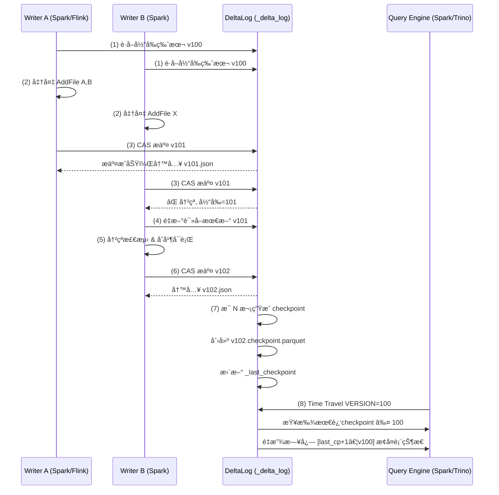
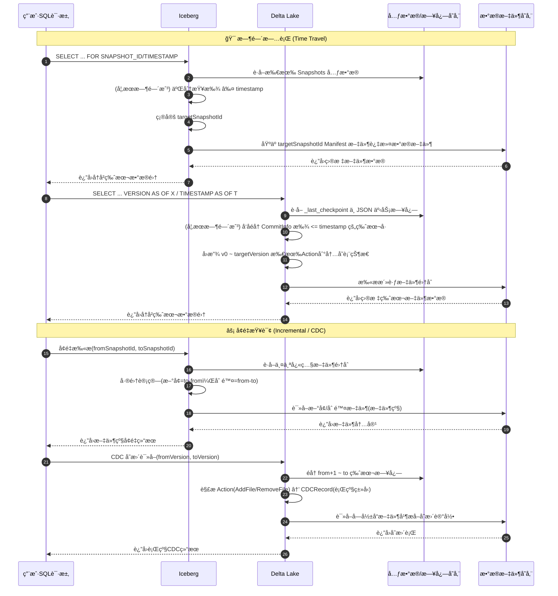

# 09/05 17:53 æ•°æ®æ¹–表解读

> Trino æ•°æ®æ¹–表格å¼æ·±åº¦è§£æ
> 解释下é¢
> ## 1. æ•°æ®æ¹–表格å¼æ¼”è¿›å†ç¨‹
>
> ### 1.1 传统数æ®æ¹–çš„å±€é™æ€§
>
> ```
> 传统Hive表格å¼çš„问题:
> ┌─────────────────────────────────────────────────────────────â”
> │ 文件级æ“作 → ç›®å½•ç»“æ„ â†’ 元数æ®å­˜å‚¨                            │
> ├─────────────────────────────────────────────────────────────┤
> │ 问题1: 缺ä¹ACIDäº‹åŠ¡æ”¯æŒ                                     │
> │ └── 并å‘写入冲çªï¼Œæ•°æ®ä¸ä¸€è‡´                                │
> │                                                           │
> │ 问题2: Schema演进困难                                       │
> │ └── 列添加/删除需è¦é‡å†™å…¨é‡æ•°æ®                              │
> │                                                           │
> │ 问题3: å°æ–‡ä»¶é—®é¢˜ä¸¥é‡                                       │
> │ └── 频ç¹å†™å…¥äº§ç”Ÿå¤§é‡å°æ–‡ä»¶ï¼Œå½±å“查询性能                      │
> │                                                           │
> │ 问题4: 缺ä¹æ—¶é—´æ—…行能力                                     │
> │ └── 无法查询å†å²ç‰ˆæœ¬æ•°æ®                                    │
> │                                                           │
> │ 问题5: 元数æ®ç®¡ç†ä½æ•ˆ                                       │
> │ └── 分区å‘ç°æ…¢ï¼Œç»Ÿè®¡ä¿¡æ¯ç»´æŠ¤æˆæœ¬é«˜                          │
> └─────────────────────────────────────────────────────────────┘
> ```
>
> ### 1.2 ç°ä»£è¡¨æ ¼å¼çš„核心创新
>
> ```java
> // ç°ä»£æ•°æ®æ¹–表格å¼çš„设计ç†å¿µ
> public abstract class ModernTableFormat {
>
>     // 核心设计åŸåˆ™
>     enum DesignPrinciple {
>         VERSIONED_METADATA,      // 版本化元数æ®
>         TRANSACTION_LOG,         // 事务日志
>         SCHEMA_EVOLUTION,        // 模å¼æ¼”è¿›
>         PARTITION_EVOLUTION,     // 分区演进
>         TIME_TRAVEL,             // 时间旅行
>         INCREMENTAL_PROCESSING,  // å¢é‡å¤„ç†
>         COMPACTION_OPTIMIZATION, // å‹ç¼©ä¼˜åŒ–
>         MULTI_ENGINE_SUPPORT     // 多引æ“支æŒ
>     }
>
>     // 表格å¼å¿…é¡»æ供的核心能力
>     public interface TableFormatCapabilities {
>         // 事务能力
>         Transaction beginTransaction();
>         void commitTransaction(Transaction tx);
>         void rollbackTransaction(Transaction tx);
>
>         // 版本管ç†
>         List<Snapshot> getSnapshots();
>         Snapshot getSnapshotAsOf(long timestampMs);
>         Snapshot getSnapshotById(long snapshotId);
>
>         // 模å¼ç®¡ç†
>         Schema getCurrentSchema();
>         Schema getSchemaAsOf(long timestampMs);
>         void evolveSchema(SchemaUpdate update);
>
>         // 分区管ç†
>         PartitionSpec getCurrentPartitionSpec();
>         void evolvePartitionSpec(PartitionSpecUpdate update);
>
>         // 文件管ç†
>         List<DataFile> getDataFiles();
>         void addDataFiles(List<DataFile> files);
>         void deleteDataFiles(List<DataFile> files);
>
>         // 优化æ“作
>         void compact(CompactionStrategy strategy);
>         void expire(ExpireStrategy strategy);
>
>         // 统计信æ¯
>         TableStatistics getStatistics();
>         void updateStatistics(TableStatistics stats);
>     }
> }
> ```
>
> ---

好å˜ï¼Œè¿™æ®µå†…容其å®æ˜¯åœ¨å¯¹ **Trino æ•°æ®æ¹–表格å¼**的演进å†ç¨‹åšä¸€ä¸ªæ·±åº¦æ¢³ç†ï¼Œä»ä¼ ç»Ÿ Hive 表格å¼çš„痛点，到ç°ä»£æ•°æ®æ¹–表格å¼ï¼ˆæ¯”如 Icebergã€Delta Lakeã€Hudi）的核心设计ç†å¿µä¸èƒ½åŠ›ã€‚我们å¯ä»¥åˆ†æˆä¸¤ä¸ªå±‚次å»ç†è§£ğŸ‘‡

---

## 1ï¸âƒ£ 传统数æ®æ¹–表格å¼çš„å±€é™æ€§

在早期数æ®æ¹–（主è¦æŒ‡ Hive on HDFS è¿™ç§æ¶æ„）中，表其å®æœ¬è´¨ä¸Šå°±æ˜¯ **å…ƒæ•°æ® + 存储文件夹**：

- 元数æ®å­˜åœ¨ **Hive Metastore（HMS）** 里，记录表 schemaã€åˆ†åŒºè·¯å¾„等信æ¯ã€‚
- æ•°æ®ä»¥ **文件**（ORC / Parquet / Text）形å¼å­˜æ”¾åœ¨ HDFS 目录结æ„中。

虽然简å•æ˜“å®ç°ï¼Œä½†**缺点é常æ˜æ˜¾**：

| 问题 | è¯´æ˜ | å½±å“ |
|------|------|------|
| âŒ ç¼ºä¹ ACID 事务 | Hive 表ä¸æ˜¯åŸç”Ÿäº‹åŠ¡è¡¨ï¼Œå¤šä¸ªå†™å…¥ä¼šå‘生冲çªï¼›insert overwrite 时如æœå¤±è´¥ï¼Œæ•°æ®å¯èƒ½ä¸ä¸€è‡´ | æ•°æ®è´¨é‡æ— æ³•ä¿è¯ï¼Œå°¤å…¶æ˜¯å¹¶å‘写入场景 |
| ⌠Schema 演进困难 | 列å¢åˆ éœ€è¦ä¿®æ”¹å…ƒæ•°æ®ï¼Œä½†åº•å±‚æ•°æ®æ–‡ä»¶ä¸å…¼å®¹è¿˜å¾—å…¨é‡é‡å†™ | 表结æ„维护困难 |
| ⌠å°æ–‡ä»¶ä¸¥é‡ | æ•°æ®å¯¼å…¥é¢‘ç¹çš„å°æ‰¹é‡äº§ç”Ÿå¤§é‡å°æ–‡ä»¶ | 查询æˆæœ¬é«˜ï¼ŒNameNode & I/O å‹åŠ›å¤§ |
| ⌠没有时间旅行（Time Travel） | 无法按å†å²ç‰ˆæœ¬å›æº¯æŸ¥è¯¢ | æ•°æ®åˆ†æ缺ä¹å¯æº¯æºæ€§ |
| ⌠元数æ®ç®¡ç†ä½æ•ˆ | 分区过多时元数æ®å‘ç°æ…¢ï¼Œç»Ÿè®¡ä¿¡æ¯æˆæœ¬é«˜ | 查询优化器难以生æˆé«˜æ•ˆè®¡åˆ’ |

💡 **直观类比**
Hive 表 = Excel 文件夹 + 文件å作为分区，缺ä¹ç‰ˆæœ¬æ§åˆ¶ & 事务管ç†
ç°ä»£è¡¨æ ¼å¼ = 带 Git ç‰ˆæœ¬ç®¡ç† + 元数æ®ç´¢å¼• + 自动åˆå¹¶ä¼˜åŒ–çš„æ•°æ®åº“

---

## 2ï¸âƒ£ ç°ä»£è¡¨æ ¼å¼çš„设计ç†å¿µ

在 Apache Iceberg / Delta Lake / Apache Hudi 等新一代数æ®æ¹–表格å¼é‡Œï¼Œæ ¸å¿ƒæ€æƒ³æ˜¯ï¼š

📌 **用事务日志（Metadata Log）管ç†æ•°æ®æ¹–文件元数æ®å’Œå˜åŒ–å†å²**
📌 **元数æ®ä¹Ÿç‰ˆæœ¬åŒ–（Versioned Metadata）**，支æŒå›æº¯ & 并å‘写入
📌 **文件管ç†è‡ªåŠ¨åŒ–**，解决å°æ–‡ä»¶ & 分区演进问题
📌 **多引æ“支æŒ**（Trinoã€Sparkã€Flinkã€Hive 等都能访问åŒä¸€ä»½è¡¨æ•°æ®ï¼‰

在你贴的 Java 示æ„代ç ä¸­ï¼š
```java
enum DesignPrinciple {
    VERSIONED_METADATA,      // 元数æ®æœ‰ç‰ˆæœ¬ï¼Œå¯è®°å½•å†å²å¿«ç…§
    TRANSACTION_LOG,         // 事务日志，支æŒåŸå­æ交/å›æ»š
    SCHEMA_EVOLUTION,        // 表结æ„å¯æ¼”进（加列ã€æ”¹åˆ—åã€ç±»å‹è½¬æ¢ï¼‰
    PARTITION_EVOLUTION,     // 分区方å¼å¯å˜ï¼ˆæ— éœ€é‡å†™å…¨é‡æ•°æ®ï¼‰
    TIME_TRAVEL,             // 支æŒæ—¶é—´æ—…行查询
    INCREMENTAL_PROCESSING,  // 支æŒå¢é‡å¤„ç†ï¼ˆåªè¯»å˜åŒ–）
    COMPACTION_OPTIMIZATION, // 自动å°æ–‡ä»¶åˆå¹¶å‹ç¼©
    MULTI_ENGINE_SUPPORT     // 支æŒå¤šè®¡ç®—引æ“读写
}
```

---

### 例å­ï¼šäº‹åŠ¡æ—¥å¿—机制
å‡è®¾å½“å‰è¡¨æ˜¯ `sales`
1. æ–°æ•°æ®å¯¼å…¥ä¼šå…ˆå†™åˆ°ä¸´æ—¶æ–‡ä»¶åŒºï¼ˆStaging）
2. 生æˆä¸€ä¸ª **Snapshot**（比如 v123），文件列表ã€Schemaã€åˆ†åŒºä¿¡æ¯éƒ½ä¼šå†™å…¥ `metadata.json`
3. **åŸå­æ交**：将 v123 加到事务日志里
4. 其他查询引æ“读å–表时就基äºæœ€æ–°çš„ Snapshot，确ä¿è¯»ä¸€è‡´æ€§

**效æœ**：
- ä¸åŒå¼•æ“（Trinoã€Spark）读到的数æ®æ˜¯ä¸€è‡´çš„
- 如æœå†™å…¥å¤±è´¥å¯ä»¥ rollback 到上一个 Snapshot

---

### Schema 演进 & 分区演进
è¿‡å» Hive 如æœè¦è°ƒæ•´åˆ†åŒºåˆ—，è¦ä¹ˆé‡æ–°å»ºè¡¨ï¼Œè¦ä¹ˆå¯¼å‡ºæ‰€æœ‰æ•°æ®é‡å†™
☑ Iceberg/Deltalake ç›´æ¥ä¿®æ”¹åˆ†åŒºç­–略，未æ¥æ–°æ•°æ®ç”¨æ–°åˆ†åŒºå­˜å‚¨ï¼Œæ—§æ•°æ®ä»å¯è®¿é—®

---

### 时间旅行（Time Travel）
例如：
```sql
SELECT * FROM sales FOR VERSION AS OF 123;
SELECT * FROM sales FOR TIMESTAMP AS OF '2024-06-10 12:00:00';
```
就能读å–ä»»æ„å†å²ç‰ˆæœ¬è¡¨çŠ¶æ€ï¼Œå®ç°æ•°æ®å¯è¿½æº¯åˆ†æ。

---

### 优化能力（Compaction）
- 定期将å°æ–‡ä»¶åˆå¹¶æˆå¤§æ–‡ä»¶ï¼Œå‡å°‘ NameNode å‹åŠ› & æ高扫æ速度
- 过期 Snapshot 删除无效文件，节çœå­˜å‚¨

---

## 3ï¸âƒ£ 在 Trino 里的体ç°

Trino 本身是一个 **计算引æ“**，ä¸å­˜å‚¨æ•°æ®ã€‚而这些ç°ä»£è¡¨æ ¼å¼è®© Trino：
- 能åƒæŸ¥è¯¢æ•°æ®åº“一样直æ¥åœ¨æ•°æ®æ¹–é‡Œåš ACID 查询
- å¯ä»¥ `SELECT ... WHERE version_id = ...`
- Schema å˜æ›´æ— éœ€é‡å»ºåˆ†åŒºç›®å½•
- 多引æ“（Flink 写入ã€Trino 查询）无ç¼å¯¹æ¥

---

## 4ï¸âƒ£ 总结对比

| 特性 | 传统 Hive 表 | Iceberg / Delta / Hudi |
|------|-------------|------------------------|
| ACID 事务 | ⌠| ✅ |
| Schema 演进 | éƒ¨åˆ†æ”¯æŒ | ✅ 完整支æŒï¼ˆå‘å‰/å‘å兼容） |
| 分区演进 | ⌠| ✅ |
| 时间旅行 | ⌠| ✅ |
| å°æ–‡ä»¶ç®¡ç† | ⌠| ✅（åˆå¹¶å‹ç¼©ï¼‰ |
| 元数æ®ç®¡ç† | Hive Metastore | 自带事务日志，外加 HMS å¯é€‰ |
| å¤šå¼•æ“ | ä»…å…¼å®¹æ”¯æŒ | åŒæ—¶æ”¯æŒ Spark / Flink / Trino / Hive |

---

如æœä½ æ„¿æ„çš„è¯ï¼Œæˆ‘å¯ä»¥å¸®ä½ ç”»ä¸€å¼  **[Trino æ•°æ®æ¹–表格å¼æ¼”进图]**，用æµç¨‹è§†è§’把 Hive → Iceberg/Delta/Hudi 的演化过程和核心组件一次性梳ç†å‡ºæ¥ğŸ“Šï¼Œè¿™æ ·ä½ å°±èƒ½ä¸€çœ¼çœ‹æ‡‚它们的差别。

ä½ è¦æˆ‘帮你画这张图å—？🤓

-----

> 画这张图æµç¨‹è§†è§’把 Hive → Iceberg/Delta/Hudi 的演化过程和核心组件一次性梳ç†å‡ºæ¥

好å˜ï½é‚£æˆ‘æ¥å¸®ä½ ç”»ä¸€å¼ **æµç¨‹/æ¶æ„视角**的对比图，把 Hive → Iceberg / Delta Lake / Hudi è¿™ç§æ¼”进路线和核心组件一å£æ°”梳ç†æ¸…楚 📊

我会分æˆä¸¤ä¸ªéƒ¨åˆ†ï¼š
1. **演进æµç¨‹å›¾**（时间维度看å˜åŒ–）
2. **核心组件对比图**（æ¶æ„维度看差异）

---

## **1ï¸âƒ£ æ•°æ®æ¹–表格å¼æ¼”è¿›æµç¨‹å›¾ï¼ˆæ—¶é—´ + 能力）**

```
传统数æ®æ¹–(Hive on HDFS)                →        ç°ä»£è¡¨æ ¼å¼(Iceberg / Delta / Hudi)
──────────────────────────────────────          ─────────────────────────────────────────────
[æ•°æ®æ–‡ä»¶ + 目录结æ„]                             [æ•°æ®æ–‡ä»¶ + 事务日志 + 版本化元数æ®]
       │                                                     │
       │                                                     │
       â–¼                                                     â–¼
┌─────────────┠                                      ┌─────────────────────â”
│ 存储: HDFS   │                                       │ 存储: HDFS/S3/GCS等 │
│ æ ¼å¼: ORC    │                                       │ æ ¼å¼: Parquet/ORC   │
│ 分区: 目录   │                                       │ 分区: PartitionSpec │
└─────────────┘                                       └─────────────────────┘
       │                                                     │
       │                                                     │
       â–¼                                                     â–¼
┌─────────────┠ 无事务ACID  ┌────────────────────────┠   有ACID
│ Hive Metastore│──────────▶ │ 事务日志(TransactionLog) │
│ 元数æ®: 分区信æ¯â”‚          │ 记录快照(Snapshot)       │
└─────────────┘             └────────────────────────┘
       │                                                     │
       │ Schemaå˜æ›´å›°éš¾                                       │ Schemaå¯æ¼”è¿›
       └────────────────────────▶ 支æŒåˆ—å¢åˆ æ”¹
       │                                                     │
       │ 无时间旅行                                           │ 时间旅行(Time Travel)
       └────────────────────────▶ å†å²ç‰ˆæœ¬æŸ¥è¯¢
       │                                                     │
       │ 查询慢                                               │ 快速元数æ®ç´¢å¼• + å°æ–‡ä»¶åˆå¹¶
       └────────────────────────▶ 查询优化
```

💡 å¯ä»¥çœ‹åˆ°æ ¸å¿ƒåŒºåˆ«æ˜¯ï¼š
- **Hive** 借助 HMS ä¿å­˜å…ƒæ•°æ®ï¼Œæ•°æ®å’Œå…ƒæ•°æ®çš„åŒæ­¥ä¸€è‡´æ€§å…¨é äººä¸ºç»´æŠ¤
- **ç°ä»£è¡¨æ ¼å¼** 引入 **事务日志(类似Git) + Snapshot版本化**，ä¿è¯å¤šå¼•æ“一致性 + å¯å›æº¯

---

## **2ï¸âƒ£ 核心组件对比表**

| 能力/组件                   | Hive è¡¨æ ¼å¼          | Iceberg                     | Delta Lake                  | Apache Hudi                 |
|-----------------------------|----------------------|------------------------------|------------------------------|------------------------------|
| **元数æ®å­˜å‚¨**              | Hive Metastore (HMS) | ä¸HMSå¯é›†æˆ / 自维护         | 事务日志JSON                 | Timeline + Commit metadata   |
| **事务管ç†**                | æ—                    | ACID Snapshot                | ACID Snapshot                | MVCC(多版本并å‘æ§åˆ¶)         |
| **版本化快照**              | ⌠                  | ✅                           | ✅                           | ✅（基äºcommit timeline）    |
| **Schema 演进**              | 有é™ï¼ˆALTER TABLE）  | 完全支æŒï¼ŒåŠ åˆ—/删列无é‡å†™     | å®Œå…¨æ”¯æŒ                     | å®Œå…¨æ”¯æŒ                     |
| **分区演进**                 | æ—                    | ✅                           | ✅                           | ⌠(部分支æŒ)                |
| **时间旅行**                 | 无                   | ✅ `AS OF VERSION/TIMESTAMP` | ✅                           | ✅                           |
| **å°æ–‡ä»¶å¤„ç†**               | æ—                    | ✅自动åˆå¹¶                    | ✅自动åˆå¹¶                    | âœ…è‡ªåŠ¨æ¸…ç† + åˆå¹¶            |
| **å¢é‡è¯»å–**                 | æ—                    | ✅ (æŸäº›API支æŒ)             | ✅                           | ✅（专注å¢é‡æ¶ˆè´¹ï¼‰           |
| **多引æ“支æŒ**               | Spark/Hive           | Spark / Flink / Trino / Hive | Spark / Trino                | Spark / Flink / Trino / Hive |

---

## **3ï¸âƒ£ æ¶æ„图（Hive vs Iceberg 对比）**

```
┌─────────────────────────────────────┠           ┌─────────────────────────────────────â”
│             Hive æ¶æ„               │            │         ç°ä»£è¡¨æ ¼å¼ï¼ˆIceberg）        │
├─────────────────────────────────────┤            ├─────────────────────────────────────┤
│ Query Engine: Hive / Trino / Spark  │            │ Query Engine: Trino / Spark / Flink │
│   │                                 │            │   │                                 │
│   ▼                                 │            │   ▼                                 │
│ Hive Metastore (HMS)                │            │ Iceberg Catalog (支æŒHMS/自维护)   │
│   │  (分区路径/Schema)              │            │   │                                 │
│   ▼                                 │            │   ▼                                 │
│ HDFS (Parquet/ORC 分区目录)          │            │ æ•°æ®æ–‡ä»¶(Data Files)               │
│                                     │            │ 事务日志(Transaction Log) + å…ƒæ•°æ® â”‚
└─────────────────────────────────────┘            └─────────────────────────────────────┘
```

---

### 📌 关键知识点总结
1. **Hive表 = 目录+HMS元数æ®**，无事务ACID，没有版本æ§åˆ¶
2. **ç°ä»£è¡¨æ ¼å¼ = æ•°æ®æ–‡ä»¶ + 事务日志 + 元数æ®ç‰ˆæœ¬åŒ–**ï¼Œåƒ Git 管数æ®æ¹–文件
3. Trino å¯ç›´æ¥åŸºäºè¿™äº›è¡¨åš SQL 查询+å†å²å›æº¯
4. Iceberg/Delta/Hudi 在 ACIDã€å¤šå¼•æ“兼容ã€Schema/分区演进ã€Time Travelã€æ€§èƒ½ä¼˜åŒ–等维度大幅超越 Hive æ ¼å¼
5. å¯¹äº **多引æ“场景（Flink写，Trino查）** æ¨è Iceberg / Delta Lake

---

我建议你如æœå续在 Trino 中åšè½åœ°ï¼Œå¯ä»¥ç”¨ **Iceberg** 作为表格å¼ï¼Œç„¶å：
- å¼€å¯ **事务日志存储在对象存储**（S3ã€OSS 等）
- ç»“åˆ **Trino Catalog** ç›´æ¥æŸ¥è¯¢
- 用 Flink / Spark æ¥å†™ï¼Œä¿è¯ ACID

---

🤓 ä½ è¦ä¸è¦æˆ‘帮你画一个**Git类比的事务日志工作æµå›¾**，直观展示 “数æ®æ¹–=æ•°æ®åº“+Git版本æ§åˆ¶â€ çš„ç†è§£ï¼Ÿè¿™æ ·ä»¥å讲解给别人时会é常形象。

-----

> 解释下é¢å…³äº Iceberg
> ## 2. Apache Icebergæ¶æ„深度解æ
>
> ### 2.1 Iceberg元数æ®æ¶æ„
>
> ```
> Iceberg表的三层元数æ®ç»“æ„:
>
>                     Table Metadata
>                          │
>         ┌────────────────┼────────────────â”
>         │                │                │
>    Manifests List   Manifests List   Manifests List
>      (Snapshot 1)    (Snapshot 2)    (Snapshot N)
>         │                │                │
>    ┌────┼────┠     ┌────┼────┠     ┌────┼────â”
>    │    │    │      │    │    │      │    │    │
> Manifest Manifest Manifest Manifest Manifest Manifest
> File-1   File-2   File-3   File-4   File-5   File-6
>    │      │        │        │        │        │
>    │      │        │        │        │        │
> Data   Data    Data     Data     Data     Data
> Files  Files   Files    Files    Files    Files
> ```
>
> #### Table Metadata结æ„详解
>
> ```java
> // Iceberg表元数æ®çš„完整结æ„
> public class TableMetadata {
>     private final int formatVersion;           // æ ¼å¼ç‰ˆæœ¬
>     private final String tableUuid;            // 表唯一标识
>     private final String location;             // 表根路径
>     private final long lastUpdatedMillis;      // 最å更新时间
>     private final int lastColumnId;            // 最大列ID
>     private final Schema schema;               // 当å‰æ¨¡å¼
>     private final PartitionSpec defaultSpec;   // 默认分区规格
>     private final List<PartitionSpec> specs;   // å†å²åˆ†åŒºè§„æ ¼
>     private final Map<String, String> properties; // 表å±æ€§
>     private final long currentSnapshotId;      // 当å‰å¿«ç…§ID
>     private final List<Snapshot> snapshots;    // 快照列表
>     private final List<MetadataLogEntry> metadataLog; // 元数æ®å˜æ›´å†å²
>
>     // 快照详细信æ¯
>     public static class Snapshot {
>         private final long snapshotId;         // å¿«ç…§ID
>         private final Long parentId;           // 父快照ID
>         private final long timestampMillis;    // 快照时间戳
>         private final String operation;        // æ“作类å‹(append/replace/delete)
>         private final Map<String, String> summary; // 摘è¦ä¿¡æ¯
>         private final String manifestList;     // Manifest列表文件路径
>
>         // è·å–快照中的所有数æ®æ–‡ä»¶
>         public List<ManifestFile> getAllManifests(FileIO io) {
>             return ManifestLists.read(io.newInputFile(manifestList));
>         }
>     }
>
>     // 模å¼æ¼”è¿›å†å²
>     public static class Schema {
>         private final List<Types.NestedField> columns; // 列定义
>         private final Map<Integer, String> aliasToId;   // 列å映射
>         private final int schemaId;                     // 模å¼ID
>
>         // 模å¼å…¼å®¹æ€§æ£€æŸ¥
>         public boolean isCompatibleWith(Schema other) {
>             return SchemaCompatibility.checkCompatibility(this, other);
>         }
>     }
> }
> ```
>
> ### 2.2 Manifest文件结æ„
>
> ```java
> // Manifest文件是Iceberg的核心索引结æ„
> public class ManifestFile {
>
>     // Manifest文件头信æ¯
>     public static class ManifestHeader {
>         private final String path;             // 文件路径
>         private final long length;             // 文件大å°
>         private final int specId;              // 分区规格ID
>         private final SequenceNumber minSequenceNumber; // 最å°åºåˆ—å·
>         private final SequenceNumber maxSequenceNumber; // 最大åºåˆ—å·
>         private final Long snapshotId;         // å…³è”å¿«ç…§ID
>         private final Integer addedFilesCount; // æ–°å¢æ–‡ä»¶æ•°
>         private final Integer existingFilesCount; // 已存在文件数
>         private final Integer deletedFilesCount; // 删除文件数
>         private final List<FieldSummary> partitions; // 分区统计
>
>         // 分区级别的统计信æ¯
>         public static class FieldSummary {
>             private final boolean containsNull;    // 是å¦åŒ…å«NULL
>             private final boolean containsNaN;     // 是å¦åŒ…å«NaN
>             private final ByteBuffer lowerBound;   // 最å°å€¼
>             private final ByteBuffer upperBound;   // 最大值
>         }
>     }
>
>     // Manifestæ¡ç›® - æè¿°å•ä¸ªæ•°æ®æ–‡ä»¶çš„元数æ®
>     public static class ManifestEntry {
>         private final Status status;           // 文件状æ€: EXISTING/ADDED/DELETED
>         private final Long snapshotId;         // å¿«ç…§ID
>         private final DataFile dataFile;       // æ•°æ®æ–‡ä»¶ä¿¡æ¯
>
>         // æ•°æ®æ–‡ä»¶çš„详细信æ¯
>         public static class DataFile {
>             private final String path;          // 文件路径
>             private final FileFormat format;    // 文件格å¼(PARQUET/ORC/AVRO)
>             private final StructLike partition; // 分区值
>             private final long recordCount;     // 记录数
>             private final long fileSizeInBytes; // 文件大å°
>             private final Map<Integer, ByteBuffer> columnSizes; // 列大å°
>             private final Map<Integer, Long> valueCounts;       // 值计数
>             private final Map<Integer, Long> nullValueCounts;   // 空值计数
>             private final Map<Integer, Long> nanValueCounts;    // NaN计数
>             private final Map<Integer, ByteBuffer> lowerBounds; // 列最å°å€¼
>             private final Map<Integer, ByteBuffer> upperBounds; // 列最大值
>             private final ByteBuffer keyMetadata;               // 加密密钥
>             private final List<Integer> splitOffsets;           // 分割å移é‡
>         }
>     }
> }
> ```
>
> ### 2.3 Iceberg事务å®ç°æœºåˆ¶
>
> ```java
> // Icebergçš„ä¹è§‚并å‘æ§åˆ¶äº‹åŠ¡å®ç°
> public class IcebergTransaction {
>
>     private final Table table;
>     private final List<PendingUpdate> pendingUpdates = new ArrayList<>();
>     private TableMetadata baseMetadata;
>     private TableMetadata currentMetadata;
>
>     // 事务的基本æ“作类å‹
>     public enum OperationType {
>         APPEND_FILES,       // 追加文件
>         REPLACE_FILES,      // 替æ¢æ–‡ä»¶
>         DELETE_FILES,       // 删除文件
>         UPDATE_SCHEMA,      // 更新模å¼
>         UPDATE_PARTITION_SPEC, // 更新分区规格
>         UPDATE_PROPERTIES   // æ›´æ–°å±æ€§
>     }
>
>     // 追加数æ®æ–‡ä»¶çš„å®ç°
>     public AppendFiles newAppend() {
>         return new BaseAppendFiles(this) {
>             @Override
>             public void commit() {
>                 // 1. 验è¯å¹¶å‘冲çª
>                 validateNoConcurrentUpdates();
>
>                 // 2. 创建新的Manifest文件
>                 ManifestFile newManifest = createNewManifest();
>
>                 // 3. 创建新的快照
>                 Snapshot newSnapshot = createSnapshot(
>                     OperationType.APPEND_FILES,
>                     Arrays.asList(newManifest)
>                 );
>
>                 // 4. 更新表元数æ®
>                 TableMetadata updatedMetadata = currentMetadata
>                     .withSnapshot(newSnapshot)
>                     .withCurrentSnapshotId(newSnapshot.snapshotId());
>
>                 // 5. åŸå­æ€§æ交
>                 commitTransaction(updatedMetadata);
>             }
>
>             private ManifestFile createNewManifest() {
>                 ManifestWriter writer = createManifestWriter();
>
>                 for (DataFile file : filesToAdd) {
>                     writer.add(ManifestEntry.builder()
>                         .status(ManifestEntry.Status.ADDED)
>                         .dataFile(file)
>                         .build());
>                 }
>
>                 return writer.close();
>             }
>         };
>     }
>
>     // 并å‘冲çªæ£€æµ‹
>     private void validateNoConcurrentUpdates() {
>         TableMetadata currentRemoteMetadata = table.refresh();
>
>         if (currentRemoteMetadata.lastUpdatedMillis() > baseMetadata.lastUpdatedMillis()) {
>             // 检查是å¦æœ‰å†²çªçš„æ›´æ–°
>             ConflictDetection.validateNoConflicts(
>                 baseMetadata,
>                 currentRemoteMetadata,
>                 pendingUpdates
>             );
>         }
>     }
>
>     // åŸå­æ€§æ交å®ç°
>     private void commitTransaction(TableMetadata newMetadata) {
>         // 1. 写入新的元数æ®æ–‡ä»¶
>         String newMetadataPath = createMetadataFile(newMetadata);
>
>         // 2. 使用æ¡ä»¶æ›´æ–°ç¡®ä¿åŸå­æ€§
>         boolean success = table.io().atomicUpdate(
>             table.metadataFileLocation(),
>             baseMetadata.metadataFileLocation(), // 期望的当å‰ç‰ˆæœ¬
>             newMetadataPath                       // 新版本
>         );
>
>         if (!success) {
>             throw new CommitFailedException("Concurrent update detected");
>         }
>
>         // 3. 更新本地状æ€
>         this.currentMetadata = newMetadata;
>     }
> }
> ```
>
> ---

好，这一段其å®æ˜¯ **Apache Iceberg æ¶æ„的核心精髓** 了 🤓
æˆ‘å¸®ä½ æŠŠå®ƒæ‹†æˆ **三个层次æ¥è§£é‡Š**：

1. **元数æ®ä¸‰å±‚结æ„**（Table Metadata → Manifest List → Manifest File → Data File）
2. **Manifest 文件细节**（元数æ®ç´¢å¼•ï¼‰
3. **事务机制å®ç°åŸç†**（ä¹è§‚å¹¶å‘ + åŸå­æ交）

---

## **1ï¸âƒ£ Iceberg 元数æ®ä¸‰å±‚æ¶æ„**

🔠逻辑图（å¯ä»¥æƒ³æˆä¸€ä¸ªâ€œGit仓库â€å­˜ä»£ç ï¼‰

```
TableMetadata   （表级别元信æ¯ï¼Œåƒ Git 仓库根的 .git/config）
     │
     ├── Snapshot（æ¯ä¸ªç‰ˆæœ¬çš„å¿«ç…§ï¼Œåƒ Git commit）
     │       │
     │       └── Manifest List（快照对应的索引文件列表）
     │                    │
     │                    └── Manifest File（详细列出数æ®æ–‡ä»¶ï¼Œåƒ Git tree）
     │                                  │
     │                                  └── Data File（真正的 Parquet/ORC æ•°æ®ï¼‰
```

### **1. Table Metadata 结æ„**
包å«ï¼š
- 表的唯一 ID（`tableUuid`）
- å½“å‰ Schema & å†å² Schema（`schema`, `specs`）
- 当å‰åˆ†åŒºè§„格（`defaultSpec` + 版本å†å²ï¼‰
- 当å‰å¿«ç…§ ID （`currentSnapshotId`）
- 所有快照å†å²åˆ—表（`snapshots`）
- 元数æ®æ›´æ–°å†å²ï¼ˆ`metadataLog`）

📌 **é‡è¦ç‚¹**：
- æ¯ä¸€æ¬¡æ交数æ®ï¼ˆappend/delete/replace schema change）会生æˆ**一个新的 Snapshot**，Snapshot 指å‘一个 `Manifest List` 文件。
- **元数æ®æ–‡ä»¶ä¹Ÿæ˜¯ä¸å¯å˜çš„**，新版本生æˆä¸€ä¸ªæ–°çš„ JSON 元数æ®æ–‡ä»¶ï¼Œè¡¨è·¯å¾„çš„ **metadata.json** åªæ˜¯ä¸€ä¸ªæŒ‡é’ˆæ–‡ä»¶ï¼ŒæŒ‡å‘最新版本。

---

### **2. Snapshot & Manifest List**
一个 **Snapshot** 表示表在æŸä¸€ä¸ªæ—¶åˆ»çš„完全状æ€ï¼ˆå¯ç”¨æ¥åš Time Travel）：
- `snapshotId`：快照 ID（全局唯一）
- `parentId`：父快照 ID（形æˆç‰ˆæœ¬é“¾ï¼‰
- `operation`：æ“作类å‹ï¼ˆè¿½åŠ  / æ›¿æ¢ / 删除）
- `manifestList`：索引所有 manifest 文件的文件路径

一个 Snapshot 对应一个 **Manifest List**（Iceberg v2 里一般是一个å•ç‹¬ .avro 文件），里é¢ä¿å­˜äº†å¤šä¸ª Manifest File 的路径，这些 Manifest File 中æ¯ä¸€ä¸ªè®°å½•äº†æ•°æ®æ–‡ä»¶çš„元数æ®ã€‚

---

## **2ï¸âƒ£ Manifest 文件结æ„**

💡 **Manifest 文件**是 **Iceberg 高效元数æ®æ£€ç´¢**的核心结æ„，相当äºâ€œæ•°æ®ç´¢å¼•æ–‡ä»¶â€
âš¡ 好处：查询时å¯ä»¥ç›´æ¥ç”¨ Manifest 中的列值范围ã€åˆ†åŒºåˆ—统计等信æ¯æ¥ **跳过ä¸ç›¸å…³æ–‡ä»¶**（Predicate Pushdown）。

### **Manifest File 包å«ä¸¤å—ä¿¡æ¯ï¼š**
1. **Manifest Header**（文件级别元数æ®ï¼‰
    - `path`：该 Manifest File 自己的ä½ç½®
    - 分区规格ID (`specId`)
    - **最å°/最大 sequence number** （决定版本范围）
    - 相关 `snapshotId`（对应哪个快照生æˆçš„）
    - å„分区值的统计信æ¯ï¼ˆ`lowerBound/upperBound`ã€`containsNull/NaN`）

2. **Manifest Entry**（记录æŸä¸ªæ•°æ®æ–‡ä»¶çš„元数æ®ï¼‰
    - `status`：Added / Existing / Deleted
    - `dataFile`：数æ®æ–‡ä»¶çš„详细结æ„，包括：
        - 文件路径
        - æ ¼å¼ï¼ˆParquet / ORC / Avro）
        - 行数 / 文件大å°
        - 列级别统计（列最å°å€¼ã€æœ€å¤§å€¼ã€null数…）
        - 分区值

📌 **查询加速åŸç†**
当 Trino / Spark è¯»å– Iceberg 表时，它会：
1. 先加载 Manifest List（找到所有 Manifest File 路径）
2. è¯»å– Manifest File çš„ Header + 分区统计
3. ç»“åˆ SQL 里的 WHERE æ¡ä»¶ï¼Œç›´æ¥è·³è¿‡ä¸ç›¸å…³çš„æ•°æ®æ–‡ä»¶
🯠这样é¿å…了扫æ整个 HDFS/S3，æ大æå‡æ€§èƒ½ï¼ˆå°¤å…¶æ˜¯åœ¨ S3 场景）。

---

## **3ï¸âƒ£ Iceberg 事务机制（ä¹è§‚并å‘æ§åˆ¶ï¼‰**

📠核心æ€æƒ³ï¼š
- **写入端ä¸ä¼šåŠ å…¨å±€é”**ï¼ˆå³ "Optimistic Concurrency Control"）
- æ交时验è¯å½“å‰è¡¨çš„元数æ®ç‰ˆæœ¬æ˜¯å¦å’Œå¼€å§‹äº‹åŠ¡æ—¶ä¸€è‡´ï¼Œå¦‚æœä¸ä¸€è‡´åˆ™åˆ¤æ–­æ˜¯å¦æœ‰å†²çªï¼Œå¦åˆ™æŠ¥é”™é‡è¯•

### **事务主è¦æµç¨‹ï¼ˆä»¥ AppendFiles 为例）**

1. **开始事务**
   ```java
   baseMetadata = table.currentMetadata();
   currentMetadata = baseMetadata;
   ```

2. **准备更新**
   - 收集新å¢æ•°æ®æ–‡ä»¶ï¼Œå†™å…¥ä¸€ä¸ªæ–°çš„ ManifestFile
   - æ„建新的 Snapshot，指å‘这个 ManifestFile

3. **并å‘冲çªæ£€æµ‹**
   ```java
   if remote.lastUpdated > base.lastUpdated:
       检查是å¦ä¿®æ”¹äº†ç›¸åŒæ–‡ä»¶/Schema -> 冲çª
   ```

4. **åŸå­æ交**
   - 将新的 TableMetadata（包å«è¿™ä¸ªæ–° Snapshot）写æˆæ–°çš„ metadata.json
   - 用 **CAS æ¡ä»¶æ›´æ–°**（Compare-And-Swap）åŸå­æ›¿æ¢å…ƒæ•°æ®æŒ‡é’ˆï¼š
     ```java
     success = io.atomicUpdate(
         currentMetadataPointer,
         oldMetadataFilePath,    // 期望值
         newMetadataFilePath     // 新值
     )
     if !success:
         throw CommitFailedException
     ```

5. **更新客户端内存状æ€**

---

## **4ï¸âƒ£ 总结整体数æ®æµ**

🔄 **æ交数æ®æµç¨‹**（Append 举例）

```
1. 写新数æ®æ–‡ä»¶åˆ° Data File 目录（Parquet/ORC）
2. 生æˆæ–°çš„ Manifest File（记录这些新数æ®æ–‡ä»¶çš„元信æ¯ï¼‰
3. 创建新的 Snapshotï¼ˆæŒ‡å‘ Manifest List -> Manifest File）
4. æ›´æ–° Table Metadata（生æˆæ–° metadata.json）
5. åŸå­æ›¿æ¢æŒ‡é’ˆæ–‡ä»¶ï¼Œç¡®ä¿å¤šå®¢æˆ·ç«¯ä¸€è‡´
```

🔠**查询数æ®æµç¨‹**
```
1. 读å–最新的 Table Metadata（metadata.json）
2. æ ¹æ® currentSnapshotId 拿到对应 Manifest List
3. 按需加载 Manifest File
4. æ ¹æ®åˆ†åŒºç»Ÿè®¡ & 列统计åšæ–‡ä»¶çº§åˆ«è¿‡æ»¤
5. åªæ‰«æ匹é…æ¡ä»¶çš„æ•°æ®æ–‡ä»¶
```

---

💡 **核心优势**：
- 事务åŸå­æ€§ + 多版本管ç†
- 高效元数æ®ç´¢å¼•ï¼ˆé¿å…全表扫æ）
- 分区演进 & Schema 演进ä¸ç ´åå†å²æ•°æ®
- æ”¯æŒ Time Travel & Incremental Read
- 对象存储å‹å¥½ï¼ˆS3/OSS/ABFS）

---

我给你画一个超清的 **Iceberg 元数æ®ä¸‰å±‚结æ„图** 📊 æ¥å¸®ä½ è®°å¿†ï¼š

```
┌───────────────────────────────────────────────────────â”
│                 Table Metadata (JSON)                 │
│ schema, partitionSpec, snapshots[], properties...     │
│ currentSnapshotId ──────┠                             │
└─────────────────────────┼─────────────────────────────┘
                          │
                   ┌──────▼───────────────────────────────────â”
                   │ Snapshot                                  │
                   │ snapshotId, operation, manifestList path  │
                   └──────────────────────┬────────────────────┘
                                          │
                      ┌───────────────────▼────────────────────â”
                      │ Manifest List (Avro)                    │
                      │ 列出当å‰å¿«ç…§å¯¹åº”çš„ Manifest File 列表    │
                      └───────────────────┬────────────────────┘
                                          │
                   ┌──────────────────────▼───────────────────────â”
                   │ Manifest File (Avro)                          │
                   │ 文件头+æ¯ä¸ªDataFile的列/分区统计+çŠ¶æ€          │
                   └──────────────────────┬───────────────────────┘
                                          │
             ┌────────────────────────────▼─────────────────────────â”
             │ Data File (Parquet / ORC / Avro)                       │
             │ 真正存储数æ®è®°å½•                                       │
             └──────────────────────────────────────────────────────┘
```

---

我建议下一步我å¯ä»¥å¸®ä½ ç”»ä¸€ä¸ª **“Iceberg事务执行时åºå›¾â€**，这样你会清楚ç†è§£å®ƒæ˜¯æ€ä¹ˆ**åŸå­æ交**的，尤其是为什么它能åšåˆ°å¤šå¼•æ“并å‘写入而ä¸æŸåæ•°æ® ğŸ™Œ
ä½ è¦æˆ‘画这张事务时åºå›¾å—？这样看完你就能完全æŒæ¡ Iceberg 的并å‘安全åŸç†äº† 💡

-----

> 画一个 “Iceberg事务执行时åºå›¾â€

好å˜~ 既然你想看 **"Iceberg 事务执行时åºå›¾"**，我就给你画一个详细的 **ä¹è§‚并å‘æ§åˆ¶ï¼ˆOptimistic Concurrency Control）** çš„æ—¶åºå›¾ï¼Œè®©ä½ ä¸€çœ¼çœ‹æ‡‚ Iceberg æ€ä¹ˆä¿è¯å¤šå¼•æ“并å‘写入ä¾ç„¶ ACID ✅

---

# **📌 Iceberg 事务执行时åºå›¾**

💡 å‡è®¾åœºæ™¯ï¼š
- 有两个客户端（Writer A & Writer B）
- 都è¿æ¥åˆ°åŒä¸€å¼  Iceberg 表
- 存储在对象存储（S3/OSS/HDFS）中
- 事务类å‹ï¼šè¿½åŠ æ–‡ä»¶ï¼ˆ`AppendFiles`）
- 并å‘æ交时用 **Compare-And-Swap（CAS）** å®ç°åŸå­æ€§ï¼Œå†²çªåˆ™é‡è¯•

---

## **1ï¸âƒ£ æ—¶åºæµç¨‹å›¾**

```text
 ┌────────────────────┠     ┌──────────────────┠    ┌────────────────────────â”
 │   Writer A (Flink) │      │ Writer B (Spark) │     │  Object Store (S3/HDFS) │
 └─────────┬──────────┘      └───────┬──────────┘     └────────────┬───────────┘
           │                           │                           │
           │ â‘  读å–å½“å‰ Table Metadata │                           │
           │──────────────────────────>│                           │
           │                            │                           │
           │        {metadata v10}      │                           │
           │<────────────────────────── │                           │
           │                           │ â‘  读å–å½“å‰ Table Metadata │
           │                           │──────────────────────────>│
           │                           │        {metadata v10}     │
           │                           │<────────────────────────── │
           │                           │                           │
           │ ② 写入 Data Files         │                           │
           │──────────────────────────────────────────────────────>│
           │                           │                           │
           │ ③ 创建 Manifest File      │                           │
           │ (记录新å¢æ•°æ®æ–‡ä»¶ç´¢å¼•)     │                           │
           │──────────────────────────────────────────────────────>│
           │                           │                           │
           │ ④ 创建 Snapshot v11       │                           │
           │ (æŒ‡å‘ Manifest List)      │                           │
           │──────────────────────────────────────────────────────>│
           │                           │                           │
           │ ⑤ CASåŸå­æ交 metadata v11│                           │
           │ metadata.json: v10→v11    │                           │
           │ (Compare base= v10)       │                           │
           │──────────────────────────────────────────────────────>│
           │                           │                           │
           │             æ交æˆåŠŸ       │                           │
           │<────────────────────────────────────────────────────── │
           │                           │                           │
           │                           │ ② 写入 Data Files         │
           │                           │──────────────────────────>│
           │                           │                           │
           │                           │ ③ 创建 Manifest File      │
           │                           │──────────────────────────>│
           │                           │                           │
           │                           │ ④ 创建 Snapshot v11       │
           │                           │──────────────────────────>│
           │                           │                           │
           │                           │ ⑤ CASåŸå­æ交 metadata    │
           │                           │ metadata.json: v10→v11    │
           │                           │──────────────────────────>│
           │                           │   ⌠失败：当å‰å·²æ˜¯ v11    │
           │                           │<────────────────────────── │
           │                           │                           │
           │                           │ 🔄 â‘¥ é‡æ–°è¯»å–最新 metadata │
           │                           │──────────────────────────>│
           │                           │    {metadata v11}         │
           │                           │<────────────────────────── │
           │                           │ é‡æ–°æ„建 Snapshot v12 并é‡è¯•CAS
```

---

## **2ï¸âƒ£ 事务关键步骤解æ**

1. **读å–当å‰å…ƒæ•°æ®ï¼ˆBase Metadata）**
   两个客户端都读到 `metadata v10` 作为起始版本。

2. **生æˆæ–°æ•°æ®æ–‡ä»¶ï¼ˆData Files）**
   å„自往 S3/HDFS 写 Parquet/ORC 文件，还没å˜æ›´å…ƒæ•°æ®ã€‚

3. **写 Manifest Files**
   ä¸ºæ–°å¢ Data File 创建 Manifest File（列出文件路径ã€åˆ†åŒºå€¼ã€åˆ—统计等）。

4. **创建新快照（Snapshot）**
   快照记录 Manifest List 的路径，形æˆä¸€ä¸ªèƒ½å®Œå…¨å›æº¯çš„版本。

5. **åŸå­æ交（CAS 更新元数æ®ï¼‰**
   - 元数æ®æŒ‡é’ˆæ–‡ä»¶ï¼ˆ`metadata.json`）是唯一的写入点
   - CAS（Compare-And-Set）检查当å‰ç‰ˆæœ¬æ˜¯å¦ä»æ˜¯ `v10`
   - A æˆåŠŸæ›´æ–°åˆ° `v11`
   - B å› ç‰ˆæœ¬å†²çª CAS 失败（期望 `v10` 但å®é™…已是 `v11`）

6. **冲çªæ£€æµ‹ + é‡è¯•æœºåˆ¶**
   - B 读å–æœ€æ–°å…ƒæ•°æ® `v11`
   - 检查自己的更改是å¦ä¸ v11 冲çªï¼ˆä¾‹å¦‚是å¦ä¿®æ”¹äº†ç›¸åŒæ–‡ä»¶/Schema）
   - 如æœæ²¡å†²çªåˆ™ç”Ÿæˆæ–°çš„ Snapshot（v12ï¼‰å† CAS æ交
   - 如æœæœ‰å†²çªåˆ™æ”¾å¼ƒæˆ–由业务端决定å›é€€/åˆå¹¶

---

## **3ï¸âƒ£ 事务æ交的三大ä¿è¯**

1. **åŸå­æ€§**
   元数æ®æŒ‡é’ˆæ–‡ä»¶æ›´æ–°æ˜¯å•æ“作，è¦ä¹ˆå…¨éƒ¨æˆåŠŸï¼Œè¦ä¹ˆä¸æ”¹åŠ¨ã€‚

2. **一致性**
   Snapshot 完整记录表状æ€ï¼Œè¯»å†™æ°¸è¿œåŸºäºæŸä¸ªç¡®å®šç‰ˆæœ¬ã€‚

3. **并å‘安全**
   采用ä¹è§‚é”（OCC）+ CAS，é¿å…加全局é”造æˆæ€§èƒ½ç“¶é¢ˆã€‚

---

## **4ï¸âƒ£ æ—¶åºå›¾æ ¸å¿ƒç‚¹æ€»ç»“**
- Iceberg **ä¸é”定表**，而是通过 **版本比较 + é‡è¯•** å®ç°å¹¶å‘安全
- 主è¦å†²çªæ¥æºï¼š
  - Schema åŒæ—¶å˜æ›´
  - 相åŒæ–‡ä»¶é‡å¤åˆ é™¤/添加
- 无冲çªå¤šå®¢æˆ·ç«¯å¯ä»¥**åŒæ—¶è¿½åŠ æ•°æ®**，åªéœ€è¦æŒ‰é¡ºåºé€’å¢ Snapshot ID
- 存储侧（S3/HDFS）åªéœ€è¦æ»¡è¶³ **åŸå­æ›¿æ¢å…ƒæ•°æ®æ–‡ä»¶** 的能力

---

## **5ï¸âƒ£ ç»“åˆ Trinoã€Sparkã€Flink å作**
- Flink 写 → ç”Ÿæˆ Manifest 文件，CAS æ交
- Trino 读 → ç›´æ¥åŸºäºæœ€æ–° Snapshot 查询，完全隔离
- å¯ä»¥åšåˆ° **å®æ—¶æµå¼å†™ + 交互å¼åˆ†æ** åŒæ—¶è¿›è¡Œï¼Œè€Œä¸äº’相é”阻å¡

---

⚡ **高能结论**：
Iceberg 的事务æ交本质上就是：
```
æ–°å¿«ç…§(Snapshot) = 旧快照(Base Snapshot) + 改动数æ®æ–‡ä»¶é›†åˆ
元数æ®æ–‡ä»¶æŒ‡é’ˆ CAS åŸå­æ›´æ–° → æˆåŠŸå³å…¨å±€å¯è§
```

---

我建议下一步，我å¯ä»¥å¸®ä½ ç”»ä¸€ä¸ª **"Iceberg 并å‘æ交冲çªåˆ¤æ–­æµç¨‹å›¾"**，让你更细化地ç†è§£äº‹åŠ¡å¤±è´¥å是如何判断冲çªå’Œé€‰æ‹©é‡è¯•çš„ ğŸ”
ä½ è¦æˆ‘画这张冲çªåˆ¤æ–­æµç¨‹å›¾å—？这样你能完全æŒæ¡ Iceberg 多引æ“并å‘写的细节 🚀

-----

> 画一个 "Iceberg 并å‘æ交冲çªåˆ¤æ–­æµç¨‹å›¾"

好å˜~ 咱们就æ¥ç”»ä¸€ä¸ª **「Iceberg 并å‘æ交冲çªåˆ¤æ–­æµç¨‹å›¾ã€**，让你彻底åƒé€ **多个引æ“åŒæ—¶å†™è¡¨** æ—¶ Iceberg 是æ€ä¹ˆåˆ¤æ–­å†²çªã€å†³å®šé‡è¯•è¿˜æ˜¯æ”¾å¼ƒçš„ ğŸ”

这个æµç¨‹å…¶å®å°±æ˜¯ **ä¹è§‚并å‘æ§åˆ¶ï¼ˆOCC）** 在 Iceberg 元数æ®æ交中的应用，核心逻辑是：
- 所有写æ“作都基äºè¯»å–到的æŸä¸ª **快照版本**（Base Snapshot）
- æ交时检查当å‰è¡¨ç‰ˆæœ¬æ˜¯å¦è¿˜æ˜¯å½“åˆè¯»å–的版本
- ä¸ä¸€è‡´åˆ™è¿›å…¥ **冲çªæ£€æŸ¥**，判断是å¦å…许åˆå¹¶æ交，å¦åˆ™é‡è¯•æˆ–失败

---

## **📌 Iceberg 并å‘æ交冲çªåˆ¤æ–­æµç¨‹**

```
          ┌───────────────────────────────────â”
          │   Writer（任æ„写客户端，如Flink）  │
          └───────────────────────────────────┘
                           │
                 [1] 读å–å½“å‰ Table Metadata
                           │
                           â–¼
                 baseMetadata = metadata_vX
                           │
                [2] 准备改动（追加/删除/更新 schema）
                           │
                           â–¼
                [3] æ交时 CAS( vX → vX+1 )
                           │
              ┌────────────┴────────────â”
      æˆåŠŸ ✔ │                           │ 失败 âŒ
              â–¼                           â–¼
   [4] æ交完æˆï¼ŒACIDä¿éšœ      [4] å‘ç°è¿œç«¯ç‰ˆæœ¬ != vX
                              │
                              â–¼
                     [5] 加载最新metadata_vY
                              │
                              â–¼
                 [6] 冲çªæ£€æµ‹ ConflictDetection
     ┌────────────────────────────────────────────────────â”
     │ 检查内容：                                           │
     │  â‘  Schemaå˜æ›´ è°å…ˆæ”¹ï¼Ÿæ˜¯å¦å†²çªï¼ˆåˆ—删改ã€ç±»å‹å˜åŠ¨ï¼‰   │
     │  â‘¡ 分区规格å˜æ›´ 是å¦å½±å“对方数æ®åˆ†å¸ƒ                │
     │  â‘¢ 文件æ“ä½œå†²çª ç›¸åŒæ•°æ®æ–‡ä»¶è¢«åŒæ—¶åˆ é™¤/æ›¿æ¢         │
     │  â‘£ Snapshot父å­å…³ç³» 是å¦æ˜¯è¿ç»­ç‰ˆæœ¬å¯åˆå¹¶           │
     └────────────────────────────────────────────────────┘
                              │
                ┌─────────────┴─────────────â”
        æ— å†²çª  │                           │  检测到冲çª
                â–¼                           â–¼
 [7] 基äºmetadata_vY é‡æ–°ç”Ÿæˆæ”¹åŠ¨å¿«ç…§       Abort事务 / 抛异常
                │
         [8] CAS( vY → vY+1 )
```

---

## **🛠 冲çªåˆ¤æ–­æ ¸å¿ƒé€»è¾‘ (ConflictDetection)**

Iceberg 在 `validateNoConcurrentUpdates()` 时，会éµå¾ªä»¥ä¸‹æ­¥éª¤ï¼š

1. **Schema 冲çª**
   - 如æœä¸¤ä¸ªäº‹åŠ¡åŒæ—¶ä¿®æ”¹ Schema，并且 **修改的列相åŒä¸”ç±»å‹ä¸å…¼å®¹** → 冲çª
   - 如æœå…¶ä¸­ä¸€ä¸ªåªæ˜¯å¢åŠ åˆ—，å¦ä¸€ä¸ªå¢åŠ ä¸åŒåˆ— → å¯åˆå¹¶

2. **分区规格（PartitionSpec）冲çª**
   - åŒæ—¶æ›´æ”¹ä¸ºä¸åŒçš„分区策略 → 冲çª
   - 一个åªè¯»ã€ä¸€ä¸ªæ”¹åŠ¨ → å¯åˆå¹¶

3. **文件æ“作冲çª**
   - åŒä¸€æ•°æ®æ–‡ä»¶åœ¨ä¸€ä¸ªäº‹åŠ¡ä¸­è¢«åˆ é™¤ã€å¦ä¸€ä¸ªè¿½åŠ  → 冲çª
   - ä¸åŒæ–‡ä»¶å˜åŠ¨ → å¯åˆå¹¶

4. **快照链冲çª**
   - 检查当å‰æ–°å¿«ç…§çš„`parentId`是å¦ä¸ºæœ€æ–°è¡¨çš„`currentSnapshotId`
   - 如æœä¸æ˜¯ç›´æ¥çˆ¶å­å…³ç³»ï¼Œåˆ™æœ‰å¹¶è¡Œæ交 → 进入åˆå¹¶åˆ¤æ–­

---

## **💡 举个例å­ï¼ˆå¹¶å‘追加数æ®ï¼‰**

| 时间 | Writer A（Flink）                 | Writer B（Spark）                 |
|------|-----------------------------------|------------------------------------|
| T1   | 读å–表版本 v10                    | 读å–表版本 v10                     |
| T2   | ç”Ÿæˆ manifest + snapshot v11      |                                    |
| T3   | CAS(v10 → v11) æˆåŠŸ                |                                    |
| T4   |                                   | ç”Ÿæˆ manifest + snapshot v11       |
| T5   |                                   | CAS(v10 → v11) → 失败               |
| T6   |                                   | 读å–最新版本 v11                    |
| T7   |                                   | 冲çªæ£€æµ‹ï¼ˆæ— æ–‡ä»¶å†²çªï¼‰              |
| T8   |                                   | åŸºäº v11 ç”Ÿæˆ snapshot v12         |
| T9   |                                   | CAS(v11 → v12) æˆåŠŸ                 |

最终版本链： v10 → v11（A） → v12（B） ✅

---

## **âš ï¸ å†²çªæ—¶æ€ä¹ˆåŠï¼Ÿ**
- **å¯åˆå¹¶**：直æ¥åŸºäºæœ€æ–° metadata é‡æ–°æ„造æ交内容（例如新å¢æ–‡ä»¶åˆ—表 + 最新分区策略）
- **ä¸å¯åˆå¹¶**：报错 `CommitFailedException`，由客户端é‡è¯•æˆ–中断写入
- **自动é‡è¯•ç­–ç•¥**：大多数引æ“（Flink/Spark）会有 retry 机制

---

## **🚀 图示版æµç¨‹å›¾ï¼ˆMermaid）**
ï¼ˆä½ åœ¨æ”¯æŒ Mermaid 的编辑器/文档里å¯ä»¥ç›´æ¥å¯è§†åŒ–）

```mermaid
flowchart TD
    A[è¯»å– baseMetadata vX] --> B[生æˆå˜æ›´å†…容]
    B --> C[CAS(vX -> vX+1) æ交]
    C -->|æˆåŠŸ| D[æ交完æˆ]
    C -->|失败(版本å˜åŒ–)| E[读å–最新metadata vY]
    E --> F[冲çªæ£€æµ‹ ConflictDetection]
    F -->|无冲çª| G[åŸºäº vY é‡æ–°ç”Ÿæˆå¿«ç…§]
    G --> H[CAS(vY -> vY+1)]
    F -->|有冲çª| I[Abort æ交 / 抛异常]
```

---

## **🥇 é‡ç‚¹è®°å¿†å…¬å¼**
Iceberg 冲çªåˆ¤æ–­ ≈
```
å†²çª = åŒæ—¶ä¿®æ”¹åŒä¸€å…ƒæ•°æ®å®ä½“ 且改动ä¸å…¼å®¹
```
å®ä½“包括：
- Schema
- Partition Spec
- æ•°æ®æ–‡ä»¶åˆ—表（åŒæ–‡ä»¶è¢«é‡å¤æ“作）

---

🙋 我建议下一步我还å¯ä»¥å¸®ä½ ç”»ä¸€ä¸ª **「Iceberg 多版本快照链（Time Travel）演化图ã€**，让你把事务ã€ç‰ˆæœ¬ã€æ—¶é—´æ—…行串æˆä¸€ä¸ªå®Œæ•´è„‘图。
è¦æˆ‘帮你画å—？这样你就能ä»â€œç‰ˆæœ¬é“¾â€ç»´åº¦å®Œæ•´ç†è§£ Iceberg ğŸ‘

-----

> 画一个 「Iceberg 多版本快照链（Time Travel）演化图ã€

好å˜ï½æ—¢ç„¶ä½ è¦çœ‹ **「Iceberg 多版本快照链 (Time Travel) 演化图ã€**，那我就帮你完整画出æ¥ï¼Œè®©ä½ ä¸€çœ¼çœ‹æ‡‚ Iceberg 是æ€ä¹ˆç”¨ **多快照链** å®ç° **时间旅行 / å¢é‡è¯»å–** 🚀

---

## 1ï¸âƒ£ 概念å‰ç½®

**Iceberg 的快照链（Snapshot Chain）**
- æ¯ä¸€æ¬¡æ交**都会生æˆä¸€ä¸ªæ–°çš„ Snapshot**，形æˆä¸€æ¡æœ‰çˆ¶å­å…³ç³»çš„版本链，类似 **Git çš„ commit 链**
- æ¯ä¸ª Snapshot 记录：
  - æ•°æ®æ–‡ä»¶ï¼ˆDataFiles）
  - manifest 列表
  - æ“作类å‹ï¼ˆappend/replace/delete）
  - 创建时间
- **时间旅行 (Time Travel)** 功能就是基äºç‰ˆæœ¬é“¾è¯»å–ä»»æ„å†å² Snapshot 的内容
- **å¢é‡è¯»å– (Incremental Read)**：通过比较两个 Snapshot 之间的差异，è·å–å˜åŒ–çš„æ•°æ®æ–‡ä»¶

---

## 2ï¸âƒ£ ASCII 演化图

下é¢æ˜¯ä¸€æ®µæ—¶é—´å†…，一个 Iceberg 表的快照演化过程：

```
时间轴 ────────────────────────────────────────────────▶

   v1 (T0)  创建表（空）
     │
     │ append files: fileA.parquet, fileB.parquet
     â–¼
   v2 (T1)  æ•°æ®å¿«ç…§
     │ manifest: m1.avro
     │ files: [fileA, fileB]
     │
     │ append files: fileC.parquet
     â–¼
   v3 (T2)  æ•°æ®å¿«ç…§
     │ manifest: m1, m2
     │ files: [fileA, fileB, fileC]
     │
     │ delete fileB
     â–¼
   v4 (T3)  æ•°æ®å¿«ç…§ï¼ˆåˆ é™¤B）
     │ files: [fileA, fileC]
     │
     │ append fileD
     â–¼
   v5 (T4)  æ•°æ®å¿«ç…§
     │ files: [fileA, fileC, fileD]
```

---

## 3ï¸âƒ£ Mermaid å¯è§†åŒ–快照链 & Time Travel

> åœ¨æ”¯æŒ Mermaid çš„ Markdown / 工具里å¯ä»¥ç›´æ¥æ¸²æŸ“


📌 **特性**：
- **时间旅行**：
  ```sql
  SELECT * FROM my_table FOR VERSION AS OF 2;  -- è¯»å– v2 çš„æ•°æ® (A,B)
  SELECT * FROM my_table FOR TIMESTAMP AS OF '2024-06-10 12:00:00';
  ```
- **å¢é‡è¯»å–**：
  ```sql
  CALL my_catalog.system.snapshot_diff('my_table', 2, 4);
  -- ä¼šè¿”å› v2 到 v4 之间新å¢/删除的文件
  ```

---

## 4ï¸âƒ£ 快照链 + 多分支（Merge-On-Read 类似 Git 分支）

有些情况下，分支æ交会产生「é线性ã€ç‰ˆæœ¬é“¾ï¼ˆç‰¹åˆ«æ˜¯åˆ†åŒºæ¼”è¿› / schema 修改），Iceberg 会ä¿ç•™å®Œæ•´é“¾è·¯è¿ç§»æƒ…况：

```
v1 ──► v2 ──► v3 ──► v4 ──► v5
          │
          â–¼
         v2a (并å‘æ交分支) ──► v3a (Mergeå›ä¸»é“¾æˆ v6)
```

åˆå¹¶è§„则：
1. 如æœåˆ†æ”¯ä¸Šçš„改动和主链版本无冲çªï¼Œå¯ä»¥ç›´æ¥åˆå¹¶ (`MergeCommits`)
2. 如æœæœ‰å†²çªï¼Œéœ€è¦æ‰‹åŠ¨æˆ–引æ“端决定丢弃 or é‡è¯•

---

## 5ï¸âƒ£ 一个真å®æŸ¥è¯¢ç”¨ä¾‹ï¼ˆTrino / Spark）

**时间旅行查询**（按版本å·ï¼‰ï¼š
```sql
SELECT *
FROM iceberg.mydb.sales FOR VERSION AS OF 42;
```

**时间旅行查询**（按时间戳）：
```sql
SELECT *
FROM iceberg.mydb.sales FOR TIMESTAMP AS OF '2024-06-01 00:00:00';
```

**å¢é‡å·®å¼‚文件列表**（快照对比）：
```sql
CALL iceberg.system.snapshot_diff(
    table => 'mydb.sales',
    from_snapshot_id => 42,
    to_snapshot_id => 45
);
```

---

## 6ï¸âƒ£ 核心记忆图（时间旅行三层关è”）

```
Time Travel                                   Incremental Read
 ──────────────────────────────────────      ─────────────────────────────
 ç‰ˆæœ¬å· / 时间戳  ──▶  找到 Snapshot ID     from_snapshot_id  → to_snapshot_id
          │                                    │
          â–¼                                    â–¼
 Snapshot å…ƒæ•°æ®       Manifest File 列表       分æ Manifest 差异
          │                                    │
          â–¼                                    â–¼
 对应数æ®æ–‡ä»¶é›†åˆ      差异数æ®æ–‡ä»¶é›†åˆ
```

---

## 7ï¸âƒ£ 💡 总结

Iceberg 多版本快照链的核心价值：
1. **å¯è¿½æº¯æ€§**：任何å†å²ç‰ˆæœ¬éƒ½èƒ½é‡ç°ï¼ˆåƒ Git checkout）
2. **并å‘安全**：æ¯æ¬¡æ交都会生æˆæ–°çš„快照，ä¸ä¼šè¦†ç›–旧版本
3. **å¢é‡å¤„ç†**：天然支æŒå¢é‡è¯»å–（ETLã€CDC）
4. **时间点分æ**：支æŒå›åˆ°ä»»æ„时间点的数æ®çŠ¶æ€

---

我建议下一步，我å¯ä»¥å¸®ä½ ç”»ä¸€ä¸ªåŠ å¼ºç‰ˆçš„
**「Iceberg 元数æ®æ–‡ä»¶å…³ç³»å›¾ï¼ˆMetadata.json ↔ Snapshot ↔ Manifest）+ 快照链ã€**
这样你就能一次性把“事务 + 版本链 + æ•°æ®æ–‡ä»¶ç´¢å¼•â€ 全在一个图里看懂 ğŸ”

ä½ è¦æˆ‘帮你画å—？这样三大知识å—就完全闭ç¯äº† 📦

-----

> 解释下é¢å…³äº Delta Lake
> ## 3. Delta Lakeå®ç°æœºç†å‰–æ
>
> ### 3.1 Delta事务日志æ¶æ„
>
> ```
> Delta Lake的核心: 事务日志 (_delta_log)
>
> table_root/
> ├── part-00000-xxx.parquet     # æ•°æ®æ–‡ä»¶
> ├── part-00001-xxx.parquet
> ├── part-00002-xxx.parquet
> └── _delta_log/                # 事务日志目录
>     ├── 00000000000000000000.json    # Version 0
>     ├── 00000000000000000001.json    # Version 1
>     ├── 00000000000000000002.json    # Version 2
>     ├── ...
>     ├── 00000000000000000010.checkpoint.parquet  # 检查点文件
>     └── _last_checkpoint                          # 最新检查点
> ```
>
> #### 事务日志æ¡ç›®ç»“æ„
>
> ```java
> // Delta Lake事务日志的æ¡ç›®ç±»å‹
> public abstract class Action {
>
>     // 元数æ®æ“作
>     public static class Metadata extends Action {
>         public String id;                    // 表ID
>         public String name;                  // 表å
>         public String description;           // æè¿°
>         public Format format;               // 存储格å¼
>         public String schemaString;          // Schema JSON
>         public List<String> partitionColumns; // 分区列
>         public Map<String, String> configuration; // é…ç½®
>         public Long createdTime;             // 创建时间
>     }
>
>     // å议版本æ“作
>     public static class Protocol extends Action {
>         public int minReaderVersion;        // 最å°è¯»å–版本
>         public int minWriterVersion;        // 最å°å†™å…¥ç‰ˆæœ¬
>         public List<String> readerFeatures; // 读å–特性
>         public List<String> writerFeatures; // 写入特性
>     }
>
>     // 添加文件æ“作
>     public static class AddFile extends Action {
>         public String path;                  // 文件路径
>         public Map<String, String> partitionValues; // 分区值
>         public long size;                    // 文件大å°
>         public long modificationTime;        // 修改时间
>         public boolean dataChange;           // 是å¦æ•°æ®å˜æ›´
>         public String stats;                 // 统计信æ¯JSON
>         public Map<String, String> tags;     // 标签
>
>         // 解æ统计信æ¯
>         public FileStatistics getStatistics() {
>             return stats != null ?
>                 FileStatistics.fromJson(stats) :
>                 FileStatistics.empty();
>         }
>     }
>
>     // 删除文件æ“作
>     public static class RemoveFile extends Action {
>         public String path;                  // 文件路径
>         public Long deletionTimestamp;       // 删除时间戳
>         public boolean dataChange;           // 是å¦æ•°æ®å˜æ›´
>         public boolean extendedFileMetadata; // 扩展元数æ®
>         public Map<String, String> partitionValues; // 分区值
>         public Long size;                    // 文件大å°
>         public String stats;                 // 统计信æ¯
>         public Map<String, String> tags;     // 标签
>     }
>
>     // æ交信æ¯æ“作
>     public static class CommitInfo extends Action {
>         public Long version;                 // 版本å·
>         public Long timestamp;               // 时间戳
>         public String userId;                // 用户ID
>         public String userName;              // 用户å
>         public String operation;             // æ“作类å‹
>         public Map<String, Object> operationParameters; // æ“作å‚æ•°
>         public Map<String, String> job;      // 作业信æ¯
>         public String notebook;              // 笔记本信æ¯
>         public String clusterId;             // 集群ID
>         public Long readVersion;             // 读å–版本
>         public String isolationLevel;        // 隔离级别
>         public Boolean isBlindAppend;        // 是å¦ç›²è¿½åŠ 
>         public Map<String, String> operationMetrics; // æ“作指标
>     }
> }
> ```
>
> ### 3.2 Delta Lake事务处ç†
>
> ```java
> // Delta Lake的事务处ç†å®ç°
> public class DeltaTransaction {
>
>     private final DeltaLog deltaLog;
>     private final long readVersion;
>     private final List<Action> actions = new ArrayList<>();
>     private boolean committed = false;
>
>     // Delta Lakeçš„ACID事务å®ç°
>     public void commit() throws DeltaCommitException {
>         if (committed) {
>             throw new IllegalStateException("Transaction already committed");
>         }
>
>         try {
>             // 1. 准备æ交信æ¯
>             CommitInfo commitInfo = prepareCommitInfo();
>             actions.add(commitInfo);
>
>             // 2. 冲çªæ£€æµ‹å’Œè§£å†³
>             resolveConflicts();
>
>             // 3. 写入事务日志
>             long newVersion = writeTransactionLog();
>
>             // 4. 更新检查点 (如æœéœ€è¦)
>             maybeCreateCheckpoint(newVersion);
>
>             this.committed = true;
>
>         } catch (Exception e) {
>             throw new DeltaCommitException("Failed to commit transaction", e);
>         }
>     }
>
>     // 冲çªæ£€æµ‹å’Œè§£å†³
>     private void resolveConflicts() throws ConflictException {
>         long currentVersion = deltaLog.getCurrentVersion();
>
>         if (currentVersion > readVersion) {
>             // 有并å‘æ交，需è¦æ£€æŸ¥å†²çª
>             List<Action> conflictingActions = getActionsSince(readVersion);
>
>             ConflictChecker checker = new ConflictChecker(actions, conflictingActions);
>
>             if (checker.hasUnresolvableConflicts()) {
>                 throw new ConflictException("Unresolvable conflicts detected");
>             }
>
>             // 应用冲çªè§£å†³ç­–ç•¥
>             actions.addAll(checker.getResolutionActions());
>         }
>     }
>
>     // 写入事务日志
>     private long writeTransactionLog() throws IOException {
>         long newVersion = deltaLog.getCurrentVersion() + 1;
>         String logFileName = String.format("%020d.json", newVersion);
>         String logFilePath = deltaLog.getLogPath() + "/" + logFileName;
>
>         // åŸå­æ€§å†™å…¥
>         try (FileWriter writer = deltaLog.getFileSystem().createFile(logFilePath)) {
>             for (Action action : actions) {
>                 writer.write(action.toJson() + "\n");
>             }
>         }
>
>         // 验è¯å†™å…¥æˆåŠŸ
>         if (!deltaLog.getFileSystem().exists(logFilePath)) {
>             throw new IOException("Failed to write transaction log");
>         }
>
>         return newVersion;
>     }
> }
> ```
>
> ### 3.3 检查点机制
>
> ```java
> // Delta Lake检查点优化机制
> public class CheckpointManager {
>
>     private final DeltaLog deltaLog;
>     private final int checkpointInterval; // 检查点间隔
>
>     // 创建检查点文件
>     public void createCheckpoint(long version) throws IOException {
>         // 1. 计算当å‰è¡¨çŠ¶æ€
>         DeltaTableState tableState = computeTableState(version);
>
>         // 2. 生æˆæ£€æŸ¥ç‚¹æ–‡ä»¶
>         String checkpointPath = String.format(
>             "%s/%020d.checkpoint.parquet",
>             deltaLog.getLogPath(),
>             version
>         );
>
>         // 3. 写入检查点数æ®
>         writeCheckpointFile(checkpointPath, tableState);
>
>         // 4. 更新_last_checkpoint文件
>         updateLastCheckpointFile(version, checkpointPath);
>     }
>
>     // 计算表的当å‰çŠ¶æ€
>     private DeltaTableState computeTableState(long version) {
>         DeltaTableState state = new DeltaTableState();
>
>         // ä»æœ€æ–°æ£€æŸ¥ç‚¹å¼€å§‹é‡æ”¾æ—¥å¿—
>         long startVersion = getLastCheckpointVersion();
>
>         if (startVersion >= 0) {
>             // 加载检查点状æ€
>             state = loadCheckpointState(startVersion);
>             startVersion++;
>         }
>
>         // é‡æ”¾ä»æ£€æŸ¥ç‚¹åˆ°ç›®æ ‡ç‰ˆæœ¬çš„所有æ“作
>         for (long v = startVersion; v <= version; v++) {
>             List<Action> actions = readTransactionLog(v);
>             state.apply(actions);
>         }
>
>         return state;
>     }
>
>     // 表状æ€çš„内存表示
>     public static class DeltaTableState {
>         private Metadata metadata;
>         private Protocol protocol;
>         private final Map<String, AddFile> activeFiles = new HashMap<>();
>         private final Set<String> removedFiles = new HashSet<>();
>
>         // 应用æ“作到状æ€
>         public void apply(List<Action> actions) {
>             for (Action action : actions) {
>                 if (action instanceof Metadata) {
>                     this.metadata = (Metadata) action;
>                 } else if (action instanceof Protocol) {
>                     this.protocol = (Protocol) action;
>                 } else if (action instanceof AddFile) {
>                     AddFile addFile = (AddFile) action;
>                     activeFiles.put(addFile.path, addFile);
>                     removedFiles.remove(addFile.path);
>                 } else if (action instanceof RemoveFile) {
>                     RemoveFile removeFile = (RemoveFile) action;
>                     activeFiles.remove(removeFile.path);
>                     removedFiles.add(removeFile.path);
>                 }
>             }
>         }
>
>         // è·å–当å‰æ´»è·ƒæ–‡ä»¶åˆ—表
>         public List<AddFile> getActiveFiles() {
>             return new ArrayList<>(activeFiles.values());
>         }
>     }
> }
> ```
>
> ---

好å˜ï¼Œè¿™æ®µå…¶å®æ˜¯ **Delta Lake 的内部工作åŸç†å…¨æ™¯å‰–æ**，它的结æ„å’Œ Iceberg 有相似之处，但å®ç°æœºåˆ¶å’Œå…ƒæ•°æ®ç®¡ç†æ–¹å¼å·®å¼‚很大 🚀
æˆ‘å¸®ä½ åˆ†æˆ **三大部分** 给你详细拆解：

---

## **1ï¸âƒ£ Delta Lake 核心事务日志æ¶æ„ (_delta_log)**

📌 **本质**：
- Delta Lake 把表的数æ®å’Œå…ƒæ•°æ®éƒ½æ”¾åœ¨ä¸€ä¸ªç»Ÿä¸€çš„目录里
- **æ•°æ®æ–‡ä»¶ï¼ˆParquet / ORC 等）**存储在表路径根目录下
- **事务日志**存储在 `_delta_log/` 目录，记录按顺åºçš„所有æ“ä½œï¼ˆåƒ Git æ交记录）
- æ¯ä¸ªäº‹åŠ¡æ˜¯ä¸€ä¸ª**追加的 JSON 日志文件**，文件å是 **20ä½é›¶å¡«å……的版本å·**
- å®šæœŸç”Ÿæˆ **checkpoint**（Parquet æ ¼å¼çš„元数æ®å¿«ç…§ï¼‰

💡 **目录结æ„示例**：
```
table_root/
├── part-00000-xxx.parquet           # æ•°æ®æ–‡ä»¶
├── part-00001-xxx.parquet
└── _delta_log/
    ├── 00000000000000000000.json    # 事务日志 v0
    ├── 00000000000000000001.json    # 事务日志 v1
    ├── ...
    ├── 00000000000000000010.checkpoint.parquet # 检查点
    └── _last_checkpoint             # 存储最å一个检查点版本
```

---

### **事务日志文件内容（Action ç±»å‹ï¼‰**
Delta çš„æ¯ä¸ª `.json` 事务日志文件由多个 **Action** 组æˆï¼Œæ¯ä¸ª Action æ述一次元数æ®æˆ–æ•°æ®å˜åŒ–：

#### â‘  Metadata（表元信æ¯ï¼‰
- 表 IDã€Schemaã€åˆ†åŒºåˆ—ã€è¡¨å±æ€§ï¼ˆç±»ä¼¼ Iceberg çš„ Table Metadata）
#### â‘¡ Protocol（读写å议版本）
- 最ä½è¯»å†™ç‰ˆæœ¬ï¼ˆç¡®ä¿ä¸åŒç‰ˆæœ¬ Delta 引æ“的兼容性）
#### â‘¢ AddFile（添加数æ®æ–‡ä»¶ï¼‰
- 文件路径ã€æ–‡ä»¶å¤§å°ã€åˆ†åŒºå€¼ã€åˆ—统计（Min/Max/Null Counts）
#### â‘£ RemoveFile（删除数æ®æ–‡ä»¶ï¼‰
- 被删除的文件路径ã€æ—¶é—´æˆ³
#### ⑤ CommitInfo（æ交信æ¯ï¼‰
- è°æ交ã€ä½•æ—¶æ交ã€æ交类å‹ï¼ˆappend / delete / optimize）

📌 **特点**：
- 多个 Action 顺åºæ‰§è¡Œï¼Œå°±èƒ½è¿˜åŸè¡¨çš„完整状æ€
- æ¯ä¸ª JSON 文件就是表的一个事务版本å˜æ›´ï¼ˆå…¨å±€é€’å¢ï¼‰

---

## **2ï¸âƒ£ Delta Lake 事务处ç†æµç¨‹**

📠**关键点**：和 Iceberg 一样采用 **ä¹è§‚并å‘æ§åˆ¶ï¼ˆOCC）**，但元数æ®æ˜¯æŒ‰**顺åºæ—¥å¿—追加**而é多层结æ„

#### æµç¨‹ï¼ˆä»¥ Append 为例）：
1. **å¯åŠ¨äº‹åŠ¡**
   - 记录当å‰è¯»å–版本 `readVersion`
   - 准备è¦æ·»åŠ çš„ AddFileã€æ›´æ–° Metadata 或 RemoveFile

2. **并å‘冲çªæ£€æµ‹**
   - 检查自 `readVersion` 以æ¥æœ‰æ²¡æœ‰å†²çªçš„å˜æ›´ï¼š
     - 是å¦åˆ é™¤äº†æˆ‘正在ä¾èµ–çš„æ•°æ®æ–‡ä»¶
     - Schema 是å¦è¢«å…¶ä»–人改过
     - 分区布局是å¦æœ‰å˜åŒ–
   - 若冲çªæ— æ³•åˆå¹¶ → 抛 `ConflictException`

3. **写事务日志**
   - è·å–æ–°ç‰ˆæœ¬å· `newVersion = currentVersion + 1`
   - 创建对应 `newVersion.json` 文件，把本次所有 Action 写进å»
   - åŸå­å†™å…¥ï¼ˆä¿è¯äº‹åŠ¡ ACID）

4. **更新检查点（Checkpoint）**
   - æ¯éš”一定版本生æˆæ£€æŸ¥ç‚¹æ–‡ä»¶ `.checkpoint.parquet`
   - 检查点记录的是**æŸä¸€ç‰ˆæœ¬æ—¶è¡¨çš„完整状æ€**（活跃文件 / Schema / 分区）

---

### **Delta vs Iceberg 元数æ®ç®¡ç†åŒºåˆ«**
| 特性 | Delta Lake `_delta_log` | Iceberg å…ƒæ•°æ® |
|------|------------------------|----------------|
| å­˜å‚¨æ–¹å¼ | 线性追加 JSON + 周期性 checkpoint | 多层结æ„（Table Metadata + Manifest List + Manifest File） |
| 索引优化 | ä¸ç›´æ¥ç´¢å¼• Parquet æ•°æ®åˆ—，ä¾èµ– stats 字段 + 分区è£å‰ª | Manifest 中列值范围索引，å¯è·³è¿‡æ— å…³ DataFile |
| Time Travel | 读å–指定 version 的日志å›æº¯ | 读å–指定 snapshot å›æº¯ |
| å¢é‡è¯»å– | 比较两个版本å·é—´æ—¥å¿—çš„ Add/RemoveFile | ç›´æ¥ snapshot diff |

---

## **3ï¸âƒ£ 检查点机制（Checkpoint）**

📠**ä¸ºä»€ä¹ˆéœ€è¦ Checkpoint？**
- 如æœè¦é‡æ„æŸä¸ªç‰ˆæœ¬çš„表状æ€ï¼Œéœ€è¦ä» `v0` 开始å›æ”¾æ‰€æœ‰ç‰ˆæœ¬æ—¥å¿— → 太慢
- Checkpoint 是中间结æœå¿«ç…§ï¼Œå¯ä»¥ç›´æ¥ä»æœ€è¿‘çš„ checkpoint 开始å¤åŸè¡¨çŠ¶æ€

#### **生æˆæµç¨‹**：
1. 找到当å‰ç‰ˆæœ¬ `V`（比如 v100）
2. ä»ä¸Šä¸€ä¸ªæ£€æŸ¥ç‚¹ç‰ˆæœ¬ `C` （比如 v90）开始读å–å„版本 JSON 日志
3. 应用动作（Action）到内存对象 `DeltaTableState`
4. 将最终状æ€ï¼ˆæ´»è·ƒæ–‡ä»¶åˆ—表 + Schema + åè®®ç‰ˆæœ¬ï¼‰å†™æˆ Parquet æ ¼å¼ checkpoint 文件：`00000000000000000100.checkpoint.parquet`
5. æ›´æ–° `_last_checkpoint` 文件，指å‘最新 checkpoint 版本

#### **读å–优化**：
- 读 Delta 表时，先加载 `_last_checkpoint`
- ä»æœ€è¿‘çš„ checkpoint æ–‡ä»¶å¼€å§‹ç»§ç»­è¯»å– JSON 日志 → 快速è·å¾—表的最新状æ€

---

## **4ï¸âƒ£ ASCII æµç¨‹å›¾ï¼šDelta 事务æ交**

```
┌──────────────â”
│ Client (Spark)│
└─────┬─────────┘
      │ start transaction at readVersion = 105
      â–¼
┌──────────────â”
│ Prepare Actions│(AddFile, Metadata, CommitInfo)
└─────┬─────────┘
      â–¼
┌──────────────────────â”
│ Conflict Detection   │ compare with logs since v105
└─────┬────────────────┘
      │ no conflict
      â–¼
┌──────────────────────â”
│ Write 00000000000106.json
│ (atomic commit)
└─────┬────────────────┘
      â–¼
┌──────────────────────â”
│ Maybe create checkpoint│ every N commits
└───────────────────────┘
```

---

## **5ï¸âƒ£ 时间旅行 & å¢é‡è¯»å–**

💡 **时间旅行（Time Travel）**
```sql
-- 按版本å·
SELECT * FROM delta.`/path/to/table` VERSION AS OF 42;

-- 按时间戳
SELECT * FROM delta.`/path/to/table` TIMESTAMP AS OF '2024-06-10T12:00:00';
```

💡 **å¢é‡è¯»å–**
```sql
-- è·å–版本 40 到 45 çš„å˜æ›´
deltaTable.history().filter("version >= 40 AND version <= 45")
```

---

## **6ï¸âƒ£ 总结对比 Iceberg**
| 维度 | Delta Lake | Iceberg |
|------|------------|---------|
| 元数æ®ç»“æ„ | 事务日志（JSON）+ Checkpoint | 三层结æ„（Table Metadata / Manifest List / Manifest） |
| 文件跳过 | 基äºæ•°æ®æ–‡ä»¶çš„ stats + 分区è£å‰ª | Manifest 文件中的列范围统计 |
| å†™å…¥æ¨¡å¼ | Append-only 日志文件 | 基äºå¿«ç…§çš„全局元数æ®æ›¿æ¢ |
| 检查点 | å®šæœŸç”Ÿæˆ Parquet å¿«ç…§ | æ¯ä¸ªç‰ˆæœ¬å…ƒæ•°æ®æ–‡ä»¶éƒ½æ˜¯å¿«ç…§ |
| 时间旅行 | 基äºç‰ˆæœ¬å·æ—¥å¿—å›æ”¾ | 基äºå¿«ç…§ ID 或时间戳 |
| å¢é‡å¤„ç† | 日志差异 | Snapshot diff |

---

我建议下一步我å¯ä»¥å¸®ä½ ç”»ä¸€ä¸ª **“Delta Lake 事务 & 检查点工作æµæ—¶åºå›¾â€**，把 **并å‘æ交 + checkpoint å›æ”¾ + time travel** 三个机制一次性串起æ¥ï¼Œä½ è¦çœ‹çœ‹å—？这样 Delta 的核心逻辑你就完全闭ç¯äº† 🔄

-----

> 画一个 “Delta Lake 事务 & 检查点工作æµæ—¶åºå›¾â€ï¼ŒæŠŠ 并å‘æ交 + checkpoint å›æ”¾ + time travel 三个机制一次性串起æ¥

好å˜ï½æˆ‘帮你画一个 **「Delta Lake 事务 & 检查点工作æµæ—¶åºå›¾ã€**，把 **并å‘æ交 + Checkpoint å›æ”¾ + Time Travel** 三大机制一å£æ°”串起æ¥ï¼Œä½ çœ‹å®Œå°±èƒ½å®Œå…¨é—­ç¯ Delta Lake 的核心è¿è¡ŒåŸç† 🚀

---

## **📌 背景**
Delta Lake 中：
- **_delta_log/** 存储所有æ“作的 JSON 日志文件 + 周期性 checkpoint.parquet 文件
- **事务æ交** 采用 **ä¹è§‚并å‘æ§åˆ¶ OCC**
- **查询 & Time Travel** 通过 checkpoint + 日志å›æ”¾ æ¢å¤ç›®æ ‡ç‰ˆæœ¬è¡¨çŠ¶æ€

---

## **1ï¸âƒ£ æ—¶åºå›¾ï¼ˆæ–‡æœ¬ç‰ˆï¼‰**

```
Actors:
Writer A (Spark/Flink)
Writer B (Spark)
DeltaLog (_delta_log 目录)
Query Engine (Spark/Trino)

------------------------------------------------------------------

Writer A              Writer B             DeltaLog             Query Engine
   │                     │                    │                     │
   │ (1) 读å–当å‰ç‰ˆæœ¬ v100  │                    │                     │
   │────────────────────>│                    │                     │
   │                     │(1) 读å–当å‰ç‰ˆæœ¬ v100 │                     │
   │                     │────────────────────>│                     │
   │                     │                    │                     │
   │ (2) 添加文件A,B       │                    │                     │
   │                     │(2) 添加文件X         │                     │
   │                     │                    │                     │
   │ (3) OCC CAS æ交 v101 │                    │                     │
   │────────────────────>│                    │                     │
   │                     │                    │ 写入 00000000000101.json
   │                     │                    │────────────────────>│
   │                     │                    │                     │
   │                     │ (3) OCC CAS v101    │                     │
   │                     │────────────────────>│                     │
   │                     │                    │ ⌠冲çªï¼šå½“å‰=101    │
   │                     │                    │ è¿”å›å¤±è´¥             │
   │                     │<────────────────── │                     │
   │                     │ (4) é‡è¯» v101       │                     │
   │                     │────────────────────>│                     │
   │                     │ (5) 冲çªæ£€æµ‹+åˆå¹¶æˆåŠŸâ”‚                     │
   │                     │ (6) CAS æ交 v102   │                     │
   │                     │────────────────────>│                     │
   │                     │                    │ 写入 00000000000102.json
   │                     │                    │────────────────────>│
   │                     │                    │                     │
   │                     │                    │ (7) æ¯N次版本 -> 创建 checkpoint v102
   │                     │                    │ 写入 00000000000102.checkpoint.parquet
   │                     │                    │ 更新 _last_checkpoint
   │                     │                    │
   │                     │                    │
   │                     │                    │<───(8) 查询 Time Travel VERSION AS OF 100
   │                     │                    │ 查找最近 checkpoint <= v100
   │                     │                    │ ä» checkpoint é‡æ”¾ v(last_cp+1)…v100
   │                     │                    │ æ¢å¤ v100 表状æ€
   │                     │                    │ å‘é€ç»“æœç»™ Query Engine
```

---

## **2ï¸âƒ£ Mermaid 版时åºå›¾**

æ–¹ä¾¿ä½ åœ¨æ”¯æŒ Mermaid çš„ Markdown 工具中渲染，直观å¯è§†åŒ–：



---

## **3ï¸âƒ£ 机制详细说æ˜**

### **事务æ交（并å‘写入）**
- **OCC ä¹è§‚并å‘æ§åˆ¶**：
  æ交时 CAS 校验 `readVersion == currentVersion`
  - æˆåŠŸï¼šå†™å…¥ `新版本.json`
  - 失败：é‡è¯»æœ€æ–°ç‰ˆæœ¬ï¼Œå†²çªæ£€æµ‹ï¼ˆæ£€æµ‹ Schema/DATA/Partition 冲çªï¼‰
  - 无冲çªï¼šåŸºäºæœ€æ–°ç‰ˆæœ¬ç”Ÿæˆåˆå¹¶æ—¥å¿—é‡æ–°æ交
  - 冲çªä¸å¯åˆå¹¶ï¼šæŠ›å¼‚常

---

### **Checkpoint å›æ”¾ï¼ˆä¼˜åŒ–读å–）**
1. `_last_checkpoint` 指å‘最近 checkpoint 版本（例如 v90）
2. ä» checkpoint.parquet 中直æ¥æ¢å¤ v90 表状æ€
3. 顺åºåŠ è½½ v91.json → v100.json 附加å˜æ›´
4. 得到 v100 的表数æ®

---

### **Time Travel 查询**
两ç§æ–¹å¼ï¼š
- **按版本å·**：
```sql
SELECT * FROM delta.`/path/to/table` VERSION AS OF 100;
```
- **按时间戳**：
```sql
SELECT * FROM delta.`/path/to/table` TIMESTAMP AS OF '2024-06-10 12:00:00';
```
执行器æµç¨‹ï¼š
1. 解æ用户版本（version / timestamp）
2. 找最近 checkpoint ≤ version
3. checkpoint çŠ¶æ€ + JSON 日志å›æ”¾ → æ¢å¤è¯¥ç‰ˆæœ¬è¡¨

---

## **4ï¸âƒ£ 全局对比 Iceberg**
| 特性              | Delta Lake | Iceberg |
|------------------|-----------|---------|
| 元数æ®å­˜å‚¨       | å•ä¸€ç›®å½• `_delta_log` 线性日志+checkpoint | ä¸‰å±‚ç»“æ„ Manifest 索引 + Table Metadata |
| 冲çªå¤„ç†         | OCC + åˆå¹¶ç­–ç•¥ | OCC + Snapshot åˆå¹¶ |
| 检查点机制       | 周期性 parquet å¿«ç…§ | æ¯ä¸ªç‰ˆæœ¬è‡ªå¸¦å®Œæ•´ metadata.json |
| Time Travel      | 日志版本å·å›æ”¾ | Snapshot Id / Timestamp |
| å¢é‡è¯»å–         | 日志版本对比 Add/RemoveFile | Snapshot diff |

---

💡 **一å¥è¯æ€»ç»“**
> Delta Lake 把所有å˜æ›´çº¿æ€§å†™å…¥ `_delta_log`，周期性 checkpoint 加速读å–ï¼Œäº‹åŠ¡åŸºäº OCC ä¿è¯ ACID，Time Travel 通过 checkpoint å›æ”¾æ¢å¤å†å²ç‰ˆæœ¬çŠ¶æ€ã€‚

---

è¦ä¸è¦æˆ‘帮你画一个 **「Delta Lake vs Iceberg 元数æ®ä¸äº‹åŠ¡æœºåˆ¶å¯¹æ¯”图ã€**，用一张图把两者的结æ„ã€æ交ã€å›æº¯æœºåˆ¶åŒºåˆ«ç›´è§‚展示？这样你能在æ¶æ„选å‹æ—¶ä¸€ç§’åˆ¤æ–­ç”¨è° ğŸ”

-----

> 解释下é¢å…³äº Hudi
> ## 4. Apache Hudi技术对比
>
> ### 4.1 Hudi的表类å‹å’Œå­˜å‚¨å¸ƒå±€
>
> ```java
> // Hudi支æŒä¸¤ç§è¡¨ç±»å‹ï¼Œå„有ä¸åŒçš„优化场景
> public enum HoodieTableType {
>
>     // Copy On Write - 写时å¤åˆ¶
>     COPY_ON_WRITE {
>         @Override
>         public String getStorageLayout() {
>             return "Parquet文件 + æ›´æ–°æ—¶é‡å†™æ•´ä¸ªæ–‡ä»¶ç»„";
>         }
>
>         @Override
>         public Characteristics getCharacteristics() {
>             return Characteristics.builder()
>                 .readLatency("ä½ - ç›´æ¥è¯»å–Parquet")
>                 .writeLatency("高 - 需è¦é‡å†™æ–‡ä»¶")
>                 .storageEfficiency("高 - æ— é‡å¤æ•°æ®")
>                 .queryComplexity("ç®€å• - 标准Parquet查询")
>                 .useCase("读多写少，批处ç†åœºæ™¯")
>                 .build();
>         }
>     },
>
>     // Merge On Read - 读时åˆå¹¶
>     MERGE_ON_READ {
>         @Override
>         public String getStorageLayout() {
>             return "Parquet基线文件 + Avroå¢é‡æ—¥å¿—文件";
>         }
>
>         @Override
>         public Characteristics getCharacteristics() {
>             return Characteristics.builder()
>                 .readLatency("中等 - 需è¦åˆå¹¶æ—¥å¿—")
>                 .writeLatency("ä½ - 追加到日志")
>                 .storageEfficiency("中等 - 有é‡å¤æ•°æ®")
>                 .queryComplexity("å¤æ‚ - 需è¦åˆå¹¶é€»è¾‘")
>                 .useCase("写多读少，近å®æ—¶åœºæ™¯")
>                 .build();
>         }
>     };
>
>     public abstract String getStorageLayout();
>     public abstract Characteristics getCharacteristics();
> }
>
> // Hudi的时间线管ç†
> public class HoodieTimeline {
>
>     // Hudiçš„æ“作类å‹
>     public enum HoodieInstantAction {
>         COMMIT("commit"),           // æ交
>         DELTA_COMMIT("deltacommit"), // å¢é‡æ交
>         CLEAN("clean"),             // 清ç†
>         COMPACTION("compaction"),   // å‹ç¼©
>         ROLLBACK("rollback"),       // å›æ»š
>         SAVEPOINT("savepoint"),     // ä¿å­˜ç‚¹
>         RESTORE("restore");         // æ¢å¤
>
>         private final String value;
>
>         HoodieInstantAction(String value) {
>             this.value = value;
>         }
>     }
>
>     // 时间线æ¡ç›®
>     public static class HoodieInstant {
>         private final State state;              // 状æ€: REQUESTED/INFLIGHT/COMPLETED
>         private final String action;            // æ“作类å‹
>         private final String timestamp;         // 时间戳
>         private final String fileName;          // 元数æ®æ–‡ä»¶å
>
>         public enum State {
>             REQUESTED,  // 请求状æ€
>             INFLIGHT,   // 进行中状æ€
>             COMPLETED   // 完æˆçŠ¶æ€
>         }
>     }
> }
> ```
>
> ### 4.2 表格å¼å¯¹æ¯”分æ
>
> ```java
> // 三ç§ä¸»æµæ•°æ®æ¹–表格å¼çš„å…¨é¢å¯¹æ¯”
> public class TableFormatComparison {
>
>     public static class ComparisonMatrix {
>
>         // ACID事务支æŒå¯¹æ¯”
>         public Map<String, TransactionSupport> getTransactionSupport() {
>             return Map.of(
>                 "Iceberg", TransactionSupport.builder()
>                     .isolation("Serializable")
>                     .concurrencyControl("ä¹è§‚并å‘æ§åˆ¶")
>                     .conflictResolution("基äºå¿«ç…§çš„自动检测")
>                     .multiTableTransaction("ä¸æ”¯æŒ")
>                     .writePerformance("中等")
>                     .build(),
>
>                 "Delta Lake", TransactionSupport.builder()
>                     .isolation("Serializable")
>                     .concurrencyControl("ä¹è§‚并å‘æ§åˆ¶")
>                     .conflictResolution("基äºç‰ˆæœ¬çš„冲çªæ£€æµ‹")
>                     .multiTableTransaction("ä¸æ”¯æŒ")
>                     .writePerformance("好")
>                     .build(),
>
>                 "Hudi", TransactionSupport.builder()
>                     .isolation("Read Committed")
>                     .concurrencyControl("时间戳æ’åº")
>                     .conflictResolution("基äºæ—¶é—´çº¿çš„åè°ƒ")
>                     .multiTableTransaction("ä¸æ”¯æŒ")
>                     .writePerformance("很好(MoR模å¼)")
>                     .build()
>             );
>         }
>
>         // 模å¼æ¼”进支æŒå¯¹æ¯”
>         public Map<String, SchemaEvolutionSupport> getSchemaEvolution() {
>             return Map.of(
>                 "Iceberg", SchemaEvolutionSupport.builder()
>                     .addColumn("完全支æŒï¼ŒåŒ…括嵌套结æ„")
>                     .dropColumn("支æŒï¼Œä¿æŒå‘å兼容")
>                     .renameColumn("支æŒ")
>                     .changeDataType("有é™æ”¯æŒï¼Œå…¼å®¹ç±»å‹")
>                     .reorderColumns("支æŒ")
>                     .promoteType("支æŒ(int→longç­‰)")
>                     .build(),
>
>                 "Delta Lake", SchemaEvolutionSupport.builder()
>                     .addColumn("完全支æŒ")
>                     .dropColumn("ä¸æ”¯æŒ(会失败)")
>                     .renameColumn("ä¸ç›´æ¥æ”¯æŒ")
>                     .changeDataType("有é™æ”¯æŒ")
>                     .reorderColumns("ä¸æ”¯æŒ")
>                     .promoteType("部分支æŒ")
>                     .build(),
>
>                 "Hudi", SchemaEvolutionSupport.builder()
>                     .addColumn("支æŒ")
>                     .dropColumn("支æŒ")
>                     .renameColumn("ä¸æ”¯æŒ")
>                     .changeDataType("有é™æ”¯æŒ")
>                     .reorderColumns("ä¸æ”¯æŒ")
>                     .promoteType("有é™æ”¯æŒ")
>                     .build()
>             );
>         }
>
>         // 查询引æ“兼容性对比
>         public Map<String, EngineCompatibility> getEngineCompatibility() {
>             return Map.of(
>                 "Iceberg", EngineCompatibility.builder()
>                     .trino("åŸç”Ÿæ”¯æŒï¼Œæ€§èƒ½æœ€ä½³")
>                     .spark("åŸç”Ÿæ”¯æŒï¼ŒåŠŸèƒ½å®Œæ•´")
>                     .flink("åŸç”Ÿæ”¯æŒï¼Œæµæ‰¹ä¸€ä½“")
>                     .hive("支æŒï¼Œéœ€è¦é¢å¤–é…ç½®")
>                     .presto("åŸç”Ÿæ”¯æŒ")
>                     .impala("å®éªŒæ€§æ”¯æŒ")
>                     .build(),
>
>                 "Delta Lake", EngineCompatibility.builder()
>                     .trino("良好支æŒï¼Œéƒ¨åˆ†åŠŸèƒ½å—é™")
>                     .spark("åŸç”Ÿæ”¯æŒï¼ŒåŠŸèƒ½æœ€å¼º")
>                     .flink("社区支æŒ")
>                     .hive("ä¸æ”¯æŒ")
>                     .presto("ä¸æ”¯æŒ")
>                     .impala("ä¸æ”¯æŒ")
>                     .build(),
>
>                 "Hudi", EngineCompatibility.builder()
>                     .trino("良好支æŒ")
>                     .spark("åŸç”Ÿæ”¯æŒ")
>                     .flink("åŸç”Ÿæ”¯æŒ")
>                     .hive("支æŒ")
>                     .presto("支æŒ")
>                     .impala("支æŒ")
>                     .build()
>             );
>         }
>     }
> }
> ```
>
> ---

好，这一段是对 **Apache Hudi** 的技术解æå’Œä¸ Iceberg / Delta Lake 的对比分æ，é常适åˆæ”¾åœ¨æ•°æ®æ¹–表格å¼é€‰å‹åˆ†æ中。
我帮你分三å—详细解释一下：

---

## **1ï¸âƒ£ Hudi 的表类å‹ä¸å­˜å‚¨å¸ƒå±€**

Hudi 支æŒä¸¤ç§è¡¨å­˜å‚¨æ¨¡å¼ï¼ˆ**Copy On Write / Merge On Read**），å¯ä»¥é’ˆå¯¹ä¸åŒçš„业务需求选择。

---

### **â‘  Copy On Write (COW)**
- **存储布局**：åªæœ‰ Parquet æ•°æ®æ–‡ä»¶ï¼ˆç´§å‡‘存储），更新时直æ¥é‡å†™æ•´ä¸ªæ–‡ä»¶
- **读性能**：高（直æ¥è¯» Parquet æ•°æ®ï¼Œé€‚åˆ Trino/Hive/Spark SQL ç›´æ¥æŸ¥è¯¢ï¼‰
- **写性能**：ä½ï¼ˆå³ä½¿å°æ›´æ–°ä¹Ÿè¦é‡å†™æ•´ä¸ªæ–‡ä»¶ï¼‰
- **存储效ç‡**：高（无需é¢å¤–日志文件，没有é‡å¤æ•°æ®ï¼‰
- **查询å¤æ‚度**：ä½ï¼ŒEngine ç›´æ¥æ‰«æ Parquet 文件å³å¯
- **适用场景**：批处ç†+读多写少，比如日报/周报分æ
```
[Parquet_1]   [Parquet_2]   → æ›´æ–° → [Parquet_1’] é‡å†™
```

---

### **â‘¡ Merge On Read (MoR)**
- **存储布局**：
  - **基线文件**（Parquet Base Files）
  - **å¢é‡æ—¥å¿—文件**（Avro Log Files，用äºå­˜æ”¾æ–°æ’å…¥/æ›´æ–°çš„æ•°æ®è®°å½•ï¼‰
- **读性能**：中等（需è¦è¯» Parquet å†åˆå¹¶ Avro 日志）
- **写性能**：高（快速追加到日志文件，ä¸é‡å†™æ•´ä¸ªæ–‡ä»¶ï¼‰
- **存储效ç‡**：中等（会存在数æ®é‡å¤ï¼Œæ•°æ®åœ¨ Base å’Œ Log åŒæ—¶å‡ºç°ç›´åˆ°å‹ç¼©ï¼‰
- **查询å¤æ‚度**ï¼šé«˜ï¼ˆéœ€è¦ LSM Tree 类似的åˆå¹¶è¿‡ç¨‹ï¼‰
- **适用场景**：写多读少 + ä½å»¶è¿ŸæŸ¥è¯¢ï¼ˆè¿‘å®æ—¶æ•°æ®æ‘„å–/CDC）
```
Base_Parquet_1 + Log_001.avro + Log_002.avro → 查询时åˆå¹¶
```

---

📌 **总结对比：**

| 特性 | COW | MoR |
|------|-----|-----|
| å­˜å‚¨æ ¼å¼ | Parquet | Parquet + Avro |
| 写延迟 | 高 | ä½ |
| 读延迟 | ä½ | 中等 |
| å­˜å‚¨æ•ˆç‡ | 高 | 中等 |
| 查询å¤æ‚度 | ç®€å• | 较å¤æ‚ |
| 场景 | 离线批处ç†ï¼Œè¯»å¤šå†™å°‘ | è¿‘å®æ—¶ï¼Œé«˜é¢‘写入 |

---

## **2ï¸âƒ£ Hudi 的时间线管ç†ï¼ˆTimeline）**

Hudi 的一个亮点在äº**æ•°æ®æ—¶é—´çº¿ç®¡ç†**（类似 Git çš„ commit log + 状æ€æ ‡è®°ï¼‰ï¼Œæ ¸å¿ƒæ˜¯ **HoodieTimeline** å’Œ **HoodieInstant**。

---

### **时间线上的æ“作类å‹ï¼ˆHoodieInstantAction）**
| æ“ä½œç±»å‹ | è¯´æ˜ | 目的 |
|----------|------|------|
| COMMIT | 完æˆä¸€æ¬¡æ‰¹é‡å†™å…¥ï¼ˆCOW/MoR å‡æœ‰ï¼‰ | 生æˆæ–°çš„ Base 文件（COW）或åˆå¹¶æ—¥å¿—（MoR） |
| DELTA_COMMIT | MoR 模å¼çš„å¢é‡å†™ | 写入 Avro 日志文件 |
| CLEAN | 清ç†æ— æ•ˆæ–‡ä»¶ | 删除è€ç‰ˆæœ¬/冗余 Base/Log |
| COMPACTION | MoR 模å¼å‹ç¼© | Base 文件ä¸æ—¥å¿—文件åˆå¹¶ |
| ROLLBACK | å›æ»šäº‹åŠ¡ | 撤销一次失败或中断的æ交 |
| SAVEPOINT | ä¿å­˜ç‚¹ | 标记一个å¯é•¿æœŸä¿ç•™çš„版本 |
| RESTORE | æ¢å¤åˆ°ä¿å­˜ç‚¹ | ä» SAVEPOINT 版本å›é€€ |

---

### **HoodieInstant (时间线æ¡ç›®)**
一个时间线æ¡ç›®åŒ…å«ï¼š
- **状æ€ï¼ˆState）**：
  - `REQUESTED`（已请求）
  - `INFLIGHT`（执行中）
  - `COMPLETED`（已完æˆï¼‰
- **时间戳**：æ“作æ交的时间
- **文件å**：指å‘的元数æ®æ–‡ä»¶

📠这ç§æ—¶é—´çº¿æœºåˆ¶è®© Hudi åŸç”Ÿæ”¯æŒï¼š
- **时间旅行（Time Travel）**
- **å¢é‡æ‹‰å–（Incremental Query）**
- **æ•…éšœæ¢å¤ï¼ˆå›æ»š / æ¢å¤ï¼‰**
- **清ç†æ— æ•ˆæ–‡ä»¶ï¼ˆCLEAN）**

---

## **3ï¸âƒ£ 三大湖仓表格å¼å¯¹æ¯”**

### **â‘  事务支æŒï¼ˆACID）**
| æ ¼å¼ | 隔离级别 | 并å‘æ§åˆ¶ | 冲çªæ£€æµ‹ | 多表事务 | 写性能 |
|------|----------|----------|----------|----------|--------|
| Iceberg | Serializable | ä¹è§‚并å‘æ§åˆ¶ | 基äºå¿«ç…§ | ⌠| 中等 |
| Delta Lake | Serializable | ä¹è§‚并å‘æ§åˆ¶ | 基äºç‰ˆæœ¬ | ⌠| 好 |
| Hudi | Read Committed | 时间戳æ’åº | 基äºæ—¶é—´çº¿ | ⌠| 很好（MoR） |

> 📌 差别：Hudi 在高并å‘写入场景下延迟最ä½ï¼ˆMoR），但隔离级别比 Iceberg / Delta ä½ä¸€æ¡£ （Read Committed）

---

### **② Schema 演进**
| 能力 | Iceberg | Delta Lake | Hudi |
|------|---------|------------|------|
| 加列 | ✅ å®Œå…¨æ”¯æŒ | ✅ | ✅ |
| 删列 | ✅ åå‘兼容 | ⌠| ✅ |
| 列é‡å‘½å | ✅ | ⌠| ⌠|
| 改数æ®ç±»å‹ | 部分支æŒï¼ˆå…¼å®¹ç±»å‹ï¼‰ | éƒ¨åˆ†æ”¯æŒ | éƒ¨åˆ†æ”¯æŒ |
| 列顺åºè°ƒæ•´ | ✅ | ⌠| ⌠|
| ç±»å‹æå‡ | ✅ | éƒ¨åˆ†æ”¯æŒ | éƒ¨åˆ†æ”¯æŒ |

---

### **â‘¢ 引æ“支æŒ**
| å¼•æ“ | Iceberg | Delta Lake | Hudi |
|------|---------|------------|------|
| Trino | ✅ åŸç”Ÿ | 部分功能 | ✅ |
| Spark | ✅ åŸç”Ÿ | ✅ 最强 | ✅ åŸç”Ÿ |
| Flink | ✅ åŸç”Ÿ | ç¤¾åŒºæ”¯æŒ | ✅ åŸç”Ÿ |
| Hive | æ”¯æŒ | ⌠| ✅ |
| Presto | ✅ | ⌠| ✅ |
| Impala | å®éªŒæ€§ | ⌠| ✅ |

---

## **4ï¸âƒ£ 关键选å‹å»ºè®®**

- **高频写（å®æ—¶æ‘„å–/æµå¼å¤„ç†ï¼‰**
  → 首选 **Hudi MoR**（最ä½å†™å»¶è¿Ÿï¼‰
- **å¤æ‚离线分æ & 多引æ“读写一致**
  → æ¨è **Iceberg**（一致性最好 & Schema 演进最强）
- **以 Spark 为核心 & 对 Delta API ä¾èµ–æ·±**
  → 选择 **Delta Lake**（Spark 生æ€æ— ç¼æ”¯æŒï¼‰

---

## **5ï¸âƒ£ 一å¥è¯æ€»ç»“**
> Hudi æ›´åƒæ˜¯ **带有å®æ—¶å¢é‡èƒ½åŠ›çš„“æµå¼+批处ç†é›†æˆæ¡†æ¶â€**ï¼Œé  Timeline 管ç†å¤šç‰ˆæœ¬ã€å¤šçŠ¶æ€ï¼ŒMoR 模å¼å¯ä»¥åšåˆ°å®æ—¶ä½å»¶è¿Ÿå†™å…¥ï¼Œè€Œ COW 则能è·å¾—高效的批é‡è¯»æ€§èƒ½ã€‚

---

如æœä½ éœ€è¦çš„è¯ï¼Œæˆ‘å¯ä»¥å¸®ä½ ç”»ä¸€ä¸ª **「Iceberg / Delta / Hudi 对比的蜘蛛图 + 场景选å‹å›¾ã€**，å¯è§†åŒ–三者在事务ã€æ¼”è¿›ã€æ€§èƒ½ã€å®æ—¶èƒ½åŠ›ç­‰ç»´åº¦çš„优劣。
ä½ è¦æˆ‘ç”»å—？这样你在团队åšæŠ€æœ¯é€‰å‹æ±‡æŠ¥æ—¶ï¼ŒPPT 上能直æ¥æ‹¿æ¥ç”¨ ğŸ¯

-----

> è§£é‡Šä¸‹é¢ Trino表格å¼é›†æˆæœºåˆ¶
> ## 5. Trino表格å¼é›†æˆæœºåˆ¶
>
> ### 5.1 Trinoè¿æ¥å™¨æ¶æ„
>
> ```java
> // Trino表格å¼è¿æ¥å™¨çš„统一æ¶æ„
> public abstract class DataLakeConnector implements Connector {
>
>     // è¿æ¥å™¨æ ¸å¿ƒç»„件
>     @Override
>     public ConnectorMetadata getMetadata(ConnectorTransactionHandle transaction) {
>         return new DataLakeMetadata(this, transaction);
>     }
>
>     @Override
>     public ConnectorSplitManager getSplitManager() {
>         return new DataLakeSplitManager(this);
>     }
>
>     @Override
>     public ConnectorPageSourceProvider getPageSourceProvider() {
>         return new DataLakePageSourceProvider(this);
>     }
>
>     @Override
>     public ConnectorPageSinkProvider getPageSinkProvider() {
>         return new DataLakePageSinkProvider(this);
>     }
> }
>
> // Icebergè¿æ¥å™¨å®ç°
> public class IcebergConnector extends DataLakeConnector {
>
>     private final IcebergConfig config;
>     private final CatalogManager catalogManager;
>
>     // Iceberg特有的元数æ®æ“作
>     public class IcebergMetadata implements ConnectorMetadata {
>
>         @Override
>         public List<ConnectorTableHandle> listTables(ConnectorSession session,
>                                                    Optional<String> schemaName) {
>             // 通过Iceberg Catalog APIè·å–表列表
>             return catalogManager.getCatalog(session)
>                 .listTables(session, schemaName)
>                 .stream()
>                 .map(IcebergTableHandle::new)
>                 .collect(toList());
>         }
>
>         @Override
>         public ConnectorTableHandle getTableHandle(ConnectorSession session,
>                                                   SchemaTableName tableName) {
>             Table icebergTable = catalogManager.getCatalog(session)
>                 .loadTable(session, tableName);
>
>             return new IcebergTableHandle(
>                 tableName.getSchemaName(),
>                 tableName.getTableName(),
>                 icebergTable.currentSnapshot().snapshotId(),
>                 icebergTable.schema(),
>                 icebergTable.spec()
>             );
>         }
>
>         @Override
>         public ConnectorTableMetadata getTableMetadata(ConnectorSession session,
>                                                       ConnectorTableHandle table) {
>             IcebergTableHandle handle = (IcebergTableHandle) table;
>             Table icebergTable = catalogManager.getTable(session, handle);
>
>             // 转æ¢Iceberg Schema到Trino Schema
>             List<ColumnMetadata> columns = icebergTable.schema().columns()
>                 .stream()
>                 .map(this::convertIcebergColumn)
>                 .collect(toList());
>
>             return new ConnectorTableMetadata(
>                 handle.getSchemaTableName(),
>                 columns,
>                 convertIcebergProperties(icebergTable.properties())
>             );
>         }
>     }
> }
>
> // åˆ†ç‰‡ç®¡ç† - å°†Icebergæ•°æ®æ–‡ä»¶è½¬æ¢ä¸ºTrino分片
> public class IcebergSplitManager implements ConnectorSplitManager {
>
>     @Override
>     public ConnectorSplitSource getSplits(
>             ConnectorTransactionHandle transaction,
>             ConnectorSession session,
>             ConnectorTableHandle tableHandle,
>             SplitSchedulingStrategy splitSchedulingStrategy) {
>
>         IcebergTableHandle handle = (IcebergTableHandle) tableHandle;
>
>         // è·å–Iceberg表的数æ®æ–‡ä»¶
>         List<FileScanTask> tasks = getFileScanTasks(session, handle);
>
>         // 转æ¢ä¸ºTrino分片
>         List<ConnectorSplit> splits = tasks.stream()
>             .map(task -> new IcebergSplit(
>                 task.file().path().toString(),
>                 task.start(),
>                 task.length(),
>                 task.file().fileSizeInBytes(),
>                 task.file().recordCount(),
>                 convertPartitionData(task.file().partition())
>             ))
>             .collect(toList());
>
>         return new FixedSplitSource(splits);
>     }
>
>     // 基äºè°“è¯å’Œåˆ†åŒºä¿¡æ¯è¿‡æ»¤æ•°æ®æ–‡ä»¶
>     private List<FileScanTask> getFileScanTasks(ConnectorSession session,
>                                                IcebergTableHandle handle) {
>         Table icebergTable = catalogManager.getTable(session, handle);
>
>         // æ„建表扫æ计划
>         TableScan tableScan = icebergTable.newScan();
>
>         // 应用谓è¯è¿‡æ»¤
>         if (handle.getEnforcedPredicate().isPresent()) {
>             Expression icebergPredicate = convertTrinoToIcebergExpression(
>                 handle.getEnforcedPredicate().get()
>             );
>             tableScan = tableScan.filter(icebergPredicate);
>         }
>
>         // 应用投影下æ¨
>         if (handle.getProjectedColumns().isPresent()) {
>             tableScan = tableScan.select(handle.getProjectedColumns().get());
>         }
>
>         // 执行规划
>         return Lists.newArrayList(tableScan.planFiles());
>     }
> }
> ```
>
> ### 5.2 查询下æ¨ä¼˜åŒ–
>
> ```java
> // Trino到表格å¼çš„查询下æ¨ä¼˜åŒ–
> public class QueryPushdownOptimizer {
>
>     // è°“è¯ä¸‹æ¨åˆ°Iceberg
>     public class IcebergPredicatePushdown {
>
>         public Expression convertTrinoToIcebergPredicate(Expression trinoExpression) {
>             return trinoExpression.accept(new ExpressionConverter(), null);
>         }
>
>         private class ExpressionConverter extends DefaultExpressionTraversalVisitor<Expression, Void> {
>
>             @Override
>             public Expression visitComparisonExpression(ComparisonExpression node, Void context) {
>                 // 转æ¢æ¯”较表达å¼
>                 if (node.getOperator() == ComparisonExpression.Operator.EQUAL) {
>                     String columnName = extractColumnName(node.getLeft());
>                     Object value = extractLiteral(node.getRight());
>                     return Expressions.equal(columnName, value);
>                 }
>                 // 其他比较æ“作符...
>                 return super.visitComparisonExpression(node, context);
>             }
>
>             @Override
>             public Expression visitLogicalBinaryExpression(LogicalBinaryExpression node, Void context) {
>                 Expression left = node.getLeft().accept(this, context);
>                 Expression right = node.getRight().accept(this, context);
>
>                 if (node.getOperator() == LogicalBinaryExpression.Operator.AND) {
>                     return Expressions.and(left, right);
>                 } else if (node.getOperator() == LogicalBinaryExpression.Operator.OR) {
>                     return Expressions.or(left, right);
>                 }
>
>                 return super.visitLogicalBinaryExpression(node, context);
>             }
>         }
>     }
>
>     // 投影下æ¨ä¼˜åŒ–
>     public class ProjectionPushdown {
>
>         public List<String> extractProjectedColumns(List<ColumnHandle> columns) {
>             return columns.stream()
>                 .map(IcebergColumnHandle.class::cast)
>                 .map(IcebergColumnHandle::getName)
>                 .collect(toList());
>         }
>
>         // 嵌套列的投影下æ¨
>         public List<String> optimizeNestedProjection(List<ColumnHandle> columns) {
>             Map<String, Set<String>> nestedFields = new HashMap<>();
>
>             for (ColumnHandle column : columns) {
>                 IcebergColumnHandle handle = (IcebergColumnHandle) column;
>                 String baseName = getBaseName(handle.getName());
>
>                 if (isNestedField(handle.getName())) {
>                     nestedFields.computeIfAbsent(baseName, k -> new HashSet<>())
>                         .add(getNestedFieldPath(handle.getName()));
>                 }
>             }
>
>             // æ„建优化的投影列表
>             List<String> optimizedProjection = new ArrayList<>();
>
>             for (Map.Entry<String, Set<String>> entry : nestedFields.entrySet()) {
>                 String baseName = entry.getKey();
>                 Set<String> fields = entry.getValue();
>
>                 if (fields.size() == 1) {
>                     // åªæŠ•å½±éœ€è¦çš„嵌套字段
>                     optimizedProjection.add(baseName + "." + fields.iterator().next());
>                 } else {
>                     // 投影整个结æ„体
>                     optimizedProjection.add(baseName);
>                 }
>             }
>
>             return optimizedProjection;
>         }
>     }
> }
> ```
>
> ---

好，这部分æºç å’Œæ³¨é‡Šå®é™…上是在讲 **Trino 是æ€ä¹ˆå’Œä¸åŒè¡¨æ ¼å¼ï¼ˆå°¤å…¶æ˜¯ Iceberg）集æˆçš„æ¶æ„机制**，并且é‡ç‚¹å±•ç¤ºäº† **Trino Connector æ¶æ„** å’Œ **查询下æ¨ä¼˜åŒ–（Predicate Pushdown / Projection Pushdown）** çš„å®ç°åŸç†ã€‚
我帮你分æˆä¸‰å±‚æ¥è§£é‡ŠğŸ‘‡

---

## **1ï¸âƒ£ Trino 表格å¼é›†æˆçš„æ¶æ„总览**

### **📌 Trino Connector 总体结æ„**
Trino 的核心设计是æ’件化的“è¿æ¥å™¨â€æ¨¡å¼ï¼Œä¸ç›´æ¥ç»‘定存储或格å¼ï¼š
- **ConnectorMetadata**：
  - 列出表ã€è·å–表的元数æ®ã€åˆ—ä¿¡æ¯
  - 通过调用 Iceberg / Hudi / Delta çš„ API è·å– schemaã€å¿«ç…§ã€å±æ€§
- **ConnectorSplitManager**：
  - 决定如何把数æ®æ‹†æˆå¤šä¸ªåˆ†ç‰‡ï¼ˆSplit）分给集群并行执行
  - 对 Iceberg æ¥è¯´ï¼šä¸€ä¸ªæ•°æ®æ–‡ä»¶é€šå¸¸æ˜¯ä¸€ä¸ª Split
- **ConnectorPageSourceProvider**：
  - 负责具体读å–æ•°æ®åˆ†ç‰‡ï¼ˆPageSource），将其转æ¢ä¸º Trino 内部格å¼ï¼ˆPage）
- **ConnectorPageSinkProvider**：
  - 用äºå†™å…¥æ•°æ®ï¼ˆåœ¨ Trino 支æŒå†™è¡¨çš„è¿æ¥å™¨ä¸­ï¼‰

📠Trino çœŸæ­£æ”¯æŒ Iceberg 的地方是：
1. 元数æ®ç®¡ç†ç›´æ¥é€šè¿‡ Iceberg Catalog API 调用
2. Split 管ç†ä¸­ä½¿ç”¨ Iceberg 的文件扫æ规划（`TableScan.planFiles()`）
3. 查询优化时把 Trino çš„è°“è¯ã€æŠ•å½±ä¸‹æ¨åˆ° Iceberg 端执行

---

## **2ï¸âƒ£ Iceberg Connector çš„å®ç°é‡ç‚¹**

### **(1) 元数æ®äº¤äº’**
`IcebergMetadata` 负责：
- **listTables**：调用 Iceberg Catalog（HMS / Glue / Nessie）è·å–表列表
- **getTableHandle**：
  - 加载 Iceberg 表对象（通过 `catalogManager.getCatalog(session).loadTable()`）
  - è·å–表的 current snapshot idã€schemaã€åˆ†åŒºä¿¡æ¯
  - å°è£…æˆ `IcebergTableHandle` ç»™ Trino Planner
- **getTableMetadata**：
  - 把 Iceberg Schema è½¬æˆ Trino çš„ ColumnMetadata 列表
  - 把 Iceberg 表å±æ€§è½¬æˆ Trino 的表å±æ€§å…ƒæ•°æ®

**💡 相当äºåœ¨ Trino å’Œ Iceberg ä¹‹é—´åš schema 翻译层**

---

### **(2) Split 管ç†**
`IcebergSplitManager` æµç¨‹ï¼š
1. **è·å– Iceberg æ•°æ®æ–‡ä»¶**：
   ```java
   TableScan tableScan = icebergTable.newScan();
   ```
2. **应用谓è¯ä¸‹æ¨**：
   - å°† Trino 表达å¼è½¬æ¢ä¸º Iceberg 过滤器（`convertTrinoToIcebergExpression()`）
   - 通过 Iceberg çš„ `filter()` 优化文件扫æ
3. **应用投影下æ¨**：
   - 指定需è¦çš„列（`tableScan.select(...)`），é¿å…读å–无关列
4. **执行 Iceberg 的 planFiles()**：
   - è¿”å›æ¯ä¸ª **FileScanTask**（带分区信æ¯ã€æ–‡ä»¶è·¯å¾„ã€offsetã€é•¿åº¦ç­‰ï¼‰
5. **转æ¢æˆ Trino Split**：
   - 一个 Split 对应一个数æ®æ–‡ä»¶èŒƒå›´ï¼ŒTrino Worker 会并行读å–这些 Split

📠**好处**：
- 文件è£å‰ªï¼ˆPruning）：对ä¸ç›¸å…³åˆ†åŒº/文件ä¸äº§ç”Ÿ Split
- 列è£å‰ªï¼ˆColumn Pruning）：åªè¯»éœ€è¦çš„列 → 读数æ®æ›´å¿«

---

## **3ï¸âƒ£ 查询下æ¨ä¼˜åŒ–**

Trino 优化器会把一部分 SQL 过滤ã€åˆ—选择逻辑下æ¨åˆ°åº•å±‚表格å¼æ‰§è¡Œï¼Œä¸åœ¨ Trino Worker 中二次过滤，这样å‡å°‘æ•°æ®ä¼ è¾“é‡ã€‚

---

### **(1) è°“è¯ä¸‹æ¨ï¼ˆPredicate Pushdown）**
- **目标**：把 SQL 里的 `WHERE` æ¡ä»¶ä¸‹æ¨åˆ° Iceberg 的扫æ器
- **å®ç°è¿‡ç¨‹**：
  1. 解æ Trino 的表达å¼æ ‘ (`Expression`)
  2. 通过 `ExpressionConverter` è½¬æˆ Iceberg çš„ `Expressions.equal()`, `Expressions.and()` ç­‰
  3. 调用 Iceberg `TableScan.filter()`
     → ç›´æ¥åœ¨ Manifest 元数æ®å±‚过滤出相关文件
     → 跳过整个无关的 Parquet/ORC 文件

**例å­**：
```sql
SELECT * FROM orders WHERE order_date = DATE '2024-06-12';
```
转æ¢æˆ Iceberg：
```java
Expressions.equal("order_date", LocalDate.of(2024,6,12))
```
最终å®ç° **Manifest 级别文件跳过**

---

### **(2) 投影下æ¨ï¼ˆProjection Pushdown）**
- **目标**：åªè¯»å– SQL 里用到的列，é¿å…全列扫æ
- **å®ç°è¿‡ç¨‹**：
  1. ä» Trino 计划æå–所需列å（`IcebergColumnHandle.getName()`）
  2. 如æœæ˜¯åµŒå¥—列（struct/map），æ„造嵌套字段路径
  3. 生æˆä¼˜åŒ–å的列投影列表
  4. 调用 Iceberg 的
     ```java
     tableScan.select(projectedColumns)
     ```
     åªè¯»å–指定的列

**例å­**：
```sql
SELECT customer.id, customer.name FROM orders;
```
- åŸå§‹ `customer` 是一个 struct
- 下æ¨ååªå– ["customer.id", "customer.name"] é¿å…读整个 struct

---

## **4ï¸âƒ£ Trino ↔ Iceberg 集æˆå·¥ä½œæµç¤ºæ„**

```
       ┌───────────────â”
       │   Trino CLI   │
       └──────┬────────┘
              │ SQL
              â–¼
   ┌─────────────────────â”
   │ Trino Coordinator   │
   ├─────────────────────┤
   │ Iceberg Connector   │
   │  - Metadata         │───► Iceberg Catalog (HMS/Glue/Nessie)
   │  - SplitManager     │───► Iceberg TableScan.planFiles()
   │  - PageSource       │───► Read Parquet/ORC from HDFS/S3
   └─────────────────────┘
              │ Splits
              â–¼
     ┌─────────────────â”
     │ Trino Workers   │
     └─────────────────┘
```

---

## **5ï¸âƒ£ 关键点总结（é¢è¯•/å¤ç›˜å¯ç”¨ï¼‰**
1. **Trino 是纯计算引æ“，所有表格å¼ç®¡ç†éƒ½ç”± Connector å®ç°**
2. **Iceberg Connector** 用 Iceberg API æ¥ï¼š
   - è·å–元数æ®ï¼ˆschemaã€snapshotã€partition spec）
   - 规划扫æ（filter + select 下æ¨ï¼‰
3. **SplitManager**：把 Iceberg è®¡åˆ’çš„æ–‡ä»¶ä»»åŠ¡è½¬æˆ Trino Split 以便并行执行
4. **查询下æ¨ï¼ˆP/P Pushdown）**：
   - è°“è¯ä¸‹æ¨ï¼ˆManifest 过滤，å‡å°‘文件数é‡ï¼‰
   - 投影下æ¨ï¼ˆåˆ—è£å‰ªï¼Œå‡å°‘列读å–）
   - 嵌套列投影优化
5. Iceberg 的元数æ®ç»“æ„（Manifest & Snapshot）天然适åˆä¸‹æ¨ä¼˜åŒ–，所以 Trino+Iceberg 性能更高

---

💡 如æœä½ éœ€è¦ï¼Œæˆ‘å¯ä»¥å¸®ä½ ç”»ä¸€ä¸ª
**「Trino → Iceberg 查询执行下æ¨è·¯å¾„图ã€**ï¼ŒæŠŠä» SQL 到 Manifest 过滤å†åˆ°æ•°æ®æ–‡ä»¶è¯»å–的整个æµç¨‹ç”»å‡ºæ¥ï¼Œè¿™æ ·ä½ å°±èƒ½å½¢è±¡ç†è§£ Trino 是æ€ä¹ˆåšåˆ°â€œåªè¯»éœ€è¦çš„æ•°æ®â€çš„。

ä½ è¦æˆ‘帮你画å—？这样你对这个 Trino 表格å¼é›†æˆæœºåˆ¶çš„执行链路会更直观 ğŸ”

-----

> 解释下é¢å…³äº ACID 事务ä¸å¹¶å‘æ§åˆ¶
> ## 6. ACID事务ä¸å¹¶å‘æ§åˆ¶
>
> ### 6.1 隔离级别å®ç°
>
> ```java
> // æ•°æ®æ¹–表格å¼çš„隔离级别å®ç°å¯¹æ¯”
> public abstract class IsolationLevelImplementation {
>
>     // Iceberg的快照隔离å®ç°
>     public static class IcebergSnapshotIsolation extends IsolationLevelImplementation {
>
>         @Override
>         public IsolationLevel getIsolationLevel() {
>             return IsolationLevel.SNAPSHOT_ISOLATION;
>         }
>
>         @Override
>         public ReadView createReadView(long transactionStartTime) {
>             // 基äºäº‹åŠ¡å¼€å§‹æ—¶é—´åˆ›å»ºä¸€è‡´æ€§è¯»è§†å›¾
>             Snapshot snapshot = table.snapshotAsOfTime(transactionStartTime);
>
>             return new IcebergReadView(snapshot) {
>                 @Override
>                 public List<DataFile> getVisibleFiles() {
>                     // è¿”å›å¿«ç…§æ—¶åˆ»çš„所有数æ®æ–‡ä»¶
>                     return snapshot.addedDataFiles(table.io());
>                 }
>
>                 @Override
>                 public boolean isVisible(DataFile file) {
>                     // 检查文件是å¦åœ¨å½“å‰å¿«ç…§ä¸­å¯è§
>                     return snapshot.addedFilesIds().contains(file.path());
>                 }
>             };
>         }
>
>         @Override
>         public ConflictDetectionResult detectConflicts(
>                 Transaction tx1, Transaction tx2) {
>             // 快照级别的冲çªæ£€æµ‹
>             Set<DataFile> tx1ModifiedFiles = tx1.getModifiedFiles();
>             Set<DataFile> tx2ModifiedFiles = tx2.getModifiedFiles();
>
>             // 检查文件级别的冲çª
>             boolean hasConflict = !Collections.disjoint(tx1ModifiedFiles, tx2ModifiedFiles);
>
>             if (hasConflict) {
>                 return ConflictDetectionResult.conflict("File modification conflict detected");
>             }
>
>             return ConflictDetectionResult.noConflict();
>         }
>     }
>
>     // Delta Lake的写冲çªæ£€æµ‹
>     public static class DeltaConflictDetection extends IsolationLevelImplementation {
>
>         @Override
>         public ConflictDetectionResult detectConflicts(
>                 List<Action> currentTxActions,
>                 List<Action> concurrentTxActions) {
>
>             ConflictChecker checker = new ConflictChecker();
>
>             // 检查ä¸å…¼å®¹çš„æ“作组åˆ
>             for (Action currentAction : currentTxActions) {
>                 for (Action concurrentAction : concurrentTxActions) {
>                     ConflictType conflict = checker.checkConflict(currentAction, concurrentAction);
>
>                     switch (conflict) {
>                         case NO_CONFLICT:
>                             continue;
>
>                         case WRITE_WRITE_CONFLICT:
>                             return ConflictDetectionResult.conflict(
>                                 "Write-write conflict: both transactions modify the same files");
>
>                         case METADATA_CONFLICT:
>                             return ConflictDetectionResult.conflict(
>                                 "Metadata conflict: concurrent schema changes");
>
>                         case DELETE_UPDATE_CONFLICT:
>                             return ConflictDetectionResult.conflict(
>                                 "Delete-update conflict: file deleted and modified concurrently");
>                     }
>                 }
>             }
>
>             return ConflictDetectionResult.noConflict();
>         }
>
>         private static class ConflictChecker {
>
>             public ConflictType checkConflict(Action action1, Action action2) {
>                 // åŒä¸€æ–‡ä»¶çš„写-写冲çª
>                 if (action1 instanceof AddFile && action2 instanceof AddFile) {
>                     AddFile add1 = (AddFile) action1;
>                     AddFile add2 = (AddFile) action2;
>
>                     if (add1.path.equals(add2.path)) {
>                         return ConflictType.WRITE_WRITE_CONFLICT;
>                     }
>                 }
>
>                 // 删除-更新冲çª
>                 if (action1 instanceof RemoveFile && action2 instanceof AddFile) {
>                     RemoveFile remove = (RemoveFile) action1;
>                     AddFile add = (AddFile) action2;
>
>                     if (remove.path.equals(add.path)) {
>                         return ConflictType.DELETE_UPDATE_CONFLICT;
>                     }
>                 }
>
>                 // 元数æ®å†²çª
>                 if (action1 instanceof Metadata && action2 instanceof Metadata) {
>                     return ConflictType.METADATA_CONFLICT;
>                 }
>
>                 return ConflictType.NO_CONFLICT;
>             }
>         }
>     }
> }
> ```
>
> ### 6.2 写æ“作优化
>
> ```java
> // æ•°æ®æ¹–表格å¼çš„写æ“作优化策略
> public class WriteOptimizationStrategies {
>
>     // 自适应文件大å°æ§åˆ¶
>     public static class AdaptiveFileSizing {
>
>         private final long targetFileSize;      // 目标文件大å°
>         private final long minFileSize;         // 最å°æ–‡ä»¶å¤§å°
>         private final long maxFileSize;         // 最大文件大å°
>         private final double skewThreshold;     // 倾斜阈值
>
>         public FileSizingStrategy determineStrategy(
>                 DataCharacteristics dataChar,
>                 WritePattern writePattern) {
>
>             if (writePattern == WritePattern.STREAMING) {
>                 // æµå¼å†™å…¥ï¼šä¼˜å…ˆå†™å…¥å»¶è¿Ÿ
>                 return FileSizingStrategy.builder()
>                     .targetSize(targetFileSize / 4)     // 较å°æ–‡ä»¶
>                     .maxFilesPerCommit(1000)            // å…许更多文件
>                     .compactionTrigger(100)             // 频ç¹å‹ç¼©
>                     .build();
>
>             } else if (dataChar.hasHighSkew()) {
>                 // æ•°æ®å€¾æ–œï¼šåŠ¨æ€åˆ†æ¡¶
>                 return FileSizingStrategy.builder()
>                     .targetSize(targetFileSize)
>                     .dynamicBucketing(true)             // å¯ç”¨åŠ¨æ€åˆ†æ¡¶
>                     .skewHandling(SkewHandling.REDISTRIBUTE)
>                     .build();
>
>             } else {
>                 // 批é‡å†™å…¥ï¼šä¼˜åŒ–ååé‡
>                 return FileSizingStrategy.builder()
>                     .targetSize(targetFileSize * 2)     // 较大文件
>                     .maxFilesPerCommit(100)             // é™åˆ¶æ–‡ä»¶æ•°
>                     .parallelism(getOptimalParallelism())
>                     .build();
>             }
>         }
>     }
>
>     // 智能å‹ç¼©ç­–ç•¥
>     public static class IntelligentCompaction {
>
>         public CompactionPlan createCompactionPlan(
>                 List<DataFile> dataFiles,
>                 TableStatistics stats) {
>
>             CompactionPlan plan = new CompactionPlan();
>
>             // 1. 分æ文件大å°åˆ†å¸ƒ
>             FileSizeDistribution distribution = analyzeFileSizes(dataFiles);
>
>             if (distribution.getSmallFileRatio() > 0.3) {
>                 // å°æ–‡ä»¶æ¯”例过高，优先åˆå¹¶å°æ–‡ä»¶
>                 plan.addTask(CompactionTask.builder()
>                     .type(CompactionTask.Type.SMALL_FILE_COMPACTION)
>                     .inputFiles(distribution.getSmallFiles())
>                     .targetFileSize(getTargetFileSize())
>                     .priority(CompactionPriority.HIGH)
>                     .build());
>             }
>
>             // 2. 检查数æ®å€¾æ–œ
>             if (stats.hasPartitionSkew()) {
>                 List<String> skewedPartitions = stats.getSkewedPartitions();
>
>                 for (String partition : skewedPartitions) {
>                     List<DataFile> partitionFiles = getFilesInPartition(dataFiles, partition);
>
>                     plan.addTask(CompactionTask.builder()
>                         .type(CompactionTask.Type.PARTITION_REBALANCE)
>                         .inputFiles(partitionFiles)
>                         .rebalancingStrategy(RebalancingStrategy.HASH_REDISTRIBUTION)
>                         .priority(CompactionPriority.MEDIUM)
>                         .build());
>                 }
>             }
>
>             // 3. Z-Orderèšç±»ä¼˜åŒ–
>             if (stats.hasZOrderCandidate()) {
>                 List<String> zOrderColumns = stats.getZOrderCandidates();
>
>                 plan.addTask(CompactionTask.builder()
>                     .type(CompactionTask.Type.ZORDER_CLUSTERING)
>                     .inputFiles(getLargeFiles(dataFiles))
>                     .clusteringColumns(zOrderColumns)
>                     .priority(CompactionPriority.LOW)
>                     .build());
>             }
>
>             return plan;
>         }
>     }
> }
> ```
>
> ---

好，这一部分是在**统一框æ¶ä¸‹**对 ACID 事务ä¸å¹¶å‘æ§åˆ¶çš„å®ç°æœºåˆ¶ï¼Œä»¥åŠæ•°æ®æ¹–表格å¼çš„写优化策略åšäº†ä»£ç çº§ç»†åŒ–分æ。它里é¢æ¶µç›–了：

1. **ä¸åŒè¡¨æ ¼å¼ï¼ˆIcebergã€Delta Lake）隔离级别和冲çªæ£€æµ‹å®ç°å¯¹æ¯”**
2. **写æ“作优化策略（自适应文件大å°æ§åˆ¶ + 智能å‹ç¼©è®¡åˆ’）**

我帮你拆æˆä¸¤éƒ¨åˆ†æ¥è§£é‡ŠğŸ‘‡

---

## **1ï¸âƒ£ ACID äº‹åŠ¡æ¨¡å‹ & 并å‘æ§åˆ¶æœºåˆ¶**

### **💡 核心先导知识**
- ACID = **åŸå­æ€§(Atomicity)**ã€**一致性(Consistency)**ã€**隔离性(Isolation)**ã€**æŒä¹…性(Durability)**
- æ•°æ®æ¹–（HDFS / S3 / OSS）本质上是**文件存储**，ä¸åƒæ•°æ®åº“有行级é”，因此三大表格å¼ï¼ˆIceberg / Delta / Hudi）都必须在**应用层åšäº‹åŠ¡æ§åˆ¶**
- 这里é‡ç‚¹å±•ç¤ºçš„是 **隔离性（Isolation Level）** å’Œ **并å‘冲çªæ£€æµ‹ç­–ç•¥**，特别是 Iceberg ä¸ Delta Lake 的差异

---

### **① Iceberg 的快照隔离（Snapshot Isolation）**
- **隔离级别**：
  - 采用 **快照隔离（Snapshot Isolation）**
  - 事务开始时**固定一个版本快照**，所有读æ“作都基äºè¯¥å¿«ç…§
- **读视图 (`createReadView`)**：
  - 给事务创建一个**å¯è§æ–‡ä»¶é›†**（`getVisibleFiles()`）
  - 判断文件是å¦åœ¨å¿«ç…§ä¸­å¯è§ï¼ˆ`isVisible()`）
  - → ä¿è¯äº‹åŠ¡æœŸé—´è¯»åˆ°ä¸€è‡´çš„æ•°æ®
- **冲çªæ£€æµ‹**：
  - 改动粒度：**文件级**
  - 如æœä¸¤ä¸ªäº‹åŠ¡ä¿®æ”¹äº†åŒä¸€ä¸ª DataFile → 冲çª
  - 检测方å¼ï¼šåˆ¤æ–­ `tx1.modifiedFiles ∩ tx2.modifiedFiles` 是å¦ä¸ºç©º
- **优势**：
  - 冲çªæ£€æµ‹ç®€å•é«˜æ•ˆ
  - é¿å…ä¸å¿…è¦çš„版本失败（读æ“作互ä¸å½±å“）
- **缺点**：
  - ä¸ä¿è¯â€œå¯é‡å¤è¯»â€çš„所有语义（写长事务时，å¯èƒ½æœ‰æ–°æ•°æ®ä¸åœ¨è§†å›¾ä¸­ï¼‰

📌 **类比**：åƒæ‹äº†ä¸€å¼ æ•°æ®ç…§ç‰‡ï¼ˆSnapshot），你的æ“作åªåœ¨ç…§ç‰‡ä¸Šä¸€è‡´ï¼Œä¸å—别的事务影å“。

---

### **â‘¡ Delta Lake 的版本冲çªæ£€æµ‹**
- **隔离级别**：
  - 默认是 **Serializable**（å¯ä¸²è¡ŒåŒ–事务）
  - æ¯ä¸ªäº‹åŠ¡éƒ½è®°å½•**读å–的版本å·** `readVersion`
- **并å‘冲çªæ£€æµ‹**（细粒度）：
  - éå†å½“å‰äº‹åŠ¡å’Œå…¶ä»–并å‘事务的 **Action** 列表
  - 冲çªç±»å‹ï¼š
    - `WRITE_WRITE_CONFLICT`：åŒæ—¶å†™äº†åŒä¸€ä¸ªæ–‡ä»¶
    - `DELETE_UPDATE_CONFLICT`：A 删除文件，B åˆä¿®æ”¹å®ƒ
    - `METADATA_CONFLICT`：Schema 或表å±æ€§åŒæ—¶æ›´æ”¹
  - 一旦检测到ä¸å¯è‡ªåŠ¨åˆå¹¶ → ç›´æ¥å›æ»šå¤±è´¥
- **优势**：
  - 冲çªæ£€æµ‹æ›´ç»†ç²’度
  - å¯ç¡®ä¿æœ€å¼ºä¸€è‡´æ€§ï¼ˆSerializable）
- **缺点**：
  - 元数æ®å¼€é”€è¾ƒå¤§
  - 并å‘冲çªå‡ ç‡é«˜æ—¶ä¼šå¯¼è‡´é¢‘ç¹é‡è¯•

📌 **类比**：æ¯ä¸ªäº‹åŠ¡éƒ½ä¼šæ£€æŸ¥è‡ªå·±å’Œå…¶ä»–事务“是å¦ç¢°äº†åŒä¸€ä¸ªç‰©ä»¶æˆ–改了åŒæ ·çš„说æ˜ä¹¦â€ã€‚

---

**🔠对比表**

| 特性 | Iceberg Snapshot Isolation | Delta Serializable Isolation |
|------|----------------------------|------------------------------|
| 冲çªæ£€æµ‹ç²’度 | 文件级 | Action（文件+元数æ®ï¼‰çº§ |
| 隔离性 | 快照隔离 | å¯ä¸²è¡ŒåŒ– |
| 性能 | 高（冲çªæ£€æµ‹å¿«ï¼Œå¤±è´¥ç‡ä½ï¼‰ | 中（冲çªæ£€æµ‹ç»†è‡´ä½†å¼€é”€å¤§ï¼‰ |
| 应用场景 | 批é‡å¤„ç†ï¼ŒOLAP 分æ | 写密集 OLTP / æ··åˆåœºæ™¯ |

---

## **2ï¸âƒ£ æ•°æ®æ¹–写æ“作优化策略**

这一段是关äº**如何在 ACID 事务æ交中æå‡å†™å…¥æ€§èƒ½**，分为两类：

---

### **â‘  自适应文件大å°æ§åˆ¶ï¼ˆAdaptiveFileSizing）**
æ ¹æ®**æ•°æ®ç‰¹æ€§**（DataCharacteristics）和**写模å¼**（WritePattern）自动调整æ¯æ¬¡æ交的文件大å°ï¼š

- **æµå¼å†™å…¥ï¼ˆStreaming）**
  - 目标文件缩å°ï¼ˆtargetSize /4），é™ä½å†™å»¶è¿Ÿ
  - å…许更多文件（maxFilesPerCommit ↑）
  - 高频触å‘å‹ç¼©ï¼ˆcompactionTrigger ↓）
  - 目的：å®æ—¶ä½å»¶è¿Ÿï¼Œç‰ºç‰²å­˜å‚¨æ•ˆç‡

- **æ•°æ®å€¾æ–œï¼ˆé«˜ Skew）**
  - å¯ç”¨ **动æ€åˆ†æ¡¶ï¼ˆdynamicBucketing）**
  - 倾斜分区é‡æ–°åˆ†å¸ƒï¼ˆSkewHandling.REDISTRIBUTE）

- **批é‡å†™å…¥ï¼ˆBatch）**
  - 目标文件更大，å‡å°‘å°æ–‡ä»¶
  - é™åˆ¶å•æ¬¡æ交文件数（maxFilesPerCommit ↓）
  - 利用最大并行度读写（parallelism ↑）
  - 目的：åå优先，优化å续扫æ性能

---

### **â‘¡ 智能å‹ç¼©ç­–略（IntelligentCompaction）**
在事务æ交或维护任务中进行智能的数æ®æ–‡ä»¶åˆå¹¶/é‡ç»„：

1. **å°æ–‡ä»¶åˆå¹¶**（Small File Compaction）
   - 如æœå°æ–‡ä»¶æ¯”例 > 30% → 高优先级触å‘å°æ–‡ä»¶åˆå¹¶
   - 目标是生æˆæ¥è¿‘ targetFileSize 的大文件

2. **倾斜分区é‡å¹³è¡¡**（Partition Rebalance）
   - 如æœéƒ¨åˆ†åˆ†åŒºæ–‡ä»¶è¿‡å¤§æˆ–è¿‡å° â†’ 对分区数æ®ç”¨æ–°åˆ†æ¡¶ç­–略进行 hash å‡è¡¡

3. **Z-Order èšç±»ä¼˜åŒ–**（ZORDER_CLUSTERING）
   - 针对ç»å¸¸æŸ¥è¯¢çš„多列åšç©ºé—´å±€éƒ¨æ€§èšç±»ï¼ˆç±»ä¼¼å¤šç»´æ’åºï¼‰
   - 适åˆèŒƒå›´æŸ¥è¯¢ã€ç»„åˆè¿‡æ»¤åœºæ™¯

**好处**：
- é™ä½æŸ¥è¯¢æ‰«æçš„æ•°æ®é‡
- å‡å°‘元数æ®å¼€é”€ï¼ˆæ›´å°‘çš„ Manifest / 分片）
- æ高数æ®å±€éƒ¨æ€§ï¼ˆI/O 更高效）

---

## **3ï¸âƒ£ 图：事务+并å‘+写优化全景示æ„**

```
          ┌────────────────────────â”
          │   Start Transaction    │
          └───────────┬────────────┘
                      │
             [读å–当å‰ç‰ˆæœ¬]
                      │
       ┌──────────────▼───────────────â”
       │  创建读视图 Isolation Level  │
       │  - Iceberg: Snapshot         │
       │  - Delta: Serializable       │
       └───────────┬──────────────────┘
                   │
           [å†™æ•°æ® / 修改元数æ®]
                   │
            并å‘冲çªæ£€æµ‹
                │
   ┌────────────┴─────────────â”
   │ æ— å†²çª                   │ 有冲çª
   │ ↓                        │ ↓
   │ 写优化策略                │ å›æ»š / é‡è¯•
   │ - AdaptiveFileSizing      │
   │ - IntelligentCompaction   │
   └────────────┬─────────────┘
                │
          [生æˆæ–°ç‰ˆæœ¬]
                │
     åŸå­æ€§æ交（ACID Commit）
```

---

## **4ï¸âƒ£ 一å¥è¯æ€»ç»“**
> 在 ACID 事务和并å‘æ§åˆ¶æ–¹é¢ï¼šIceberg 追求高åå & ä½å†²çªç‡ï¼ŒDelta 追求最强一致性 & 精细化冲çªæ£€æµ‹ï¼›è€Œåœ¨å†™ä¼˜åŒ–上，ä¸ç®¡å“ªç§è¡¨æ ¼å¼ï¼Œéƒ½éœ€è¦é€šè¿‡â€œè‡ªé€‚åº”æ–‡ä»¶ç®¡ç† + 智能å‹ç¼©â€æ¥å¹³è¡¡å®æ—¶æ€§ã€å­˜å‚¨æ•ˆç‡å’ŒæŸ¥è¯¢æ€§èƒ½ã€‚

---

我建议下一步我å¯ä»¥å¸®ä½ ç”»ä¸€ä¸ª **「Iceberg vs Delta 冲çªæ£€æµ‹æµç¨‹å¯¹æ¯”图ã€**，用时åºè§†è§’对比它们在并å‘æ交时的差异，这样你对冲çªæ£€æµ‹æœºåˆ¶ä¼šé常直观。
è¦æˆ‘帮你画这张对比图å—？这样 ACID 并å‘çš„çŸ¥è¯†ç‚¹ä¼šå®Œå…¨é—­ç¯ ğŸ”

-----

> 解释下é¢
> ## 7. 高级特性å®ç°åŸç†
>
> ### 7.1 时间旅行å®ç°
>
> ```java
> // 时间旅行查询的å®ç°æœºåˆ¶
> public class TimeTravel {
>
>     // Iceberg时间旅行å®ç°
>     public static class IcebergTimeTravel {
>
>         public TableScan createTimeTravelScan(Table table, TimestampType timestampType, Object timestamp) {
>             switch (timestampType) {
>                 case SNAPSHOT_ID:
>                     long snapshotId = (Long) timestamp;
>                     Snapshot snapshot = table.snapshot(snapshotId);
>                     if (snapshot == null) {
>                         throw new IllegalArgumentException("Snapshot not found: " + snapshotId);
>                     }
>                     return table.newScan().useSnapshot(snapshotId);
>
>                 case TIMESTAMP:
>                     long timestampMs = (Long) timestamp;
>                     Snapshot snapshotAtTime = findSnapshotAsOfTime(table, timestampMs);
>                     return table.newScan().useSnapshot(snapshotAtTime.snapshotId());
>
>                 case VERSION:
>                     // Iceberg使用snapshot ID，ä¸ç›´æ¥æ”¯æŒç‰ˆæœ¬å·
>                     throw new UnsupportedOperationException("Version-based time travel not supported in Iceberg");
>             }
>
>             throw new IllegalArgumentException("Unsupported timestamp type: " + timestampType);
>         }
>
>         private Snapshot findSnapshotAsOfTime(Table table, long timestampMs) {
>             // 二分查找最æ¥è¿‘çš„å¿«ç…§
>             List<Snapshot> snapshots = Lists.newArrayList(table.snapshots());
>             snapshots.sort(Comparator.comparing(Snapshot::timestampMillis));
>
>             int left = 0, right = snapshots.size() - 1;
>             Snapshot result = null;
>
>             while (left <= right) {
>                 int mid = (left + right) / 2;
>                 Snapshot midSnapshot = snapshots.get(mid);
>
>                 if (midSnapshot.timestampMillis() <= timestampMs) {
>                     result = midSnapshot;
>                     left = mid + 1;
>                 } else {
>                     right = mid - 1;
>                 }
>             }
>
>             if (result == null) {
>                 throw new IllegalArgumentException("No snapshot found before timestamp: " + timestampMs);
>             }
>
>             return result;
>         }
>     }
>
>     // Delta Lake时间旅行å®ç°
>     public static class DeltaTimeTravel {
>
>         public DeltaTableState getTableStateAsOf(DeltaLog deltaLog, TimestampType type, Object value) {
>             switch (type) {
>                 case VERSION:
>                     long version = (Long) value;
>                     return reconstructTableState(deltaLog, version);
>
>                 case TIMESTAMP:
>                     long timestamp = (Long) value;
>                     long versionAtTime = findVersionAsOfTime(deltaLog, timestamp);
>                     return reconstructTableState(deltaLog, versionAtTime);
>
>                 default:
>                     throw new IllegalArgumentException("Unsupported time travel type: " + type);
>             }
>         }
>
>         private long findVersionAsOfTime(DeltaLog deltaLog, long timestamp) {
>             // ä»æœ€æ–°ç‰ˆæœ¬å‘å‰æŸ¥æ‰¾
>             long currentVersion = deltaLog.getCurrentVersion();
>
>             for (long version = currentVersion; version >= 0; version--) {
>                 CommitInfo commitInfo = getCommitInfo(deltaLog, version);
>
>                 if (commitInfo != null && commitInfo.timestamp <= timestamp) {
>                     return version;
>                 }
>             }
>
>             throw new IllegalArgumentException("No version found before timestamp: " + timestamp);
>         }
>
>         private DeltaTableState reconstructTableState(DeltaLog deltaLog, long targetVersion) {
>             DeltaTableState state = new DeltaTableState();
>
>             // é‡æ”¾ä»ç‰ˆæœ¬0到目标版本的所有æ“作
>             for (long version = 0; version <= targetVersion; version++) {
>                 List<Action> actions = deltaLog.readTransactionLog(version);
>                 state.apply(actions);
>             }
>
>             return state;
>         }
>     }
> }
> ```
>
> ### 7.2 å¢é‡æŸ¥è¯¢å®ç°
>
> ```java
> // å¢é‡æŸ¥è¯¢çš„å®ç°æœºåˆ¶
> public class IncrementalQuery {
>
>     // Icebergå¢é‡è¯»å–
>     public static class IcebergIncrementalRead {
>
>         public IncrementalScan createIncrementalScan(
>                 Table table,
>                 long fromSnapshotId,
>                 long toSnapshotId) {
>
>             Snapshot fromSnapshot = table.snapshot(fromSnapshotId);
>             Snapshot toSnapshot = table.snapshot(toSnapshotId);
>
>             if (fromSnapshot == null || toSnapshot == null) {
>                 throw new IllegalArgumentException("Invalid snapshot range");
>             }
>
>             return new IcebergIncrementalScan(table, fromSnapshot, toSnapshot);
>         }
>
>         private static class IcebergIncrementalScan implements IncrementalScan {
>             private final Table table;
>             private final Snapshot fromSnapshot;
>             private final Snapshot toSnapshot;
>
>             @Override
>             public List<DataFile> getIncrementalFiles() {
>                 // è·å–å¢é‡æ•°æ®æ–‡ä»¶
>                 Set<DataFile> fromFiles = getDataFiles(fromSnapshot);
>                 Set<DataFile> toFiles = getDataFiles(toSnapshot);
>
>                 // 计算å¢é‡æ–‡ä»¶ï¼šæ–°å¿«ç…§ä¸­æœ‰ä½†æ—§å¿«ç…§ä¸­æ²¡æœ‰çš„文件
>                 Set<DataFile> incrementalFiles = new HashSet<>(toFiles);
>                 incrementalFiles.removeAll(fromFiles);
>
>                 return new ArrayList<>(incrementalFiles);
>             }
>
>             @Override
>             public List<DataFile> getDeletedFiles() {
>                 // è·å–被删除的数æ®æ–‡ä»¶
>                 Set<DataFile> fromFiles = getDataFiles(fromSnapshot);
>                 Set<DataFile> toFiles = getDataFiles(toSnapshot);
>
>                 Set<DataFile> deletedFiles = new HashSet<>(fromFiles);
>                 deletedFiles.removeAll(toFiles);
>
>                 return new ArrayList<>(deletedFiles);
>             }
>         }
>     }
>
>     // Delta Lake Change Data Capture
>     public static class DeltaCDC {
>
>         public CDCResult readChangeData(
>                 DeltaLog deltaLog,
>                 long fromVersion,
>                 long toVersion) {
>
>             CDCResult result = new CDCResult();
>
>             // é€ç‰ˆæœ¬åˆ†æå˜æ›´
>             for (long version = fromVersion + 1; version <= toVersion; version++) {
>                 List<Action> actions = deltaLog.readTransactionLog(version);
>                 CDCBatch batch = processChangesBatch(actions, version);
>                 result.addBatch(batch);
>             }
>
>             return result;
>         }
>
>         private CDCBatch processChangesBatch(List<Action> actions, long version) {
>             CDCBatch batch = new CDCBatch(version);
>
>             for (Action action : actions) {
>                 if (action instanceof AddFile) {
>                     AddFile addFile = (AddFile) action;
>
>                     if (addFile.dataChange) {
>                         // 这是一个数æ®å˜æ›´ï¼ˆINSERT或UPDATEå的记录）
>                         batch.addChange(new CDCRecord(
>                             CDCRecord.ChangeType.INSERT_OR_UPDATE,
>                             addFile.path,
>                             addFile.partitionValues
>                         ));
>                     }
>
>                 } else if (action instanceof RemoveFile) {
>                     RemoveFile removeFile = (RemoveFile) action;
>
>                     if (removeFile.dataChange) {
>                         // 这是一个数æ®åˆ é™¤
>                         batch.addChange(new CDCRecord(
>                             CDCRecord.ChangeType.DELETE,
>                             removeFile.path,
>                             removeFile.partitionValues
>                         ));
>                     }
>                 }
>             }
>
>             return batch;
>         }
>     }
> }
> ```
>
> ---

好，这一段代ç å’Œæ³¨é‡Šï¼Œå…¶å®æ˜¯åœ¨è®² **æ•°æ®æ¹–高级特性** 中的两个核心能力的底层å®ç°æœºåˆ¶ï¼š

- **时间旅行（Time Travel）**
- **å¢é‡æŸ¥è¯¢ï¼ˆIncremental Query / CDC）**

而且分开介ç»äº† **Iceberg** å’Œ **Delta Lake** çš„ä¸åŒåšæ³•ã€‚
我帮你完整拆开解释一下 👇

---

## **1ï¸âƒ£ 时间旅行（Time Travel）å®ç°åŸç†**

**作用**：
å…许用户“å›åˆ°è¿‡å»â€çš„æŸä¸€ä¸ªæ—¶é—´ç‚¹æˆ–版本，查询当时表的快照数æ®ã€‚
æ•°æ®æ¹–表格å¼é€šè¿‡**多版本元数æ®**æ¥å®ç°è¿™ä¸€ç‚¹ã€‚

---

### **â‘  Iceberg 的时间旅行å®ç°**

æ ¸å¿ƒï¼šåŸºäº **Snapshot ID** 或 **时间戳**。
- **Snapshot ID 模å¼**
  ```java
  table.newScan().useSnapshot(snapshotId)
  ```
  ç›´æ¥åŠ è½½æŒ‡å®š `snapshotId` 对应的快照。

- **时间戳模å¼**
  - éå†å…¨éƒ¨å¿«ç…§ `table.snapshots()`
  - 按时间戳æ’åºï¼ŒäºŒåˆ†æŸ¥æ‰¾ ≤ 给定时间的最新快照
  - 用 `table.newScan().useSnapshot(snapshotId)` åšæ‰«æ

- **注æ„**
  - Iceberg åŸç”Ÿä¸æ供“版本å·â€è¿™ç§è¿ç»­æ•°å­—（åªæœ‰ snapshotId）
  - ç”±äº snapshotId 是 64 ä½æ•´æ•°ä¸”全局唯一，æ¯æ¬¡æ交都会生æˆæ–°çš„ ID

**例å­**：
```sql
SELECT * FROM sales FOR SYSTEM_VERSION AS OF 192328102931; -- 指定snapshotId
SELECT * FROM sales FOR TIMESTAMP AS OF '2024-06-10 12:00:00';
```

**机制优点**：
- å¯ä»¥ç§’级跳到任æ„版本的全局一致性快照
- 查询是对冷å†å²æ•°æ®çš„“åªè¯»â€æ‰«æ，安全无副作用

---

### **â‘¡ Delta Lake 的时间旅行å®ç°**

核心：Delta æ ¹æ®**ç‰ˆæœ¬å· version** 或 **时间戳** æ¥å›æ»šè¡¨çŠ¶æ€ã€‚
- **版本å·æ¨¡å¼**
  - ç›´æ¥é‡å»º table state 至指定版本å·
- **时间戳模å¼**
  - ä»æœ€æ–°ç‰ˆæœ¬å€’åºéå† commitInfo
  - 找到时间戳 ≤ 指定时间的版本å·
  - 然å按版本å·å›æ”¾æ—¥å¿—文件é‡å»ºçŠ¶æ€

- **é‡æ”¾æœºåˆ¶**：
  - ä» v0 到目标版本 version
  - 顺åºåº”用 JSON 事务日志里的所有 Action（AddFileã€RemoveFileã€Metadata等）
  - 得到目标版本的完整活跃文件列表

**例å­**：
```sql
SELECT * FROM delta.`/table/path` VERSION AS OF 40;
SELECT * FROM delta.`/table/path` TIMESTAMP AS OF '2024-06-10T12:00:00';
```

---

**🔠对比**
| 特性 | Iceberg | Delta Lake |
|------|---------|------------|
| 时间旅行对象 | Snapshot ID / Timestamp | Version / Timestamp |
| æ•°æ®æ¥æº | Manifest + Snapshot | JSON Log + Checkpoint |
| æ¢å¤æ–¹å¼ | æŒ‡å‘ snapshotId | å›æ”¾æ—¥å¿—到指定版本 |
| 性能 | ç›´æ¥å®šä½å¿«ç…§ï¼Œå¿« | å–å†³äº checkpoint é—´éš”å’Œæ—¥å¿—é‡ |

---

## **2ï¸âƒ£ å¢é‡æŸ¥è¯¢ï¼ˆIncremental Query / CDC）å®ç°**

**作用**：
åªè¿”å›â€œä¸¤æ¬¡ç‰ˆæœ¬ä¹‹é—´â€æ–°å¢ã€ä¿®æ”¹ã€åˆ é™¤çš„文件或记录，支æŒå¢é‡ETLå’ŒCDC（Change Data Capture）。

---

### **â‘  Iceberg å¢é‡è¯»å–**

- 基äº**两个快照ID**：`fromSnapshotId` å’Œ `toSnapshotId`
- 过程：
  1. è·å– `fromSnapshot` å’Œ `toSnapshot` 的文件集
  2. **æ–°å¢æ–‡ä»¶**：`toFiles - fromFiles`
  3. **删除文件**：`fromFiles - toFiles`
- è¿”å›æ–‡ä»¶çº§åˆ«çš„å¢é‡ï¼ˆè€Œä¸æ˜¯è¡Œçº§ï¼‰ï¼Œç”±ä¸Šå±‚读å–这些文件内容åšè¿›ä¸€æ­¥å¤„ç†

**例å­**：
```java
IncrementalScan scan = table.newIncrementalScan()
    .fromSnapshotInclusive(fromId)
    .toSnapshot(toId);
```

**优点**：
- 计算简å•ï¼ˆé›†åˆå·®é›†ï¼‰
- 适åˆæ‰¹é‡å¢é‡æ•°æ®åŒæ­¥ï¼ˆæŒ‰æ–‡ä»¶ï¼‰

---

### **â‘¡ Delta Lake CDC**

- Delta CDC 更细粒度，记录的是**行级å˜æ›´äº‹ä»¶**
- åŸç†ï¼š
  - å¯¹ä» `fromVersion+1` 到 `toVersion` 之间的æ¯ä¸ªç‰ˆæœ¬ï¼š
    - 解æ AddFile / RemoveFile Action
    - 带 `dataChange=true` çš„ AddFile → æ’å…¥/æ›´æ–°
    - 带 `dataChange=true` 的 RemoveFile → 删除
  - å°è£…æˆ CDCRecord（å˜æ›´ç±»å‹ã€æ–‡ä»¶è·¯å¾„ã€åˆ†åŒºä¿¡æ¯ï¼‰

**例å­**：
```sql
SELECT * FROM table_changes('my_table', 5, 8);
-- è¿”å› version 5 到 version 8 的所有 INSERT / UPDATE / DELETE 记录
```

**优点**：
- 支æŒè¡Œçº§å˜åŒ–，适åˆä¸‹æ¸¸ OLTP åŒæ­¥æˆ–细粒度审计
- Spark åŸç”Ÿæ”¯æŒ `table_changes` SQL

---

### **🔠对比**
| 特性 | Iceberg Incremental | Delta CDC |
|------|--------------------|-----------|
| 粒度 | 文件级 | 文件 → 行级 |
| å¢é‡èŒƒå›´ | 两快照IDé—´å˜åŒ– | 两版本å·é—´å˜åŒ– |
| å®ç°æ–¹å¼ | 集åˆå·®é›† | éå†æ—¥å¿—记录å˜æ›´ç±»å‹ |
| 场景 | æ•°æ®åŒæ­¥/ETL | å®æ—¶å˜æ›´è¿½è¸ª/审计 |

---

## **3ï¸âƒ£ 两大高级特性全景图**

```
  时间旅行（Time Travel）
  ┌──────────────┬─────────────────────────────────────â”
  │ Iceberg      │ 快照ID或时间戳 -> SnapShots           │
  │              │ newScan().useSnapshot()               │
  ├──────────────┼─────────────────────────────────────┤
  │ Delta Lake   │ 版本å·/时间戳 -> å›æ”¾äº‹åŠ¡æ—¥å¿—+checkpoint│
  └──────────────┴─────────────────────────────────────┘

  å¢é‡æŸ¥è¯¢ï¼ˆIncremental / CDC）
  ┌──────────────┬─────────────────────────────────────â”
  │ Iceberg      │ fromSnapshotId ~ toSnapshotId 差集计算  │
  │ Delta Lake   │ fromVersion ~ toVersion 行级å˜æ›´è®°å½•   │
  └──────────────┴─────────────────────────────────────┘
```

---

## **4ï¸âƒ£ 一å¥è¯è®°å¿†**
> Iceberg 时间旅行åƒâ€œç›´æ¥ checkout æŸä¸ª commit å¿«ç…§â€ï¼›Delta Lake 时间旅行åƒâ€œå›æ”¾ git commit 到æŸä¸€ç‰ˆæœ¬â€ã€‚
> Iceberg å¢é‡è¯»å–åå‘文件差集，Delta CDC åå‘行级å˜æ›´æµã€‚

---

如æœä½ æ„¿æ„，我还å¯ä»¥å¸®ä½ ç”»ä¸€ä¸ª **「Iceberg vs Delta Lake 的时间旅行 & å¢é‡æŸ¥è¯¢æ—¶åºå›¾ã€**，用动作æµæŠŠ**定ä½ç‰ˆæœ¬ → 读å–æ•°æ® â†’ è¿”å›ç»“æœ**çš„æµç¨‹ï¼Œä¸€ä¸‹å­å¸®ä½ å®Œå…¨ä¸²èµ·æ¥ã€‚
è¦å¸®ä½ ç”»å—？这样你能在脑å­é‡Œç«‹åˆ»å½¢æˆç”»é¢æ„Ÿ ğŸ¯

-----

> 画一个 「Iceberg vs Delta Lake 的时间旅行 & å¢é‡æŸ¥è¯¢æ—¶åºå›¾ã€ï¼Œç”¨åŠ¨ä½œæµæŠŠå®šä½ç‰ˆæœ¬ → 读å–æ•°æ® â†’ è¿”å›ç»“æœçš„æµç¨‹

好å˜ï½
我帮你画一个 **《Iceberg vs Delta Lake 的时间旅行 & å¢é‡æŸ¥è¯¢æ—¶åºå›¾ã€‹**，用**动作æµ**对比两者在 **定ä½ç‰ˆæœ¬ → 读å–æ•°æ® â†’ è¿”å›ç»“æœ**的具体执行æµç¨‹ï¼Œè®©ä½ ç§’懂它们差别 🚀

---

## **1ï¸âƒ£ æ—¶åºå›¾å¯¹æ¯”核心逻辑**

这里我会分æˆä¸¤æ¡ä¸»çº¿ï¼š
- **时间旅行 (Time Travel)**
- **å¢é‡æŸ¥è¯¢ (Incremental / CDC)**

在æ¯æ¡ä¸»çº¿ä¸Šå¯¹æ¯” **Iceberg** å’Œ **Delta Lake** ä»æ¥æ”¶ç”¨æˆ·è¯·æ±‚ → 定ä½ç›®æ ‡ç‰ˆæœ¬/å¿«ç…§ → 读å–æ•°æ® â†’ è¿”å›ç»“æœ çš„æ‰§è¡Œè¿‡ç¨‹ã€‚

---



---

## **2ï¸âƒ£ 文本解读**

### **🕓 时间旅行**
- **Iceberg**
  - 按 Snapshot ID / 时间戳 ç›´æ¥æ‰¾å¿«ç…§
  - 通过 Manifest 文件快速定ä½æ•°æ®æ–‡ä»¶
  - 优点：秒级定ä½ï¼Œæ— éœ€å…¨é‡å›æ”¾æ—¥å¿—
- **Delta Lake**
  - 按 Version / 时间戳 åšæ£€æŸ¥
  - 如æœæ˜¯æ—¶é—´æˆ³ → 倒åºéå† commit log
  - å›æ”¾äº‹åŠ¡æ—¥å¿—（加 checkpoint æ速）
  - 优点：支æŒç²¾ç¡®ç‰ˆæœ¬å·ï¼›ç¼ºç‚¹ï¼šä¾èµ–å›æ”¾é€Ÿåº¦

---

### **âš¡ å¢é‡æŸ¥è¯¢**
- **Iceberg Incremental**
  - å¯¹æ¯”ä¸¤ä¸ªå¿«ç…§çš„æ–‡ä»¶é›†åˆ â†’ 得到新å¢å’Œåˆ é™¤çš„文件
  - 文件级 CDC，适åˆæ‰¹å¤„ç† ETL åŒæ­¥
- **Delta CDC**
  - éå†ç‰ˆæœ¬æ—¥å¿—，æå– AddFile/RemoveFile 的行级å˜æ›´
  - 适åˆå®æ—¶è¡Œçº§å˜æ›´æµï¼ˆå¦‚åŒæ­¥åˆ°ä¸‹æ¸¸ MySQL/Kafka）

---

## **3ï¸âƒ£ 关键差异总结表**

| 功能 | Iceberg | Delta Lake |
|------|---------|------------|
| 时间旅行标识 | SnapshotId / Timestamp | Version / Timestamp |
| æ•°æ®æ¥æº | Manifest+Snapshot | Checkpoint+JSON日志 |
| æ¢å¤æ–¹å¼ | ç›´æ¥åŠ è½½ç›®æ ‡å¿«ç…§ | 日志å›æ”¾ |
| å¢é‡ç±»å‹ | 文件级差异 | 行级CDC |
| 查询延迟 | ä½ï¼ˆç´¢å¼•å¿«ï¼‰ | å–决äºæ—¥å¿—é‡ |

---

✅ **总结一å¥è¯**
> Iceberg 的时间旅行方å¼ç±»ä¼¼ `git checkout commit-id`（直æ¥å›åˆ°æŸä¸ªå¿«ç…§ï¼‰ï¼Œå¢é‡æ˜¯çœ‹ä¸¤ä¸ªå¿«ç…§çš„文件差异；Delta æ›´åƒ `git log` å›æ”¾ commit 到æŸä¸ªç‰ˆæœ¬ï¼Œå¢é‡å¯ä»¥ç²¾ç¡®åˆ°è¡Œçº§ CDC。

---

兄弟，è¦ä¸è¦æˆ‘å†å¸®ä½ ç”»ä¸€ä¸ª **「Iceberg / Delta Time Travel vs Incremental 查询 æ•°æ®æµæ¶æ„图ã€**，用 **æ°´å¹³æµç¨‹å›¾** 显示它们内部如何ä»å…ƒæ•°æ®å®šä½åˆ°æ•°æ®æ–‡ä»¶ï¼Ÿè¿™æ ·ä¼šè®©ä½ æ›´ç›´è§‚看到二者在**元数æ®ç»„织 & 查询路径**上的差异 ğŸ”

-----

> 解释下é¢
> ## 8. 性能优化ä¸æœ€ä½³å®è·µ
>
> ### 8.1 查询性能优化策略
>
> ```java
> // æ•°æ®æ¹–表格å¼çš„查询性能优化
> public class QueryPerformanceOptimization {
>
>     // 分区策略优化
>     public static class PartitioningStrategy {
>
>         public PartitionStrategy recommendPartitioning(
>                 TableStatistics stats,
>                 QueryPattern queryPattern) {
>
>             PartitionStrategy.Builder strategy = PartitionStrategy.builder();
>
>             // 分æ查询模å¼ä¸­çš„过滤æ¡ä»¶
>             List<String> frequentFilters = queryPattern.getFrequentFilterColumns();
>             List<String> highCardinalityColumns = stats.getHighCardinalityColumns();
>
>             // 选择分区列
>             for (String column : frequentFilters) {
>                 ColumnStatistics colStats = stats.getColumnStatistics(column);
>
>                 if (colStats.getCardinality() < 10000 &&
>                     colStats.getSkewness() < 2.0) {
>                     // ä½åŸºæ•°ã€ä½å€¾æ–œçš„列适åˆä½œä¸ºåˆ†åŒºåˆ—
>                     strategy.addPartitionColumn(column);
>                 }
>             }
>
>             // é¿å…过度分区
>             int recommendedPartitions = calculateOptimalPartitionCount(stats);
>             strategy.setMaxPartitions(recommendedPartitions);
>
>             // éšè—分区优化（Iceberg特性）
>             if (supportsHiddenPartitioning()) {
>                 strategy.enableHiddenPartitioning(true);
>
>                 // 为日期列添加éšè—分区
>                 stats.getDateColumns().forEach(col ->
>                     strategy.addHiddenPartition(col, "day"));
>             }
>
>             return strategy.build();
>         }
>
>         private int calculateOptimalPartitionCount(TableStatistics stats) {
>             long totalSize = stats.getTotalSize();
>             long optimalPartitionSize = 1024L * 1024 * 1024; // 1GB per partition
>
>             int partitionCount = (int) Math.ceil((double) totalSize / optimalPartitionSize);
>
>             // é™åˆ¶åˆ†åŒºæ•°é‡é¿å…å°æ–‡ä»¶é—®é¢˜
>             return Math.min(partitionCount, 10000);
>         }
>     }
>
>     // 文件布局优化
>     public static class FileLayoutOptimization {
>
>         public FileLayout optimizeLayout(
>                 List<DataFile> dataFiles,
>                 QueryPattern queryPattern) {
>
>             FileLayout.Builder layout = FileLayout.builder();
>
>             // Z-Orderèšç±»åˆ†æ
>             List<String> clusteringCandidates = findClusteringCandidates(queryPattern);
>
>             if (!clusteringCandidates.isEmpty()) {
>                 layout.setClusteringStrategy(ClusteringStrategy.ZORDER)
>                       .setClusteringColumns(clusteringCandidates);
>             }
>
>             // 文件大å°ä¼˜åŒ–
>             FileSizeDistribution distribution = analyzeFileSizes(dataFiles);
>
>             if (distribution.getSmallFileRatio() > 0.3) {
>                 layout.addOptimizationTask(
>                     OptimizationTask.builder()
>                         .type(OptimizationTask.Type.COMPACT_SMALL_FILES)
>                         .priority(OptimizationPriority.HIGH)
>                         .targetFileSize(getOptimalFileSize(queryPattern))
>                         .build()
>                 );
>             }
>
>             // 删除å‘é‡ä¼˜åŒ–
>             if (distribution.getDeleteRatio() > 0.1) {
>                 layout.addOptimizationTask(
>                     OptimizationTask.builder()
>                         .type(OptimizationTask.Type.REWRITE_WITH_DELETES)
>                         .priority(OptimizationPriority.MEDIUM)
>                         .build()
>                 );
>             }
>
>             return layout.build();
>         }
>     }
>
>     // 统计信æ¯ä¼˜åŒ–
>     public static class StatisticsOptimization {
>
>         public void optimizeStatistics(Table table, QueryPattern queryPattern) {
>             // 收集表级统计
>             updateTableStatistics(table);
>
>             // 收集列级统计（é‡ç‚¹å…³æ³¨é¢‘ç¹æŸ¥è¯¢çš„列）
>             List<String> importantColumns = queryPattern.getFrequentlyAccessedColumns();
>
>             for (String column : importantColumns) {
>                 updateColumnStatistics(table, column);
>
>                 // 为高基数列创建直方图
>                 ColumnStatistics colStats = getColumnStatistics(table, column);
>                 if (colStats.getCardinality() > 1000) {
>                     createHistogram(table, column);
>                 }
>             }
>
>             // 优化分区级统计
>             if (table.spec().isPartitioned()) {
>                 updatePartitionStatistics(table);
>             }
>         }
>
>         private void updateColumnStatistics(Table table, String column) {
>             // 计算列的详细统计信æ¯
>             ColumnStatisticsBuilder builder = ColumnStatistics.builder();
>
>             // 使用Trino查询收集统计
>             String statsQuery = String.format(
>                 "SELECT COUNT(*) as row_count, " +
>                 "COUNT(DISTINCT %s) as ndv, " +
>                 "COUNT(CASE WHEN %s IS NULL THEN 1 END) as null_count, " +
>                 "MIN(%s) as min_value, " +
>                 "MAX(%s) as max_value " +
>                 "FROM %s",
>                 column, column, column, column, table.name()
>             );
>
>             // 执行查询并更新统计信æ¯
>             executeAndUpdateStats(statsQuery, builder);
>         }
>     }
> }
> ```
>
> ### 8.2 生产ç¯å¢ƒæœ€ä½³å®è·µ
>
> ```java
> // 生产ç¯å¢ƒçš„表格å¼ç®¡ç†æœ€ä½³å®è·µ
> public class ProductionBestPractices {
>
>     // 表维护策略
>     public static class TableMaintenanceStrategy {
>
>         @Scheduled(cron = "0 2 * * * ?") // æ¯å¤©å‡Œæ™¨2点执行
>         public void performDailyMaintenance() {
>             for (Table table : getActiveTables()) {
>                 try {
>                     // 1. å‹ç¼©å°æ–‡ä»¶
>                     compactSmallFiles(table);
>
>                     // 2. 清ç†è¿‡æœŸå¿«ç…§
>                     expireOldSnapshots(table);
>
>                     // 3. 删除孤儿文件
>                     deleteOrphanFiles(table);
>
>                     // 4. 更新统计信æ¯
>                     updateTableStatistics(table);
>
>                 } catch (Exception e) {
>                     logger.error("Maintenance failed for table: " + table.name(), e);
>                     alerting.sendAlert(AlertLevel.WARNING,
>                         "Table maintenance failed: " + table.name());
>                 }
>             }
>         }
>
>         private void compactSmallFiles(Table table) {
>             List<DataFile> dataFiles = getAllDataFiles(table);
>             FileSizeDistribution distribution = analyzeFileSizes(dataFiles);
>
>             if (distribution.getSmallFileRatio() > 0.2) {
>                 logger.info("Compacting small files for table: {}", table.name());
>
>                 CompactionStrategy strategy = CompactionStrategy.builder()
>                     .targetFileSize(512 * 1024 * 1024) // 512MB
>                     .maxFilesPerGroup(50)
>                     .maxConcurrency(4)
>                     .build();
>
>                 executeCompaction(table, strategy);
>             }
>         }
>
>         private void expireOldSnapshots(Table table) {
>             long retentionPeriod = getSnapshotRetentionPeriod(table);
>             long expireTimestamp = System.currentTimeMillis() - retentionPeriod;
>
>             ExpireSnapshots expireAction = table.expireSnapshots()
>                 .expireOlderThan(expireTimestamp)
>                 .retainLast(10); // 至少ä¿ç•™10个快照
>
>             expireAction.commit();
>
>             logger.info("Expired old snapshots for table: {}", table.name());
>         }
>     }
>
>     // 监æ§å’Œå‘Šè­¦
>     public static class MonitoringAndAlerting {
>
>         @Scheduled(fixedRate = 300000) // æ¯5分钟检查
>         public void checkTableHealth() {
>             for (Table table : getMonitoredTables()) {
>                 TableHealthMetrics metrics = collectHealthMetrics(table);
>
>                 // 检查å°æ–‡ä»¶é—®é¢˜
>                 if (metrics.getSmallFileRatio() > 0.5) {
>                     sendAlert(AlertLevel.WARNING,
>                         String.format("Table %s has high small file ratio: %.2f%%",
>                             table.name(), metrics.getSmallFileRatio() * 100));
>                 }
>
>                 // 检查快照数é‡
>                 if (metrics.getSnapshotCount() > 100) {
>                     sendAlert(AlertLevel.INFO,
>                         String.format("Table %s has many snapshots: %d",
>                             table.name(), metrics.getSnapshotCount()));
>                 }
>
>                 // 检查表大å°å¢é•¿
>                 if (metrics.getSizeGrowthRate() > 0.5) { // 50%å¢é•¿
>                     sendAlert(AlertLevel.INFO,
>                         String.format("Table %s is growing rapidly: %.2f%% in last hour",
>                             table.name(), metrics.getSizeGrowthRate() * 100));
>                 }
>             }
>         }
>
>         private TableHealthMetrics collectHealthMetrics(Table table) {
>             return TableHealthMetrics.builder()
>                 .tableName(table.name())
>                 .totalSize(calculateTableSize(table))
>                 .fileCount(countDataFiles(table))
>                 .smallFileRatio(calculateSmallFileRatio(table))
>                 .snapshotCount(countSnapshots(table))
>                 .sizeGrowthRate(calculateGrowthRate(table))
>                 .lastOptimizationTime(getLastOptimizationTime(table))
>                 .build();
>         }
>     }
>
>     // 性能调优建议
>     public static class PerformanceTuningRecommendations {
>
>         public List<TuningRecommendation> analyzeAndRecommend(Table table) {
>             List<TuningRecommendation> recommendations = new ArrayList<>();
>
>             TableAnalysis analysis = performTableAnalysis(table);
>
>             // 分区策略建议
>             if (analysis.isPartitioningSuboptimal()) {
>                 recommendations.add(TuningRecommendation.builder()
>                     .category("Partitioning")
>                     .priority(Priority.HIGH)
>                     .title("优化分区策略")
>                     .description("当å‰åˆ†åŒºç­–略导致分区数过多或数æ®å€¾æ–œ")
>                     .action("考虑é‡æ–°è®¾è®¡åˆ†åŒºåˆ—或使用éšè—分区")
>                     .estimatedImpact("查询性能æå‡30-50%")
>                     .build());
>             }
>
>             // 文件大å°å»ºè®®
>             if (analysis.hasSmallFilesProblem()) {
>                 recommendations.add(TuningRecommendation.builder()
>                     .category("File Layout")
>                     .priority(Priority.MEDIUM)
>                     .title("å‹ç¼©å°æ–‡ä»¶")
>                     .description(String.format("%.1f%%的文件å°äºæ¨è大å°",
>                         analysis.getSmallFileRatio() * 100))
>                     .action("è¿è¡Œè¡¨å‹ç¼©æ“作，目标文件大å°512MB")
>                     .estimatedImpact("查询性能æå‡10-20%")
>                     .build());
>             }
>
>             // èšç±»å»ºè®®
>             if (analysis.canBenefitFromClustering()) {
>                 List<String> clusteringColumns = analysis.getClusteringCandidates();
>
>                 recommendations.add(TuningRecommendation.builder()
>                     .category("Data Layout")
>                     .priority(Priority.LOW)
>                     .title("å¯ç”¨æ•°æ®èšç±»")
>                     .description("基äºæŸ¥è¯¢æ¨¡å¼ï¼Œæ•°æ®èšç±»å¯ä»¥æå‡æ€§èƒ½")
>                     .action(String.format("对列 %s å¯ç”¨Z-Orderèšç±»",
>                         String.join(", ", clusteringColumns)))
>                     .estimatedImpact("特定查询性能æå‡2-5x")
>                     .build());
>             }
>
>             return recommendations;
>         }
>     }
> }
> ```

好，这一段 **「性能优化ä¸æœ€ä½³å®è·µã€** 的内容，其å®æ˜¯åœ¨æ€»ç»“**æ•°æ®æ¹–表格å¼ï¼ˆIceberg / Delta / Hudi 等）在生产ç¯å¢ƒè½åœ°æ—¶çš„调优手段和维护策略**，åŒæ—¶ç»“åˆäº† Trinoã€Sparkã€Flink 等引æ“的优化点。
我帮你拆æˆä¸¤å¤§éƒ¨åˆ†è§£é‡ŠğŸ‘‡

---

## **1ï¸âƒ£ 查询性能优化策略（Query Performance Optimization）**

这部分æºç åˆ†æˆä¸‰å—：**分区策略优化ã€æ–‡ä»¶å¸ƒå±€ä¼˜åŒ–ã€ç»Ÿè®¡ä¿¡æ¯ä¼˜åŒ–**
目标是é™ä½ I/O 和元数æ®æ‰«ææˆæœ¬ï¼Œè®© Trino/Spark 在扫ææ•°æ®æ¹–表时尽å¯èƒ½åªè¯»â€œéœ€è¦çš„æ•°æ®â€ã€‚

---

### **① 分区策略优化（PartitioningStrategy）**
- **分æ查询模å¼**
  - 找出频ç¹å‡ºç°åœ¨ `WHERE` / `JOIN` 里的**过滤列**（frequentFilters）
  - 找出**ä½åŸºæ•°ï¼ˆCardinality < 10K）且倾斜度ä½ï¼ˆSkewness < 2.0）**的列 → 作为分区键
- **é¿å…过度分区**
  - 过多分区 = å°æ–‡ä»¶é—®é¢˜ + 元数æ®çˆ†ç‚¸
  - æ ¹æ®æ€»æ•°æ®é‡/æ¨è大å°(1GB)æ¥è®¡ç®—最优分区数
- **éšè—分区（Iceberg 特性）**
  - 例如日期列按 `day` 粒度自动分区，但在元数æ®ä¸­ä¸æš´éœ²åˆ†åŒºå­—段
  - 能å‡å°‘业务端对分区字段的显å¼ç®¡ç†

**好处**：
- 优化分区è£å‰ªï¼ˆPartition Pruning）
- é¿å…产生过多å°æ–‡ä»¶
- 对查询引æ“é€æ˜ï¼ˆç‰¹åˆ«æ˜¯ Iceberg çš„ Hidden Partitioning）

---

### **② 文件布局优化（FileLayoutOptimization）**
- **Z-Order æ•°æ®èšç±»ï¼ˆClustering）**
  - 找到常用的多列过滤æ¡ä»¶ï¼ˆå¦‚ `region` + `date`）
  - 将这些列作为 Z-Order èšç±»åˆ—，æ高è”åˆè¿‡æ»¤çš„局部性
- **å°æ–‡ä»¶åˆå¹¶ï¼ˆCompaction）**
  - 如æœå°æ–‡ä»¶æ¯”例 > 30%ï¼Œä¼˜å…ˆè§¦å‘ `COMPACT_SMALL_FILES` 优化
  - 目标文件大å°æ ¹æ®æŸ¥è¯¢æ¨¡å¼åŠ¨æ€è®¾å®šï¼ˆå¦‚ 512MB）
- **Rewrite With Deletes**
  - 如æœåˆ é™¤æ¯”例 > 10%，触å‘对有删除标记的文件é‡å†™ → é™ä½æ‰«æ开销

---

### **â‘¢ 统计信æ¯ä¼˜åŒ–（StatisticsOptimization）**
- **更新表级统计**（行数ã€æ–‡ä»¶æ•°ã€æ€»å¤§å°ï¼‰
- **更新列级统计**（NDVã€Null æ•°ã€æœ€å€¼ï¼‰
  - 高基数列（NDV>1000）é¢å¤–创建**直方图**用äºç²¾ç¡®ä¼°ç®—过滤比例
- **更新分区级统计**
  - 对分区数较多的表尤其关键，分区级统计能让 Trino 优化器直æ¥è£å‰ªåˆ†åŒº

**好处**：
- æ高查询计划准确性
- 让优化器更好选择索引ã€Join ç­–ç•¥ã€å¹¶è¡Œåº¦

---

## **2ï¸âƒ£ 生产ç¯å¢ƒæœ€ä½³å®è·µï¼ˆProduction Best Practices）**

æºç åˆ†æˆä¸‰ç§ç­–略：**表维护（Maintenance）ã€ç›‘æ§å‘Šè­¦ï¼ˆMonitoring）ã€è°ƒä¼˜å»ºè®®ï¼ˆTuning Recommendations）**

---

### **① 表维护策略（TableMaintenanceStrategy）**
- **æ¯æ—¥å®šæ—¶ä»»åŠ¡ï¼ˆå‡Œæ™¨ä½å³°æœŸï¼‰**
  1. **å‹ç¼©å°æ–‡ä»¶**
     - å°æ–‡ä»¶æ¯”例 > 20% 触å‘
     - ç›®æ ‡å¤§å° 512MB，最多50个文件åˆå¹¶ä¸ºä¸€ç»„并行执行
  2. **清ç†è¿‡æœŸå¿«ç…§ï¼ˆExpire Old Snapshots）**
     - 超过ä¿ç•™æ—¶é•¿æˆ–超过ä¿ç•™å¿«ç…§æ•°ï¼ˆä¿ç•™æœ€è¿‘10个）
     - å‡å°‘元数æ®é‡/Manifest 文件数é‡
  3. **删除孤儿文件（Orphan Files）**
     - 删除ä¸å†è¢«ä»»ä½• snapshot 引用的文件，释放存储
  4. **更新统计信æ¯**

**æ„义**：
- æŒç»­å‹ç¼© + 清ç†å¿«ç…§ å¯ä»¥æ˜¾è‘—é™ä½å…ƒæ•°æ®æ‰«æ时间和加速 Partition Pruning
- 删除孤儿文件能节约存储æˆæœ¬

---

### **â‘¡ 监æ§ä¸å‘Šè­¦ï¼ˆMonitoringAndAlerting）**
- **å¥åº·æŒ‡æ ‡ç›‘æ§ï¼ˆæ¯5分钟）**：
  - å°æ–‡ä»¶æ¯”例（> 50% 警告）
  - 快照数é‡ï¼ˆ> 100 æ示）
  - 表数æ®å¢é•¿é€Ÿç‡ï¼ˆ> 50%/å°æ—¶ æ示）
- **异常报警**：
  - 消æ¯ç³»ç»Ÿ / 邮件 / ä¼ä¸šå¾®ä¿¡ / Prometheus 报警

**目的**：
- åŠæ—¶å‘ç°å°æ–‡ä»¶è†¨èƒ€ã€å¿«ç…§å †ç§¯ã€æ•°æ®æš´å¢ç­‰æ½œåœ¨é—®é¢˜
- ç»™è¿ç»´/æ•°æ®å¹³å°å·¥ç¨‹å¸ˆå‘优化任务

---

### **③ 性能调优建议（PerformanceTuningRecommendations）**
- å®šæœŸåš **Table Analysis**
- 输出å¯æ‰§è¡Œçš„优化建议åŠé¢„期收益：
  - **分区策略优化**
    - 分区过多/倾斜 → é‡æ–°è®¾è®¡åˆ†åŒºåˆ—或å¯ç”¨éšè—分区
    - 预期性能æå‡ 30%-50%
  - **å°æ–‡ä»¶å‹ç¼©**
    - 比例异常高时 → è¿è¡Œ compaction 作业
    - 预期性能æå‡ 10%-20%
  - **æ•°æ®èšç±»ï¼ˆZ-Order Clustering）**
    - 对多列过滤查询性能å¯æå‡ 2-5 å€

---

## **3ï¸âƒ£ ASCII æ¶æ„图：性能优化闭ç¯**

```
                 ┌────────────────────────────â”
                 │   查询性能优化策略          │
                 │ ┌─────────────┠           │
                 │ │ 分区优化     │→ è£å‰ªé«˜æ•ˆ  │
                 │ ├─────────────┤            │
                 │ │ 文件布局优化 │→ IO优化    │
                 │ ├─────────────┤            │
                 │ │ 统计信æ¯ä¼˜åŒ– │→ 计划准确  │
                 └─┴───────▲─────┘
                             │
                 ┌───────────┴───────────â”
                 │   生产维护ä¸ç›‘æ§       │
                 │ - 定时å‹ç¼©å°æ–‡ä»¶       │
                 │ - 清ç†å¿«ç…§ä¸å­¤å„¿æ–‡ä»¶   │
                 │ - 指标监æ§ä¸å‘Šè­¦       │
                 │ - 性能调优建议         │
                 └────────────────────────┘
```

---

## **4ï¸âƒ£ 总结最佳å®è·µ**
1. **æ¯å‘¨å‹ç¼©å°æ–‡ä»¶**（或按比例规则自动执行）
2. **按需é‡æ–°è®¾è®¡åˆ†åŒºç­–ç•¥**（监æ§æŸ¥è¯¢æ¨¡å¼å˜åŒ–）
3. **å¯ç”¨ç»Ÿè®¡ä¿¡æ¯æ”¶é›†**（表ã€åˆ—ã€åˆ†åŒºçº§ï¼‰
4. **定时清ç†å¿«ç…§**（ä¿ç•™æ ¸å¿ƒå†å²å³å¯ï¼‰
5. **å®æ—¶ç›‘æ§å°æ–‡ä»¶æ¯”例 & 快照堆积** → 触å‘自动优化任务
6. **针对典å‹æŸ¥è¯¢æ¨¡å¼åšæ•°æ®èšç±»ï¼ˆZ-Order/Sort）**

---

我建议å¯ä»¥**结åˆè¿™å¥—策略，画一张《数æ®æ¹–性能优化全景æµç¨‹å›¾ã€‹**，把**查询性能优化策略ã€æ—¥å¸¸ç»´æŠ¤ã€ç›‘æ§å‘Šè­¦ã€è°ƒä¼˜å»ºè®®**è¿æ¥æˆä¸€ä¸ªé—­ç¯æµç¨‹ï¼Œæ–¹ä¾¿æŠ€æœ¯å›¢é˜Ÿè½åœ°æ‰§è¡Œã€‚
ä½ è¦æˆ‘画这张闭ç¯æµç¨‹å›¾å—？这样å¯ç›´æ¥ä½œä¸ºæ€§èƒ½æ²»ç† SOP 放到团队 Wiki 里 ✅

-----

> 画一张《数æ®æ¹–性能优化全景æµç¨‹å›¾ã€‹ï¼ŒæŠŠæŸ¥è¯¢æ€§èƒ½ä¼˜åŒ–ç­–ç•¥ã€æ—¥å¸¸ç»´æŠ¤ã€ç›‘æ§å‘Šè­¦ã€è°ƒä¼˜å»ºè®®è¿æ¥æˆä¸€ä¸ªé—­ç¯æµç¨‹

好å˜ï½æˆ‘们就画一张 **《数æ®æ¹–性能优化全景æµç¨‹å›¾ã€‹** 🗺ï¸
把 **查询性能优化策略 → 日常维护 → 监æ§å‘Šè­¦ → 调优建议** å½¢æˆä¸€ä¸ªå¯æŒç»­é—­ç¯ï¼Œè®©ä½ åœ¨å›¢é˜Ÿé‡Œä½œä¸º **Data Lake æ€§èƒ½æ²»ç† SOP** 用。

我会åŒæ—¶ç»™ä½  **Mermaid æµç¨‹å›¾ç‰ˆæœ¬**（方便 Markdown/Wiki 渲染）和 **文字图版**ï¼ˆé€‚åˆ PPT 文档）。

---

## **1ï¸âƒ£ Mermaid 版（å¯æ¸²æŸ“）**

```mermaid
flowchart LR
    subgraph OPT[查询性能优化策略]
        A1[分区策略优化\n- 分区列选择\n- é¿å…过多分区\n- éšè—分区]
        A2[文件布局优化\n- å°æ–‡ä»¶åˆå¹¶\n- Z-Order/æ’åºèšç±»\n- 删除å‘é‡ä¼˜åŒ–]
        A3[统计信æ¯ä¼˜åŒ–\n- 表/列级统计更新\n- 分区级统计\n- 高基数列直方图]
    end

    subgraph MNT[日常维护策略]
        B1[å‹ç¼©å°æ–‡ä»¶\n(定时任务/比例触å‘)]
        B2[清ç†è¿‡æœŸå¿«ç…§\n- ä¿ç•™æœ€è¿‘N个]
        B3[删除孤儿文件\n释放存储]
        B4[更新统计信æ¯\næ¯æ—¥/æ¯å‘¨æ‰¹å¤„ç†]
    end

    subgraph MON[监æ§ä¸å‘Šè­¦]
        C1[监æ§å°æ–‡ä»¶æ¯”例\n> 阈值告警]
        C2[监æ§å¿«ç…§æ•°é‡\n> 阈值告警]
        C3[监æ§è¡¨å¤§å°å¢é•¿é€Ÿç‡\n异常预警]
    end

    subgraph TUN[性能调优建议]
        D1[分æ查询模å¼]
        D2[生æˆä¼˜åŒ–建议\n- 分区调整\n- é‡æ–°èšç±»\n- å‹ç¼©å°æ–‡ä»¶]
        D3[评估æå‡å¹…度\nå½±å“预估]
    end

    %% è¿çº¿å½¢æˆé—­ç¯
    OPT --> MNT
    MNT --> MON
    MON --> TUN
    TUN --> OPT
```

💡 **使用方å¼**ï¼šåœ¨æ”¯æŒ Mermaid çš„å¹³å°ï¼ˆGitLab/GitHub Wikiã€Markdown 编辑器ã€Notion）å¯ä»¥ç›´æ¥æ¸²æŸ“出结æ„化闭ç¯å›¾ã€‚

---

## **2ï¸âƒ£ ASCII 文字版（PPT/文档版）**

```
 ┌─────────────── 查询性能优化策略 ───────────────â”
 │ 分区策略优化 → 文件布局优化 → 统计信æ¯ä¼˜åŒ–    │
 └─────────────────────┬───────────────────────┘
                       ↓
 ┌───────────────────── 日常维护策略 ─────────────────────â”
 │ å‹ç¼©å°æ–‡ä»¶  清ç†å¿«ç…§  删除孤儿文件  æ›´æ–°ç»Ÿè®¡ä¿¡æ¯         │
 └─────────────────────┬────────────────────────────────┘
                       ↓
 ┌─────────────────── 监æ§ä¸å‘Šè­¦ ───────────────────────â”
 │ å°æ–‡ä»¶æ¯”例异常  快照数é‡å¼‚常  æ•°æ®é‡å¢é•¿å¼‚常           │
 └─────────────────────┬───────────────────────────────┘
                       ↓
 ┌─────────────────── 性能调优建议 ─────────────────────â”
 │ 查询模å¼åˆ†æ → ä¼˜åŒ–æ–¹æ¡ˆç”Ÿæˆ â†’ 预估性能æå‡å¹…度        │
 └─────────────────────┬───────────────────────────────┘
                       ↓
（闭ç¯å›åˆ°ï¼‰ 查询性能优化策略
```

---

## **3ï¸âƒ£ é—­ç¯æ€è·¯è¯´æ˜**

1. **查询性能优化策略（Proactive 优化）**
   - 事先åšåˆ†åŒºã€æ–‡ä»¶å¸ƒå±€ã€ç»Ÿè®¡ä¿¡æ¯ä¼˜åŒ–
   - å‡å°‘全表扫æ和无效 I/O
   - æå‡ Trino/Spark 优化器决策质é‡

2. **日常维护（Routine Maintenance）**
   - **周期性å‹ç¼©å°æ–‡ä»¶**
   - **å¿«ç…§ä¸å­¤å„¿æ–‡ä»¶æ¸…ç†**
   - **周期性统计信æ¯åˆ·æ–°**

3. **å®æ—¶ç›‘æ§ä¸å‘Šè­¦ï¼ˆMonitoring & Alerting）**
   - 5 分钟/15 分钟采集一次å¥åº·æ•°æ®
   - å¯åµŒå…¥ Prometheus + Grafana 自动预警

4. **性能调优建议（Recommendation Engine）**
   - 基äºç›‘æ§æ•°æ®å’ŒæŸ¥è¯¢æ¨¡å¼åˆ†æ，生æˆå¯æ‰§è¡Œå»ºè®®
   - 评估优化收益，形æˆä»»åŠ¡å•äº¤ç»™æ•°æ®è¿ç»´æ‰§è¡Œ

5. **é—­ç¯å馈**
   - 调优 → 新的分区/布局/统计 → å†è¿›å…¥æ­£å¸¸æŸ¥è¯¢ä¼˜åŒ–周期

---

## **4ï¸âƒ£ 我的建议**
è¦è®©è¿™ä¸ªé—­ç¯ **自动化** è½åœ°ï¼Œå¯ä»¥ï¼š
- **用 Airflow/Flink CDC 定时任务** 执行å‹ç¼©ã€æ¸…ç†ï¼›
- **引入表å¥åº·åº¦è¯„分（Health Score）**
- 当å¥åº·åº¦ä½æ—¶ï¼Œ**自动生æˆè°ƒä¼˜ä»»åŠ¡** ç»™è¿ç»´æˆ–è§¦å‘ Spark 作业
- å’Œ BI/查询统计平å°ç»“åˆï¼ŒåŠ¨æ€ä¼˜åŒ–分区 + 文件布局

---

如æœä½ æ„¿æ„，我å¯ä»¥å¸®ä½ å†ç”» **《数æ®æ¹–性能治ç†è‡ªåŠ¨åŒ–æ¶æ„图》**，把 Trino/Spark 查询 → 元数æ®ç›‘æ§ â†’ 性能优化决策 → 自动维护 è¿æ¥èµ·æ¥ï¼Œè¾¾åˆ°è‡ªæ„ˆå‹æ•°æ®æ¹–的效æœã€‚

ä½ è¦æˆ‘帮你画这张 **自动化è¿ç»´æ¶æ„图** å—？这样会让整个优化体系å‡çº§æˆå¯æ— äººå€¼å®ˆè¿è¡Œçš„é—­ç¯ ğŸ’¡